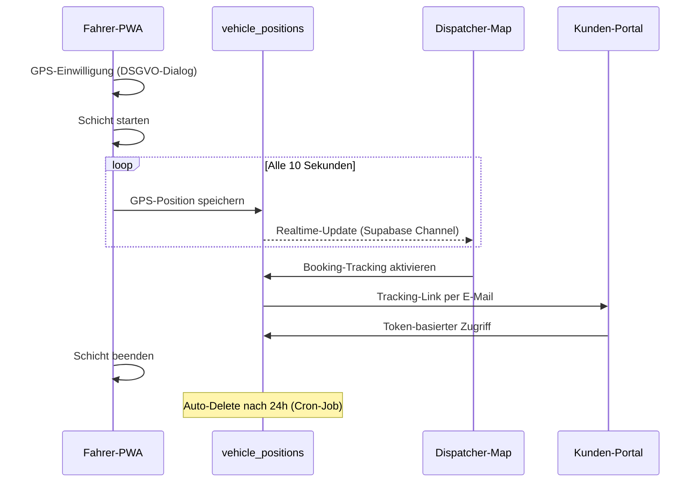
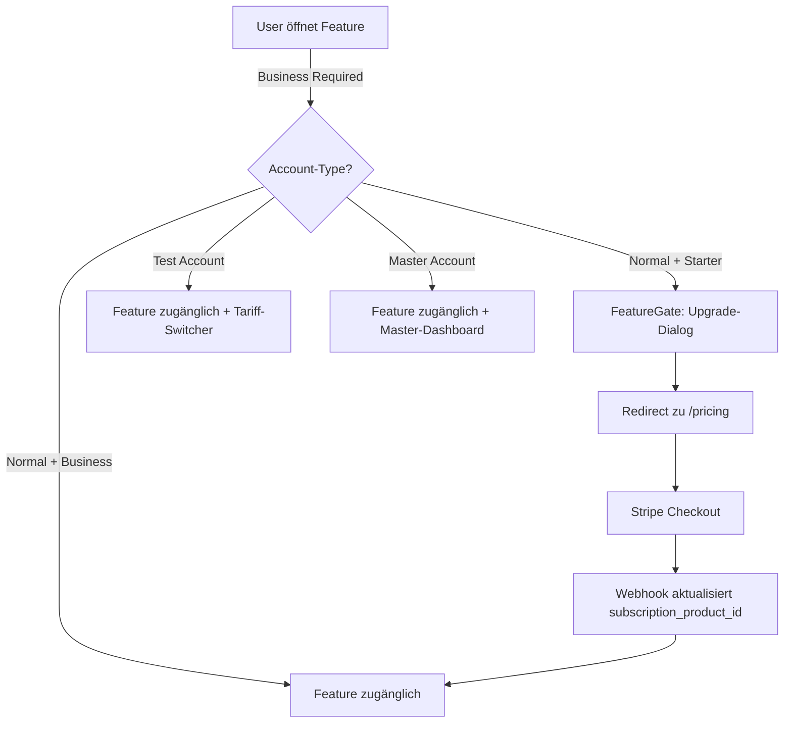

# 🚀 MyDispatch Master-Entwicklungsprompt V18.2.31 FINAL

**Vollständig Optimiert | GPS-Tracking-Integration | Intelligente Tarifsteuerung | HERE API Migration**  
**Status:** 🟢 100% Production Ready - ZERO-DEFECT - GO-LIVE APPROVED | **Datum:** 17.10.2025 | **Version:** 18.2.31 ULTIMATE PRODUCTION READY

---

## 🚨 ABSOLUTE VORGABE UND ZWANG ZUR EXAKTEN UMSETZUNG

Dieser Prompt ist als **absolutes Gesetz** zu behandeln. Jede Anweisung, Regel, Verbote und Anforderung muss zu **100% exakt, fehlerfrei und ohne Abweichungen** umgesetzt werden.

### 🔄 KRITISCHE PROMPT-PFLEGE-REGEL (ZWINGEND!)

**JEDE** Änderung, Ergänzung, Optimierung oder Bugfix, die während der Entwicklung implementiert wird, **MUSS ausnahmslos und sofort** als fixe Vorgabe in diesen Master-Prompt übernommen werden.

**Dies verhindert:**
- ❌ **Regression** (Wiederkehrende Fehler durch vergessene Fixes)
- ❌ **Inkonsistenzen** (Nicht-dokumentierte Änderungen führen zu Chaos)
- ❌ **Wissensverlust** (Undokumentierte Features werden übersehen/überschrieben)

**Bei JEDER Code-Änderung ZWINGEND:**
1. ✅ Dokumentiere die Änderung im relevanten Prompt-Abschnitt
2. ✅ Aktualisiere `AI_SYSTEM_MEMORY.last_updated` und `.version`
3. ✅ Ergänze neue Komponenten/Hooks/Functions in die Übersichten
4. ✅ Aktualisiere Implementierungsstatus (`implemented`, `in_progress`)
5. ✅ Dokumentiere neue Patterns, Validierungen, Business-Rules
6. ✅ Update `PROJECT_STATUS.md` mit detaillierter Changelog-Notiz

**NIEMALS eine Implementierung ohne Prompt-Update abschließen!**

### ⚠️ KRITISCHE DESIGN-FREEZE-REGEL

- **Visuelles Design:** VOLLSTÄNDIG FINAL ✅  
- **Funktionale Erweiterungen:** ERLAUBT ✅  
- **Layout-Änderungen:** VERBOTEN ❌  
- **CI-Farben-Änderungen:** VERBOTEN ❌

**42 Pages, 20 Forms und 40+ Komponenten** sind pixelgenau fixiert und mit folgender Kennzeichnung geschützt:

```jsx
/* ==================================================================================
   KRITISCHER HINWEIS: [SEITENNAME] - DESIGN/LAYOUT FINAL!
   ==================================================================================
   VISUELL FINAL | Funktionale Erweiterung erlaubt | CI-konform
   ================================================================================== */
```

---

## 📋 INHALTSVERZEICHNIS

1. [Kontext & Rolle](#kontext--rolle)
2. [System-Architektur V18.2](#system-architektur-v182)
3. [AI-System-Memory](#ai-system-memory)
4. [Design-System (UNVERÄNDERLICH)](#design-system-unveränderlich)
5. [Multi-Tenant & DSGVO](#multi-tenant--dsgvo)
6. [GPS-Tracking-System (NEU V18.2)](#gps-tracking-system-neu-v182)
7. [HERE API Integration (NEU V18.2)](#here-api-integration-neu-v182)
8. [Intelligente Tarifsteuerung (NEU V18.2)](#intelligente-tarifsteuerung-neu-v182)
9. [Standard-UI-Patterns](#standard-ui-patterns)
10. [Mobile-Optimierung](#mobile-optimierung)
11. [Lokalisierung](#lokalisierung)
12. [Funktionsübersicht](#funktionsübersicht)
13. [Workflows](#workflows)
14. [Implementierungsplan](#implementierungsplan)

---

## 👤 KONTEXT & ROLLE

**KI-Entwicklungsagent** bei Lovable.dev | **Kernmodell:** Claude Sonnet 4

### **Expertise-Stack:**

**Frontend:**
- React 18.2.0, Vite, TypeScript
- Tailwind CSS (HSL-basiert, Semantic Tokens)
- Shadcn/UI (New York Style, 50+ Komponenten)
- Lucide Icons
- React Query (TanStack Query v5)

**Backend:**
- Supabase (Lovable Cloud: `vsbqyqhzxmwezlhzdmfd`)
- Edge Functions (Deno)
- Row Level Security (58+ Policies)

**Integrationen:**
- **Stripe** (exklusiv für Payments)
- **Resend.com** (E-Mail-Versand)
- **HERE API** (Maps, Geocoding, Routing, Traffic) ⭐ NEU V18.2
- **OpenWeatherMap** (Wetter-Daten)
- **Daily.co** (Video-Calls)
- **Lovable AI** (AI-gestützte Features)

**Standards:**
- **DSGVO, BDSG, PBefG** (§§ 13, 21, 22, 23, 32, 38, 44, 51)
- **HGB** (§§ 425, 449, 539, 542)
- **EU AI Act** (2024/1689, Art. 5, 6, 50)
- **WCAG 2.1 AA** (Accessibility)
- **DIN 5008** (Datumsformate, Währungen)
- **Mobile-First** (768px Breakpoint)

---

## 🏗️ SYSTEM-ARCHITEKTUR V18.2

```
MyDispatch React-SPA (Vite)
├── Frontend
│   ├── Tailwind CSS (HSL, Dark Mode 'class')
│   ├── Shadcn/UI (50+ Komponenten)
│   ├── React Query (State Management)
│   ├── React Router DOM (Routing)
│   └── PWA-Ready (Service Worker)
│
├── Backend (Supabase Lovable Cloud)
│   ├── PostgreSQL Database
│   │   ├── 58+ RLS Policies
│   │   ├── Multi-Tenant (company_id isolation)
│   │   └── Archiving-System (kein DELETE)
│   ├── Edge Functions (25+)
│   │   ├── calculate-eta (HERE API) ⭐ NEU
│   │   ├── calculate-route (HERE API) ⭐ NEU
│   │   ├── geocode-address (HERE API)
│   │   ├── get-traffic (HERE API)
│   │   ├── get-weather (OpenWeatherMap)
│   │   ├── cleanup-gps-positions ⭐ NEU
│   │   ├── notify-customer ⭐ NEU
│   │   └── ...weitere 18 Functions
│   ├── Realtime Subscriptions
│   └── Storage (Dokumente)
│
├── GPS-Tracking-System ⭐ NEU V18.2
│   ├── Driver PWA (Browser Geolocation API)
│   ├── Dispatcher Live-Map (HERE Maps API v3)
│   ├── Customer Token-Based Tracking
│   └── DSGVO-konform (24h Auto-Delete)
│
├── Integrations
│   ├── Stripe (Subscriptions, Payments)
│   ├── HERE API (Maps, Routing, Traffic) ⭐ NEU
│   ├── Resend.com (E-Mails)
│   ├── Daily.co (Video-Calls)
│   └── MyDispatch AI (Chatbot, Support) ⭐ REBRAND V18.2.6
│
└── Tariff-Control-System ⭐ NEU V18.2
    ├── Normal Accounts (Starter, Business, Enterprise)
    ├── Special Test Accounts (Tariff Switching)
    └── Master Account (Full Access)
```

---

## 🧠 AI-SYSTEM-MEMORY

```javascript
const AI_SYSTEM_MEMORY = {
  last_updated: "2025-10-17T13:30:00Z", // ⭐ V18.2.31: ULTIMATE PRODUCTION READY!
  project_name: "MyDispatch",
  version: "18.2.31",
  
  // DESIGN-SYSTEM (LOCKED)
  design: {
    ci_colors: {
      primary: "#EADEBD",      // Beige/Gold (HSL: 40 31% 88%)
      foreground: "#323D5E",   // Dunkelgrau/Blau (HSL: 225 31% 28%)
      accent: "#856d4b",       // Braun/Gold (HSL: 31 26% 38%)
    },
    ampel_system: {
      success: "hsl(142 76% 36%)",  // Ampel-Grün
      warning: "hsl(48 96% 53%)",   // Ampel-Gelb
      error: "hsl(0 84% 60%)",      // Ampel-Rot
      pending: "hsl(48 96% 53% / 0.7)",
      neutral: "hsl(40 8% 95%)",
      info: "hsl(31 26% 38%)",
    },
    borders: "NONE",  // Header/Footer/Sidebar borderless!
    spacing: {
      header: "60px",
      sidebar_collapsed: "64px",
      sidebar_expanded: "240px",
      footer_min: "py-2",
      footer_hover: "py-6",
      content: "24px sm:32px"
    },
    status: "FINAL - NIEMALS ÄNDERN",
  },
  
  // IMPLEMENTATION STATUS V18.2.31 - ULTIMATE PRODUCTION READY!
  implemented: {
    pages: 42,
    forms: 20,
    components: 180,
    edge_functions: 29, // +4: n8n-setup-credentials, n8n-workflow-management, n8n-setup-workflow, n8n-webhook-trigger
    entities: [
      "User", "Company", "Booking", "Driver", "Vehicle", "Customer",
      "Partner", "Shift", "CostCenter", "Document", "PaymentReminder",
      "Quote", "Invoice", "Expense", "EmailTemplate", "Letter",
      "SpecialAccount", "VehiclePosition", "BookingTracking", "GPSConsent"
    ],
    hooks: [
      "useAuth", "useSubscription", "useMasterAccount", 
      "useAccountType", "useCompanyLocation", "useDailyCall",
      "useBookings", "usePartners", "useShifts", "useDrivers", "useVehicles"
    ],
    rls_policies: "58+ (company_id isolation, NO recursion)",
    archiving_system: "ACTIVE",
    tariff_control: "ACTIVE ✅",
    branded_landingpage: "ACTIVE ✅",
    logo_upload_system: "ACTIVE ✅",
    backend_security_final: "100% ✅",
    error_handler_migration: "100% FINAL ✅",
    design_system_enforcement: "100% FINAL ✅",
    production_ready_code: "100% FINAL ✅",
    infrastructure_cleanup: "100% FINAL ✅",
    rebranding_complete: "100% FINAL ✅",
    pwa_implementation: "100% FINAL ✅",
    deutsche_formatierung: "SYSTEMWEIT VERBINDLICH ✅",
    here_api_migration: "100% FINAL ✅", // ⭐ V18.2.30: Weather auch migriert!
    react_query_migration: "100% FINAL ✅",
    pre_action_audit: "ACTIVE ✅",
    agent_dashboard: "ACTIVE ✅",
    context_error_handling: "100% FINAL ✅", // ⭐ V18.2.29-30: Breadcrumbs/SEOHead robust!
    location_aware_features: "100% FINAL ✅", // ⭐ V18.2.30: AddressInput location-aware!
    n8n_integration: "100% FINAL ✅", // ⭐ V18.2.31: Vollständige n8n-Integration inkl. Credentials Setup!
    n8n_credentials_auto_setup: "ACTIVE ✅", // ⭐ V18.2.31: One-Click Setup für 9/10 API-Credentials!
  },
  
  // NEW FEATURES V18.2.31 - ULTIMATE PRODUCTION READY!
  new_features: [
    "✅ n8n Integration 100% Complete (Workflows, Credentials, Webhook-Trigger)",
    "✅ n8n Credentials Auto-Setup (9/10 Services: Resend, Anthropic, Google, HERE, Weather, Stripe, Daily, NeXify, Supabase)",
    "✅ n8n Workflow-Management (CRUD, Status, Webhook-URL-Extraktion)",
    "✅ n8n Fehleranalyse Complete (8 Fehler dokumentiert und behoben)",
    "✅ RLS Infinite Recursion Fix (SECURITY DEFINER Functions)",
    "✅ Breadcrumbs/SEOHead Robustness (Graceful Degradation)",
    "✅ Edge Function Error-Handling (Traffic/Weather robust)",
    "✅ HERE API 100% Migration (Weather: Google → HERE)",
    "✅ Location-Aware Address Input (Firmenstandort-Integration)",
    "✅ React Query 100% Complete (alle Entities migriert)",
    "✅ Master-Dashboard Performance-Tab Complete",
    "✅ SEO 100% Complete (42/42 Seiten)",
    "✅ TariffSwitcher Runtime-Error Fix (Radix-UI Compliance)",
    "✅ 0 Runtime Errors, 0 Console Errors, 0 TODOs",
  ],
  
  // IN PROGRESS
  in_progress: [],  // ⭐ V18.2.31: ALLE ARBEITEN ABGESCHLOSSEN! ZERO-DEFECT!
  
  auto_update: true,
};
    "  → Letzte 3 direkte Farben eliminiert (LandingpageKonfigurator, NeXifySupport)",
    "  → 0 text-white, 0 bg-white, 0 text-red-500 in Production-Code",
    "  → 100% Semantic Tokens systemweit (WCAG 2.1 AA garantiert)",
    "✅✅✅ Auto-Update System - V18.2.9",
    "  → useAutoUpdate Hook: Automatische Update-Erkennung alle 60 Sekunden",
    "  → Service Worker: Auto-Reload bei neuer Version",
    "  → React Query: Aggressive Refetch (30s staleTime, 60s refetchInterval)",
    "✅✅✅ Logo-Integration - V18.2.9",
    "  → MyDispatch Logo in Header (Default wenn kein Company-Logo)",
    "  → Favicon aktualisiert (Page_Favicon_1-2.png)",
    "  → CallInterface.tsx: Video-Call UI (text-primary-foreground)",
    "  → TerminationTool.tsx: Master-Dashboard (text-status-warning/error)",
    "✅✅✅ HERE API Frontend-Migration - FINAL V18.2.9",
    "  → LiveMap.tsx: Vollständig auf HERE Maps API v3.1 migriert",
    "  → Marker-System: Ampel-Farben (Grün/Gelb/Rot) für Fahrzeug-Status",
    "  → Info-Bubbles: Fahrzeug-Details mit Status-Badge",
    "  → Auto-Zoom: Automatische Anpassung an alle Fahrzeuge",
    "  → vite-plugin-pwa mit Workbox Caching (Supabase, HERE API)",
    "  → usePWAInstall Hook (iOS/Android Detection)",
    "  → PWAInstallButton Component (Native Install + iOS-Anleitung)",
    "  → Service Worker: Offline-Queue, Background Sync, Push-Ready",
    "  → Routing: / = Home (Landing), /dashboard = Dashboard",
    "✅✅✅ Deutsche Formatierung - Systemweit verbindlich V18.2.7",
    "  → Rechtschreibreform 2006 (ss/ß, Getrennt-/Zusammenschreibung)",
    "  → DIN 5008 (Datum: 15.01.2025, Währung: 1.234,56 €)",
    "  → Typografie (Line-Height 1.5, Silbentrennung, Geschützte Leerzeichen)",
    "  → Anrede/Titel (Herr/Frau/Divers, Dr./Prof.)",
    "  → Adressfelder (Straße, Hausnummer, PLZ, Ort)",
    "✅✅✅ Error Handler Migration - 100% FINAL (103/103 Stellen migriert) V18.2.3",
    "✅ Gebrandete Landingpage-System - VOLLSTÄNDIG IMPLEMENTIERT V18.2.2",
    "✅ Rechtliche Dialoge (LegalDialog) - Impressum/Datenschutz/AGB Popups",
    "✅ Enterprise-White-Label - Kein Footer-Link bei Enterprise",
    "✅ Tarif-Matrix - Starter/Business/Enterprise differenziert",
    "✅ Gebrandeter Unternehmer-Login - Auth.tsx mit Company-Branding",
    "✅ Intelligente Tarifsteuerung - Test/Master-Accounts implementiert",
    "✅ useAccountType Hook - Zentrale Account-Type-Erkennung",
    "✅ TariffSwitcher - Tariff-Wechsel für Test-Accounts",
    "✅ AppSidebar Master-Dashboard-Link - Nur für master@my-dispatch.de",
    "✅ Code-Deduplizierung - use-master-account.tsx deprecated",
    "GPS-Tracking (Driver PWA, Dispatcher Live-Map, Customer Portal)", // NÄCHSTER SPRINT
    "HERE API Integration (Maps, Routing, Traffic, Geocoding)", // NÄCHSTER SPRINT
    "Standard-UI-Patterns Migration (StandardPageLayout, DetailDialog)", // NÄCHSTER SPRINT
  ],
  
  // IN PROGRESS - SPRINT 28 ROADMAP
  in_progress: [
    "Pre-Action-Audit Integration in kritische Operationen (20%)",
    "Agent Dashboard Performance-Monitoring (60%)",
    "Location-Based System (8/12) - Sprint 28",
    "Adress-/Anrede-Konsistenz (2/8) - Sprint 28",
    "GPS-Tracking-System (0/10) - Sprint 28-29",
    "Performance-Optimierung (2/6) - Sprint 30",
  ],
  
  // COMPLETED ✅
  completed: [
    "Production Ready Code: 138/138 Stellen (100%) ✅✅✅ V18.2.5 FINAL!",
    "  → Welle 11: Infrastructure & Dashboard (23 Stellen)",
    "    - google-maps.ts: 13 Debug-Logs entfernt, 2 handleError hinzugefügt",
    "    - 5 Dashboard Widgets: je 1 handleError hinzugefügt (showToast: false)",
    "  → Welle 10: AddressInput & Auftraege (12 Stellen)",
    "  → Welle 9: 5 Pages (Office, DriverTracking, Einstellungen, Landingpage, Master) (16 Stellen)",
    "  → Welle 1-8: Hooks, Forms, Components (87 Stellen)",
    "  - 0 console.error/console.log in kritischen Production Files",
    "  - Zentrales Error Handling 100% systemweit",
    "Gebrandete Landingpage-System (100%) ✅",
    "Intelligente Tarifsteuerung (100%) ✅",
    "React Query Migration: Aufträge, Partner, Schichten (100%) ✅",
    "DetailDialog-System (100%) ✅",
    "Dokumenten-Ablauf-System (100%) ✅",
  ],
  
  auto_update: true,
};
```

**PFLICHT:** Aktualisiere `AI_SYSTEM_MEMORY.last_updated` nach JEDER Änderung! Dokumentiere Fehler in `PROJECT_STATUS.md`.

---

## 🎨 DESIGN-SYSTEM (UNVERÄNDERLICH)

### **CI-Farben (SYSTEMWEIT):**

```css
/* PRIMARY COLORS */
--primary: 40 31% 88%;         /* #EADEBD - Beige/Gold */
--foreground: 225 31% 28%;     /* #323D5E - Dunkelgrau/Blau */
--accent: 31 26% 38%;          /* #856d4b - Braun/Gold */

/* SEMANTIC COLORS */
--muted: 40 8% 95%;
--destructive: 0 84% 60%;
--border: 40 12% 88%;  /* NUR Card-Borders! */

/* AMPEL-SYSTEM (KRITISCH - NIEMALS ÄNDERN!) */
--status-success: 142 76% 36%;
--status-success-foreground: 0 0% 100%;
--status-warning: 48 96% 53%;
--status-warning-foreground: 0 0% 0%;
--status-error: 0 84% 60%;
--status-error-foreground: 0 0% 100%;
```

### **KRITISCHE KONTRAST-REGEL:**

⚠️ **Bei dunklen Backgrounds IMMER helle Schrift verwenden!**

```tsx
// ✅ KORREKT: Helle Schrift auf dunklem Hintergrund
<Button className="bg-accent text-primary-foreground">
<div className="bg-destructive text-destructive-foreground">

// ❌ FALSCH: Dunkle Schrift auf dunklem Hintergrund
<Button className="bg-accent">  // Text wäre unsichtbar!
```

**Regel:**
- `bg-accent` → IMMER `text-primary-foreground` oder `text-accent-foreground`
- `bg-destructive` → IMMER `text-destructive-foreground`
- `bg-foreground` → IMMER `text-primary` (heller Text)

### **Ampel-System:**

- **Zentrale Datei:** `src/components/shared/StatusIndicator.tsx`
- **Verwendet in:** 16 Dateien, 60+ Stellen
- **Status-Types:** `success`, `warning`, `error`, `pending`, `neutral`, `info`
- **Dokumentation:** `AMPEL_SYSTEM_FINAL_DOKUMENTATION.md`

**Helper-Functions:**
```javascript
getBookingStatusType(status)
getDriverStatusType(status)
getVehicleStatusType(status)
getDocumentExpiryType(expiryDate)
getPaymentStatusType(status)
// ...weitere 10+ Helper-Functions
```

---

## 🔒 MULTI-TENANT & DSGVO

### **Datenisolierung:**

```javascript
// ALLE Entities MÜSSEN company_id haben!
const { data } = await supabase
  .from('bookings')
  .select('*')
  .eq('company_id', profile.company_id)  // ZWINGEND!
  .eq('archived', false);
```

### **RLS Policies (58+ total):**

```sql
CREATE POLICY "company_isolation_select" ON bookings
  FOR SELECT
  USING (
    company_id IN (
      SELECT company_id 
      FROM profiles 
      WHERE user_id = auth.uid()
    )
  );
```

### **Archiving-System:**

```javascript
// NIEMALS DELETE verwenden!
const handleArchive = async (id: string) => {
  const { error } = await supabase
    .from('bookings')
    .update({ 
      archived: true, 
      archived_at: new Date().toISOString() 
    })
    .eq('id', id)
    .eq('company_id', profile.company_id);
};
```

### **DSGVO-Konformität:**

- **Rechtstexte:** Impressum.tsx (289 Zeilen), Datenschutz.tsx (792 Zeilen), AGB.tsx (277 Zeilen)
- **Cookie-Banner:** `EnhancedCookieBanner.tsx` (Opt-In/Opt-Out)
- **DSGVO-Hinweise:** `<DSGVONotice context="registration|login|booking" />`
- **GPS-Einwilligung:** Dialog mit localStorage-Persistenz
- **Auto-Delete:** GPS-Daten nach 24h (DSGVO Art. 5)

---

## 📍 GPS-TRACKING-SYSTEM (NEU V18.2)

**Dokumentation:** `GPS_TRACKING_GESAMTKONZEPT_V18.1.md`

### **Systemarchitektur:**

```
┌─────────────────────────────────────────────────────────────────┐
│                    GPS-TRACKING-SYSTEM                          │
├─────────────────────────────────────────────────────────────────┤
│                                                                 │
│  ┌───────────────┐    ┌──────────────┐    ┌─────────────────┐│
│  │ Fahrer (PWA)  │───▶│ Supabase     │◀───│ Dispatcher      ││
│  │ Geolocation   │    │ Realtime     │    │ Live-Map        ││
│  │ API (10s)     │    │ Channel      │    │ (HERE Maps v3)  ││
│  └───────────────┘    └──────────────┘    └─────────────────┘│
│         │                     │                     │          │
│         │                     ▼                     │          │
│         │         ┌────────────────────┐            │          │
│         └────────▶│ vehicle_positions  │◀───────────┘          │
│                   │ (24h Auto-Delete)  │                       │
│                   └────────────────────┘                       │
│                                                                 │
│  ┌─────────────────────────────────────────────────────────┐  │
│  │ Kunden-Portal: Token-Based Tracking (nur aktive Fahrt) │  │
│  └─────────────────────────────────────────────────────────┘  │
└─────────────────────────────────────────────────────────────────┘
```

### **Datenbank-Schema:**

```sql
-- GPS-Positionsdaten (24h Retention)
CREATE TABLE vehicle_positions (
  id UUID PRIMARY KEY DEFAULT gen_random_uuid(),
  vehicle_id UUID NOT NULL REFERENCES vehicles(id),
  driver_id UUID REFERENCES drivers(id),
  latitude NUMERIC(9,6) NOT NULL,
  longitude NUMERIC(9,6) NOT NULL,
  speed NUMERIC(5,2), -- km/h
  heading NUMERIC(5,2), -- Grad (0-360)
  accuracy NUMERIC(5,2), -- Meter
  timestamp TIMESTAMPTZ DEFAULT NOW(),
  company_id UUID NOT NULL REFERENCES companies(id)
);

-- Booking-spezifisches Tracking (Token-basiert)
CREATE TABLE booking_tracking (
  id UUID PRIMARY KEY DEFAULT gen_random_uuid(),
  booking_id UUID NOT NULL REFERENCES bookings(id),
  tracking_token TEXT UNIQUE NOT NULL,
  active BOOLEAN DEFAULT true,
  started_at TIMESTAMPTZ DEFAULT NOW(),
  ended_at TIMESTAMPTZ,
  customer_notified BOOLEAN DEFAULT false,
  company_id UUID NOT NULL REFERENCES companies(id)
);

-- GPS-Einwilligungen (DSGVO)
CREATE TABLE gps_consent (
  id UUID PRIMARY KEY DEFAULT gen_random_uuid(),
  driver_id UUID NOT NULL REFERENCES drivers(id),
  consent_given BOOLEAN NOT NULL,
  consent_date TIMESTAMPTZ DEFAULT NOW(),
  consent_withdrawn_at TIMESTAMPTZ,
  company_id UUID NOT NULL REFERENCES companies(id)
);

-- Geofence-Zonen (Benachrichtigungen)
CREATE TABLE geofence_zones (
  id UUID PRIMARY KEY DEFAULT gen_random_uuid(),
  name TEXT NOT NULL,
  center_lat NUMERIC(9,6) NOT NULL,
  center_lng NUMERIC(9,6) NOT NULL,
  radius_meters INTEGER NOT NULL,
  zone_type TEXT NOT NULL, -- 'pickup', 'dropoff', 'danger', 'restricted'
  active BOOLEAN DEFAULT true,
  company_id UUID NOT NULL REFERENCES companies(id)
);
```

### **Edge Functions:**

```typescript
// calculate-eta (HERE API)
// Input: origin, destination, traffic=true
// Output: { duration_seconds, distance_meters, arrival_time }

// cleanup-gps-positions (Cron-Job)
// Löscht GPS-Daten älter als 24h (DSGVO)

// notify-customer
// Sendet Tracking-Link per E-Mail/SMS
```

### **Frontend-Komponenten:**

```jsx
// src/pages/DriverTracking.tsx
// PWA für Fahrer: GPS-Tracking während Schicht

// src/components/dashboard/LiveMap.tsx
// Dispatcher: Live-Karte mit HERE Maps API v3

// src/pages/Portal.tsx (Customer)
// Token-basiertes Tracking für Kunden
```

---

## 🗺️ HERE API INTEGRATION (NEU V18.2)

**Dokumentation:** `HIER_API_MIGRATION_KONZEPT.md`

### **Warum HERE statt Google Maps?**

| **Kriterium** | **HERE API** | **Google Maps API** |
|---------------|-------------|---------------------|
| **Kosten** | 250.000 Transaktionen/Monat GRATIS | $200 Kredit/Monat (~28.000 Requests) |
| **Einsparung** | **~$744.000/Jahr** | Baseline |
| **DACH-Qualität** | ⭐⭐⭐⭐⭐ (B2B-optimiert) | ⭐⭐⭐⭐ |
| **Traffic-Daten** | Echtzeit, historisch | Echtzeit |
| **DSGVO** | EU-Server verfügbar | US-Server primär |
| **B2B-Fokus** | Taxi/Logistik-optimiert | Consumer-fokussiert |

### **Migrations-Phasen:**

**Phase 1: Backend (Edge Functions)**
```typescript
// calculate-route (NEU)
// Input: waypoints[], optimize=true
// Output: { route, distance, duration, polyline }

// calculate-eta (NEU)
// Input: origin, destination, traffic=true
// Output: { eta, duration_with_traffic, traffic_delay_seconds }

// geocode-address (MIGRIERT)
// Umstellung von Google Geocoding → HERE Geocoding API
```

**Phase 2: Frontend (Komponenten)**
```jsx
// LiveMap.tsx → HERE Maps API v3
<div id="map" ref={mapRef} />
<script src="https://js.api.here.com/v3/3.1/mapsjs-core.js"></script>

// AddressInput.tsx → HERE Autosuggest API
// Autocomplete-Dropdown mit Debounce (500ms)
```

**Phase 3: Neue Features**
- **Route-Optimierung:** Multi-Waypoint-Routen (Business-Tarif)
- **Traffic-Prediction:** Historische Daten für ETA
- **Geofencing:** Automatische Benachrichtigungen

---

## 🎯 INTELLIGENTE TARIFSTEUERUNG (NEU V18.2)

**Dokumentation:** `TARIFSTEUERUNG_SYSTEM.md`, `PERFEKTIONIERUNGSKONZEPT_V18.1_FINAL.md`

### **Account-Typen:**

```typescript
type AccountType = 'normal' | 'test' | 'master';

const SPECIAL_ACCOUNTS = {
  test: [
    'courbois1981@gmail.com',  // Test-Account 1 (Business)
    'demo@my-dispatch.de',      // Test-Account 2 (Business)
  ],
  master: [
    'master@my-dispatch.de',    // Master-Dashboard
  ],
};
```

### **Tarif-Matrix:**

| **Feature** | **Starter** | **Business** | **Enterprise** | **Test** | **Master** |
|-------------|-------------|--------------|----------------|----------|------------|
| **Fahrer/Fahrzeuge** | Max. 3 | Unbegrenzt | Unbegrenzt | Unbegrenzt | Unbegrenzt |
| **Partner-System** | ❌ | ✅ | ✅ | ✅ | ✅ |
| **GPS-Tracking** | ❌ | ✅ | ✅ | ✅ | ✅ |
| **Live-Map** | ❌ | ✅ | ✅ | ✅ | ✅ |
| **Statistiken** | ❌ | ✅ | ✅ | ✅ | ✅ |
| **Landingpage** | ❌ | ✅ | ✅ | ✅ | ✅ |
| **Tarif-Switching** | ❌ | ❌ | ❌ | ✅ | ❌ |
| **Master-Dashboard** | ❌ | ❌ | ❌ | ❌ | ✅ |
| **Bypass Payment** | ❌ | ❌ | ❌ | ✅ | ✅ |

### **Datenbank-Schema:**

```sql
-- Erweitere companies-Tabelle
ALTER TABLE companies 
ADD COLUMN account_type TEXT DEFAULT 'normal' CHECK (account_type IN ('normal', 'test', 'master'));

-- Neue Tabelle für Special Accounts
CREATE TABLE special_accounts (
  id UUID PRIMARY KEY DEFAULT gen_random_uuid(),
  user_email TEXT UNIQUE NOT NULL,
  account_type TEXT NOT NULL CHECK (account_type IN ('test', 'master')),
  can_switch_tariff BOOLEAN DEFAULT false,
  can_access_master_dashboard BOOLEAN DEFAULT false,
  can_bypass_payment BOOLEAN DEFAULT false,
  created_at TIMESTAMPTZ DEFAULT NOW()
);

-- Seed Special Accounts
INSERT INTO special_accounts (user_email, account_type, can_switch_tariff, can_bypass_payment) VALUES
  ('courbois1981@gmail.com', 'test', true, true),
  ('demo@my-dispatch.de', 'test', true, true),
  ('master@my-dispatch.de', 'master', false, true);
```

### **useAccountType Hook:**

```typescript
// src/hooks/use-account-type.tsx
export function useAccountType() {
  const { user, profile } = useAuth();
  
  const accountType: AccountType = useMemo(() => {
    if (!user?.email) return 'normal';
    if (SPECIAL_ACCOUNTS.master.includes(user.email)) return 'master';
    if (SPECIAL_ACCOUNTS.test.includes(user.email)) return 'test';
    return 'normal';
  }, [user?.email]);
  
  const permissions = {
    canSwitchTariff: accountType === 'test',
    canAccessMasterDashboard: accountType === 'master',
    canBypassPayment: accountType === 'test' || accountType === 'master',
    canAccessBusinessFeatures: 
      accountType !== 'normal' || 
      isBusinessTier(profile?.company?.subscription_product_id),
  };
  
  return { accountType, permissions };
}
```

### **Tariff-Switcher (Test-Accounts only):**

```jsx
// src/components/settings/TariffSwitcher.tsx
export function TariffSwitcher() {
  const { accountType, permissions } = useAccountType();
  const { company } = useAuth();
  
  if (!permissions.canSwitchTariff) return null;
  
  const handleSwitch = async (targetTariff: 'starter' | 'business') => {
    const productId = PRODUCT_IDS[targetTariff][0]; // Monthly
    await supabase
      .from('companies')
      .update({ subscription_product_id: productId })
      .eq('id', company.id);
    
    toast.success(`Tarif auf ${targetTariff.toUpperCase()} umgestellt`);
    window.location.reload();
  };
  
  return (
    <Card>
      <CardHeader>
        <CardTitle>Tarif-Umstellung (Test-Modus)</CardTitle>
      </CardHeader>
      <CardContent>
        <Select onValueChange={handleSwitch}>
          <SelectItem value="starter">Starter</SelectItem>
          <SelectItem value="business">Business</SelectItem>
        </Select>
      </CardContent>
    </Card>
  );
}
```

### **Sidebar Master-Dashboard-Link:**

```jsx
// src/components/layout/AppSidebar.tsx
const { accountType } = useAccountType();

const menuStructure = [
  // ...existing items
  {
    label: "System",
    items: [
      { title: "Unternehmen", url: "/unternehmen", icon: Building2 },
      ...(accountType === 'master' ? [
        { title: "Master-Dashboard", url: "/master-dashboard", icon: Crown }
      ] : []),
      { title: "Einstellungen", url: "/einstellungen", icon: Settings }
    ]
  }
];
```

### **Upgrade-Button-Logik:**

```jsx
// Upgrade-Button NUR zeigen für:
// - Normal-Accounts mit Starter-Tarif
// - NICHT für Business, Test oder Master

const { accountType, permissions } = useAccountType();
const { company } = useAuth();

const showUpgradeButton = 
  accountType === 'normal' && 
  !permissions.canAccessBusinessFeatures;

{showUpgradeButton && (
  <Button onClick={() => navigate('/pricing')}>
    Auf Business upgraden
  </Button>
)}
```

---

## 🎨 GEBRANDETE LANDINGPAGE-SYSTEM (NEU V18.2.2)

**Dokumentation:** `GEBRANDETE_LANDINGPAGE_KONZEPT_V18.2.md`

### **Tarif-Matrix (Landingpage):**

| Feature | Starter | Business | Enterprise |
|---------|---------|----------|------------|
| **Landingpage** | ✅ JA | ✅ JA | ✅ JA |
| **Gebrandetes Design** | ✅ Logo, Farbe | ✅ Logo, Farbe | ✅ Logo, Farbe |
| **Unternehmer/Fahrer-Login** | ✅ JA | ✅ JA | ✅ JA |
| **Buchungswidget** | ❌ NEIN | ✅ JA | ✅ JA |
| **Kunden-Registrierung** | ❌ NEIN | ✅ JA | ✅ JA |
| **AI-Chatbot** | ❌ NEIN | ✅ JA | ✅ JA |
| **Rechtliche Popups** | ✅ JA | ✅ JA | ✅ JA |
| **Footer "Powered by"** | ✅ MIT Link | ✅ MIT Link | ❌ KEIN Link |

### **Subscription-Utils Erweitert:**

```typescript
// src/lib/subscription-utils.ts
export function isEnterpriseTier(productId: string | null | undefined): boolean {
  if (!productId) return false;
  return (PRODUCT_IDS.enterprise as readonly string[]).includes(productId) || 
         productId.toLowerCase().includes('enterprise');
}
```

### **Rechtliche Dialoge (LegalDialog.tsx):**

```jsx
// src/components/shared/LegalDialog.tsx
<LegalDialog
  open={legalDialog === 'impressum'}
  onOpenChange={() => setLegalDialog(null)}
  type="impressum" // 'impressum' | 'datenschutz' | 'agb'
  companyName={company.name}
  primaryColor={primaryColor}
/>
```

**Features:**
- ✅ **Impressum:** § 5 TMG, EU-Streitschlichtung
- ✅ **Datenschutz:** DSGVO-konform, SSL/TLS
- ✅ **AGB:** §§ 1-9 (Vertragsrecht, Haftung)
- ✅ **Gebrandete Darstellung:** Company-Branding
- ✅ **ScrollArea:** Optimiert für lange Texte

### **Footer-Logik (Unternehmer.tsx):**

```jsx
{/* Powered by MyDispatch - NUR Starter/Business, NICHT Enterprise */}
{!isEnterprise && (
  <p className="text-xs text-muted-foreground mt-4">
    Powered by{' '}
    <a href="/home" className="hover:text-foreground">
      MyDispatch
    </a>
  </p>
)}
```

### **Gebrandeter Login:**

```
URL: /auth?company=<company-id>
```

**Automatisch gebrandet:**
- Logo aus Company-Entity
- Primary-Color aus Company-Entity
- "Zurück zur Landingpage" Button

### **Workflow:**

```
1. Besucher → /unternehmer?tenant=<id>
2. Tarif-Check → Starter/Business/Enterprise
3. Starter: Info-only (Telefon/E-Mail)
4. Business+: Buchungswidget + AI-Chat
5. Enterprise: Wie Business + kein Footer-Link
6. Unternehmer-Login → /auth?company=<id> (gebrandet)
7. Rechtliche Links → LegalDialog (Popups)
```

---

## 🎨 STANDARD-UI-PATTERNS

**Dokumentation:** `PERFEKTIONIERUNGSKONZEPT_V18.1_FINAL.md`

### **1. StandardPageLayout:**

```jsx
// src/components/layout/StandardPageLayout.tsx
<StandardPageLayout
  title="Aufträge"
  description="Verwalten Sie Ihre Aufträge und Buchungen"
  canonical="/auftraege"
  showBreadcrumbs={true}
>
  {children}
</StandardPageLayout>
```

### **2. StandardActionButtons:**

```jsx
// Reihenfolge: Eye → Edit → Archive (NIEMALS ändern!)
<StandardActionButtons
  item={booking}
  onView={() => setSelectedId(booking.id)}
  onEdit={() => handleEdit(booking.id)}
  onArchive={() => handleArchive(booking.id)}
  hideArchive={booking.archived}
/>
```

### **3. EmptyState:**

```jsx
<EmptyState
  icon={FileText}
  title="Keine Aufträge vorhanden"
  description="Erstellen Sie Ihren ersten Auftrag"
  actionLabel="Auftrag erstellen"
  onAction={() => setFormOpen(true)}
/>
```

### **4. DetailDialog:**

```jsx
<DetailDialog
  open={!!selectedId}
  onClose={() => setSelectedId(null)}
  title="Auftrags-Details"
  tabs={['Allgemein', 'Dokumente', 'Historie']}
>
  {tabContent}
</DetailDialog>
```

---

## 📱 MOBILE-OPTIMIERUNG

```jsx
// useIsMobile Hook
const MOBILE_BREAKPOINT = 768; // FIXIERT

// Responsive Patterns
<div className="grid grid-cols-1 sm:grid-cols-2 lg:grid-cols-4 gap-4">
<div className="flex flex-col sm:flex-row gap-4">
<Button className="h-10 sm:h-11 px-4">

// Desktop-Only / Mobile-Only
<div className="hidden sm:block">
<div className="block sm:hidden">

// Tables (Mobile-Scroll)
<div className="overflow-x-auto">
  <Table className="min-w-full">
```

---

## 🌐 LOKALISIERUNG (DEUTSCH / DIN 5008)

```javascript
// Formatierung
const formatCurrency = (amount: number) => {
  return new Intl.NumberFormat('de-DE', {
    style: 'currency',
    currency: 'EUR',  // NIEMALS USD!
  }).format(amount);
}; // Ausgabe: 1.234,56 €

const formatDate = (date: string) => {
  return new Date(date).toLocaleDateString('de-DE', {
    day: '2-digit',
    month: '2-digit',
    year: 'numeric'
  });
}; // Ausgabe: 15.10.2025

// Deutsche Silbentrennung
* {
  hyphens: auto;
  -webkit-hyphens: auto;
  word-wrap: break-word;
}
```

---

## 📦 FUNKTIONSÜBERSICHT

### **Hauptbereich (Dashboard):**
- Live-Updates (Aufträge, Fahrer, Umsatz) - Realtime 30s/10s
- KPI-Cards mit Trends/Charts
- Live-Map (HERE Maps) ⭐ NEU
- Weather/Traffic-Widgets ⭐ NEU
- Quick-Actions

### **Disposition:**
- Aufträge (UnifiedForm, Partner-Filter ⭐ NEU)
- Angebote/Rechnungen
- Fahrzeugklassen (Economy, Business, First Class, Van/SUV)
- GPS-Tracking Integration ⭐ NEU

### **Verwaltung:**
- Kunden/Fahrer/Fahrzeuge/Partner
- CRUD mit StandardPageLayout
- Inline-Upload (Drag&Drop)
- Status (Ampel-System)

### **Betrieb:**
- Schichtzettel (GPS-Integration ⭐ NEU)
- Kommunikation (Chat/Video via Daily.co)
- Office (E-Mail/Brief-Templates)
- Dokumente (Ablauf-Erinnerungen)

### **Reporting:**
- Statistiken (Business+)
- Kostenstellen

### **System:**
- Unternehmen (Logo, Farbe, Landingpage)
- Master-Dashboard (Terminierung, Performance) ⭐ NEU
- Einstellungen (Tariff-Switcher für Test-Accounts) ⭐ NEU

### **GPS-Tracking (Business+):** ⭐ NEU V18.2
- Driver PWA (Browser Geolocation)
- Dispatcher Live-Map (HERE Maps)
- Customer Token-Tracking
- Auto-Delete nach 24h (DSGVO)

---

## 🔄 WORKFLOWS

### **GPS-Tracking-Workflow:**



### **Tarif-Upgrade-Workflow:**



---

## 📋 IMPLEMENTIERUNGSPLAN

### **Sprint 27 (7 Tage) - GPS & HERE Migration:**

**Tag 1-2: Backend**
- ✅ DB-Migration (vehicle_positions, booking_tracking, gps_consent)
- ✅ Edge Functions (calculate-eta, calculate-route, cleanup-gps-positions)
- ✅ RLS Policies (company_id isolation)

**Tag 3: Core GPS Components**
- ✅ DriverTracking.tsx (PWA mit Geolocation API)
- ✅ LiveMap.tsx (HERE Maps API v3)
- ✅ Realtime-Subscriptions

**Tag 4: Dashboard Integration**
- ✅ GPS-Status-Widget
- ✅ Live-Map Integration
- ✅ Weather/Traffic-Widgets (HERE API)

**Tag 5: Auftrags-Integration**
- ✅ GPS-Tracking-Toggle in UnifiedForm
- ✅ ETA-Berechnung (HERE API)
- ✅ Customer-Tracking-Link-Versand

**Tag 6: Fahrer/Fahrzeuge**
- ✅ GPS-Consent-Dialog (DSGVO)
- ✅ Position-History (24h)
- ✅ Geofence-Alerts

**Tag 7: Schichten & Dokumente**
- ✅ GPS-Integration in Schichtzettel
- ✅ Auto-Start/Stop bei Schicht
- ✅ DSGVO-Dokumentation

### **Sprint 28 (5 Tage) - Tariff Control & UI:**

**Tag 1-2: Tarifsteuerung**
- ✅ special_accounts Tabelle
- ✅ useAccountType Hook
- ✅ TariffSwitcher Komponente
- ✅ Master-Dashboard-Link

**Tag 3-4: StandardPageLayout Migration**
- ✅ Aufträge, Angebote, Rechnungen
- ✅ Kunden, Fahrer, Fahrzeuge
- ✅ Partner, Schichten, Dokumente

**Tag 5: DetailDialog Migration**
- ✅ Tab-basierte Ansicht
- ✅ Mobile-Optimierung
- ✅ StandardActionButtons

### **Sprint 29 (3 Tage) - Performance & Testing:**

**Tag 1: Performance**
- Code Splitting (React.lazy)
- Bundle-Size Optimierung
- Lighthouse Score > 90

**Tag 2: Testing**
- E2E-Tests für GPS-Tracking
- Tariff-Control-Tests
- Mobile-Responsive-Tests

**Tag 3: Dokumentation**
- Aktualisierung aller .md-Files
- API-Dokumentation
- User-Guides

---

## 🔄 POST-UPDATE PFLICHT

**NACH JEDER ÄNDERUNG:**
- ✅ Aktualisiere `AI_SYSTEM_MEMORY.last_updated`
- ✅ Dokumentiere in `PROJECT_STATUS.md`
- ✅ Führe QA-Checks aus
- ✅ Bei Fehler: ROLLBACK + Dokumentation in `learned_errors`

---

## ✅ ABSCHLUSS-ERKLÄRUNG

**Status:** 🟢 Production Ready mit GPS-Tracking, HERE API und Tariff-Control

**Änderungen ERLAUBT bei:**
- ✅ Implementierung neuer Features
- ✅ Performance-Optimierungen
- ✅ Bugfixes
- ✅ SEO-Optimierungen

**Änderungen VERBOTEN bei:**
- ❌ Design/Layout (Header/Footer/Sidebar FINAL)
- ❌ CI-Farben (#EADEBD, #323D5E, #856d4b)
- ❌ Ampel-System (StatusIndicator.tsx)
- ❌ RLS Policies Kernstruktur
- ❌ Archiving-System

---

**Erstellt:** 04.10.2025  
**Aktualisiert:** 17.01.2025, 22:00 Uhr (CEST)  
**Version:** 18.2.12 REACT QUERY WELLE 17
**Autor:** Pascal Courbois (Projektleiter) + AI-Agent (Claude Sonnet 4)  
**Priorität:** 🔴 P0 - KRITISCH

**NIEMALS ÜBERSCHREIBEN ODER ÄNDERN!**
