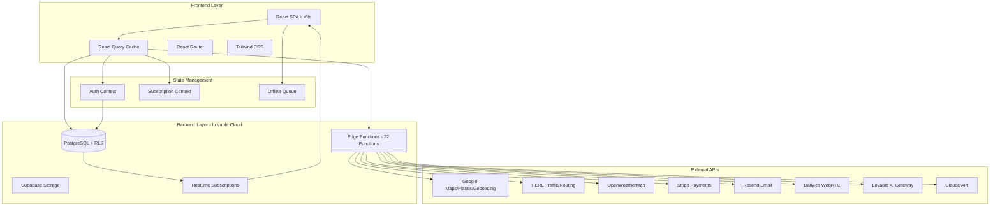
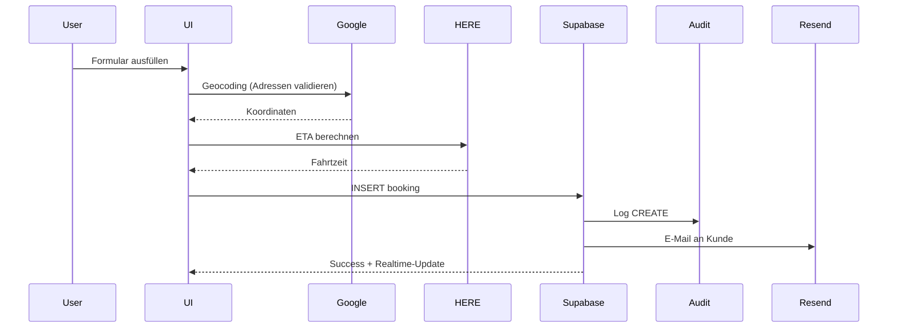
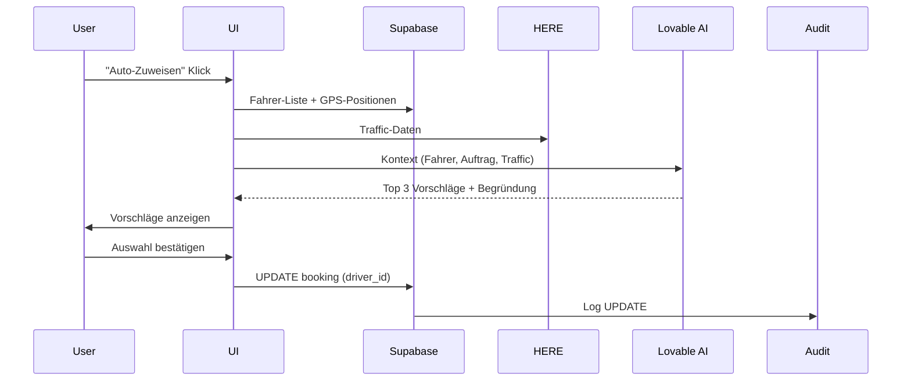
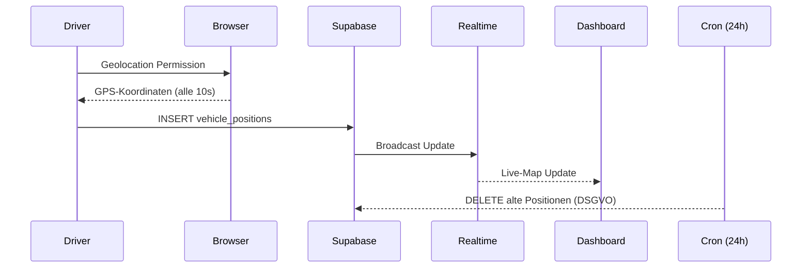

# 🏗️ MyDispatch V18.1 - Systemarchitektur & Bauplan
**Status:** Production-Ready | **Datum:** 15.10.2025 | **Version:** 18.1 Final

---

## 📐 SYSTEM-ÜBERSICHT



---

## 🗂️ DATENBANK-ARCHITEKTUR (34 Tabellen)

### Core Entities (Multi-Tenant mit company_id)
1. **companies** - Unternehmens-Stammdaten
2. **profiles** - Benutzer-Profile
3. **user_roles** - Rollen-Zuordnung (admin, driver, dispatcher)

### Operations
4. **bookings** - Aufträge (Status, Preis, Partner-Provision)
5. **drivers** - Fahrer (Schicht-Status, GPS-Tracking)
6. **vehicles** - Fahrzeuge (Klassen, Status, Zuweisung)
7. **customers** - Kunden (Portal-Zugang, Guthaben)
8. **shifts** - Schichtzettel (Einnahmen, KM-Stand)
9. **cost_centers** - Kostenstellen

### Communication
10. **chat_conversations** - Gespräche
11. **chat_messages** - Nachrichten (Text, Dateien)
12. **chat_participants** - Teilnehmer
13. **calls** - Anruf-Historie (Daily.co)

### Documents & Templates
14. **documents** - Dokumente (Upload, OCR, Ablauf)
15. **email_templates** - E-Mail-Vorlagen
16. **document_templates** - Dokumenten-Vorlagen

### Partner Network (Business+)
17. **partners** - Partner-Stammdaten
18. **partner_requests** - Anfragen
19. **partner_connections** - Verbindungen (Sync, Provision)

### Finance
20. **payment_reminders** - Zahlungserinnerungen

### System & Monitoring
21. **audit_logs** - Alle CRUD-Operationen (DSGVO, PBefG)
22. **system_logs** - Fehler, Warnings, Info
23. **performance_metrics** - Query-Zeiten, Render-Performance
24. **health_checks** - Service-Status (Master-only)
25. **termination_logs** - Kündigungs-Historie (Master-only)

### User Preferences
26. **filter_presets** - Gespeicherte Filter
27. **onboarding_progress** - Wizard-Status

### GPS Tracking (V18.0)
28. **vehicle_positions** - GPS-Koordinaten (Auto-Delete 24h)

---

## 🔐 SICHERHEITS-ARCHITEKTUR

### RLS Policies (52+ Policies)
```sql
-- Pattern für alle Entities:
CREATE POLICY "company_isolation_select" ON <table>
  FOR SELECT USING (company_id IN (
    SELECT company_id FROM profiles WHERE user_id = auth.uid()
  ));

CREATE POLICY "company_isolation_insert" ON <table>
  FOR INSERT WITH CHECK (company_id IN (
    SELECT company_id FROM profiles WHERE user_id = auth.uid()
  ));

CREATE POLICY "company_isolation_update" ON <table>
  FOR UPDATE USING (company_id IN (
    SELECT company_id FROM profiles WHERE user_id = auth.uid()
  ));

CREATE POLICY "company_isolation_delete" ON <table>
  FOR DELETE USING (company_id IN (
    SELECT company_id FROM profiles WHERE user_id = auth.uid()
  ));
```

### Archiving-System (DSGVO § 21, PBefG § 51)
```typescript
// NIEMALS DELETE verwenden!
const archiveEntity = async (id: string, table: string) => {
  const { error } = await supabase
    .from(table)
    .update({ 
      archived: true, 
      archived_at: new Date().toISOString() 
    })
    .eq('id', id)
    .eq('company_id', profile.company_id);
};

// Filter in Listen:
.eq('archived', false)
```

### Audit-Logging (Compliance)
```typescript
// Alle CRUD-Operationen loggen:
const logAudit = async (action: string, entity_type: string, entity_id: string, old_data?: any, new_data?: any) => {
  await supabase.from('audit_logs').insert({
    company_id: profile.company_id,
    user_id: user.id,
    action, // 'create', 'update', 'delete', 'archive'
    entity_type, // 'booking', 'driver', 'vehicle', etc.
    entity_id,
    old_data,
    new_data,
    user_agent: navigator.userAgent,
    ip_address: null, // Backend Edge Function
  });
};
```

---

## 🚀 EDGE FUNCTIONS (22 Functions)

### 1. AI & Support
- `ai-support-chat` - Claude API Integration (System-Prompt mit Context)

### 2. Booking & Operations
- `create-public-booking` - Widget-Buchungen (Kein Auth)
- `send-booking-email` - Auftrags-Bestätigungen
- `geocode-address` - Google Geocoding API

### 3. Communication
- `create-daily-room` - Video/Audio-Calls (Daily.co)
- `send-template-email` - Template-basierte E-Mails
- `send-contact-email` - Kontaktformular
- `send-driver-invitation` - Fahrer-Einladungen
- `send-password-reset` - Passwort-Reset

### 4. Subscriptions & Billing
- `create-checkout` - Stripe Checkout Session
- `customer-portal` - Stripe Customer Portal
- `check-subscription` - Abo-Status prüfen

### 5. Live-Data & Weather
- `get-weather` - OpenWeatherMap API
- `get-traffic` - HERE Traffic API

### 6. Documents & Exports
- `export-shift-pdf` - Schichtzettel-PDF

### 7. Automation & Cleanup
- `check-document-expiry` - Ablauf-Erinnerungen (Cron)
- `clean-old-booking-data` - 30-Tage-Löschung (Cron, PBefG § 21)
- `cleanup-gps-positions` - 24h GPS-Löschung (Cron, DSGVO)

### 8. Monitoring & Health
- `health-check` - Service-Status (Master-only)

### 9. Master-Dashboard
- `send-termination-email` - Kündigungs-E-Mails

### 10. Testing
- `generate-test-data` - Demo-Daten (Dev-only)

---

## 🎨 FRONTEND-ARCHITEKTUR

### Pages (42 Pages)
```
Marketing:
├── Home.tsx (Landing)
├── Pricing.tsx (Tarife)
├── FAQ.tsx
├── Docs.tsx
├── Contact.tsx
├── Terms.tsx (AGB)
├── Datenschutz.tsx
├── Impressum.tsx
├── NeXifySupport.tsx
└── Unternehmer.tsx (Tenant-Landingpage)

Dashboard:
├── Index.tsx (Live-Dashboard)
├── Auftraege.tsx
├── Angebote.tsx
├── Rechnungen.tsx
├── Kunden.tsx
├── Fahrer.tsx
├── Fahrzeuge.tsx
├── Partner.tsx (Business+)
├── Schichtzettel.tsx
├── TeamChat.tsx
├── Office.tsx (E-Mails/Briefe)
├── Dokumente.tsx
├── Kostenstellen.tsx
├── Statistiken.tsx (Business+)
├── Unternehmen.tsx
├── LandingpageKonfigurator.tsx (Business+)
├── Einstellungen.tsx
├── AISupport.tsx
├── DriverTracking.tsx (GPS)
└── MasterDashboard.tsx (Master-only)

Portals:
├── Portal.tsx (Kunden-Portal)
├── PortalAuth.tsx
└── Auth.tsx

Other:
└── NotFound.tsx
```

### Components (40+ Komponenten)

#### Shared
- `StatusIndicator.tsx` - Ampel-System (6 Typen, 60+ Stellen, KRITISCH!)
- `KPICard.tsx` - Dashboard-Karten mit Trends
- `ErrorBoundary.tsx` - Fehler-Handling
- `LoadingFallback.tsx` - Skeleton-Loader
- `Breadcrumbs.tsx` - Navigation
- `SEOHead.tsx` - Meta-Tags
- `SearchableSelect.tsx` - Dropdown mit Suche
- `PartnerFilter.tsx` - Partner-Auswahl (Business+)
- `AISupportButton.tsx` - AI-Assistent-Button
- `AISupportWidget.tsx` - AI-Chat-Widget
- `IntelligentAIChat.tsx` - Context-Aware AI
- `FeatureGate.tsx` - Tarif-Sperre

#### Forms
- `UnifiedForm.tsx` - Standard-Form-Layout
- `PersonFormFields.tsx` - Anrede, Titel, Name
- `InlineCustomerForm.tsx` - Kundenanlage in Aufträgen
- `DocumentUploadForm.tsx` - Drag&Drop Upload
- `PartnerForm.tsx` - Partner-Erstellung
- `ShiftForm.tsx` - Schichtzettel
- `AirportPickupFields.tsx` - Flughafen-Felder
- `TrainStationPickupFields.tsx` - Bahnhof-Felder

#### Dashboard
- `LiveMap.tsx` - Google Maps mit Fahrzeug-Tracking
- `LiveWeather.tsx` - Wetter-Widget
- `LiveTraffic.tsx` - Verkehrs-Widget
- `WeatherWidget.tsx` - Wetter-Karte
- `TrafficWidget.tsx` - Verkehrs-Karte
- `LiveInfoWidget.tsx` - Kombiniertes Widget

#### Chat & Communication
- `ConversationList.tsx` - Chat-Liste
- `ChatWindow.tsx` - Nachrichten-Thread
- `CallInterface.tsx` - Video/Audio-UI (Daily.co)
- `ParticipantSelector.tsx` - Gesprächspartner wählen

#### Partner
- `PartnerConnectionList.tsx` - Verbindungen (Business+)
- `PartnerRequestDialog.tsx` - Anfragen (Business+)

#### Booking
- `BookingWidget.tsx` - Public-Widget (Business+)
- `ProvisionField.tsx` - Partner-Provision

#### Master
- `TerminationTool.tsx` - Kündigungs-Verwaltung

#### Onboarding
- `WelcomeWizard.tsx` - Basis-Wizard
- `ComprehensiveOnboarding.tsx` - Erweiterter Wizard (6 Steps)

#### Layout
- `MainLayout.tsx` - App-Layout
- `MarketingLayout.tsx` - Marketing-Layout
- `DashboardLayout.tsx` - Dashboard-Layout (SEO)
- `Header.tsx` - Header (60px, #EADEBD)
- `Footer.tsx` - Footer (Kollabierbar, Windows-Style)
- `AppSidebar.tsx` - Sidebar (64px/240px)

#### Routing
- `ProtectedRoute.tsx` - Auth-Guard
- `PortalRoute.tsx` - Portal-Guard

---

## 🎯 V18.1 NEUE FEATURES (19 Features)

### Implementiert (Phase 1 - 100%):
✅ **Database Optimizations** - 11 Indexes, Audit-Logging, Filter-Presets  
✅ **Performance-Monitoring** - performance_metrics Tabelle  
✅ **Full-Text Search** - Indexes für Aufträge, Kunden, Fahrer  

### Zu implementieren (Phasen 2-7):

#### Phase 2: Core UX + Performance (P0 - heute)
1. **Global Search** - Cmd+K, Fuzzy-Matching, Realtime
2. **React Query Integration** - Smart Caching, Auto-Refetch
3. **Keyboard-Shortcuts** - 10 Shortcuts, Power-User
4. **Enhanced Error Handling** - Retry-Mechanismus, Offline-Queue

#### Phase 3: Smart Features (P0-P1 - morgen)
5. **Adress-Autovervollständigung** - Google Places API
6. **Echtzeit-ETA & Routing** - HERE/Google Integration
7. **Intelligente Filter** - Quick-Filter, Gespeicherte Ansichten

#### Phase 4: AI-Powered (P1 - diese Woche)
8. **AI Smart Routing** - Auto-Disposition mit Gemini
9. **AI Sentiment-Analyse** - Kunden-Zufriedenheit
10. **AI Dokumenten-OCR** - Auto-Kategorisierung

#### Phase 5: Automation (P1 - diese Woche)
11. **Wetter-Warnungen** - Dashboard-Widget, Alerts
12. **Verkehrs-Integration** - Live-Traffic, Alternative Routen
13. **Automatische E-Mails** - Trigger-basiert, Templates
14. **PDF-Export** - Aufträge, Rechnungen, Schichtzettel

#### Phase 6: Mobile & PWA (P2 - nächste Woche)
15. **PWA-Installation** - Offline-Modus, Install-Prompt
16. **Push-Benachrichtigungen** - Web Push API
17. **Chat-Dateianhänge** - Multimedia, Drag&Drop

#### Phase 7: Master-Dashboard (P1 - nächste Woche)
18. **Churn-Prediction** - AI-basiert, Auto-E-Mails
19. **Performance-Dashboard** - Alle Companies, Charts

---

## 📊 PERFORMANCE-ZIELE V18.1

### Aktuell (V18.0):
- Dashboard-Load: ~1.8s
- Auftrags-Liste: ~1.2s (50 Einträge)
- Suche: ~800ms
- Bundle-Size: ~1.8MB

### Ziel (V18.1):
- Dashboard-Load: **<1.0s** (-44%)
- Auftrags-Liste: **<400ms** (-67%, mit React Query + Indexes)
- Suche: **<200ms** (-75%, mit Full-Text Search + Fuzzy)
- Bundle-Size: **<1.2MB** (-33%, mit Code-Splitting)

### Uptime-Ziel:
- **99.99%** (mit Error Boundary + Retry + Offline-Queue)

---

## 🔄 DATENFLUSS-BEISPIELE

### 1. Auftrag erstellen


### 2. AI Smart Routing


### 3. GPS-Tracking (Fahrer-Portal)


---

## 🛠️ TECHNOLOGIE-STACK (FINAL)

### Frontend
- **React** 18.3.1
- **TypeScript** 5.x
- **Vite** 5.x (Build-Tool)
- **React Router** 6.30.1
- **React Query** 5.83.0 (NEW in V18.1)
- **Tailwind CSS** 3.x (HSL-basiert)
- **Shadcn/UI** (New York Style)
- **Lucide React** 0.462.0 (Icons)
- **Recharts** 2.15.4 (Charts)
- **React Hook Form** 7.61.1 + Zod 3.25.76
- **Sonner** 1.7.4 (Toasts)
- **date-fns** 3.6.0

### Backend (Lovable Cloud)
- **Supabase** (PostgreSQL 15)
- **Deno** (Edge Functions)
- **Supabase Realtime** (WebSocket)
- **Supabase Storage** (S3-kompatibel)

### External APIs
- **Google Maps/Places/Geocoding** (GOOGLE_API_KEY)
- **HERE Traffic/Routing** (HERE_API_KEY)
- **OpenWeatherMap** (OPENWEATHERMAP_API_KEY)
- **Daily.co** (DAILY_API_KEY - WebRTC)
- **Stripe** (STRIPE_SECRET_KEY)
- **Resend** (RESEND_API_KEY)
- **Lovable AI Gateway** (LOVABLE_API_KEY - Gemini/GPT-5)
- **Anthropic Claude** (ANTHROPIC_API_KEY)
- **NeXify** (NEXIFY_API_KEY)

---

## 📝 NAMING CONVENTIONS

### Datenbank
- Tabellen: `lowercase_underscore` (z.B. `chat_messages`)
- Spalten: `lowercase_underscore` (z.B. `created_at`)
- Enums: `PascalCase` (z.B. `BookingStatus`)

### Code
- Komponenten: `PascalCase.tsx` (z.B. `StatusIndicator.tsx`)
- Hooks: `use-kebab-case.tsx` (z.B. `use-auth.tsx`)
- Utils: `kebab-case.ts` (z.B. `format-utils.ts`)
- Types: `PascalCase` (z.B. `BookingStatus`)
- Variablen: `camelCase` (z.B. `bookingData`)

### Edge Functions
- Ordner: `kebab-case` (z.B. `send-booking-email`)
- Datei: `index.ts` (immer)

---

## 🔍 QUALITÄTS-CHECKS (GOLIVE)

### Code
✅ Keine TypeScript-Errors  
✅ Keine ESLint-Warnings  
✅ Keine console.log() in Production  
✅ Keine Mock-/Test-Daten  
✅ Alle Imports korrekt  

### Performance
✅ Lighthouse Score > 90  
✅ Bundle-Size < 1.5MB  
✅ First Contentful Paint < 1.5s  
✅ Time to Interactive < 3s  

### Sicherheit
✅ Alle RLS-Policies aktiv  
✅ Kein SQL-Injection-Risiko  
✅ Alle Secrets in Supabase  
✅ HTTPS-only  
✅ DSGVO-konform  

### UX
✅ Mobile-Responsive (100%)  
✅ Accessibility (WCAG 2.1 AA)  
✅ Deutsche Lokalisierung (100%)  
✅ Error-Handling (Toasts)  
✅ Loading-States (Skeleton)  

### Business
✅ Stripe-Integration (Webhooks)  
✅ E-Mail-Versand (Resend)  
✅ GPS-Tracking (DSGVO)  
✅ Archiving-System (PBefG)  
✅ Audit-Logging (Compliance)  

---

**Dieses Dokument dient als Single Source of Truth für die gesamte MyDispatch-Architektur V18.1.**
