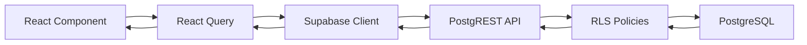
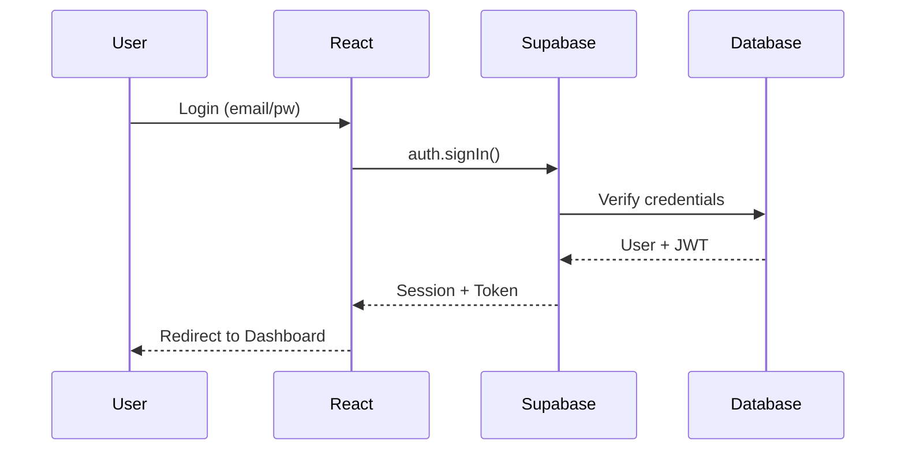

# 🏗️ Architecture Overview

> **System-Architektur von MyDispatch**  
> **Version:** 18.5.0  
> **Letzte Aktualisierung:** 2025-01-26

---

## 🎯 Architektur-Prinzipien

### 1. Mobile-First

- Alle Features zuerst für Mobile (375px)
- Progressive Enhancement zu Desktop
- Touch-Targets ≥ 44px

### 2. Component-Driven

- Atomic Design Prinzip
- Wiederverwendbare Komponenten
- Single Responsibility

### 3. Type-Safe

- Strikte TypeScript Konfiguration
- Zod Schema Validation
- Supabase Type Generation

### 4. Security-First

- RLS auf allen Tabellen
- Input Validation (Client + Server)
- XSS/SQL-Injection Prevention

---

## 📐 Tech Stack

### Frontend

```
React 18.3+ (UI Library)
├── TypeScript 5+ (Type Safety)
├── Vite 5+ (Build Tool)
├── TailwindCSS 3+ (Styling)
├── Shadcn/UI (Component Library)
└── React Query (State Management)
```

### Backend (Lovable Cloud)

```
Supabase (Backend-as-a-Service)
├── PostgreSQL (Database)
├── PostgREST (Auto-generated API)
├── GoTrue (Authentication)
├── Edge Functions (Serverless Logic)
└── Storage (File Uploads)
```

### Testing

```
Playwright (E2E Tests)
├── Vitest (Unit Tests)
├── React Testing Library (Component Tests)
└── MSW (API Mocking)
```

---

## 🗂️ Projekt-Struktur

```
mydispatch/
├── src/
│   ├── components/           # UI Components
│   │   ├── ui/              # Shadcn Base Components
│   │   ├── design-system/   # Custom Design Components
│   │   └── shared/          # Shared Business Components
│   ├── pages/               # Route Pages
│   ├── hooks/               # Custom React Hooks
│   ├── lib/                 # Utilities & Helpers
│   ├── config/              # Configuration Files
│   │   ├── content.config.ts    # Content System
│   │   └── content.types.ts     # Content Types
│   ├── integrations/        # External Integrations
│   │   └── supabase/        # Supabase Client (auto-generated)
│   ├── index.css            # Global Styles + Design Tokens
│   └── App.tsx              # Root Component
├── docs/                    # Dokumentation
│   ├── 01-GETTING-STARTED/
│   ├── 02-ARCHITECTURE/
│   ├── 03-DEVELOPMENT/
│   ├── 04-GOVERNANCE/
│   └── 05-ARCHIVE/
├── supabase/
│   ├── migrations/          # DB Migrations (auto)
│   └── config.toml          # Supabase Config (auto)
├── tests/
│   ├── e2e/                 # Playwright E2E Tests
│   └── unit/                # Vitest Unit Tests
└── public/                  # Static Assets
```

---

## 🔄 Datenfluss-Architektur

### Client → Backend Flow



### Authentication Flow



---

## 🎨 Design-System-Architektur

### Zentrale Design-Tokens

**Location:** `src/index.css` + `tailwind.config.ts`

```css
:root {
  /* Brand Colors */
  --background: 40 8% 98%;
  --foreground: 225 31% 28%;
  --primary: 40 31% 88%;
  --secondary: 225 31% 28%;

  /* Status Colors */
  --status-success: 142 71% 45%;
  --status-warning: 38 92% 50%;
  --status-error: 0 84% 60%;
}
```

### Component-System

```
UI Components (src/components/ui/)
├── button.tsx         # Shadcn Base Button
├── input.tsx          # Form Input
├── dialog.tsx         # Modal Dialog
└── ...

Design System (src/components/design-system/)
├── Icon.tsx           # Zentrale Icon-Komponente
├── MarketingButton.tsx # Marketing-spezifische Buttons
└── ...

Shared Components (src/components/shared/)
├── FeatureIconBox.tsx  # Feature-Icons (wie Sidebar)
├── Navbar.tsx          # Navigation
└── ...
```

---

## 🗄️ Database-Architektur

### Multi-Tenancy Pattern

```sql
-- Jede Tabelle hat company_id
CREATE TABLE bookings (
  id UUID PRIMARY KEY DEFAULT gen_random_uuid(),
  company_id UUID NOT NULL,
  customer_id UUID NOT NULL,
  -- ... weitere Felder
  CONSTRAINT fk_company FOREIGN KEY (company_id)
    REFERENCES companies(id) ON DELETE CASCADE
);

-- RLS Policy für Tenant-Isolation
CREATE POLICY "Users see own company data"
ON bookings FOR SELECT
USING (
  company_id IN (
    SELECT company_id FROM profiles WHERE user_id = auth.uid()
  )
);
```

### Kern-Tabellen

- **profiles** - User-Profil-Daten (Custom Claims)
- **companies** - Firmen-Stammdaten
- **bookings** - Buchungen
- **customers** - Kunden
- **vehicles** - Fahrzeuge
- **drivers** - Fahrer

---

## 🔐 Security-Architektur

### Defense-in-Depth Layers

```
Layer 1: Input Validation (Zod)
    ↓
Layer 2: Client-side Authorization (React Query)
    ↓
Layer 3: RLS Policies (PostgreSQL)
    ↓
Layer 4: Security Definer Functions (search_path)
    ↓
Layer 5: Audit Logging (Database Triggers)
```

### RLS Policy Template

```sql
-- SELECT Policy
CREATE POLICY "policy_name_select"
ON table_name FOR SELECT
USING (
  company_id IN (
    SELECT company_id FROM profiles WHERE user_id = auth.uid()
  )
);

-- INSERT Policy
CREATE POLICY "policy_name_insert"
ON table_name FOR INSERT
WITH CHECK (
  company_id IN (
    SELECT company_id FROM profiles WHERE user_id = auth.uid()
  )
);
```

---

## 🚀 Deployment-Architektur

### CI/CD Pipeline

```
GitHub Push (main)
    ↓
GitHub Actions
    ↓
├── Lint (ESLint)
├── Type Check (tsc)
├── Unit Tests (Vitest)
├── E2E Tests (Playwright)
└── Build (Vite)
    ↓
Lovable Cloud Deploy
    ↓
Production (lovable.app)
```

### Environments

- **Development:** `localhost:8080` (Vite Dev Server)
- **Staging:** Auto-deploy bei PR (Lovable Preview)
- **Production:** `*.lovable.app` (Lovable Cloud)

---

## 📊 State-Management-Architektur

### React Query Pattern

```tsx
// ✅ RICHTIG - React Query für Server-State
const { data: bookings } = useQuery({
  queryKey: ["bookings", companyId],
  queryFn: async () => {
    const { data } = await supabase.from("bookings").select("*").eq("company_id", companyId);
    return data;
  },
});

// ✅ RICHTIG - useState für UI-State
const [isModalOpen, setIsModalOpen] = useState(false);
```

### State-Kategorien

| State-Art    | Tool            | Use Case                |
| ------------ | --------------- | ----------------------- |
| Server-State | React Query     | API-Daten, DB-Queries   |
| UI-State     | useState        | Modals, Dropdowns, Tabs |
| Form-State   | React Hook Form | Formulare               |
| Route-State  | React Router    | URL-Parameter           |

---

## 🎯 Performance-Architektur

### Optimierungs-Strategien

1. **Code-Splitting**

   ```tsx
   const Dashboard = lazy(() => import("./pages/Dashboard"));
   ```

2. **React Query Caching**

   ```tsx
   staleTime: 5 * 60 * 1000, // 5min Cache
   cacheTime: 10 * 60 * 1000 // 10min Memory
   ```

3. **Memoization**

   ```tsx
   const expensiveValue = useMemo(() => calculate(data), [data]);
   ```

4. **Virtual Scrolling** (bei langen Listen)
   ```tsx
   import { useVirtualizer } from "@tanstack/react-virtual";
   ```

---

## 🧪 Testing-Architektur

### Testing-Pyramid

```
      /\
     /E2E\         ← 10% (Playwright)
    /------\
   /Integration\   ← 20% (React Testing Library)
  /------------\
 /    Unit     \  ← 70% (Vitest)
/----------------\
```

### Test-Coverage-Ziele

- **Unit Tests:** > 80%
- **Integration Tests:** > 60%
- **E2E Tests:** Critical User Flows

---

## 📚 Weitere Ressourcen

- [Design System](./Design-System.md) - UI/UX Guidelines
- [Component Library](./Component-Library.md) - Component Docs
- [Database Schema](./Database-Schema.md) - DB Design
- [Coding Standards](../03-DEVELOPMENT/Coding-Standards.md) - Code Guidelines

---

## 📝 Changelog

### V18.5.0 (2025-01-26)

- Erstversion Architecture Overview
- Tech Stack dokumentiert
- Architektur-Patterns definiert
- Datenfluss-Diagramme hinzugefügt

---

**WICHTIG:** Diese Architektur ist die Grundlage für alle weiteren Entwicklungen.
