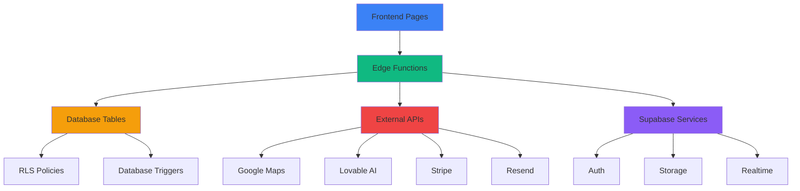

# ABHÄNGIGKEITEN-MATRIX V1.0

## 🔗 SYSTEM-ABHÄNGIGKEITEN

### 1. DIREKTE ABHÄNGIGKEITEN (TIER 1)

#### Frontend → Backend
```typescript
// Frontend komponenten → Edge Functions
const frontendBackendDeps = {
  // Authentication Flow
  "/login": ["auth-signin", "auth-session"],
  "/signup": ["auth-signup", "send-verification-email"],
  
  // Dashboard
  "/dashboard": [
    "get-dashboard-stats",
    "get-recent-activity",
    "brain-query" // NeXify Wiki Loader
  ],
  
  // Aufträge
  "/auftraege": [
    "get-bookings",
    "create-booking",
    "update-booking",
    "delete-booking"
  ],
  
  // Fahrer
  "/fahrer": [
    "get-drivers",
    "create-driver",
    "send-driver-invitation"
  ],
  
  // Rechnungen
  "/rechnungen": [
    "get-invoices",
    "create-invoice",
    "export-invoice-pdf"
  ],
  
  // AI Features
  "/ai-assistant": [
    "dashboard-ai-assistant",
    "ai-orchestrator",
    "kronos-executor"
  ]
};
```

#### Edge Functions → Database
```sql
-- Edge Function → Database Table Mapping

-- get-bookings
-- Reads: bookings, customers
-- Writes: -
-- Requires Auth: true

-- create-booking
-- Reads: customers
-- Writes: bookings
-- Requires Auth: true

-- get-dashboard-stats
-- Reads: bookings, drivers, invoices
-- Writes: -
-- Requires Auth: true

-- kronos-executor
-- Reads: entities_queue
-- Writes: entities_queue, entities_results
-- Requires Auth: false

-- brain-query
-- Reads: knowledge_base, ai_learning_patterns
-- Writes: -
-- Requires Auth: false
```

### 2. INDIREKTE ABHÄNGIGKEITEN (TIER 2)

```typescript
// Chain of Dependencies
const dependencyChains = {
  // User creates booking → Multiple cascading calls
  "create-booking": [
    "validate-customer", // Step 1
    "calculate-price", // Step 2
    "reserve-driver", // Step 3
    "send-confirmation-email", // Step 4
    "update-dashboard-stats" // Step 5
  ],
  
  // Dashboard load → Multiple parallel calls
  "dashboard-load": {
    parallel: [
      "get-recent-bookings",
      "get-driver-status",
      "get-revenue-stats",
      "load-nexify-wiki" // V18.5.13
    ]
  },
  
  // AI Code Generation → KRONOS Pipeline
  "kronos-code-generation": [
    "wiki-to-yaml-parser", // Extract entities
    "kronos-executor", // Orchestrate generation
    "kronos-code-generator", // Generate code
    "ai-code-validator", // Validate output
    "auto-learn-from-actions" // Learn from result
  ]
};
```

### 3. API-VERBINDUNGEN

#### Externe APIs
```typescript
const externalAPIs = {
  // Google Maps (Geocoding)
  googleMaps: {
    endpoint: "https://maps.googleapis.com/maps/api/geocode/json",
    usedBy: ["geocode-address", "geocode-company-address"],
    requiresKey: "GOOGLE_MAPS_API_KEY",
    rateLimit: "2500 req/day (free tier)",
    fallback: "HERE Maps API"
  },
  
  // HERE Maps (Traffic & Routing)
  hereMaps: {
    endpoint: "https://api.here.com/v1/",
    usedBy: ["get-traffic", "here-autosuggest"],
    requiresKey: "HERE_API_KEY",
    rateLimit: "250k transactions/month (free tier)",
    fallback: "Cached data"
  },
  
  // Lovable AI Gateway
  lovableAI: {
    endpoint: "https://ai.gateway.lovable.dev/v1/chat/completions",
    usedBy: [
      "kronos-code-generator",
      "ai-orchestrator",
      "dashboard-ai-assistant",
      "all ai-* functions"
    ],
    requiresKey: "LOVABLE_API_KEY",
    models: [
      "google/gemini-2.5-pro",
      "google/gemini-2.5-flash",
      "openai/gpt-5"
    ],
    rateLimit: "Workspace-dependent",
    fallback: "Queue for later processing"
  },
  
  // Stripe (Payments)
  stripe: {
    endpoint: "https://api.stripe.com/v1/",
    usedBy: ["create-checkout", "customer-portal"],
    requiresKey: "STRIPE_SECRET_KEY",
    rateLimit: "100 req/sec",
    fallback: "Email notification to admin"
  },
  
  // Resend (Email)
  resend: {
    endpoint: "https://api.resend.com/",
    usedBy: [
      "send-booking-email",
      "send-driver-invitation",
      "send-password-reset"
    ],
    requiresKey: "RESEND_API_KEY",
    rateLimit: "100 emails/day (free tier)",
    fallback: "Queue for retry"
  }
};
```

#### Interne API (Supabase)
```typescript
const internalAPIs = {
  // Supabase Database
  database: {
    endpoint: "${SUPABASE_URL}/rest/v1/",
    authentication: "Bearer ${SUPABASE_ANON_KEY}",
    rls: "Enabled for all user tables",
    tables: 150, // Total tables
    functions: 42, // Database functions
    triggers: 28 // Database triggers
  },
  
  // Supabase Auth
  auth: {
    endpoint: "${SUPABASE_URL}/auth/v1/",
    providers: ["email", "google", "github"],
    mfa: "Disabled",
    emailConfirmation: "Auto-confirm enabled"
  },
  
  // Supabase Storage
  storage: {
    endpoint: "${SUPABASE_URL}/storage/v1/",
    buckets: ["avatars", "invoices", "documents"],
    rls: "Enabled per bucket"
  },
  
  // Supabase Realtime
  realtime: {
    endpoint: "wss://${SUPABASE_URL}/realtime/v1/",
    channels: ["bookings", "drivers", "chat"],
    rls: "Inherited from tables"
  }
};
```

### 4. KRITISCHE PFADE

```typescript
// Critical paths that must always work
const criticalPaths = {
  // Authentication Flow (MUST WORK)
  auth: {
    path: "Login → Auth Check → Dashboard",
    dependencies: [
      "supabase.auth.signInWithPassword",
      "auth.users table",
      "RLS policies"
    ],
    fallback: "Redirect to /login on failure",
    priority: "P0 - CRITICAL"
  },
  
  // Booking Creation (REVENUE-CRITICAL)
  booking: {
    path: "Form → Validation → DB Insert → Email → Dashboard Update",
    dependencies: [
      "create-booking edge function",
      "bookings table",
      "send-booking-email edge function",
      "RESEND_API_KEY"
    ],
    fallback: "Save to draft, retry email later",
    priority: "P0 - CRITICAL"
  },
  
  // AI Code Generation (DEVELOPMENT-CRITICAL)
  aiCodeGen: {
    path: "Wiki → Parser → Queue → Executor → Generator → Validation",
    dependencies: [
      "knowledge_base table",
      "wiki-to-yaml-parser",
      "kronos-executor",
      "kronos-code-generator",
      "LOVABLE_API_KEY"
    ],
    fallback: "Queue for manual review",
    priority: "P1 - HIGH"
  },
  
  // Payment Processing (REVENUE-CRITICAL)
  payment: {
    path: "Cart → Checkout → Stripe → Webhook → DB Update",
    dependencies: [
      "create-checkout edge function",
      "STRIPE_SECRET_KEY",
      "stripe webhook",
      "invoices table"
    ],
    fallback: "Email notification to admin",
    priority: "P0 - CRITICAL"
  }
};
```

### 5. DEPENDENCY GRAPH VISUALIZATION



### 6. BREAKING CHANGE IMPACT ANALYSIS

```typescript
// When changing X, these will break:
const impactAnalysis = {
  // Database Schema Changes
  "ALTER TABLE bookings": {
    affectedFunctions: [
      "get-bookings",
      "create-booking",
      "update-booking"
    ],
    affectedPages: ["/auftraege", "/dashboard"],
    migrationRequired: true,
    estimatedDowntime: "5 minutes",
    rollbackStrategy: "Revert migration"
  },
  
  // Edge Function Signature Change
  "kronos-executor body change": {
    affectedCallers: [
      "/pages/KronosOrchestrator.tsx",
      "useAutonomousMigration hook"
    ],
    affectedFunctions: [],
    migrationRequired: false,
    estimatedDowntime: "0 minutes",
    rollbackStrategy: "Git revert"
  },
  
  // Environment Variable Change
  "LOVABLE_API_KEY renamed": {
    affectedFunctions: [
      "All ai-* functions (23 total)",
      "kronos-code-generator",
      "dashboard-ai-assistant"
    ],
    affectedPages: [],
    migrationRequired: true,
    estimatedDowntime: "30 minutes (deploy)",
    rollbackStrategy: "Update secret in Supabase"
  },
  
  // API Endpoint Change
  "Stripe API v2 → v3": {
    affectedFunctions: [
      "create-checkout",
      "customer-portal",
      "stripe-webhook"
    ],
    affectedPages: ["/checkout", "/dashboard"],
    migrationRequired: true,
    estimatedDowntime: "2 hours",
    rollbackStrategy: "Keep v2 endpoints active during migration"
  }
};
```

### 7. DEPENDENCY HEALTH MONITORING

```typescript
// Automated dependency health check
const monitorDependencies = async () => {
  const results = {
    externalAPIs: await checkExternalAPIs(),
    databaseConnections: await checkDatabaseConnections(),
    edgeFunctions: await checkEdgeFunctions(),
    authSystem: await checkAuthSystem(),
    realtimeChannels: await checkRealtimeChannels()
  };
  
  // Alert if critical dependency fails
  const critical = [
    results.authSystem,
    results.databaseConnections
  ];
  
  if (critical.some(c => !c.healthy)) {
    await sendCriticalAlert({
      message: "Critical dependency failure detected",
      details: results,
      severity: "P0"
    });
  }
  
  return results;
};

// Check External API Health
const checkExternalAPIs = async () => {
  const apis = ['googleMaps', 'lovableAI', 'stripe', 'resend'];
  const results = await Promise.all(
    apis.map(async (api) => ({
      api,
      healthy: await pingAPI(api),
      responseTime: await measureResponseTime(api)
    }))
  );
  
  return {
    healthy: results.every(r => r.healthy),
    details: results
  };
};
```

### 8. DEPENDENCY RESOLUTION STRATEGY

#### Circular Dependencies
```typescript
// ❌ BAD: Circular dependency
// fileA.ts imports fileB.ts
// fileB.ts imports fileA.ts

// ✅ GOOD: Extract shared logic
// fileA.ts imports shared.ts
// fileB.ts imports shared.ts
// shared.ts has no imports from A or B
```

#### Missing Dependencies
```typescript
// Detection
const detectMissingDeps = async () => {
  const code = await readAllFiles();
  const imports = extractImports(code);
  const installed = await getInstalledPackages();
  
  return imports.filter(imp => !installed.includes(imp));
};

// Auto-fix
const autoInstallMissing = async () => {
  const missing = await detectMissingDeps();
  for (const pkg of missing) {
    await exec(`npm install ${pkg}`);
  }
};
```

### 9. DEPENDENCY VERSIONING

```typescript
// Critical version constraints
const versionConstraints = {
  "@supabase/supabase-js": "^2.75.0", // Must be 2.x
  "react": "^18.3.1", // Must be 18.x
  "typescript": "^5.0.0", // Must be 5.x
  "@tanstack/react-query": "^5.83.0" // Must be 5.x
};

// Breaking change detection
const detectBreakingChanges = async (oldVersion: string, newVersion: string) => {
  const oldMajor = oldVersion.split('.')[0];
  const newMajor = newVersion.split('.')[0];
  
  if (oldMajor !== newMajor) {
    console.warn(`BREAKING CHANGE: ${oldVersion} → ${newVersion}`);
    return true;
  }
  
  return false;
};
```

## VERSION HISTORY
- V1.0 (2025-01-31): Initial Matrix
  - Frontend-Backend Dependencies
  - API Connections
  - Critical Paths
  - Impact Analysis
  - Health Monitoring

## TAGS
`abhängigkeiten` `dependencies` `api` `architecture` `system-design` `monitoring`
