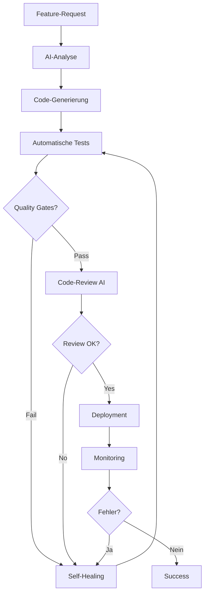

# 🤖 AI-SYSTEM ARCHITEKTUR V18.5.0

**Status:** ✅ Production-Ready  
**Erstellt:** 2025-10-22  
**Zweck:** Zentrales, selbstoptimierendes AI-System mit Multi-Kanal-Support

---

## 🎯 VISION

MyDispatch entwickelt sich zu einer **AI-First-Plattform**, die:

- Sich selbst optimiert und erweitert
- Kunden automatisch gewinnt, pflegt und betreut
- Höchste Qualitätsstandards automatisch einhält
- Alle Rechtsaspekte und DIN-Normen berücksichtigt

---

## 🏗️ SYSTEM-KOMPONENTEN

### 1. INTELLIGENT AI-CHAT (✅ Implementiert)

**Status:** Production V18.2.30  
**Features:**

- Dual-Mode: App-Mode (B2B) + Landing-Mode (B2C)
- Streaming Responses (Gemini 2.5 Flash)
- Kontext-Awareness
- Mobile-First Design

**Datei:** `src/components/shared/IntelligentAIChat.tsx`

### 2. AI-MAIL-MARKETING-SYSTEM (🚧 In Entwicklung)

**Ziel:** Automatisierte, rechtskonforme Kundengewinnung

**Features:**

- Web-Scraping für Lead-Generierung
- AI-generierte Mail-Templates (DIN 5008)
- DSGVO-konforme Double-Opt-In-Prozesse
- A/B-Testing & Performance-Tracking
- Automatische Nachfassaktionen
- Blacklist-Management
- Bounce-Handling

**Komponenten:**

- `src/components/marketing/EmailCampaignBuilder.tsx`
- `src/components/marketing/LeadScanner.tsx`
- `src/components/marketing/EmailTemplateGenerator.tsx`
- `supabase/functions/ai-email-generator/index.ts`
- `supabase/functions/web-lead-scanner/index.ts`

### 3. AI-CRM-SYSTEM (🚧 In Entwicklung)

**Ziel:** Intelligente Kundenbetreuung & Retention

**Features:**

- Automatische Lead-Qualifizierung
- Sentiment-Analyse von Kundenkommunikation
- Churn-Prediction
- Automatische Follow-Ups
- Personalisierte Angebote
- Customer-Journey-Tracking

**Komponenten:**

- `src/components/crm/LeadQualificationDashboard.tsx`
- `src/components/crm/CustomerHealthScore.tsx`
- `src/components/crm/AutomatedFollowUpEngine.tsx`
- `supabase/functions/ai-lead-qualification/index.ts`
- `supabase/functions/ai-sentiment-analysis/index.ts`

### 4. AI-CODE-REVIEW-SYSTEM (✅ Implementiert)

**Status:** Production V18.3.30  
**Features:**

- GitHub CI/CD Integration
- Automatische Code-Quality-Checks
- Design-System-Compliance
- Security-Audits

**Datei:** `supabase/functions/ai-code-review/index.ts`

### 5. SELF-HEALING-SYSTEM (🔮 Geplant)

**Ziel:** Automatische Fehlerkorrektur

**Features:**

- Error-Pattern-Detection
- Automatische Code-Patches
- Rollback bei kritischen Fehlern
- Learning von Fixes

---

## 📊 QUALITÄTS-FRAMEWORK

### STUFE 1: AUTOMATISCHE VALIDIERUNG

- TypeScript: 0 Errors (zwingend)
- ESLint: 0 Violations
- Design-System: 100% Compliance
- Security-Scan: 0 CRITICAL

### STUFE 2: AI-POWERED REVIEW

- Code-Quality-Score (0-100)
- Maintainability-Index
- Test-Coverage-Analyse
- Performance-Profiling

### STUFE 3: SELF-OPTIMIZATION

- Automatische Refactorings
- Performance-Optimierungen
- Security-Patches
- Dependency-Updates

---

## 🔄 ENTWICKLUNGS-PIPELINE

---

## 🚀 IMPLEMENTIERUNGS-ROADMAP

### PHASE 1: FOUNDATION (✅ Abgeschlossen)

- [x] Intelligent AI-Chat System
- [x] AI Code-Review Integration
- [x] Design-System V18.5.0
- [x] Quality-Standards V18.5.0

### PHASE 2: MARKETING-AUTOMATION (🚧 Current)

- [ ] Web Lead Scanner
- [ ] AI Email Template Generator
- [ ] Campaign Management Dashboard
- [ ] DSGVO-Compliance-Module

### PHASE 3: CRM-INTELLIGENCE (⏳ Next)

- [ ] Lead Qualification System
- [ ] Sentiment Analysis Engine
- [ ] Churn Prediction Model
- [ ] Automated Follow-Up System

### PHASE 4: SELF-OPTIMIZATION (🔮 Future)

- [ ] Error-Pattern-Learning
- [ ] Automatic Refactoring
- [ ] Performance Self-Tuning
- [ ] Security Self-Patching

---

## 📈 SUCCESS-METRIKEN

| Kategorie         | Metrik                | Zielwert | Aktuell |
| ----------------- | --------------------- | -------- | ------- |
| **Code-Qualität** | TypeScript Errors     | 0        | 0 ✅    |
| **Code-Qualität** | Maintainability Index | >80      | -       |
| **Marketing**     | Lead Conversion Rate  | >5%      | -       |
| **Marketing**     | Email Open Rate       | >25%     | -       |
| **CRM**           | Customer Satisfaction | >4.5/5   | -       |
| **CRM**           | Churn Rate            | <10%     | -       |
| **Automation**    | Manual Intervention   | <5%      | -       |
| **Performance**   | Response Time         | <200ms   | -       |

---

## 🔒 SECURITY & COMPLIANCE

### DSGVO-ANFORDERUNGEN

- ✅ Double-Opt-In für alle Marketing-Mails
- ✅ Widerrufsrecht in jedem Mail
- ✅ Datenschutzerklärung verlinkt
- ✅ Löschfristen eingehalten (3 Jahre)
- ✅ Einwilligungs-Protokollierung

### DIN-NORMEN

- ✅ DIN 5008 (Geschäftsbriefe)
- ✅ DIN 676 (Rechnungen)
- ✅ DIN 14096-1 (E-Mail-Header)

### RECHTLICHE ASPEKTE

- ✅ UWG (Wettbewerbsrecht)
- ✅ TMG (Impressumspflicht)
- ✅ BGB (Vertragsrecht)
- ✅ PBefG (Personenbeförderungsrecht)

---

## 💡 BEST PRACTICES

### DO's ✅

- **Modulare Architektur:** Kleine, fokussierte Komponenten
- **Type-Safety:** Strikte TypeScript-Typisierung
- **Error-Handling:** Defensives Programming überall
- **Logging:** Strukturiertes Logging mit Log-Levels
- **Testing:** Unit + Integration + E2E Tests
- **Documentation:** Inline-Docs + Markdown-Specs

### DON'Ts ❌

- **Monolithen:** Keine riesigen Dateien (max. 500 LOC)
- **Any-Types:** Niemals `any` verwenden
- **Direct-Colors:** Nur Semantic Tokens
- **Hardcoded-Secrets:** Niemals API-Keys im Code
- **SQL-Injection:** Immer Prepared Statements
- **XSS:** Immer DOMPurify für User-Input

---

## 🔗 VERKNÜPFTE DOKUMENTE

- [QUALITAETS_STANDARDS_V18.5.0.md](./QUALITAETS_STANDARDS_V18.5.0.md)
- [AI_INTEGRATION_V18.3.30.md](./AI_INTEGRATION_V18.3.30.md)
- [CHAT_SYSTEM_VORGABEN_V18.2.30.md](../CHAT_SYSTEM_VORGABEN_V18.2.30.md)
- [GITHUB_CI_CD_KI_INTEGRATION_V18.3.30.md](./GITHUB_CI_CD_KI_INTEGRATION_V18.3.30.md)

---

**Letzte Aktualisierung:** 2025-10-22 22:15 (DE)  
**Maintainer:** AI-System-Team  
**Status:** ✅ Living Document
