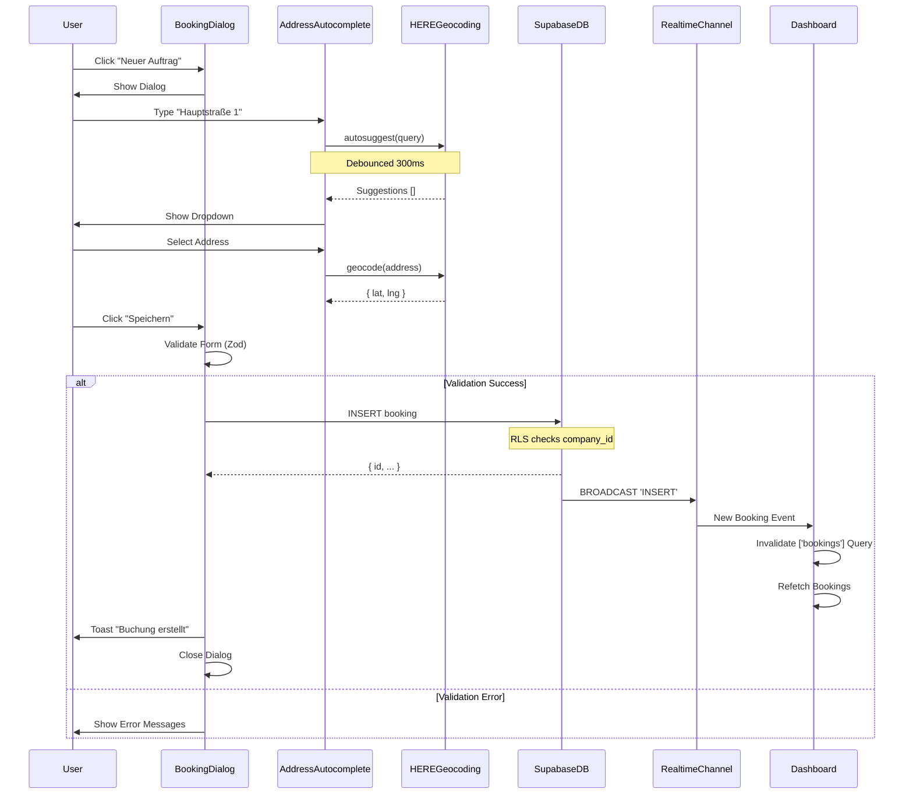
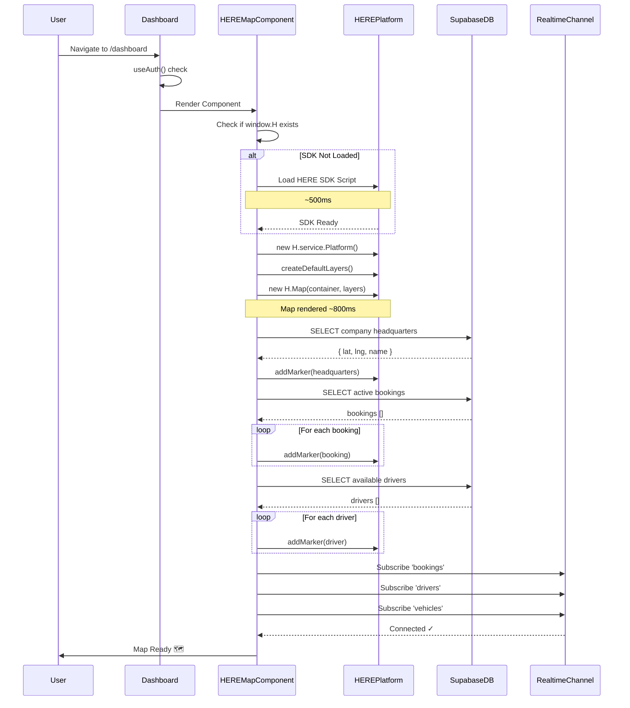
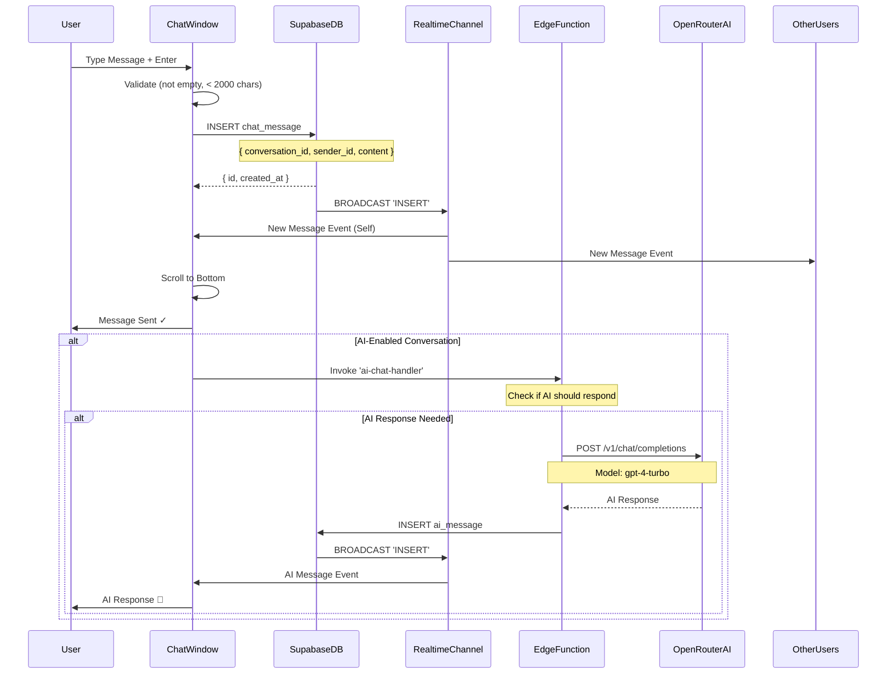
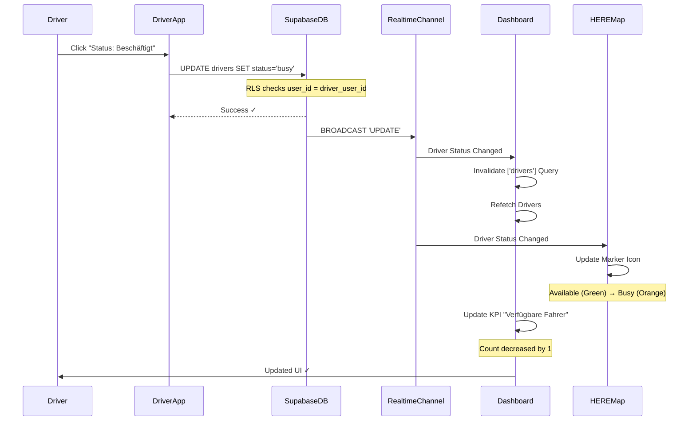
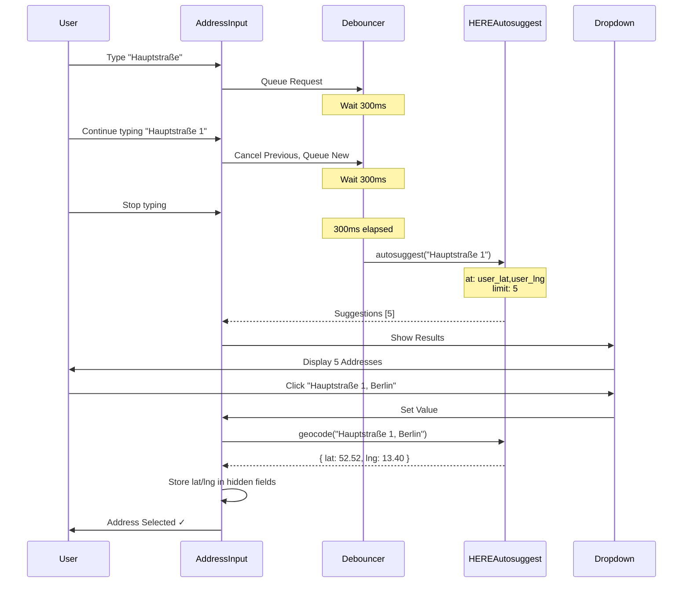
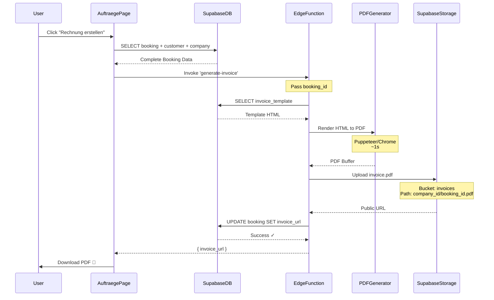
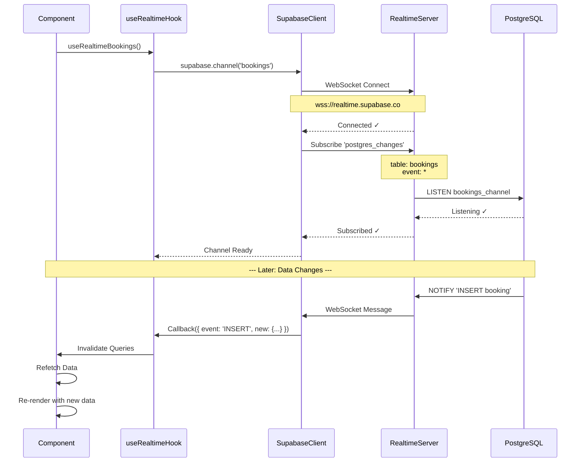
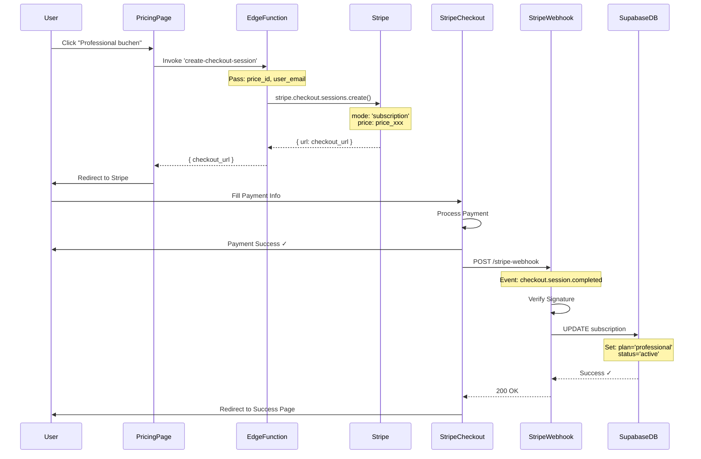

# 🔄 API FLOW DIAGRAMS V28.2.0

**Status:** ✅ PRODUCTION  
**Letzte Aktualisierung:** 2025-10-29  
**Version:** 28.2.0  
**Zweck:** Visualisierung kritischer API-Flows mit Mermaid

---

## 📋 OVERVIEW

Dieses Dokument enthält **Sequence Diagrams** für die 8 kritischsten API-Flows in MyDispatch:

1. **Booking Creation Flow** - User erstellt neue Buchung
2. **Map Rendering Flow** - Dashboard Map wird geladen
3. **Chat Message Flow** - User sendet Chat-Nachricht
4. **Driver Status Update Flow** - Driver ändert Status
5. **Address Autocomplete Flow** - User tippt Adresse ein
6. **Invoice Generation Flow** - System generiert Rechnung
7. **Realtime Subscription Flow** - Client subscribt Realtime Channel
8. **Payment Flow** - User startet Stripe Checkout

---

## 1️⃣ BOOKING CREATION FLOW

**Trigger:** User klickt "Neuer Auftrag" Button im Dashboard  
**Duration:** ~800ms (ohne Address Autocomplete)  
**APIs:** HERE Geocoding, Supabase DB, Supabase Realtime



**Error Points:**

- ⚠️ HERE API Timeout (Fallback: Manual Lat/Lng Input)
- ⚠️ Supabase RLS Violation (Toast: "Keine Berechtigung")
- ⚠️ Validation Error (Show Field-Errors)

**Performance Target:** < 800ms (ohne User-Input-Zeit)

---

## 2️⃣ MAP RENDERING FLOW

**Trigger:** User navigiert zu Dashboard  
**Duration:** ~2s (inkl. HERE SDK Load)  
**APIs:** HERE Maps SDK, Supabase DB (Bookings, Drivers, Vehicles)



**Error Points:**

- ⚠️ HERE SDK Load Failure (Fallback: Static Map Image)
- ⚠️ Company Headquarters Missing (Fallback: Default Berlin Coordinates)
- ⚠️ Realtime Connection Lost (Fallback: Polling every 10s)

**Performance Target:** < 2s Map Load (Lighthouse Metric)

---

## 3️⃣ CHAT MESSAGE FLOW

**Trigger:** User sendet Chat-Nachricht  
**Duration:** ~300ms (ohne AI Response)  
**APIs:** Supabase DB, Supabase Realtime, OpenRouter AI (Edge Function)



**Error Points:**

- ⚠️ Message Insert Failed (Toast: "Nachricht konnte nicht gesendet werden")
- ⚠️ Realtime Connection Lost (Show Warning: "Offline - Messages verzögert")
- ⚠️ AI API Timeout (Show: "AI antwortet nicht")

**Performance Target:** < 300ms Message Insert

---

## 4️⃣ DRIVER STATUS UPDATE FLOW

**Trigger:** Driver ändert Status (verfügbar → beschäftigt)  
**Duration:** ~200ms  
**APIs:** Supabase DB, Supabase Realtime



**Error Points:**

- ⚠️ Update Failed (RLS Violation) - Toast: "Keine Berechtigung"
- ⚠️ Optimistic Update Conflict (Version Mismatch) - Reload Data

**Performance Target:** < 200ms Status Update

---

## 5️⃣ ADDRESS AUTOCOMPLETE FLOW

**Trigger:** User tippt Adresse in Booking-Formular  
**Duration:** ~350ms (300ms Debounce + 50ms API)  
**APIs:** HERE Autosuggest API



**Error Points:**

- ⚠️ API Rate Limit (Show: "Zu viele Anfragen, bitte warten")
- ⚠️ No Suggestions Found (Show: "Keine Adressen gefunden")
- ⚠️ Geocoding Failed (Fallback: Manual Lat/Lng Input)

**Performance Target:** < 50ms API Response (nach Debounce)

---

## 6️⃣ INVOICE GENERATION FLOW

**Trigger:** User klickt "Rechnung erstellen" für Booking  
**Duration:** ~1.5s (PDF Generation)  
**APIs:** Supabase DB, Edge Function (PDF Generator)



**Error Points:**

- ⚠️ PDF Generation Timeout (> 10s) - Retry once
- ⚠️ Storage Upload Failed - Toast: "Upload fehlgeschlagen"
- ⚠️ Template Not Found - Use Default Template

**Performance Target:** < 2s Total Time

---

## 7️⃣ REALTIME SUBSCRIPTION FLOW

**Trigger:** Component Mount (Dashboard, Auftraege, etc.)  
**Duration:** ~500ms Connection Setup  
**APIs:** Supabase Realtime



**Error Points:**

- ⚠️ WebSocket Connection Failed (Fallback: HTTP Polling)
- ⚠️ Connection Dropped (Auto-Reconnect after 5s)
- ⚠️ Channel Error (Log + Toast Warning)

**Performance Target:** < 500ms Connection Setup

---

## 8️⃣ PAYMENT FLOW (STRIPE CHECKOUT)

**Trigger:** User klickt "Abonnement kaufen" auf Pricing-Seite  
**Duration:** ~2s (Checkout Session Creation)  
**APIs:** Stripe, Supabase DB (Webhook)



**Error Points:**

- ⚠️ Checkout Session Creation Failed (Toast: "Fehler beim Laden")
- ⚠️ Payment Failed (Stripe shows error)
- ⚠️ Webhook Signature Invalid (Log + Alert Admin)

**Performance Target:** < 2s Checkout Session Creation

---

## 📊 PERFORMANCE TARGETS SUMMARY

| Flow                      | Target  | Critical? | Fallback          |
| ------------------------- | ------- | --------- | ----------------- |
| **Booking Creation**      | < 800ms | ✅ Yes    | Manual Lat/Lng    |
| **Map Rendering**         | < 2s    | ✅ Yes    | Static Image      |
| **Chat Message**          | < 300ms | ⚠️ Medium | Offline Queue     |
| **Driver Status Update**  | < 200ms | ✅ Yes    | Optimistic Update |
| **Address Autocomplete**  | < 50ms  | ⚠️ Medium | Manual Input      |
| **Invoice Generation**    | < 2s    | ⚠️ Medium | Retry + Email     |
| **Realtime Subscription** | < 500ms | ✅ Yes    | HTTP Polling      |
| **Payment Flow**          | < 2s    | ✅ Yes    | Retry + Support   |

---

## 🚨 ERROR HANDLING PATTERNS

### Pattern 1: Retry with Exponential Backoff

```typescript
async function fetchWithRetry(fn: () => Promise<any>, retries = 3) {
  for (let i = 0; i < retries; i++) {
    try {
      return await fn();
    } catch (error) {
      if (i === retries - 1) throw error;
      await new Promise((resolve) => setTimeout(resolve, 2 ** i * 1000));
    }
  }
}
```

### Pattern 2: Fallback to Manual Input

```typescript
try {
  const { lat, lng } = await geocodeAddress(address);
} catch (error) {
  logError("[Geocoding] Failed:", error);
  toast.info("Bitte Koordinaten manuell eingeben");
  setShowManualInput(true);
}
```

### Pattern 3: Optimistic Update

```typescript
// Update UI immediately
setBookings((prev) => [...prev, newBooking]);

// Then save to DB
try {
  await supabase.from("bookings").insert(newBooking);
} catch (error) {
  // Rollback on error
  setBookings((prev) => prev.filter((b) => b.id !== newBooking.id));
  toast.error("Speichern fehlgeschlagen");
}
```

---

**Version:** 28.2.0  
**Status:** ✅ PRODUCTION  
**Nächste Review:** Bei neuen kritischen Flows
