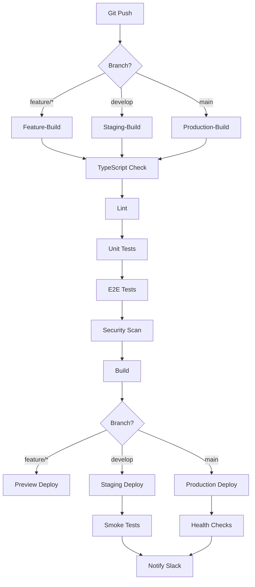

# AUTOMATISIERUNGS-PIPELINE V18.5.0

**Status:** 🚀 Implementierungs-Ready  
**Erstellt:** 2025-10-23  
**Zweck:** Vollautomatische CI/CD-Pipeline mit Tests, Security & Deployment

---

## 🎯 PIPELINE-ÜBERSICHT



---

## 📁 DATEI-STRUKTUR

```bash
.github/
  ├── workflows/
  │   ├── ci.yml                # Main CI/CD Pipeline
  │   ├── security.yml          # Security Scans
  │   ├── performance.yml       # Lighthouse CI
  │   └── dependabot.yml        # Dependency Updates
  ├── pull_request_template.md # PR-Template
  └── CODEOWNERS               # Code-Ownership

tests/
  ├── e2e/                     # Playwright E2E Tests
  │   ├── auth.spec.ts
  │   ├── bookings.spec.ts
  │   ├── customers.spec.ts
  │   └── drivers.spec.ts
  ├── unit/                    # Vitest Unit Tests
  │   ├── lib/
  │   └── hooks/
  └── fixtures/                # Test-Daten

scripts/
  ├── deploy-staging.sh        # Staging-Deployment
  ├── deploy-production.sh     # Production-Deployment
  ├── rollback.sh              # Emergency-Rollback
  └── smoke-tests.sh           # Post-Deploy-Checks
```

---

## 🔧 GITHUB ACTIONS WORKFLOWS

### 1. Main CI/CD Pipeline (.github/workflows/ci.yml)

```yaml
name: CI/CD Pipeline

on:
  push:
    branches: [main, develop, "feature/**"]
  pull_request:
    branches: [main, develop]

env:
  NODE_VERSION: "18"
  VITE_SUPABASE_URL: ${{ secrets.VITE_SUPABASE_URL }}
  VITE_SUPABASE_PUBLISHABLE_KEY: ${{ secrets.VITE_SUPABASE_PUBLISHABLE_KEY }}

jobs:
  # ========== VALIDATION STAGE ==========
  validate:
    name: Validate Code
    runs-on: ubuntu-latest

    steps:
      - uses: actions/checkout@v4

      - name: Setup Node.js
        uses: actions/setup-node@v4
        with:
          node-version: ${{ env.NODE_VERSION }}
          cache: "npm"

      - name: Install Dependencies
        run: npm ci

      - name: TypeScript Check
        run: npm run type-check

      - name: Lint
        run: npm run lint

      - name: Format Check
        run: npm run format:check

  # ========== TEST STAGE ==========
  test-unit:
    name: Unit Tests
    runs-on: ubuntu-latest
    needs: validate

    steps:
      - uses: actions/checkout@v4

      - name: Setup Node.js
        uses: actions/setup-node@v4
        with:
          node-version: ${{ env.NODE_VERSION }}
          cache: "npm"

      - name: Install Dependencies
        run: npm ci

      - name: Run Unit Tests
        run: npm run test:unit -- --coverage

      - name: Upload Coverage
        uses: codecov/codecov-action@v3
        with:
          files: ./coverage/coverage-final.json
          flags: unit

  test-e2e:
    name: E2E Tests
    runs-on: ubuntu-latest
    needs: validate

    steps:
      - uses: actions/checkout@v4

      - name: Setup Node.js
        uses: actions/setup-node@v4
        with:
          node-version: ${{ env.NODE_VERSION }}
          cache: "npm"

      - name: Install Dependencies
        run: npm ci

      - name: Install Playwright
        run: npx playwright install --with-deps

      - name: Run E2E Tests
        run: npm run test:e2e

      - name: Upload Test Results
        if: always()
        uses: actions/upload-artifact@v3
        with:
          name: playwright-report
          path: playwright-report/
          retention-days: 7

  # ========== BUILD STAGE ==========
  build:
    name: Build Application
    runs-on: ubuntu-latest
    needs: [test-unit, test-e2e]

    steps:
      - uses: actions/checkout@v4

      - name: Setup Node.js
        uses: actions/setup-node@v4
        with:
          node-version: ${{ env.NODE_VERSION }}
          cache: "npm"

      - name: Install Dependencies
        run: npm ci

      - name: Build
        run: npm run build

      - name: Check Bundle Size
        run: |
          BUNDLE_SIZE=$(du -sh dist | cut -f1)
          echo "Bundle size: $BUNDLE_SIZE"
          # Fail if > 2MB
          if [ $(du -sb dist | cut -f1) -gt 2097152 ]; then
            echo "Bundle size exceeds 2MB!"
            exit 1
          fi

      - name: Upload Build Artifact
        uses: actions/upload-artifact@v3
        with:
          name: dist
          path: dist/
          retention-days: 7

  # ========== DEPLOY STAGE ==========
  deploy-preview:
    name: Deploy Preview
    runs-on: ubuntu-latest
    needs: build
    if: github.event_name == 'pull_request'

    steps:
      - uses: actions/checkout@v4

      - name: Download Build
        uses: actions/download-artifact@v3
        with:
          name: dist
          path: dist/

      - name: Deploy to Netlify Preview
        uses: nwtgck/actions-netlify@v2.0
        with:
          publish-dir: "./dist"
          production-deploy: false
          github-token: ${{ secrets.GITHUB_TOKEN }}
          deploy-message: "Preview for PR #${{ github.event.number }}"
        env:
          NETLIFY_AUTH_TOKEN: ${{ secrets.NETLIFY_AUTH_TOKEN }}
          NETLIFY_SITE_ID: ${{ secrets.NETLIFY_SITE_ID }}

  deploy-staging:
    name: Deploy to Staging
    runs-on: ubuntu-latest
    needs: build
    if: github.ref == 'refs/heads/develop'

    environment:
      name: staging
      url: https://staging.my-dispatch.de

    steps:
      - uses: actions/checkout@v4

      - name: Download Build
        uses: actions/download-artifact@v3
        with:
          name: dist
          path: dist/

      - name: Deploy to Staging
        run: ./scripts/deploy-staging.sh
        env:
          STAGING_DEPLOY_KEY: ${{ secrets.STAGING_DEPLOY_KEY }}

      - name: Run Smoke Tests
        run: ./scripts/smoke-tests.sh https://staging.my-dispatch.de

      - name: Notify Slack
        uses: 8398a7/action-slack@v3
        with:
          status: ${{ job.status }}
          text: "Staging deployed successfully!"
          webhook_url: ${{ secrets.SLACK_WEBHOOK }}

  deploy-production:
    name: Deploy to Production
    runs-on: ubuntu-latest
    needs: build
    if: github.ref == 'refs/heads/main'

    environment:
      name: production
      url: https://my-dispatch.de

    steps:
      - uses: actions/checkout@v4

      - name: Download Build
        uses: actions/download-artifact@v3
        with:
          name: dist
          path: dist/

      - name: Deploy to Production
        run: ./scripts/deploy-production.sh
        env:
          PRODUCTION_DEPLOY_KEY: ${{ secrets.PRODUCTION_DEPLOY_KEY }}

      - name: Health Checks
        run: |
          curl -f https://my-dispatch.de/health || exit 1
          curl -f https://my-dispatch.de/api/health || exit 1

      - name: Create Sentry Release
        uses: getsentry/action-release@v1
        env:
          SENTRY_AUTH_TOKEN: ${{ secrets.SENTRY_AUTH_TOKEN }}
          SENTRY_ORG: mydispatch
          SENTRY_PROJECT: frontend
        with:
          environment: production

      - name: Notify Slack
        uses: 8398a7/action-slack@v3
        with:
          status: ${{ job.status }}
          text: "🚀 Production deployed successfully!"
          webhook_url: ${{ secrets.SLACK_WEBHOOK }}
```

---

### 2. Security Scan (.github/workflows/security.yml)

```yaml
name: Security Scan

on:
  schedule:
    - cron: "0 2 * * 1" # Montags 2 Uhr
  push:
    branches: [main]
  pull_request:
    branches: [main]

jobs:
  dependency-check:
    name: Dependency Audit
    runs-on: ubuntu-latest

    steps:
      - uses: actions/checkout@v4

      - name: Setup Node.js
        uses: actions/setup-node@v4
        with:
          node-version: "18"

      - name: NPM Audit
        run: npm audit --audit-level=moderate

      - name: Snyk Security Scan
        uses: snyk/actions/node@master
        env:
          SNYK_TOKEN: ${{ secrets.SNYK_TOKEN }}

  supabase-rls-check:
    name: Supabase RLS Linter
    runs-on: ubuntu-latest

    steps:
      - uses: actions/checkout@v4

      - name: Setup Supabase CLI
        uses: supabase/setup-cli@v1

      - name: Run RLS Linter
        run: supabase db lint --linked
        env:
          SUPABASE_ACCESS_TOKEN: ${{ secrets.SUPABASE_ACCESS_TOKEN }}

      - name: Check for Critical Issues
        run: |
          # Fail wenn Critical Issues gefunden
          if grep -q "CRITICAL" lint-report.txt; then
            echo "Critical security issues found!"
            exit 1
          fi

  owasp-zap-scan:
    name: OWASP ZAP Scan
    runs-on: ubuntu-latest

    steps:
      - uses: actions/checkout@v4

      - name: ZAP Baseline Scan
        uses: zaproxy/action-baseline@v0.7.0
        with:
          target: "https://staging.my-dispatch.de"
          rules_file_name: ".zap/rules.tsv"
          cmd_options: "-a"
```

---

### 3. Performance Monitoring (.github/workflows/performance.yml)

```yaml
name: Lighthouse CI

on:
  push:
    branches: [main, develop]
  pull_request:
    branches: [main]

jobs:
  lighthouse:
    name: Lighthouse Audit
    runs-on: ubuntu-latest

    steps:
      - uses: actions/checkout@v4

      - name: Setup Node.js
        uses: actions/setup-node@v4
        with:
          node-version: "18"

      - name: Install Dependencies
        run: npm ci

      - name: Build
        run: npm run build

      - name: Run Lighthouse CI
        uses: treosh/lighthouse-ci-action@v9
        with:
          urls: |
            https://staging.my-dispatch.de
            https://staging.my-dispatch.de/auftraege
            https://staging.my-dispatch.de/dashboard
          uploadArtifacts: true
          temporaryPublicStorage: true

      - name: Check Performance Budget
        run: |
          # Fail wenn Performance-Score <90
          SCORE=$(cat ./lhci_reports/manifest.json | jq '.[0].summary.performance')
          if [ $SCORE -lt 90 ]; then
            echo "Performance score below 90: $SCORE"
            exit 1
          fi
```

---

## 🧪 TEST-IMPLEMENTIERUNG

### E2E Tests (tests/e2e/auth.spec.ts)

```typescript
import { test, expect } from "@playwright/test";

test.describe("Authentication Flow", () => {
  test("should login successfully", async ({ page }) => {
    await page.goto("/auth");

    await page.fill('input[name="email"]', "test@example.com");
    await page.fill('input[name="password"]', "password123");
    await page.click('button[type="submit"]');

    await expect(page).toHaveURL("/dashboard");
    await expect(page.locator("text=Willkommen")).toBeVisible();
  });

  test("should show error on invalid credentials", async ({ page }) => {
    await page.goto("/auth");

    await page.fill('input[name="email"]', "invalid@example.com");
    await page.fill('input[name="password"]', "wrongpassword");
    await page.click('button[type="submit"]');

    await expect(page.locator("text=Ungültige Anmeldedaten")).toBeVisible();
  });
});
```

### Unit Tests (tests/unit/lib/validators.test.ts)

```typescript
import { describe, it, expect } from "vitest";
import { validateEmail, validatePhone } from "@/lib/validators";

describe("validateEmail", () => {
  it("should validate correct email", () => {
    expect(validateEmail("test@example.com")).toBe(true);
  });

  it("should reject invalid email", () => {
    expect(validateEmail("invalid-email")).toBe(false);
    expect(validateEmail("test@")).toBe(false);
    expect(validateEmail("@example.com")).toBe(false);
  });
});

describe("validatePhone", () => {
  it("should validate German phone numbers", () => {
    expect(validatePhone("+49 30 12345678")).toBe(true);
    expect(validatePhone("030 12345678")).toBe(true);
  });

  it("should reject invalid phone numbers", () => {
    expect(validatePhone("123")).toBe(false);
    expect(validatePhone("abc")).toBe(false);
  });
});
```

---

## 📊 METRIKEN & MONITORING

### Performance-Budget

```json
// .lighthouserc.json
{
  "ci": {
    "collect": {
      "numberOfRuns": 3,
      "url": ["https://staging.my-dispatch.de", "https://staging.my-dispatch.de/dashboard"]
    },
    "assert": {
      "assertions": {
        "categories:performance": ["error", { "minScore": 0.9 }],
        "categories:accessibility": ["error", { "minScore": 0.9 }],
        "categories:best-practices": ["error", { "minScore": 0.9 }],
        "categories:seo": ["error", { "minScore": 0.9 }],
        "first-contentful-paint": ["error", { "maxNumericValue": 2000 }],
        "interactive": ["error", { "maxNumericValue": 5000 }]
      }
    },
    "upload": {
      "target": "temporary-public-storage"
    }
  }
}
```

---

## 🚨 ROLLBACK-PROZEDUR

### Automatischer Rollback bei Failed Health-Checks

```bash
#!/bin/bash
# scripts/rollback.sh

echo "🔄 Starting rollback..."

# Get previous successful deployment
PREVIOUS_COMMIT=$(git log --format="%H" -n 2 | tail -1)

echo "Rolling back to: $PREVIOUS_COMMIT"

# Revert to previous commit
git checkout $PREVIOUS_COMMIT
npm ci
npm run build

# Deploy
./scripts/deploy-production.sh

# Verify
curl -f https://my-dispatch.de/health || exit 1

echo "✅ Rollback successful!"
```

---

## 📝 CHECKLISTE FÜR NEUE DEPLOYMENTS

### Pre-Deployment

- [ ] Alle Tests grün (Unit + E2E)
- [ ] TypeScript 0 Errors
- [ ] Lighthouse-Score >90
- [ ] Security-Scan bestanden
- [ ] Changelog aktualisiert
- [ ] DB-Migrations getestet (falls vorhanden)
- [ ] Feature-Flags konfiguriert (falls neue Features)

### Post-Deployment

- [ ] Health-Checks erfolgreich
- [ ] Smoke-Tests bestanden
- [ ] Sentry: Keine neuen Errors
- [ ] Performance-Metriken überwacht
- [ ] Slack-Notification erhalten

---

## 🔗 VERKNÜPFTE DOKUMENTE

- [WORKFLOW_OPTIMIERUNG_V18.5.0.md](./WORKFLOW_OPTIMIERUNG_V18.5.0.md) - Optimierungs-Plan
- [TASK_MANAGEMENT_SYSTEM_V18.5.0.md](./TASK_MANAGEMENT_SYSTEM_V18.5.0.md) - Task-Tracking
- [QUALITAETS_STANDARDS_V18.5.0.md](./QUALITAETS_STANDARDS_V18.5.0.md) - Quality Gates

---

**Erstellt:** 2025-10-24 00:10 (DE)  
**Status:** 🚀 Implementierungs-Ready  
**Version:** 18.5.0
