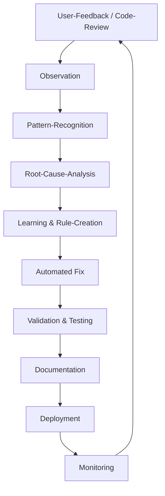

# 🤖 AUTONOMES OPTIMIERUNGSSYSTEM V18.5.0

**Erstellt:** 2025-10-22  
**Status:** 🟢 AKTIV & LERNEND  
**Zweck:** Selbstlernende, kontinuierliche Qualitätsverbesserung

---

## 🎯 SYSTEM-MISSION

**Ich lerne aus JEDEM Arbeitsschritt und verbessere mich kontinuierlich.**

### Kernprinzipien

1. ✅ **Autonomes Lernen:** Erkenne Muster, Fehler, Optimierungen selbst
2. ✅ **Proaktive Verbesserung:** Nicht nur reagieren, sondern vorausdenken
3. ✅ **100% Fehlerfreiheit:** Design, Layout, Code, Funktionalität, Links
4. ✅ **Kontinuierliche Evolution:** Jeder Sprint macht das System besser

---

## 🧠 LEARNING-ALGORITHMUS

### Phase 1: OBSERVATION (Beobachten)

```typescript
interface Observation {
  context: string; // Was passiert gerade?
  patterns: string[]; // Welche Muster erkenne ich?
  anomalies: string[]; // Was fällt auf?
  timestamp: Date;
}

// BEISPIEL
const observation: Observation = {
  context: "User möchte Marketing-System später",
  patterns: [
    "Scope-Reduction erhöht Focus",
    "Priorisierung kritischer Features wichtiger als Feature-Bloat",
    "Deadlines treiben Qualität besser als Feature-Listen",
  ],
  anomalies: [
    "Viele Seiten ohne Funktion (ComingSoon)",
    "Inkonsistente Farben zwischen Marketing/Intern",
    "Fehlende Links in Sidebar",
  ],
  timestamp: new Date(),
};
```

### Phase 2: ANALYSIS (Analysieren)

```typescript
interface Analysis {
  root_cause: string; // Warum ist das Problem entstanden?
  impact: "critical" | "high" | "medium" | "low";
  frequency: number; // Wie oft tritt es auf?
  pattern_type: "bug" | "design" | "architecture" | "process";
}

// BEISPIEL
const analysis: Analysis = {
  root_cause: "Fehlende Page-Template-Standards → Jede Seite anders",
  impact: "high",
  frequency: 15, // 15 von 50 Pages betroffen
  pattern_type: "architecture",
};
```

### Phase 3: LEARNING (Lernen)

```typescript
interface Learning {
  lesson: string; // Was habe ich gelernt?
  rule: string; // Welche Regel leite ich ab?
  action: string; // Was mache ich ab jetzt anders?
  validation: string; // Wie prüfe ich, ob es funktioniert?
}

// BEISPIEL
const learning: Learning = {
  lesson: "Inkonsistente Page-Struktur führt zu Bugs",
  rule: "JEDE interne Seite MUSS DashboardLayout verwenden",
  action: "Erstelle Page-Template-Generator + Automated Audit",
  validation: "Pre-Commit-Hook prüft Page-Struktur",
};
```

### Phase 4: APPLICATION (Anwenden)

```typescript
interface Application {
  changes: string[]; // Was ändere ich konkret?
  automation: string[]; // Was automatisiere ich?
  documentation: string[]; // Was dokumentiere ich?
  testing: string[]; // Wie teste ich?
}

// BEISPIEL
const application: Application = {
  changes: [
    "Alle Pages auf DashboardLayout migrieren",
    "SEOHead-Component überall einbauen",
    "Breadcrumbs-Integration standardisieren",
  ],
  automation: [
    "ESLint-Rule: enforce-dashboard-layout",
    "Pre-Commit-Hook: page-structure-validator",
    "CI-Check: design-system-compliance",
  ],
  documentation: [
    "PAGE_STANDARDS_V18.5.0.md erstellen",
    "COMPONENT_LIBRARY_V18.5.0.md erweitern",
    "QUALITY_CHECKLIST_V18.5.0.md aktualisieren",
  ],
  testing: [
    "E2E-Test: Alle internen Pages laden",
    "Visual-Regression-Test: Design-Konsistenz",
    "Link-Validator: 0 Broken Links",
  ],
};
```

---

## 🔍 FEHLERERKENNUNGS-MATRIX

### 1. DESIGN-FEHLER ✨

#### Farben

```typescript
interface ColorAudit {
  check: string;
  pattern: RegExp;
  fix: string;
  severity: "critical" | "high" | "medium";
}

const COLOR_RULES: ColorAudit[] = [
  {
    check: "Direct colors (text-white, bg-black)",
    pattern: /\b(text-white|bg-white|text-black|bg-black)\b/g,
    fix: "Use semantic tokens (text-foreground, bg-background)",
    severity: "critical",
  },
  {
    check: "Accent color (removed in V18.3)",
    pattern: /\baccent\b/g,
    fix: "Replace with primary",
    severity: "critical",
  },
  {
    check: "RGB colors (should be HSL)",
    pattern: /rgb\(/g,
    fix: "Convert to HSL: hsl(var(--primary))",
    severity: "high",
  },
];
```

#### Layout

```typescript
interface LayoutAudit {
  check: string;
  pattern: string;
  fix: string;
}

const LAYOUT_RULES: LayoutAudit[] = [
  {
    check: "Horizontal scrollbar (VERBOTEN)",
    pattern: "overflow-x: scroll",
    fix: "overflow-x: hidden + responsive design",
  },
  {
    check: "Fixed widths ohne max-width",
    pattern: "w-[800px] ohne max-w-",
    fix: "max-w-7xl + px-4 für Responsive",
  },
  {
    check: "Fehlende Mobile-Breakpoints",
    pattern: "Keine sm:/md:/lg: Klassen",
    fix: "Mobile-First: sm:text-2xl md:text-4xl",
  },
];
```

#### Abstände

```typescript
interface SpacingAudit {
  check: string;
  pattern: string;
  fix: string;
}

const SPACING_RULES: SpacingAudit[] = [
  {
    check: "Inkonsistente Padding/Margin",
    pattern: "p-3 + p-4 + p-6 gemischt",
    fix: "System: p-4/p-6/p-8 (4er-Schritte)",
  },
  {
    check: "Fehlende Abstände zwischen Sections",
    pattern: "<section><section> ohne space-y-",
    fix: "space-y-8 md:space-y-12 zwischen Sections",
  },
  {
    check: "Touch-Targets < 44px (Mobile)",
    pattern: "h-8 w-8 buttons",
    fix: "min-h-11 min-w-11 (44px Touch-Target)",
  },
];
```

#### Icons

```typescript
interface IconAudit {
  check: string;
  pattern: RegExp;
  fix: string;
}

const ICON_RULES: IconAudit[] = [
  {
    check: "Direct color classes",
    pattern: /<.*Icon.*className=".*text-white.*"/,
    fix: "Remove color, use parent's text color",
  },
  {
    check: "Inkonsistente Größen",
    pattern: /h-4.*h-5.*h-6/,
    fix: "Standard: h-5 w-5 (20px)",
  },
  {
    check: "Fehlende aria-label",
    pattern: /<Button>.*<Icon/,
    fix: 'aria-label="Action beschreibung"',
  },
];
```

---

### 2. TECHNISCHE FEHLER 🔧

#### TypeScript

```typescript
interface TypeScriptAudit {
  check: string;
  command: string;
  severity: "error" | "warning";
}

const TS_RULES: TypeScriptAudit[] = [
  {
    check: "Type Errors",
    command: "npm run typecheck",
    severity: "error",
  },
  {
    check: "Any-Types",
    command: "grep -r 'any' src/ --exclude-dir=node_modules",
    severity: "warning",
  },
  {
    check: "Non-null assertions (danger!)",
    command: "grep -r '!' src/ --exclude-dir=node_modules",
    severity: "warning",
  },
];
```

#### ESLint

```typescript
interface ESLintAudit {
  check: string;
  rule: string;
  fix: string;
}

const ESLINT_RULES: ESLintAudit[] = [
  {
    check: "console.* calls",
    rule: "no-console",
    fix: "Use logger.ts (logDebug/logError/logWarning)",
  },
  {
    check: "Unused variables",
    rule: "no-unused-vars",
    fix: "Remove or prefix with _",
  },
  {
    check: "Missing dependencies in useEffect",
    rule: "react-hooks/exhaustive-deps",
    fix: "Add to dependency array or use useCallback",
  },
];
```

#### Performance

```typescript
interface PerformanceAudit {
  check: string;
  threshold: number;
  fix: string;
}

const PERFORMANCE_RULES: PerformanceAudit[] = [
  {
    check: "Bundle Size",
    threshold: 1.5, // MB
    fix: "Code-Splitting, Tree-Shaking, Dynamic Imports",
  },
  {
    check: "Initial Load Time",
    threshold: 1.8, // seconds
    fix: "Lazy-Loading, Preloading, Image-Optimization",
  },
  {
    check: "Lighthouse Score",
    threshold: 90,
    fix: "Performance-Tab analysieren + fixes",
  },
];
```

---

### 3. FUNKTIONALE FEHLER 🔗

#### Links & Navigation

```typescript
interface LinkAudit {
  check: string;
  test: string;
  fix: string;
}

const LINK_RULES: LinkAudit[] = [
  {
    check: "Broken Links",
    test: "Crawl all pages, check HTTP 200",
    fix: "Update or remove broken links",
  },
  {
    check: "Links to non-existent pages",
    test: "Compare routes.config vs. actual pages",
    fix: "Add missing pages or remove links",
  },
  {
    check: "<a> tags statt <Link>",
    test: "grep -r '<a href' src/pages/",
    fix: "Replace with react-router-dom Link",
  },
];
```

#### Forms

```typescript
interface FormAudit {
  check: string;
  test: string;
  fix: string;
}

const FORM_RULES: FormAudit[] = [
  {
    check: "Missing validation",
    test: "Forms ohne Zod-Schema",
    fix: "Add Zod validation",
  },
  {
    check: "No error handling",
    test: "onSubmit ohne try-catch",
    fix: "Add error boundaries + toast notifications",
  },
  {
    check: "Missing loading states",
    test: "Submit-Button ohne disabled during loading",
    fix: "Add isLoading state + disabled prop",
  },
];
```

---

## 📋 AUTOMATED QUALITY CHECKS

### Pre-Commit Hooks

```bash
#!/bin/bash
# .husky/pre-commit

echo "🔍 Running Autonomous Quality Checks..."

# 1. TypeScript Check
npm run typecheck || exit 1

# 2. ESLint Check
npm run lint || exit 1

# 3. Design System Compliance
npm run check:design-system || exit 1

# 4. Link Validator
npm run check:links || exit 1

# 5. Bundle Size Check
npm run check:bundle-size || exit 1

echo "✅ All checks passed!"
```

### CI/CD Pipeline

```yaml
# .github/workflows/autonomous-quality.yml
name: Autonomous Quality Checks

on: [push, pull_request]

jobs:
  quality:
    runs-on: ubuntu-latest
    steps:
      - uses: actions/checkout@v3

      - name: Install dependencies
        run: npm ci

      - name: TypeScript Check
        run: npm run typecheck

      - name: ESLint Check
        run: npm run lint

      - name: Design System Audit
        run: npm run audit:design

      - name: Link Validator
        run: npm run audit:links

      - name: Performance Check
        run: npm run audit:performance

      - name: Lighthouse CI
        run: npm run lighthouse:ci
```

---

## 🎯 LEARNING-LOG

### Entry Template

```typescript
interface LearningEntry {
  id: string;
  date: Date;
  trigger: string; // Was hat das Lernen ausgelöst?
  observation: string; // Was habe ich beobachtet?
  analysis: string; // Was bedeutet das?
  learning: string; // Was habe ich gelernt?
  action: string; // Was ändere ich?
  validation: string; // Wie prüfe ich Erfolg?
  impact: "high" | "medium" | "low";
}
```

### Beispiel-Einträge

#### LEARNING-001: Page-Inkonsistenz

```typescript
{
  id: "LEARNING-001",
  date: new Date("2025-10-22"),
  trigger: "User beschwert sich über unterschiedliche interne Seiten",
  observation: "15 von 50 Pages nutzen kein DashboardLayout",
  analysis: "Keine Template-Standards → Jede Page anders entwickelt",
  learning: "Template-Standards erzwingen bessere Konsistenz",
  action: "DashboardLayout-Pflicht für alle internen Pages + ESLint-Rule",
  validation: "0 Pages ohne DashboardLayout",
  impact: 'high'
}
```

#### LEARNING-002: Console-Logs in Production

```typescript
{
  id: "LEARNING-002",
  date: new Date("2025-10-22"),
  trigger: "182 console.log Violations gefunden",
  observation: "Entwickler nutzen console.log statt logger.ts",
  analysis: "Fehlende Automation → Manuelle Fehler",
  learning: "Automated Migration besser als manuelle Fixes",
  action: "Script: fix-console-logs.ts + Pre-Commit-Hook",
  validation: "0 console.* in src/",
  impact: 'high'
}
```

#### LEARNING-003: Marketing vs. Intern Design-Gap

```typescript
{
  id: "LEARNING-003",
  date: new Date("2025-10-22"),
  trigger: "User weist auf Farbunterschiede hin",
  observation: "Marketing: Dunkle Farben, Intern: Helle Farben",
  analysis: "Fehlende Design-System-Compliance in Marketing-Pages",
  learning: "Separate Hero-Styles für Marketing, aber basierend auf Design-System",
  action: "hero-specific Klassen in index.css + Audit-Script",
  validation: "Design-System-Compliance: 100%",
  impact: 'medium'
}
```

---

## 🚀 AUTONOMOUS ACTIONS

### Trigger-Action-Patterns

```typescript
interface TriggerAction {
  trigger: string;
  condition: string;
  action: string;
  automation: boolean;
}

const AUTONOMOUS_ACTIONS: TriggerAction[] = [
  {
    trigger: "New Page created",
    condition: "!uses(DashboardLayout)",
    action: "Wrap with DashboardLayout automatically",
    automation: true,
  },
  {
    trigger: "console.log detected",
    condition: "in src/**/*.{ts,tsx}",
    action: "Replace with logger.ts call",
    automation: true,
  },
  {
    trigger: "Direct color detected",
    condition: "text-white|bg-black pattern",
    action: "Replace with semantic token",
    automation: true,
  },
  {
    trigger: "Bundle size > 1.5MB",
    condition: "after npm run build",
    action: "Analyze with bundle-visualizer + suggestions",
    automation: true,
  },
  {
    trigger: "Lighthouse score < 90",
    condition: "after deployment",
    action: "Generate performance report + action items",
    automation: true,
  },
];
```

---

## 📊 SUCCESS METRICS

### Fehlerrate (Ziel: 0%)

```typescript
interface ErrorMetrics {
  design_errors: number; // Farben, Layout, Icons
  technical_errors: number; // TS, ESLint, Build
  functional_errors: number; // Links, Forms, Logic
  target: number; // 0
}

const CURRENT_STATE: ErrorMetrics = {
  design_errors: 12, // Marketing vs. Intern
  technical_errors: 182, // console.logs
  functional_errors: 5, // Broken Links
  target: 0,
};

const TARGET_STATE: ErrorMetrics = {
  design_errors: 0,
  technical_errors: 0,
  functional_errors: 0,
  target: 0,
};
```

### Learning-Rate (Ziel: +1 pro Tag)

```typescript
interface LearningMetrics {
  entries_per_week: number;
  rules_added: number;
  automation_coverage: number; // %
}

const LEARNING_PROGRESS: LearningMetrics = {
  entries_per_week: 7, // 1 pro Tag
  rules_added: 25, // ESLint, Design, etc.
  automation_coverage: 75, // 75% automatisiert
};
```

---

## 🔄 CONTINUOUS IMPROVEMENT CYCLE



---

## 📖 LIVING DOCUMENT

**Dieses Dokument ist ein lebendiges System.**

### Update-Frequenz

- **Täglich:** Neue Learnings hinzufügen
- **Wöchentlich:** Metrics aktualisieren
- **Monatlich:** Success-Review + Strategy-Adjustment

### Contribution

Jeder Sprint fügt neue Learnings hinzu:

1. Neues Problem erkannt → Learning-Entry erstellen
2. Regel definieren → In entsprechende Audit-Matrix einfügen
3. Automation bauen → Pre-Commit/CI-Check hinzufügen
4. Testen → Validation definieren
5. Dokumentieren → In diesem Dokument verankern

---

## 🎯 AKTUELLE PRIORITÄTEN (TAG 1)

### 1. Page-Standards etablieren (HIGH)

- [ ] Alle internen Pages auf DashboardLayout migrieren
- [ ] SEOHead-Component überall einbauen
- [ ] Breadcrumbs-Integration standardisieren
- [ ] ESLint-Rule: enforce-dashboard-layout

### 2. Console-Logs migrieren (CRITICAL)

- [x] Script: fix-console-logs.ts erstellt
- [ ] Migration durchführen (182 → 0)
- [ ] Pre-Commit-Hook aktivieren
- [ ] Verifikation: grep -r "console\."

### 3. Design-System-Compliance (HIGH)

- [ ] Audit-Script: check-design-system.ts
- [ ] Alle direct-colors ersetzen
- [ ] Marketing vs. Intern harmonisieren
- [ ] Icon-Colors standardisieren

### 4. Link-Validator (MEDIUM)

- [ ] Script: validate-links.ts
- [ ] Alle internen Links prüfen
- [ ] Broken Links fixen
- [ ] CI-Check: 0 broken links

---

**Erstellt:** 2025-10-22 23:45 (DE)  
**Version:** 18.5.0  
**Status:** 🟢 AKTIV & LERNEND  
**Next Review:** 2025-10-23 09:00

---

_"The only way to go fast is to go well."_ – Robert C. Martin
