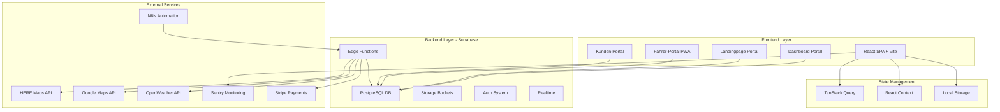
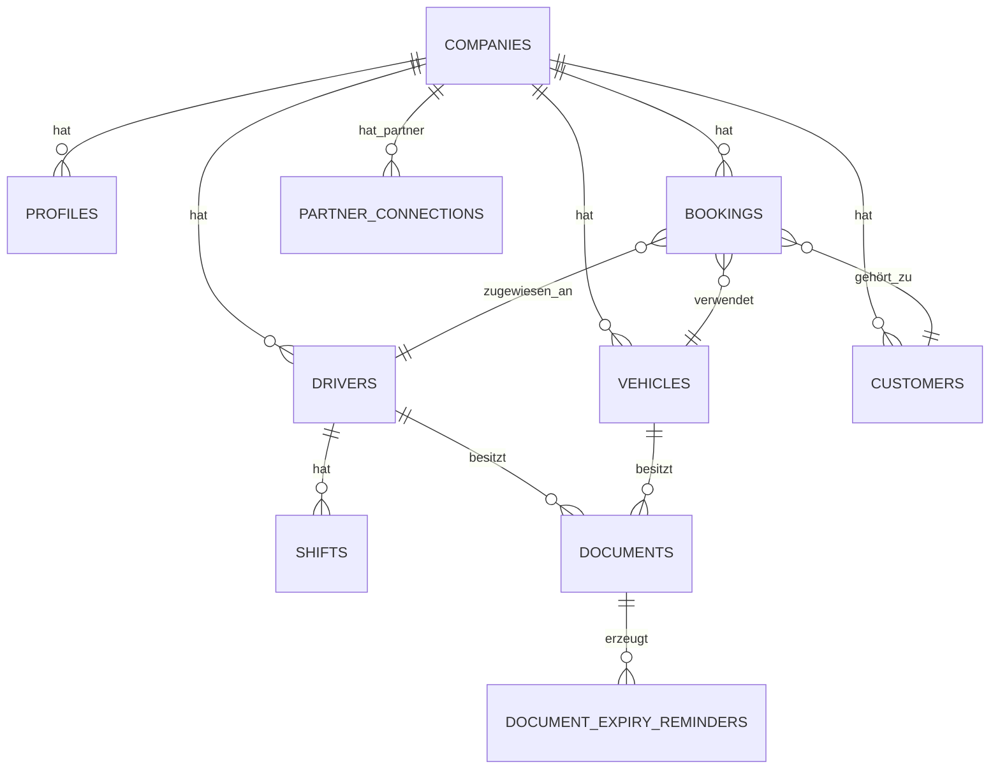

# MYDISPATCH V18.5.0 - TECHNISCHER BAUPLAN

**Version:** 18.5.0  
**Datum:** 2025-01-22  
**Status:** PRODUKTIONSBEREIT

---

## 🏗️ ARCHITEKTUR-ÜBERSICHT

### System-Komponenten



---

## 📁 PROJEKTSTRUKTUR

```
mydispatch/
├── src/
│   ├── components/           # React-Komponenten
│   │   ├── design-system/   # Master-Komponenten
│   │   │   ├── HeroSection.tsx
│   │   │   ├── KPICard.tsx
│   │   │   ├── QuickActions.tsx
│   │   │   ├── DashboardGrid.tsx
│   │   │   ├── ResponsiveBadge.tsx
│   │   │   └── Icon.tsx
│   │   ├── dashboard/       # Dashboard-Widgets
│   │   │   ├── BookingStats.tsx
│   │   │   ├── RevenueChart.tsx
│   │   │   ├── DriverAvailability.tsx
│   │   │   ├── VehicleStatus.tsx
│   │   │   ├── PendingDocuments.tsx
│   │   │   └── PredictiveDemandWidget.tsx
│   │   ├── bookings/        # Auftrags-Komponenten
│   │   │   ├── BookingForm.tsx
│   │   │   ├── BookingList.tsx
│   │   │   ├── BookingDetails.tsx
│   │   │   └── BookingFilters.tsx
│   │   ├── drivers/         # Fahrer-Komponenten
│   │   ├── vehicles/        # Fahrzeug-Komponenten
│   │   ├── customers/       # Kunden-Komponenten
│   │   ├── finance/         # Finanz-Komponenten
│   │   ├── documents/       # Dokument-Komponenten
│   │   ├── chat/            # Chat-Komponenten
│   │   └── ui/              # Shadcn UI-Primitives
│   ├── pages/               # Route-Komponenten
│   │   ├── Index.tsx        # Dashboard (/)
│   │   ├── Auftraege.tsx    # Aufträge (/auftraege)
│   │   ├── Fahrer.tsx       # Fahrer (/fahrer)
│   │   ├── Fahrzeuge.tsx    # Fahrzeuge (/fahrzeuge)
│   │   ├── Kunden.tsx       # Kunden (/kunden)
│   │   ├── Finanzen.tsx     # Finanzen (/finanzen)
│   │   ├── Dokumente.tsx    # Dokumente (/dokumente)
│   │   ├── Statistiken.tsx  # Statistiken (/statistiken)
│   │   ├── Einstellungen.tsx # Einstellungen (/einstellungen)
│   │   ├── Auth.tsx         # Login/Signup (/auth)
│   │   ├── FahrerPortal.tsx # Fahrer-Portal (/fahrer-portal)
│   │   ├── KundenPortal.tsx # Kunden-Portal (/kunden-portal)
│   │   └── [slug].tsx       # Landingpage (/:slug)
│   ├── hooks/               # Custom Hooks
│   │   ├── use-auth.tsx     # Authentication
│   │   ├── use-bookings.ts  # Bookings CRUD
│   │   ├── use-drivers.ts   # Drivers CRUD
│   │   ├── use-vehicles.ts  # Vehicles CRUD
│   │   ├── use-customers.ts # Customers CRUD
│   │   └── use-mobile.ts    # Mobile Detection
│   ├── lib/                 # Utilities
│   │   ├── database-utils.ts      # CompanyQuery, SoftDelete
│   │   ├── error-handler.ts       # Error Handling + SMI
│   │   ├── error-tracker.ts       # Error Tracking
│   │   ├── logger.ts              # Structured Logging
│   │   ├── sentry-integration.ts  # Sentry Setup
│   │   ├── semantic-memory.ts     # SMI (Semantic Memory Index)
│   │   ├── design-system.ts       # Design Tokens
│   │   ├── safe-storage.ts        # Safe localStorage Wrapper
│   │   └── validation.ts          # Input Validation (Zod)
│   ├── integrations/
│   │   └── supabase/
│   │       ├── client.ts    # Supabase Client (AUTO-GEN)
│   │       └── types.ts     # Database Types (AUTO-GEN)
│   ├── styles/
│   │   └── index.css        # Global Styles + Design Tokens
│   ├── App.tsx              # Root Component
│   ├── main.tsx             # Entry Point
│   └── routes.tsx           # Route Definitions
├── supabase/
│   ├── functions/           # Edge Functions
│   │   ├── ai-error-analysis/
│   │   ├── ai-forecast/
│   │   ├── booking-webhook/
│   │   ├── send-chat-notification/
│   │   ├── stripe-webhook/
│   │   └── configure-auth-security/
│   ├── migrations/          # Database Migrations
│   └── config.toml          # Supabase Config (AUTO-GEN)
├── docs/                    # Dokumentation
│   ├── GESAMTKONZEPT_V18.5.0.md
│   ├── BAUPLAN_V18.5.0.md (THIS FILE)
│   ├── FEHLERANALYSE_KOMPLETT_V18.5.0.md
│   ├── PFLICHTENHEFTE_V18.5.0.md
│   ├── MARKETING_KONZEPT_V18.5.0.md
│   ├── WORKFLOW_AUTOMATION_V18.5.0.md
│   ├── API_DOKUMENTATION_V18.5.0.md
│   ├── DASHBOARD_SPEZIFIKATION_V18.5.0.md
│   ├── FORMULAR_STANDARDS_V18.5.0.md
│   ├── DASHBOARD_NAMING_CONVENTIONS.md
│   ├── DASHBOARD_DESIGN_VORGABEN.md
│   ├── ERROR_SOLUTIONS_DB.md
│   └── FEHLERDATENBANK_V18.3.28.md
├── public/                  # Static Assets
│   ├── sw.js                # Service Worker
│   └── manifest.json        # PWA Manifest
├── .github/
│   └── workflows/
│       └── production-deployment.yml
├── vite.config.ts
├── tailwind.config.ts
├── tsconfig.json
└── package.json
```

---

## 🧩 KOMPONENTEN-HIERARCHIE

### Dashboard-Portal (/)

```
DashboardLayout
├── Header
│   ├── Logo
│   ├── CompanyName
│   ├── Navigation
│   └── UserMenu
├── Sidebar
│   ├── NavigationMenu
│   │   ├── Dashboard
│   │   ├── Aufträge
│   │   ├── Fahrer
│   │   ├── Fahrzeuge
│   │   ├── Kunden
│   │   ├── Finanzen
│   │   ├── Dokumente
│   │   ├── Statistiken
│   │   └── Einstellungen
│   └── Footer
│       ├── Version
│       └── Support-Link
└── MainContent
    ├── PageHeader
    │   ├── Heading
    │   ├── Description
    │   └── Actions (Buttons)
    └── PageContent
        ├── DashboardGrid (12-Column)
        │   ├── LeftColumn (8 Cols)
        │   │   ├── QuickActions
        │   │   ├── BookingStats (KPI-Cards)
        │   │   └── RevenueChart
        │   └── RightColumn (4 Cols)
        │       ├── DriverAvailability
        │       ├── VehicleStatus
        │       └── PendingDocuments
        └── Footer
```

### Aufträge-Seite (/auftraege)

```
AuftraegePage
├── PageHeader
│   ├── Heading: "Aufträge"
│   ├── Description: "Verwalten Sie alle Buchungen"
│   └── Actions
│       └── Button: "Neuer Auftrag"
├── BookingFilters
│   ├── StatusFilter
│   ├── DateRangePicker
│   ├── DriverFilter
│   └── SearchInput
└── BookingList
    └── BookingCard[] (Loop)
        ├── BookingHeader
        │   ├── BookingID
        │   ├── Status Badge
        │   └── Actions (Edit, Delete)
        ├── BookingDetails
        │   ├── PickupAddress
        │   ├── DropoffAddress
        │   ├── PickupTime
        │   ├── CustomerName
        │   ├── DriverName
        │   └── Price
        └── BookingFooter
            ├── CreatedAt
            └── PaymentStatus Badge
```

### Formular-Komponenten

```
BookingForm
├── FormHeader
│   ├── Title
│   └── CloseButton
├── FormBody (Steps)
│   ├── Step1: Zeitpunkt & Route
│   │   ├── DateTimePicker (PickupTime)
│   │   ├── AddressAutocomplete (Pickup)
│   │   └── AddressAutocomplete (Dropoff)
│   ├── Step2: Fahrgastdaten
│   │   ├── PassengerCount
│   │   ├── LuggageCount
│   │   └── SpecialRequests
│   ├── Step3: Kundendaten
│   │   ├── CustomerSelect (Existing) OR
│   │   └── CustomerForm (New)
│   │       ├── FirstName
│   │       ├── LastName
│   │       ├── Email
│   │       └── Phone
│   └── Step4: Zuweisung (Optional)
│       ├── DriverSelect
│       └── VehicleSelect
└── FormFooter
    ├── BackButton (Step 2-4)
    ├── NextButton (Step 1-3)
    └── SubmitButton (Step 4)
```

---

## 🗄️ DATENBANK-SCHEMA

### Tabellen-Übersicht (34 Tabellen)

| Tabelle | Primär | Zweck | Multi-Tenant |
|---------|--------|-------|--------------|
| `companies` | ✅ | Unternehmensdaten | - |
| `profiles` | - | User-Profile | ✅ `company_id` |
| `user_roles` | - | Rollenbasierte Zugriffskontrolle | - |
| `bookings` | ✅ | Buchungen/Aufträge | ✅ `company_id` |
| `customers` | - | Kundendaten | ✅ `company_id` |
| `drivers` | - | Fahrerdaten | ✅ `company_id` |
| `vehicles` | - | Fahrzeugdaten | ✅ `company_id` |
| `invoices` | - | Rechnungen | ✅ `company_id` |
| `payments` | - | Zahlungen | ✅ `company_id` |
| `documents` | - | Dokumente (Führerschein, etc.) | ✅ `company_id` |
| `document_expiry_reminders` | - | Ablauf-Erinnerungen | ✅ `company_id` |
| `shifts` | - | Schichtpläne | ✅ `company_id` |
| `partner_connections` | - | Partnernetzwerk | ✅ `company_a_id/b_id` |
| `chat_conversations` | - | Chat-Konversationen | ✅ `company_id` |
| `chat_messages` | - | Chat-Nachrichten | - |
| `chat_participants` | - | Chat-Teilnehmer | - |
| `chat_consent` | - | Chat-Einwilligung | ✅ `company_id` |
| `system_logs` | - | System-Logs | ✅ `company_id` |
| `error_logs` | - | Fehler-Logs | ✅ `company_id` |
| `analytics.dashboard_stats` | - | Materialized View (KPIs) | ✅ `company_id` |
| `analytics.mv_document_expiry_dashboard` | - | Materialized View (Ablauf) | ✅ `company_id` |
| ... | - | (weitere 13 Tabellen) | ✅ |

### Kritische Beziehungen



### RLS-Policies (Beispiel: bookings)

```sql
-- SELECT: Eigene Company + Partner-Bookings
CREATE POLICY "bookings_select_policy" ON bookings
  FOR SELECT
  USING (
    company_id = (SELECT company_id FROM profiles WHERE user_id = auth.uid())
    OR
    company_id IN (
      SELECT company_b_id FROM partner_connections 
      WHERE company_a_id = (SELECT company_id FROM profiles WHERE user_id = auth.uid())
    )
  );

-- INSERT: Nur eigene Company
CREATE POLICY "bookings_insert_policy" ON bookings
  FOR INSERT
  WITH CHECK (
    company_id = (SELECT company_id FROM profiles WHERE user_id = auth.uid())
  );

-- UPDATE: Nur eigene Bookings
CREATE POLICY "bookings_update_policy" ON bookings
  FOR UPDATE
  USING (
    company_id = (SELECT company_id FROM profiles WHERE user_id = auth.uid())
  );

-- DELETE: SOFT DELETE via archived = true
-- (Kein direktes DELETE erlaubt)
```

---

## 🔧 EDGE FUNCTIONS

### Übersicht

| Function | Trigger | Zweck | Model |
|----------|---------|-------|-------|
| `ai-error-analysis` | Manual | Fehleranalyse via KI | Gemini 2.5 Flash |
| `ai-forecast` | Scheduled (täglich) | Nachfrage-Prognose | Gemini 2.5 Flash |
| `booking-webhook` | N8N | Automatische Fahrer-Zuweisung | - |
| `send-chat-notification` | DB-Trigger | Chat-Benachrichtigungen | - |
| `stripe-webhook` | Stripe | Payment-Events | - |
| `configure-auth-security` | Deployment-Hook | Auth-Konfiguration | - |

### Edge Function Template

```typescript
// supabase/functions/FUNCTION_NAME/index.ts
const corsHeaders = {
  'Access-Control-Allow-Origin': '*',
  'Access-Control-Allow-Headers': 'authorization, x-client-info, apikey, content-type',
};

Deno.serve(async (req) => {
  // CORS Preflight
  if (req.method === 'OPTIONS') {
    return new Response(null, { headers: corsHeaders });
  }

  try {
    const { data } = await req.json();
    
    // Validierung
    if (!data) {
      throw new Error('Missing required data');
    }
    
    // Business Logic
    const result = await processData(data);
    
    // Response
    return new Response(JSON.stringify(result), {
      headers: { ...corsHeaders, 'Content-Type': 'application/json' },
    });
    
  } catch (error) {
    console.error('[FUNCTION_NAME] Error:', error);
    return new Response(
      JSON.stringify({ error: error.message }),
      { 
        status: 500, 
        headers: { ...corsHeaders, 'Content-Type': 'application/json' } 
      }
    );
  }
});
```

---

## 🎨 DESIGN-SYSTEM

### Design Tokens (index.css)

```css
:root {
  /* Farben (HSL) */
  --primary: 210 100% 50%;           /* Blau */
  --primary-foreground: 0 0% 100%;   /* Weiß */
  --secondary: 200 18% 46%;          /* Grau-Blau */
  --accent: 210 100% 60%;            /* Hell-Blau */
  --background: 0 0% 100%;           /* Weiß */
  --foreground: 222 47% 11%;         /* Dunkel-Grau */
  --muted: 210 40% 96%;              /* Hell-Grau */
  --border: 214 32% 91%;             /* Grau */
  
  /* Status-Farben */
  --status-success: 142 76% 36%;     /* Grün */
  --status-warning: 38 92% 50%;      /* Orange */
  --status-error: 0 84% 60%;         /* Rot */
  --status-info: 210 100% 50%;       /* Blau */
  
  /* Typografie */
  --font-sans: 'Inter', system-ui, sans-serif;
  --font-mono: 'Fira Code', monospace;
  
  /* Spacing */
  --spacing-xs: 0.25rem;  /* 4px */
  --spacing-sm: 0.5rem;   /* 8px */
  --spacing-md: 1rem;     /* 16px */
  --spacing-lg: 1.5rem;   /* 24px */
  --spacing-xl: 2rem;     /* 32px */
  
  /* Border Radius */
  --radius-sm: 0.25rem;   /* 4px */
  --radius-md: 0.5rem;    /* 8px */
  --radius-lg: 0.75rem;   /* 12px */
  
  /* Shadows */
  --shadow-sm: 0 1px 2px 0 rgb(0 0 0 / 0.05);
  --shadow-md: 0 4px 6px -1px rgb(0 0 0 / 0.1);
  --shadow-lg: 0 10px 15px -3px rgb(0 0 0 / 0.1);
  
  /* Transitions */
  --transition-fast: 150ms ease-in-out;
  --transition-base: 200ms ease-in-out;
  --transition-slow: 300ms ease-in-out;
}

/* Dark Mode */
.dark {
  --background: 222 47% 11%;
  --foreground: 210 40% 98%;
  --primary: 210 100% 60%;
  --muted: 217 33% 17%;
  --border: 217 33% 20%;
}
```

### Responsive Breakpoints

```typescript
// tailwind.config.ts
export default {
  theme: {
    screens: {
      'sm': '640px',   // Mobile Large
      'md': '768px',   // Tablet
      'lg': '1024px',  // Desktop
      'xl': '1280px',  // Desktop Large
      '2xl': '1536px', // Desktop XL
    },
  },
};
```

### Icon-System

```typescript
// src/components/design-system/Icon.tsx
import { LucideIcon } from 'lucide-react';
import { cn } from '@/lib/utils';

export const ICON_SIZES = {
  xs: 'w-3 h-3',      // 12px
  sm: 'w-4 h-4',      // 16px
  md: 'w-5 h-5',      // 20px
  lg: 'w-6 h-6',      // 24px
  xl: 'w-8 h-8',      // 32px
} as const;

interface IconProps {
  icon: LucideIcon;
  size?: keyof typeof ICON_SIZES;
  className?: string;
}

export const Icon: React.FC<IconProps> = ({ 
  icon: IconComponent, 
  size = 'md', 
  className 
}) => {
  return (
    <IconComponent 
      className={cn(ICON_SIZES[size], 'text-foreground', className)} 
    />
  );
};
```

**Verwendung:**

```tsx
import { Calendar } from 'lucide-react';
import { Icon } from '@/components/design-system/Icon';

<Icon icon={Calendar} size="md" className="text-primary" />
```

---

## 🔐 SICHERHEITSKONZEPT

### Multi-Tenant Data Isolation

**ABSOLUTE REGEL:** Jede Datenbank-Query MUSS mit `company_id` gefiltert werden!

```typescript
// ✅ RICHTIG - CompanyQuery verwenden
import { CompanyQuery } from '@/lib/database-utils';

const { data } = await CompanyQuery(supabase)
  .from('bookings')
  .select('*')
  .eq('company_id', companyId); // ✅ Automatisch gefiltert

// ❌ FALSCH - Direkter Query ohne Filter
const { data } = await supabase.from('bookings').select('*'); // ❌ SECURITY RISK!
```

### Soft-Delete Policy

**NIEMALS** Hard-Delete! Immer Soft-Delete mit `archived = true`.

```typescript
// ✅ RICHTIG - Soft-Delete
import { softDelete } from '@/lib/database-utils';

await softDelete(supabase, 'drivers', driverId);
// → UPDATE drivers SET archived = true, archived_at = NOW(), archived_by = auth.uid()

// ❌ FALSCH - Hard-Delete
await supabase.from('drivers').delete().eq('id', driverId); // ❌ VERBOTEN!
```

### Input-Validierung (Zod)

```typescript
// src/lib/validation.ts
import { z } from 'zod';

export const bookingSchema = z.object({
  pickup_time: z.date().min(new Date(), 'Pickup time must be in future'),
  pickup_address: z.string().min(5, 'Address too short').max(500),
  dropoff_address: z.string().min(5, 'Address too short').max(500),
  passengers: z.number().int().min(1).max(8),
  luggage: z.number().int().min(0).max(8),
  special_requests: z.string().max(1000).optional(),
});

export type BookingInput = z.infer<typeof bookingSchema>;
```

### XSS-Protection

```typescript
// ✅ RICHTIG - DOMPurify verwenden
import DOMPurify from 'dompurify';

const cleanHTML = DOMPurify.sanitize(userInput);
<div dangerouslySetInnerHTML={{ __html: cleanHTML }} />

// ❌ FALSCH - Ohne Sanitization
<div dangerouslySetInnerHTML={{ __html: userInput }} /> // ❌ XSS RISK!
```

---

## 📊 PERFORMANCE-OPTIMIERUNG

### Query-Caching (TanStack Query)

```typescript
// src/lib/query-client.ts
import { QueryClient } from '@tanstack/react-query';

export const queryClient = new QueryClient({
  defaultOptions: {
    queries: {
      staleTime: 5 * 60 * 1000,        // 5 Minuten
      cacheTime: 10 * 60 * 1000,       // 10 Minuten
      refetchOnWindowFocus: false,     // Kein automatischer Refetch
      refetchOnReconnect: true,        // Refetch bei Reconnect
      retry: 3,                        // 3 Versuche bei Fehler
      retryDelay: (attemptIndex) => Math.min(1000 * 2 ** attemptIndex, 30000),
    },
  },
});
```

### Code-Splitting

```typescript
// src/routes.tsx
import { lazy, Suspense } from 'react';

const Dashboard = lazy(() => import('./pages/Index'));
const Auftraege = lazy(() => import('./pages/Auftraege'));
const Fahrer = lazy(() => import('./pages/Fahrer'));

export const routes = [
  {
    path: '/',
    element: (
      <Suspense fallback={<LoadingSpinner />}>
        <Dashboard />
      </Suspense>
    ),
  },
  // ...
];
```

### Lazy Loading Images

```typescript
// src/components/ui/LazyImage.tsx
import { useState, useEffect } from 'react';

export const LazyImage: React.FC<{ src: string; alt: string }> = ({ src, alt }) => {
  const [imageSrc, setImageSrc] = useState<string | null>(null);

  useEffect(() => {
    const img = new Image();
    img.src = src;
    img.onload = () => setImageSrc(src);
  }, [src]);

  return imageSrc ? (
    
  ) : (
    <div className="animate-pulse bg-muted h-full w-full" />
  );
};
```

### Memoization

```typescript
import { memo, useMemo, useCallback } from 'react';

// React.memo für Components
export const BookingCard = memo(({ booking }: { booking: Booking }) => {
  return <div>{booking.pickup_address}</div>;
});

// useMemo für berechnete Werte
const filteredBookings = useMemo(() => {
  return bookings.filter(b => b.status === 'confirmed');
}, [bookings]);

// useCallback für Event-Handler
const handleDelete = useCallback((id: string) => {
  deleteBooking(id);
}, [deleteBooking]);
```

---

## 🧪 TESTING-STRATEGIE

### Unit-Tests (Vitest)

```typescript
// src/lib/__tests__/database-utils.test.ts
import { describe, it, expect, vi } from 'vitest';
import { CompanyQuery } from '../database-utils';

describe('CompanyQuery', () => {
  it('should add company_id filter', () => {
    const mockSupabase = {
      from: vi.fn().mockReturnThis(),
      select: vi.fn().mockReturnThis(),
      eq: vi.fn().mockReturnThis(),
    };

    CompanyQuery(mockSupabase as any)
      .from('bookings')
      .select('*');

    expect(mockSupabase.eq).toHaveBeenCalledWith('company_id', expect.any(String));
  });
});
```

### E2E-Tests (Playwright)

```typescript
// tests/e2e/bookings.spec.ts
import { test, expect } from '@playwright/test';

test('create new booking', async ({ page }) => {
  await page.goto('/auth');
  await page.fill('[name="email"]', 'test@example.com');
  await page.fill('[name="password"]', 'password123');
  await page.click('button[type="submit"]');

  await page.goto('/auftraege');
  await page.click('text=Neuer Auftrag');

  await page.fill('[name="pickup_address"]', 'Berlin Hauptbahnhof');
  await page.fill('[name="dropoff_address"]', 'Flughafen Tegel');
  await page.click('button:has-text("Speichern")');

  await expect(page.locator('text=Auftrag erfolgreich erstellt')).toBeVisible();
});
```

---

## 🚀 DEPLOYMENT-PROZESS

### CI/CD-Pipeline (.github/workflows/production-deployment.yml)

```yaml
name: Production Deployment

on:
  push:
    branches: [main]

jobs:
  test:
    runs-on: ubuntu-latest
    steps:
      - uses: actions/checkout@v4
      - uses: actions/setup-node@v4
        with:
          node-version: '20'
      - run: npm ci
      - run: npm run type-check
      - run: npm run test
      - run: npm run build

  security-scan:
    needs: test
    runs-on: ubuntu-latest
    steps:
      - uses: actions/checkout@v4
      - name: Supabase Security Linter
        run: npx supabase db lint --linked
      - name: Check RLS Policies
        run: |
          psql $SUPABASE_DB_URL -c "
            SELECT policyname FROM pg_policies 
            WHERE qual::text LIKE '%auth.users%'
          " > rls_check.txt
          
          if [ -s rls_check.txt ]; then
            echo "❌ RLS Policies mit auth.users gefunden!"
            exit 1
          fi

  deploy:
    needs: [test, security-scan]
    runs-on: ubuntu-latest
    steps:
      - name: Deploy to Production
        run: |
          echo "✅ All checks passed. Deploying..."
          # Lovable auto-deploys on main push
```

### Health-Check Endpoint

```typescript
// src/pages/Health.tsx
export const Health = () => {
  const { data: dbStatus } = useQuery({
    queryKey: ['health-check'],
    queryFn: async () => {
      const { data, error } = await supabase.from('companies').select('count');
      return { status: error ? 'unhealthy' : 'healthy' };
    },
  });

  return (
    <div>
      <h1>Health Check</h1>
      <p>Status: {dbStatus?.status}</p>
    </div>
  );
};
```

---

## 📈 MONITORING & OBSERVABILITY

### Sentry-Integration

```typescript
// src/lib/sentry-integration.ts
import * as Sentry from '@sentry/react';

Sentry.init({
  dsn: import.meta.env.VITE_SENTRY_DSN,
  environment: import.meta.env.MODE,
  release: 'mydispatch@18.5.0',
  
  tracesSampleRate: 0.2,
  replaysSessionSampleRate: 0.1,
  replaysOnErrorSampleRate: 1.0,
  
  beforeSend(event) {
    if (event.user) event.user.email = '[REDACTED]';
    return event;
  },
  
  integrations: [
    new Sentry.BrowserTracing(),
    new Sentry.Replay({ maskAllText: true }),
  ],
});
```

### Strukturiertes Logging

```typescript
// src/lib/logger.ts
export const logger = {
  info: (message: string, meta?: Record<string, any>) => {
    console.log(`[INFO] ${message}`, meta);
    // Optional: Log zu Supabase
  },
  error: (message: string, error: Error, meta?: Record<string, any>) => {
    console.error(`[ERROR] ${message}`, error, meta);
    Sentry.captureException(error, { extra: meta });
  },
  warn: (message: string, meta?: Record<string, any>) => {
    console.warn(`[WARN] ${message}`, meta);
  },
};
```

---

## 🔄 STATE MANAGEMENT

### Authentication State (use-auth.tsx)

```typescript
// src/hooks/use-auth.tsx
import { createContext, useContext, useEffect, useState } from 'react';
import { User, Session } from '@supabase/supabase-js';
import { supabase } from '@/integrations/supabase/client';

interface AuthContextType {
  user: User | null;
  session: Session | null;
  profile: Profile | null;
  company: Company | null;
  signIn: (email: string, password: string) => Promise<void>;
  signUp: (email: string, password: string, data: SignUpData) => Promise<void>;
  signOut: () => Promise<void>;
}

const AuthContext = createContext<AuthContextType | undefined>(undefined);

export const AuthProvider: React.FC<{ children: React.ReactNode }> = ({ children }) => {
  const [user, setUser] = useState<User | null>(null);
  const [session, setSession] = useState<Session | null>(null);
  const [profile, setProfile] = useState<Profile | null>(null);
  const [company, setCompany] = useState<Company | null>(null);

  useEffect(() => {
    // Set up auth state listener FIRST
    const { data: { subscription } } = supabase.auth.onAuthStateChange(
      (event, session) => {
        setSession(session);
        setUser(session?.user ?? null);
        
        // Defer data fetching with setTimeout
        if (session?.user) {
          setTimeout(() => {
            fetchUserData(session.user.id);
          }, 0);
        }
      }
    );

    // THEN check for existing session
    supabase.auth.getSession().then(({ data: { session } }) => {
      setSession(session);
      setUser(session?.user ?? null);
      if (session?.user) {
        fetchUserData(session.user.id);
      }
    });

    return () => subscription.unsubscribe();
  }, []);

  const fetchUserData = async (userId: string) => {
    const { data: profileData } = await supabase
      .from('profiles')
      .select('*, companies(*)')
      .eq('user_id', userId)
      .single();

    if (profileData) {
      setProfile(profileData);
      setCompany(profileData.companies);
    }
  };

  const signIn = async (email: string, password: string) => {
    const { error } = await supabase.auth.signInWithPassword({ email, password });
    if (error) throw error;
  };

  const signUp = async (email: string, password: string, data: SignUpData) => {
    const { error } = await supabase.auth.signUp({
      email,
      password,
      options: {
        emailRedirectTo: `${window.location.origin}/`,
        data,
      },
    });
    if (error) throw error;
  };

  const signOut = async () => {
    await supabase.auth.signOut();
    setUser(null);
    setSession(null);
    setProfile(null);
    setCompany(null);
  };

  return (
    <AuthContext.Provider value={{ user, session, profile, company, signIn, signUp, signOut }}>
      {children}
    </AuthContext.Provider>
  );
};

export const useAuth = () => {
  const context = useContext(AuthContext);
  if (!context) throw new Error('useAuth must be used within AuthProvider');
  return context;
};
```

---

## 📱 PWA-KONFIGURATION

### Service Worker (public/sw.js)

```javascript
// public/sw.js
const CACHE_NAME = 'mydispatch-v18.5.0';
const urlsToCache = [
  '/',
  '/index.html',
  '/manifest.json',
];

self.addEventListener('install', (event) => {
  event.waitUntil(
    caches.open(CACHE_NAME).then((cache) => cache.addAll(urlsToCache))
  );
});

self.addEventListener('activate', (event) => {
  event.waitUntil(
    caches.keys().then((keys) =>
      Promise.all(
        keys.map((cache) => {
          if (cache !== CACHE_NAME) return caches.delete(cache);
        })
      )
    )
  );
});

self.addEventListener('fetch', (event) => {
  event.respondWith(
    caches.match(event.request).then((response) => {
      return response || fetch(event.request);
    })
  );
});
```

### Manifest (public/manifest.json)

```json
{
  "name": "MyDispatch",
  "short_name": "MyDispatch",
  "description": "Premium Transport Management System",
  "start_url": "/",
  "display": "standalone",
  "background_color": "#ffffff",
  "theme_color": "#3b82f6",
  "icons": [
    {
      "src": "/icon-192.png",
      "sizes": "192x192",
      "type": "image/png"
    },
    {
      "src": "/icon-512.png",
      "sizes": "512x512",
      "type": "image/png"
    }
  ]
}
```

---

## 🌐 API-INTEGRATIONEN

### HERE Maps API

```typescript
// src/lib/here-api.ts
const HERE_API_KEY = import.meta.env.VITE_HERE_API_KEY;

export const geocodeAddress = async (address: string) => {
  const response = await fetch(
    `https://geocode.search.hereapi.com/v1/geocode?q=${encodeURIComponent(address)}&apiKey=${HERE_API_KEY}`
  );
  const data = await response.json();
  return data.items[0].position;
};

export const calculateRoute = async (origin: [number, number], destination: [number, number]) => {
  const response = await fetch(
    `https://router.hereapi.com/v8/routes?transportMode=car&origin=${origin.join(',')}&destination=${destination.join(',')}&return=summary&apiKey=${HERE_API_KEY}`
  );
  const data = await response.json();
  return {
    distance: data.routes[0].sections[0].summary.length,
    duration: data.routes[0].sections[0].summary.duration,
  };
};
```

### Stripe Payments

```typescript
// src/lib/stripe-client.ts
import { loadStripe } from '@stripe/stripe-js';

const stripePromise = loadStripe(import.meta.env.VITE_STRIPE_PUBLISHABLE_KEY);

export const createCheckoutSession = async (priceId: string) => {
  const stripe = await stripePromise;
  
  const { data } = await supabase.functions.invoke('create-checkout-session', {
    body: { priceId },
  });

  await stripe?.redirectToCheckout({ sessionId: data.sessionId });
};
```

---

## 🎯 NÄCHSTE SCHRITTE

1. ✅ Technischer Bauplan erstellt
2. ⏳ Pflichtenhefte erstellen (PFLICHTENHEFTE_V18.5.0.md)
3. ⏳ Marketing-Konzept erstellen (MARKETING_KONZEPT_V18.5.0.md)
4. ⏳ Workflow-Dokumentation erstellen (WORKFLOW_AUTOMATION_V18.5.0.md)
5. ⏳ API-Dokumentation erstellen (API_DOKUMENTATION_V18.5.0.md)
6. ⏳ Dashboard-Spezifikation erstellen (DASHBOARD_SPEZIFIKATION_V18.5.0.md)
7. ⏳ Formular-Standards erstellen (FORMULAR_STANDARDS_V18.5.0.md)
8. ⏳ Error-Datenbank aktualisieren (ERROR_SOLUTIONS_DB.md)

---

**Version:** 18.5.0  
**Letztes Update:** 2025-01-22  
**Status:** ✅ PRODUKTIONSBEREIT