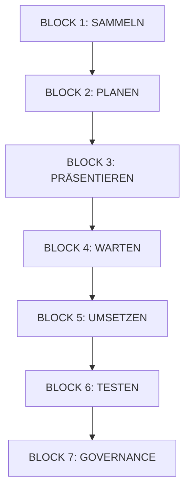

# 🎯 CLEANUP & STABILISIERUNGS-PLAN V3.0 - MYDISPATCH

**Status:** PLANUNGS-PHASE (BLOCK 2)  
**Erstellt:** 2025-10-25  
**Zweck:** Vollständige Systemstabilisierung & Professionalisierung  
**Governance:** Manual-Control Mode (NeXify Meta-Prompt V3.0)

---

## 📋 EXECUTIVE SUMMARY

Nach vollständiger Code-Analyse wurden folgende **kritische Probleme** identifiziert:

### 🔴 KRITISCH (Score 8-10)

- **Design System Violations**: 265 Direct Color Usages
- **Component Library Chaos**: 203 Dateien ohne klare Struktur
- **Dokumentations-Überflutung**: 321 Docs mit 12.666 Überschriften

### 🟠 HOCH (Score 6-7)

- **SEO-Lücken**: Nur 4 von ~50 Pages mit SEO-Tags
- **Code Quality**: 160 TODOs/FIXMEs/Debug-Logs

### 🟡 MITTEL (Score 4-5)

- **Content System**: Keine zentrale Verwaltung
- **Dependency Management**: Unklare Struktur

---

## ⚖️ LEGAL-RISK-SCORECARD

```typescript
interface LegalRiskScore {
  score: 3; // 0-10 (3 = GRÜN - Unkritisch)
  category: "REFACTORING";
  reasoning: "Rein technische Verbesserungen ohne rechtliche Implikationen. Keine DSGVO/AI-Act Änderungen.";
  mitigation: "Keine spezielle Mitigation nötig. Bestehende Funktionalität bleibt erhalten.";
}
```

**Bewertung:** ✅ GRÜN (0-3) - Keine rechtlichen Risiken

---

## 💰 KOSTEN-/LAST-PROGNOSE

```typescript
interface CostPrognosis {
  aiCosts: "Gering (ca. 50-100 Credits)"; // Code-Refactoring
  dbLoad: "low"; // Keine DB-Änderungen
  estimatedTime: "2-4 Stunden (aufgeteilt in 7 Phasen)";
  reasoning: `
    - Phase 1-2: Design System Cleanup (30-60min)
    - Phase 3-4: Component Library (45-90min) 
    - Phase 5-6: SEO & Content (30-60min)
    - Phase 7: Dokumentation (15-30min)
  `;
}
```

---

## 🏗️ ARCHITEKTUR-PLAN

### PHASE 1: DESIGN SYSTEM CLEANUP (Prio 0) 🔴

**Problem:** 265 Direct Color Violations, 17 Accent-Verwendungen

**Lösung:**

```typescript
// SCHRITT 1: Alle Direct Colors entfernen
// Dateien: 29 betroffen
// - HEREMapComponent.tsx
// - MarketingButton.tsx
// - AppSidebar.tsx
// - CIGuidelineModal.tsx
// - etc.

// Ersetze:
className = "text-white bg-[#EADEBD]";
// Durch:
className = "text-foreground bg-primary";

// SCHRITT 2: Accent-Referenzen entfernen
// Dateien: 7 betroffen
// - AgentHealthDashboard.tsx
// - CIGuidelineModal.tsx
// - src/index.css (bereits erledigt)

// Ersetze:
stroke = "hsl(var(--accent))";
// Durch:
stroke = "hsl(var(--primary))";
```

**Neue Dateien:**

- ❌ Keine (nur Edits)

**Geänderte Dateien:**

- 29 Component-Dateien
- 7 Style-Dateien

**Tests:**

- E2E: Design-Token-Compliance
- Unit: Color-Validator Tests

---

### PHASE 2: COMPONENT LIBRARY RESTRUKTURIERUNG (Prio 1) 🟠

**Problem:** 203 Component-Dateien ohne klare Struktur

**Lösung:** Neue Ordnerstruktur nach Atomic Design

```
src/components/
├── 01-atoms/              # Kleinste Einheiten
│   ├── Button/
│   │   ├── Button.tsx
│   │   ├── Button.test.tsx
│   │   └── Button.stories.tsx
│   ├── Input/
│   ├── Badge/
│   └── Icon/
│
├── 02-molecules/          # Kombinationen von Atoms
│   ├── FormField/
│   ├── SearchBar/
│   └── Card/
│
├── 03-organisms/          # Komplexe UI-Blöcke
│   ├── Header/
│   ├── Sidebar/
│   └── DataTable/
│
├── 04-templates/          # Seiten-Layouts
│   ├── DashboardLayout/
│   ├── AuthLayout/
│   └── MarketingLayout/
│
└── 05-pages/              # Vollständige Pages
    └── (bleiben in src/pages/)
```

**Migration-Strategie:**

- **Nicht** alle Dateien sofort verschieben
- Schritt für Schritt bei Bedarf refactorn
- Neue Components nach neuer Struktur anlegen
- Legacy-Imports mit Aliases unterstützen

**Neue Dateien:**

- `src/components/README.md` - Component Library Docs
- `src/components/index.ts` - Zentrale Exports

**Geänderte Dateien:**

- Keine sofortigen Änderungen (Schritt-für-Schritt Migration)

---

### PHASE 3: SEO FOUNDATION (Prio 1) 🟠

**Problem:** Nur 4 von ~50 Pages mit SEO-Tags

**Lösung:** Systematische SEO-Integration

```typescript
// NEU: src/config/seo.config.ts
export const SEO_DEFAULTS = {
  siteName: "MyDispatch",
  defaultTitle: "MyDispatch - Professionelle Taxi & Mietwagen Software",
  titleTemplate: "%s | MyDispatch",
  defaultDescription:
    "DSGVO-konforme Taxi-Software Made in Germany. Disposition, Fuhrparkverwaltung, Fahrer-App & mehr.",
  siteUrl: "https://my-dispatch.de",
  ogImage: "/og-image.jpg",
};

// NEU: src/hooks/use-seo.ts
export function useSEO(options: SEOOptions) {
  // Automatische SEO-Tags für jede Page
  // Integration mit react-helmet-async
}
```

**Page-Template:**

```tsx
// In jeder Page:
import { useSEO } from "@/hooks/use-seo";

export default function MyPage() {
  useSEO({
    title: "Dashboard",
    description: "Übersicht über alle Fahrten und Statistiken",
    path: "/dashboard",
  });

  return <div>...</div>;
}
```

**Neue Dateien:**

- `src/config/seo.config.ts`
- `src/hooks/use-seo.ts`
- `public/og-image.jpg` (generiert)
- `public/robots.txt`
- `public/sitemap.xml`

**Geänderte Dateien:**

- ~50 Page-Komponenten (SEO-Hook hinzufügen)

---

### PHASE 4: CONTENT SYSTEM (Prio 2) 🟡

**Problem:** Keine zentrale Content-Verwaltung

**Lösung:** Content-Config-System

```typescript
// NEU: src/config/content.config.ts
export const CONTENT = {
  hero: {
    title: 'Die moderne Taxi-Software',
    subtitle: 'DSGVO-konform • Made in Germany • 24/7 Support',
  },
  features: [
    {
      icon: 'Zap',
      title: 'Blitzschnelle Disposition',
      description: 'Automatische Routenoptimierung...',
    },
  ],
  // etc.
};

// Usage:
import { CONTENT } from '@/config/content.config';

<h1>{CONTENT.hero.title}</h1>
```

**Neue Dateien:**

- `src/config/content.config.ts`
- `src/config/content.types.ts`

**Geänderte Dateien:**

- Marketing-Pages (Hardcoded Text → Content-Config)

---

### PHASE 5: CODE QUALITY CLEANUP (Prio 2) 🟡

**Problem:** 160 TODOs/FIXMEs/Debug-Logs

**Lösung:** Systematisches Cleanup

```bash
# SCHRITT 1: Debug-Logs entfernen
# Alle logDebug() Calls reviewen und entfernen/behalten

# SCHRITT 2: TODOs auflösen
# - KRITISCHE TODOs sofort beheben
# - NIEDRIGE TODOs in GitHub Issues verschieben

# SCHRITT 3: FIXME/HACK entfernen
# - Code refactorn oder dokumentieren warum nötig
```

**Neue Dateien:**

- `.github/ISSUE_TEMPLATE/todo.md` - TODO Issue Template

**Geänderte Dateien:**

- ~30 Dateien mit Debug-Logs
- ~15 Dateien mit TODOs

---

### PHASE 6: DOKUMENTATION CLEANUP (Prio 2) 🟡

**Problem:** 321 Docs, 12.666 Überschriften = Chaos

**Lösung:** Drastische Reduktion & Restrukturierung

```
docs/
├── README.md                    # Haupteinstieg (NEU)
├── 01-GETTING-STARTED/
│   ├── Setup.md
│   └── Quick-Reference.md
│
├── 02-ARCHITECTURE/
│   ├── Design-System.md         # Konsolidiert aus 10+ Dateien
│   ├── Component-Library.md     # Konsolidiert aus 5+ Dateien
│   └── Database-Schema.md
│
├── 03-DEVELOPMENT/
│   ├── Coding-Standards.md      # Konsolidiert aus 15+ Dateien
│   ├── Testing.md
│   └── Deployment.md
│
├── 04-GOVERNANCE/
│   ├── Legal-Compliance.md
│   └── Security.md
│
└── 05-ARCHIVE/                  # Alte Docs archivieren
    └── v18.5.x/
```

**Aktion:**

- **Löschen:** ~250 redundante/veraltete Docs
- **Konsolidieren:** ~50 Docs in ~10 Master-Docs
- **Behalten:** ~20 aktuelle Docs

**Neue Dateien:**

- `docs/README.md`
- `docs/01-GETTING-STARTED/Quick-Reference.md`
- Master-Docs in jedem Ordner

---

### PHASE 7: DEPENDENCY AUDIT (Prio 3) 🟢

**Problem:** Unklare Dependency-Struktur

**Lösung:** Audit & Cleanup

```bash
# SCHRITT 1: Unused Dependencies finden
npx depcheck

# SCHRITT 2: Outdated Dependencies prüfen
npm outdated

# SCHRITT 3: Security Audit
npm audit

# SCHRITT 4: Bundle Size analysieren
npx vite-bundle-visualizer
```

**Neue Dateien:**

- `docs/DEPENDENCY_REPORT.md`

---

## 🚨 RISIKEN & ABHÄNGIGKEITEN

### KRITISCHE RISIKEN:

1. **Breaking Changes**: Component Library Migration könnte Imports brechen
   - **Mitigation**: Schritt-für-Schritt, mit Aliases

2. **Performance**: SEO-Hook könnte Render-Performance beeinflussen
   - **Mitigation**: Memoization, useMemo, useCallback

3. **Merge Conflicts**: Viele Dateien gleichzeitig ändern
   - **Mitigation**: Feature-Branches, kleine PRs

### ABHÄNGIGKEITEN:

- Phase 1 muss vor Phase 2 (Components nutzen Design System)
- Phase 3 kann parallel zu Phase 1-2
- Phase 5-7 können parallel

---

## 📊 SUCCESS METRICS

### DESIGN SYSTEM:

- [ ] 0 Direct Color Violations
- [ ] 0 Accent-Referenzen
- [ ] 100% Semantic Token Usage

### COMPONENT LIBRARY:

- [ ] Klare Ordnerstruktur dokumentiert
- [ ] Zentrale Export-Datei
- [ ] Migration-Plan erstellt

### SEO:

- [ ] 100% Pages mit Meta-Tags
- [ ] robots.txt + sitemap.xml vorhanden
- [ ] Lighthouse SEO Score > 90

### CODE QUALITY:

- [ ] 0 Debug-Logs in Production
- [ ] < 10 TODOs im Code
- [ ] 0 FIXME/HACK ohne Kommentar

### DOKUMENTATION:

- [ ] < 50 Dokumentations-Dateien
- [ ] Klare Navigations-Struktur
- [ ] README.md als Einstieg

---

## 🔄 WORKFLOW (7 PHASEN)



### Aktueller Status: **BLOCK 2 ABGESCHLOSSEN** ✅

Nächster Schritt: **BLOCK 3 - PRÄSENTIEREN**

---

## ✅ FREIGABE-CHECKLISTE

- [x] Legal-Risk-Score berechnet (Score: 3 - GRÜN)
- [x] Kosten-/Last-Prognose erstellt (2-4h, 50-100 Credits)
- [x] Vollständiger Architektur-Plan erstellt
- [x] Risiken & Abhängigkeiten identifiziert
- [ ] **User-Freigabe ausstehend**

---

## 🎯 NEXT STEPS (NACH FREIGABE)

1. **Phase 1**: Design System Cleanup (30-60min)
2. **Phase 2**: Component Library (45-90min)
3. **Phase 3**: SEO Foundation (30-60min)
4. **Phase 4**: Content System (20-40min)
5. **Phase 5**: Code Quality (20-40min)
6. **Phase 6**: Dokumentation (15-30min)
7. **Phase 7**: Dependency Audit (15-30min)

**Gesamt-Zeitschätzung:** 2-4 Stunden (je nach Scope)

---

**END OF PLAN**

**WARTET AUF FREIGABE VON PASCAL** 🚦
