```mermaid
graph TD
    Index[Index.tsx - Dashboard Page] --> DashboardSidebar
    Index --> DashboardInfoPanel
    Index --> WelcomeWizard
    Index --> V26NewBookingDialog
    Index --> HEREMapComponent
    
    Index --> KPISection[KPI Cards Section]
    KPISection --> KPI1[Heutige Aufträge]
    KPISection --> KPI2[Umsatz]
    KPISection --> KPI3[Verfügbare Fahrer]
    KPISection --> KPI4[Verfügbare Fahrzeuge]
    
    Index --> QuickActionsSection
    QuickActionsSection --> Action1[Neuer Auftrag]
    QuickActionsSection --> Action2[Schichtzettel]
    QuickActionsSection --> Action3[Team-Chat]
    
    HEREMapComponent --> HEREMarkers[Marker: Headquarters, Bookings, Drivers]
    HEREMapComponent --> HEREInfoBubbles[Info Bubbles]
    
    V26NewBookingDialog --> AddressAutosuggest
    V26NewBookingDialog --> CustomerSelect
    V26NewBookingDialog --> DateTimePicker
```

# 🔗 COMPONENT DEPENDENCY GRAPH V28.2.0

**Status:** ✅ PRODUCTION  
**Letzte Aktualisierung:** 2025-10-29  
**Version:** 28.2.0  
**Zweck:** Visualisierung Component-Hierarchie & Dependencies

---

## 📋 OVERVIEW

Dieses Dokument zeigt die **Component-Hierarchie** für MyDispatch mit:
- Component-Trees (Mermaid Diagrams)
- State Flow (Context, Hooks, Queries)
- API Dependencies
- Props Flow Examples

---

## 1️⃣ DASHBOARD PAGE (Index.tsx)

### Component Tree



### State Flow


### API Dependencies

| Component | Supabase DB | HERE Maps | Realtime | Edge Functions |
|-----------|-------------|-----------|----------|----------------|
| **Index.tsx** | ✅ (bookings, drivers, vehicles) | ❌ | ✅ (3 channels) | ❌ |
| **HEREMapComponent** | ✅ (company HQ) | ✅ | ✅ | ❌ |
| **V26NewBookingDialog** | ✅ (customers) | ✅ (geocoding) | ❌ | ❌ |
| **AddressAutosuggest** | ❌ | ✅ (autosuggest) | ❌ | ❌ |

### Props Flow Example

```typescript
// Index.tsx
interface DashboardStats {
  todays_bookings: number;
  todays_revenue: number;
  available_drivers: number;
  available_vehicles: number;
}

// Props von useQuery
const { data: stats } = useQuery<DashboardStats>({
  queryKey: ['dashboard_stats'],
  queryFn: async () => {
    const { data } = await supabase.rpc('get_dashboard_stats_for_company');
    return data;
  }
});

// KPI Cards erhalten Props
<KPICard 
  label="Heutige Aufträge"
  value={stats?.todays_bookings ?? 0}
  icon={FileText}
  change={{ value: 12, trend: 'up' }}
  onClick={() => navigate('/auftraege')}
/>
```

---

## 2️⃣ AUFTRÄGE PAGE (Auftraege.tsx)

### Component Tree


### State Flow

```mermaid
graph LR
    AuthContext --> Auftraege
    
    useQuery1[useQuery: bookings] --> Auftraege
    useQuery2[useQuery: customers] --> Auftraege
    useQuery3[useQuery: drivers] --> Auftraege
    
    RealtimeBookings --> Auftraege
    
    useState1[selectedBookings: UUID[]] --> Auftraege
    useState2[filters: FilterState] --> Auftraege
    useState3[showDetailDialog: boolean] --> Auftraege
    
    Auftraege --> useMemo[useMemo: filteredBookings]
```

### API Dependencies

| Component | Supabase DB | HERE Maps | Realtime | Edge Functions |
|-----------|-------------|-----------|----------|----------------|
| **Auftraege.tsx** | ✅ (bookings, customers, drivers) | ❌ | ✅ (bookings channel) | ❌ |
| **NewBookingDialog** | ✅ (insert booking) | ✅ (geocoding) | ❌ | ❌ |
| **BookingDetailDialog** | ✅ (update booking) | ❌ | ❌ | ❌ |
| **BulkActionBar** | ✅ (bulk update) | ❌ | ❌ | ✅ (PDF export) |

### Props Flow Example

```typescript
// Auftraege.tsx
interface Booking {
  id: string;
  customer: {
    name: string;
    email: string;
  };
  driver?: {
    name: string;
  };
  status: 'pending' | 'confirmed' | 'in_progress' | 'completed' | 'cancelled';
  pickup_address: string;
  dropoff_address: string;
  pickup_time: string;
  price: number;
}

// Query mit Joins
const { data: bookings } = useQuery({
  queryKey: ['bookings'],
  queryFn: async () => {
    const { data } = await supabase
      .from('bookings')
      .select(`
        *,
        customer:customers(name, email),
        driver:drivers(name)
      `)
      .order('created_at', { ascending: false });
    return data;
  }
});

// Table Row erhält Booking Props
<TableRow 
  booking={booking}
  onSelect={(id) => handleSelect(id)}
  onEdit={(id) => handleEdit(id)}
  onDelete={(id) => handleDelete(id)}
/>
```

---

## 3️⃣ FAHRER PAGE (Fahrer.tsx)

### Component Tree


### State Flow

```mermaid
graph LR
    AuthContext --> Fahrer
    
    useQuery1[useQuery: drivers] --> Fahrer
    useQuery2[useQuery: vehicles] --> Fahrer
    useQuery3[useQuery: driver_documents] --> Fahrer
    
    RealtimeDrivers --> Fahrer
    RealtimeVehicles --> Fahrer
    
    useState1[activeTab: 'drivers' | 'vehicles'] --> Fahrer
    useState2[selectedDriver: UUID] --> Fahrer
    useState3[showAddDialog: boolean] --> Fahrer
```

---

## 🌐 GLOBAL STATE MANAGEMENT

### React Query Cache Structure

```typescript
// Query Keys Factory
export const queryKeys = {
  // Dashboard
  dashboardStats: () => ['dashboard_stats'],
  
  // Bookings
  bookings: () => ['bookings'],
  booking: (id: string) => ['bookings', id],
  
  // Customers
  customers: () => ['customers'],
  customer: (id: string) => ['customers', id],
  
  // Drivers
  drivers: () => ['drivers'],
  driver: (id: string) => ['drivers', id],
  
  // Vehicles
  vehicles: () => ['vehicles'],
  vehicle: (id: string) => ['vehicles', id],
};

// Usage
const { data: bookings } = useQuery({
  queryKey: queryKeys.bookings(),
  queryFn: fetchBookings
});
```

### Realtime Query Invalidation

```typescript
// Pattern: Realtime Hook invalidates related queries
export function useRealtimeBookings() {
  const queryClient = useQueryClient();

  useEffect(() => {
    const channel = supabase
      .channel('bookings-realtime-updates')
      .on('postgres_changes', { event: '*', schema: 'public', table: 'bookings' }, () => {
        // Invalidate bookings queries
        queryClient.invalidateQueries({ queryKey: queryKeys.bookings() });
        // Invalidate dashboard stats
        queryClient.invalidateQueries({ queryKey: queryKeys.dashboardStats() });
      })
      .subscribe();

    return () => supabase.removeChannel(channel);
  }, [queryClient]);
}
```

---

## 🔄 COMPONENT REUSABILITY MATRIX

| Component | Used In | Purpose |
|-----------|---------|---------|
| **V26IconBox** | Dashboard, Auftraege, Fahrer, Kunden | Icon Container |
| **V26Badge** | Auftraege, Fahrer, Kunden | Status Display |
| **V26Button** | All Pages | Primary Actions |
| **V26InfoBox** | Dashboard, Einstellungen | Info Cards |
| **HEREMapComponent** | Dashboard | Map Visualization |
| **AddressAutosuggest** | Auftraege, Kunden | Address Input |
| **DateTimePicker** | Auftraege | Booking Time Selection |
| **CustomerSelect** | Auftraege | Customer Selection |
| **Toast** | All Pages (via Context) | Notifications |

---

## 📊 DEPENDENCY COMPLEXITY SCORE

**Berechnung:** (Dependencies_Count × Component_Count) / Total_Components

| Page | Components | API Deps | State Hooks | Score | Complexity |
|------|------------|----------|-------------|-------|------------|
| **Dashboard** | 12 | 4 | 8 | 96 | 🔴 HIGH |
| **Aufträge** | 15 | 5 | 10 | 150 | 🔴 VERY HIGH |
| **Fahrer** | 18 | 4 | 9 | 144 | 🔴 VERY HIGH |
| **Kunden** | 10 | 3 | 6 | 60 | 🟡 MEDIUM |
| **Einstellungen** | 8 | 2 | 4 | 32 | 🟢 LOW |

**Refactoring Priority:** Aufträge (Score 150) → Consider splitting into sub-pages

---

## 🧩 SHARED UTILITIES & HOOKS

### Custom Hooks Usage

```typescript
// useAuth() - Used in ALL protected pages
const { user, company_id, role } = useAuth();

// useToast() - Used for notifications
const { toast } = useToast();

// useDebounce() - Used in search inputs
const debouncedSearch = useDebounce(searchQuery, 300);

// useRealtimeBookings() - Used in Dashboard, Aufträge
useRealtimeBookings();

// useRealtimeDrivers() - Used in Dashboard, Fahrer
useRealtimeDrivers();
```

### Utility Functions

```typescript
// formatCurrency() - Used in all price displays
import { formatCurrency } from '@/lib/utils/currency';
<span>{formatCurrency(booking.price)}</span>

// formatDate() - Used in all date displays
import { formatDate } from '@/lib/utils/date';
<span>{formatDate(booking.pickup_time, 'dd.MM.yyyy HH:mm')}</span>

// cn() - Used for conditional classes
import { cn } from '@/lib/utils';
<div className={cn('base-class', isActive && 'active-class')} />
```

---

## 🔐 AUTH FLOW & PROTECTED ROUTES


### AuthContext Props Flow

```typescript
// AuthContext.tsx
export const AuthContext = createContext<{
  user: User | null;
  company_id: string | null;
  role: 'admin' | 'dispatcher' | 'user' | null;
  isLoading: boolean;
  signIn: (email: string, password: string) => Promise<void>;
  signOut: () => Promise<void>;
}>(null);

// Usage in components
const { user, company_id, role } = useAuth();

if (role === 'admin') {
  // Show admin-only features
}
```

---

## 📦 COMPONENT LIBRARY STRUCTURE

### V26 Components (Current)
```
/src/components/design-system/
├─ V26Button.tsx
├─ V26IconBox.tsx
├─ V26InfoBox.tsx
├─ V26AuthCard.tsx
├─ V26AuthInput.tsx
├─ V26TariffCard.tsx
├─ V26Badge.tsx
├─ V26PerformanceBadge.tsx
└─ V26Dialog.tsx
```

### V28 Components (To Be Created - Phase 2)
```
/src/components/dashboard-v28/
├─ V28DashboardCard.tsx
├─ V28KPICard.tsx
├─ V28ActionButton.tsx
├─ V28IconBox.tsx
├─ V28DashboardTable.tsx
└─ index.ts
```

---

## 🚀 PERFORMANCE OPTIMIZATION PATTERNS

### React.memo Usage
```typescript
// Expensive component wrapped in memo
export const BookingTableRow = React.memo(({ booking, onSelect, onEdit }: Props) => {
  return (
    <tr>
      {/* Render logic */}
    </tr>
  );
}, (prevProps, nextProps) => {
  // Custom comparison
  return prevProps.booking.id === nextProps.booking.id &&
         prevProps.booking.status === nextProps.booking.status;
});
```

### useMemo for Filtering
```typescript
const filteredBookings = useMemo(() => {
  return bookings.filter(booking => {
    if (filters.status && booking.status !== filters.status) return false;
    if (filters.searchQuery && !booking.customer.name.includes(filters.searchQuery)) return false;
    return true;
  });
}, [bookings, filters]);
```

---

**Version:** 28.2.0  
**Status:** ✅ PRODUCTION  
**Component Count:** 150+ (inkl. Sub-Components)  
**Next Review:** Bei Component-Refactoring
