# 🔗 DEPENDENCY GRAPHS V1.0

**Version:** 1.0.0  
**Datum:** 2025-01-31  
**Status:** ✅ PRODUCTION-READY

---

## 📋 Inhaltsverzeichnis

1. [Frontend → Backend Complete Flow](#1-frontend--backend-complete-flow)
2. [TanStack Query Hook Chain](#2-tanstack-query-hook-chain)
3. [Critical Path Failures](#3-critical-path-failures)
4. [External API Dependencies](#4-external-api-dependencies)
5. [Edge Function Dependency Chain](#5-edge-function-dependency-chain)
6. [Database Schema Dependencies](#6-database-schema-dependencies)

---

## 1. Frontend → Backend Complete Flow

### Booking Creation Flow (Complete)

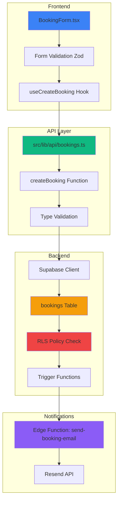

### Authentication Flow

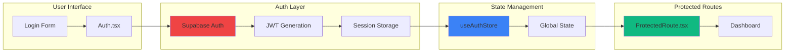

---

## 2. TanStack Query Hook Chain

### useBookings Hook Dependency Chain

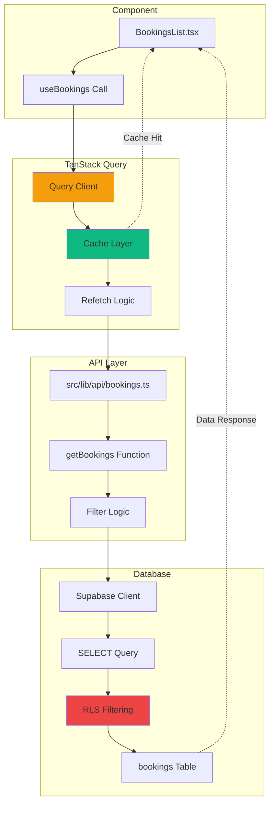

### Mutation Flow (useCreateBooking)

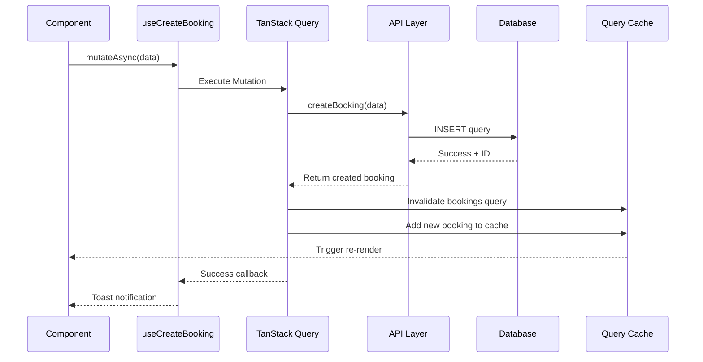

---

## 3. Critical Path Failures

### What Breaks If X Fails?

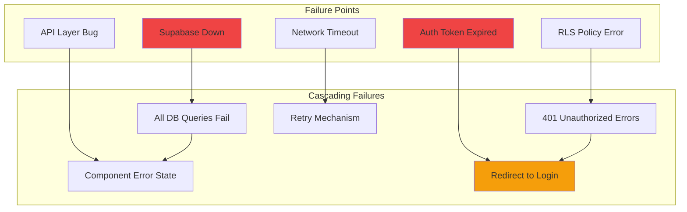

### Authentication Failure Chain

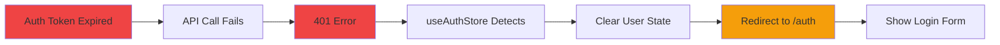

### Database Connection Failure

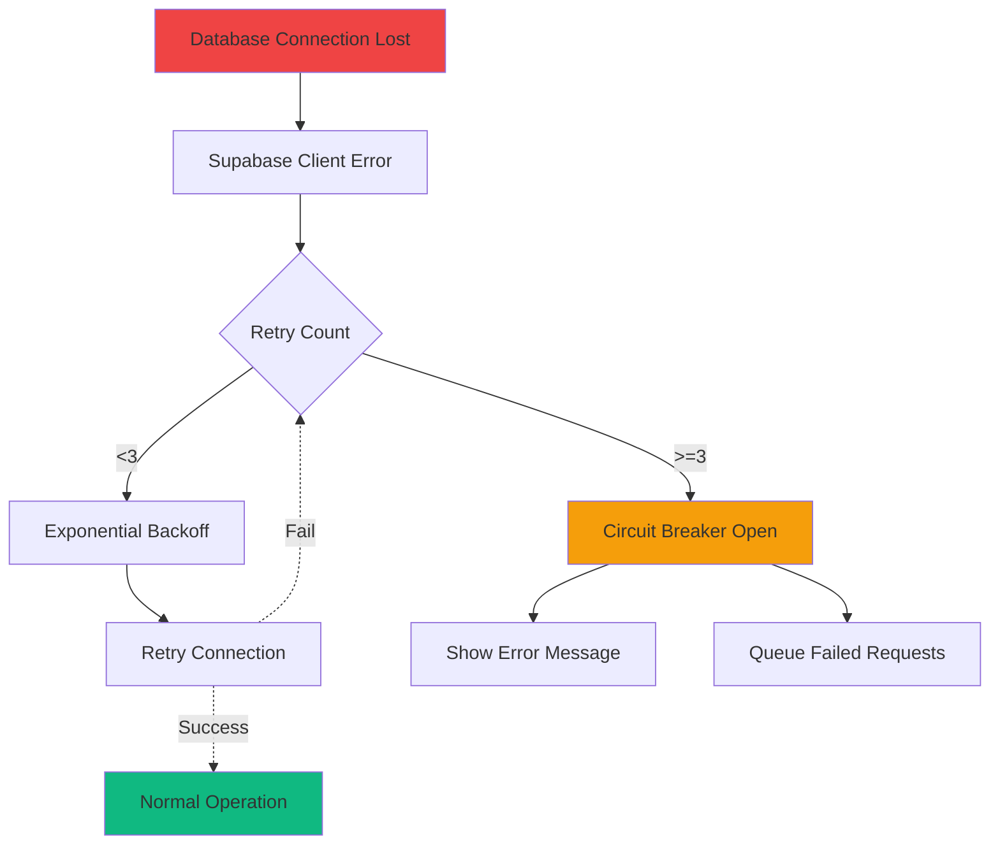

---

## 4. External API Dependencies

### Complete External API Map

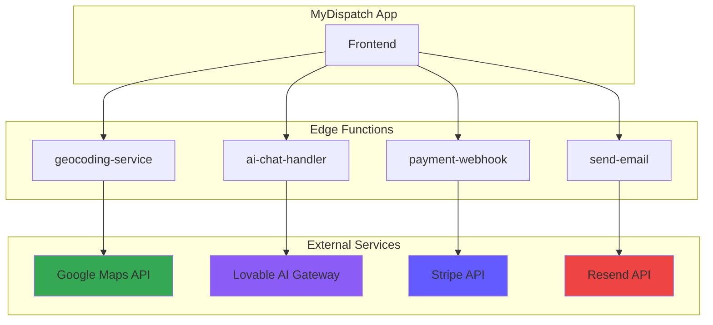

### API Health Check Flow

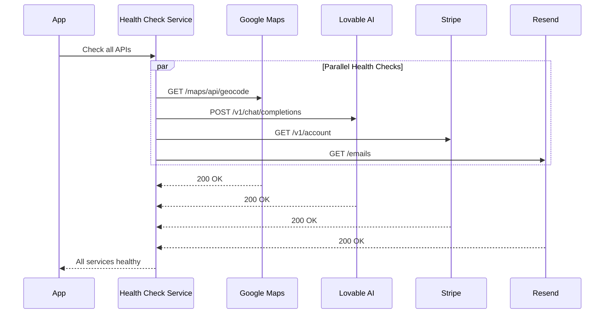

---

## 5. Edge Function Dependency Chain

### Edge Function → Database → External API

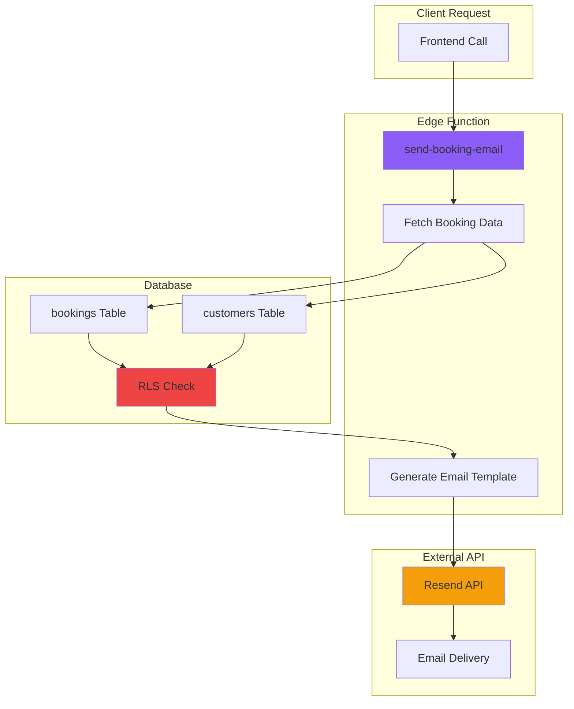

### Edge Function Environment Dependencies

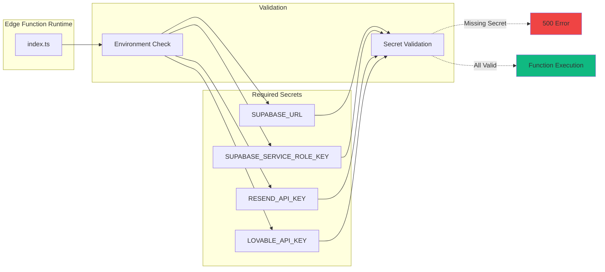

---

## 6. Database Schema Dependencies

### Table Relationships

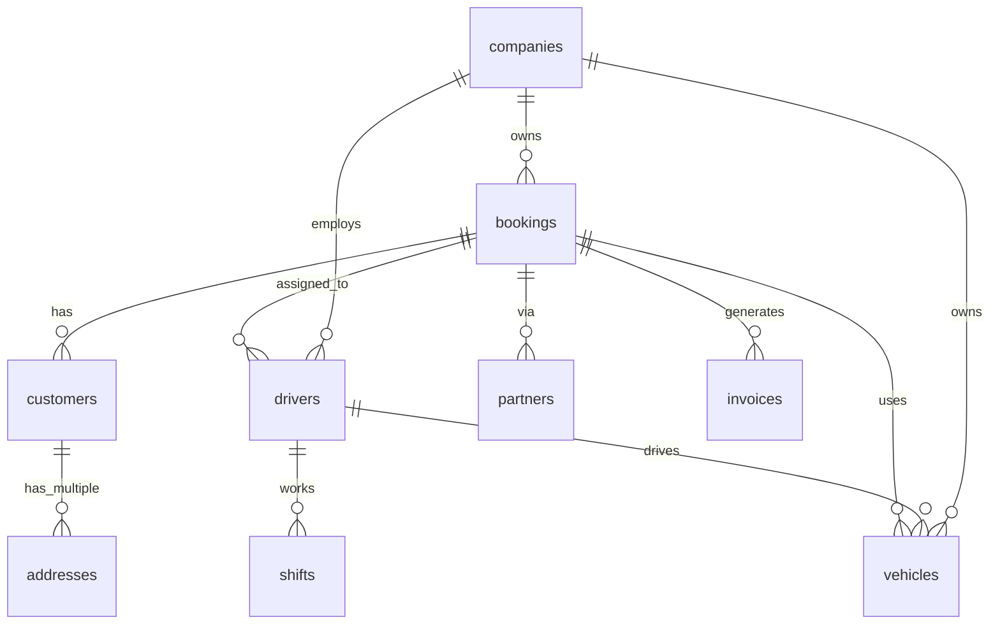

### RLS Policy Dependencies

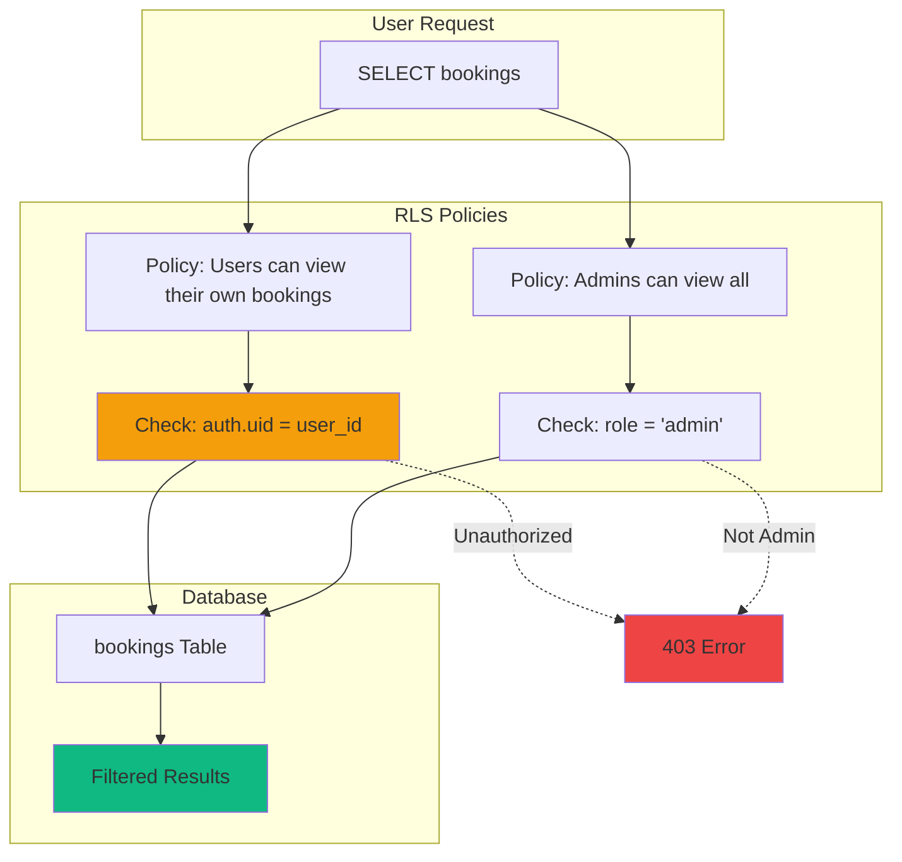

---

## 🎯 Usage Guidelines

### When to Use Which Diagram?

1. **Frontend → Backend Flow** → Use for understanding complete request lifecycle
2. **TanStack Query Chain** → Use for debugging caching issues
3. **Critical Path Failures** → Use for incident response planning
4. **External API Map** → Use for API health monitoring
5. **Edge Function Chain** → Use for debugging serverless functions
6. **Database Schema** → Use for understanding data relationships

### How to Update Diagrams

1. **Install Mermaid CLI** (optional for local preview):
   ```bash
   npm install -g @mermaid-js/mermaid-cli
   ```

2. **Edit Markdown**: Diagrams are Mermaid code blocks
3. **Preview**: Use VS Code Mermaid extension or [mermaid.live](https://mermaid.live/)
4. **Commit**: Diagrams render automatically in GitHub/Lovable docs

---

## 📊 Dependency Complexity Metrics

| Dependency Type | Count | Criticality | Monitoring |
|----------------|-------|-------------|------------|
| Frontend Components | 150+ | Medium | Component Registry |
| API Layer Modules | 7 | High | Unit Tests |
| Database Tables | 18 | Critical | RLS Linter |
| Edge Functions | 12 | High | Health Checks |
| External APIs | 4 | Critical | Uptime Monitor |
| RLS Policies | 45+ | Critical | Security Scan |

**Total Tracked Dependencies:** 236+

---

**© 2025 NeXify - Alle Rechte vorbehalten**
