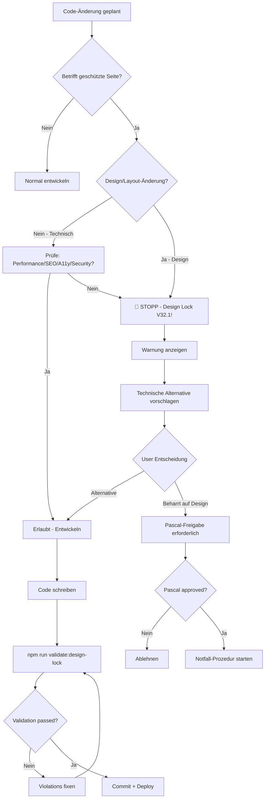

# 🔒 DESIGN LOCK INDEX V32.1

> **HAUPTDOKUMENT:** Zentrale Übersicht aller Design-Lock-Dokumentation  
> **STATUS:** ✅ AKTIV & ENFORCED  
> **DATUM:** 2025-10-31

---

## 📋 QUICK FACTS

### 🌐 DESIGN-HIERARCHIE (NEU in V32.1):

**Öffentliches Design = MASTER-DESIGN für GESAMTES SYSTEM!**

- ✅ **Header** aus öffentlichem Bereich = **SYSTEMWEIT EINZIG ERLAUBT**
- ✅ **Hero** (V28HeroPremium) = **SYSTEMWEIT EINZIG ERLAUBT**
- ✅ **Sidebar** aus öffentlichem Bereich = **SYSTEMWEIT EINZIG ERLAUBT**
- ✅ Alle Bereiche (Dashboard, Unternehmer-Landingpage, etc.) = **EXAKT IDENTISCH**

**Siehe:** [`docs/MASTER_DESIGN_SYSTEM_V32.1.md`](./MASTER_DESIGN_SYSTEM_V32.1.md)

---

### ✅ GESPERRTE BEREICHE:

#### 🌐 Öffentliche Seiten (11 Total) - V32.1 LOCKED:

- **Core Marketing (6):** Home, Features, Pricing, About, Contact, FAQ
- **Auth Pages (2):** Login, Register
- **Legal Pages (3):** Privacy, Terms, Imprint

#### 🏢 Dashboard-Seiten (2 Total) - V18.5 LOCKED:

- Dashboard (Index.tsx)
- Aufträge (Auftraege.tsx)

### 🚨 LOCK-LEVEL:

- **ABSOLUT GESPERRT** gegen Design-/Layout-Änderungen
- **NUR ERLAUBT:** Technische Optimierungen (Performance, SEO, A11y, Security)
- **ENFORCEMENT:** Automatische Validation + AI-Agent Check

---

## 📚 DOKUMENTATIONS-HIERARCHIE

### 🎯 LEVEL 1: SCHNELL-REFERENZEN (Start hier!)

#### 1. **Quick Reference (Daily Use)**

📄 [`docs/LAYOUT_FREEZE_QUICK_REFERENCE.md`](./LAYOUT_FREEZE_QUICK_REFERENCE.md)

- ⚡ 2-Minuten Check vor jeder Änderung
- ✅ Erlaubt/Verboten Checkliste
- 🔍 Code-Snippet für Validierung
- 🚨 Warnung-Template für User

**WANN NUTZEN:** Vor JEDER Code-Änderung an geschützten Seiten

---

### 🎯 LEVEL 2: VOLLSTÄNDIGE SPEZIFIKATIONEN

#### 2. **Master Design System (SYSTEMWEIT - V32.1)** ⭐ NEU!

📄 [`docs/MASTER_DESIGN_SYSTEM_V32.1.md`](./MASTER_DESIGN_SYSTEM_V32.1.md)

- 🌐 **Öffentliches Design = MASTER für GESAMTES System**
- 🔒 Header/Hero/Sidebar = SYSTEMWEIT EINZIG ERLAUBT
- 🎨 Farb-System, Typography, Spacing (SYSTEMWEIT)
- 🧩 Layout-Komponenten (SYSTEMWEIT)
- 🚨 Systemweite Verbote & Erlaubnisse
- 🔄 Migration-Guide für bestehende Bereiche
- 🛡️ Enforcement-Strategie

**WANN NUTZEN:**

- **ERSTE ANLAUFSTELLE** für alle Design-Fragen
- Vor Entwicklung in Dashboard, Unternehmer-Landingpage, etc.
- Bei Unklarheiten über systemweites Design
- Für Design-System Verständnis

#### 3. **Public Pages Design Lock (HAUPTDOKUMENT V32.1)**

📄 [`docs/PUBLIC_PAGES_DESIGN_LOCK_V32.1.md`](./PUBLIC_PAGES_DESIGN_LOCK_V32.1.md)

- 🔒 Alle 11 öffentlichen Seiten im Detail
- ❌ Vollständige Liste aller Verbote
- ✅ Vollständige Liste erlaubter Optimierungen
- 🛡️ Enforcement-Strategie
- 🚨 Notfall-Prozedur
- 📊 Erfolgs-Metriken
- 🔄 Lifecycle-Management

**WANN NUTZEN:**

- Vor Start eines Features, das öffentliche Seiten betrifft
- Bei Unklarheiten über erlaubte/verbotene Änderungen
- Für umfassende Planung

#### 3. **Layout Freeze Protection (Allgemeine Regeln V18.5.1)**

📄 [`docs/LAYOUT_FREEZE_PROTECTION_V18.5.1.md`](./LAYOUT_FREEZE_PROTECTION_V18.5.1.md)

- 🔒 Übersicht aller geschützten Seiten (öffentlich + Dashboard)
- 📋 Schutz-Regeln (Verboten/Erlaubt)
- 🛡️ Durchsetzung & AI-Agent Verhalten
- ✅ Review-Checklist
- 🔄 Lifecycle (wann wird Seite gesperrt/entsperrt)
- 🚨 Notfall-Änderungen Prozess

**WANN NUTZEN:**

- Für ganzheitliches Verständnis des Layout-Freeze-Systems
- Bei Dashboard-Seiten-Änderungen (V18.5)
- Für Architektur-Entscheidungen

#### 4. **AI Agent Layout Freeze Prompt (V18.5.1)**

📄 [`docs/AI_AGENT_LAYOUT_FREEZE_PROMPT_V18.5.1.md`](./AI_AGENT_LAYOUT_FREEZE_PROMPT_V18.5.1.md)

- 🤖 AI-Agent Verhalten bei Layout-Anfragen
- 🛑 Pflicht-Check vor jeder Änderung
- 🚨 Warnung-Templates (öffentlich + Dashboard)
- 📋 Code-Snippets für Validierung

**WANN NUTZEN:**

- Für AI-Agent Konfiguration
- Bei Implementierung von Validierungs-Logik
- Für Training neuer Entwickler

---

### 🎯 LEVEL 3: DESIGN-SYSTEM-SPEZIFIKATIONEN

#### 5. **Design System Lock (V32.0)**

📄 [`docs/DESIGN_SYSTEM_LOCK.md`](./DESIGN_SYSTEM_LOCK.md)

- 🎨 V32.0 Design-System Spezifikation
- ✅ Erlaubte Komponenten (V28HeroPremium, etc.)
- ❌ Verbotene Komponenten (alte Hero-Varianten)
- 🎨 Farb-System (Slate-Only)
- 🧱 CSS-Regeln (Inline-Styles, Custom CSS)
- 🔍 Validation-Script Details

**WANN NUTZEN:**

- Bei Komponenten-Entwicklung
- Bei Farb-/Styling-Fragen
- Für Design-System Compliance Check

#### 6. **Hero Lock Final (V32.0)**

📄 [`docs/HERO_LOCK_FINAL_V32.0.md`](./HERO_LOCK_FINAL_V32.0.md)

- 🦸 V28HeroPremium Spezifikation (einzige erlaubte Hero)
- 🎭 Alle Varianten im Detail (`home`, `features`, `pricing`, etc.)
- 🎨 Background-Varianten (`3d-premium`, `flat`)
- ❌ Verbotene alte Hero-Komponenten
- 📋 Migration-Beispiele
- ✅ Usage-Guidelines

**WANN NUTZEN:**

- Bei Hero-Sektion Änderungen/Erweiterungen
- Für neue Seiten-Erstellung
- Bei Migration alter Seiten

#### 7. **Color Exceptions (V32.1)**

📄 [`docs/COLOR_EXCEPTIONS.md`](./COLOR_EXCEPTIONS.md)

- 🎨 Erlaubte Nicht-Slate-Farben (Status-Indicators)
- ✅ green-500, red-500, yellow-500 (nur für Status)
- ❌ Verbotene Verwendung überall sonst
- 📋 Code-Beispiele (erlaubt/verboten)
- 🔍 Validierungs-Regeln
- 📝 Code-Kommentare (`{/* ✅ Status Exception */}`)

**WANN NUTZEN:**

- Bei Status-Badges/Live-Indicators
- Wenn Nicht-Slate-Farben benötigt werden
- Für Color-Compliance Check

---

### 🎯 LEVEL 4: PROJEKT-ÜBERGREIFEND

#### 8. **Absolute Vorgaben Final**

📄 [`docs/ABSOLUT_VORGABEN_FINAL.md`](./ABSOLUT_VORGABEN_FINAL.md)

- 🚨 Ultimative Projekt-Vorgaben
- 🔒 Design-Lock Integration (Sektion 1)
- 📋 Dokumentationspflicht
- 🛡️ Enforcement-Regeln
- ✅ Erfolgs-Kriterien

**WANN NUTZEN:**

- Für ganzheitlichen Projekt-Kontext
- Bei Architektur-Entscheidungen
- Für Compliance-Checks

#### 9. **Pre-Login Focus**

📄 [`docs/PRE_LOGIN_FOCUS.md`](./PRE_LOGIN_FOCUS.md)

- 🎯 Pre-Login Strategie
- ✅ Abgeschlossene Seiten (11 Total)
- 🔒 Design-Lock Status
- 📋 Dokumentations-Links

**WANN NUTZEN:**

- Für Projekt-Strategie Verständnis
- Bei Priorisierungs-Entscheidungen

---

### 🎯 LEVEL 5: TECHNISCHE IMPLEMENTATION

#### 10. **Validation Script**

📄 [`scripts/validate-design-lock.ts`](../scripts/validate-design-lock.ts)

- 🔍 Automatische Design-Lock Validierung
- ❌ Forbidden Patterns Detection
- ⚠️ Warnings für Edge-Cases
- 📊 Violation Reports

**WANN NUTZEN:**

- Vor jedem Commit (`npm run validate:design-lock`)
- Bei CI/CD Pipeline Integration
- Für automatische Compliance Checks

#### 11. **Style Cleanup Log**

📄 [`docs/STYLE_CLEANUP_LOG.md`](./STYLE_CLEANUP_LOG.md)

- 📜 Changelog aller Cleanup-Aktionen
- 🗑️ Entfernte CSS-Klassen
- 📦 Archivierte Komponenten
- ✏️ Aktualisierte Dateien

**WANN NUTZEN:**

- Für historischen Kontext
- Bei Debugging alter Patterns
- Für Dokumentations-Zwecke

#### 12. **Deprecated Components**

📄 [`archive/DEPRECATED_COMPONENTS.md`](../archive/DEPRECATED_COMPONENTS.md)

- 📦 Liste aller archivierten Komponenten
- 🔄 Migration-Guidelines
- 📋 Alternative Komponenten

**WANN NUTZEN:**

- Bei Migration alter Codebases
- Für Komponenten-Refactoring
- Bei Fehlermeldungen zu alten Komponenten

---

## 🔄 WORKFLOW-DIAGRAMM



---

## 🚀 SCHNELLSTART-GUIDE

### Für Entwickler (Daily Use):

1. **Vor jeder Änderung:**

   ```bash
   # Quick Check
   cat docs/LAYOUT_FREEZE_QUICK_REFERENCE.md
   ```

2. **Während Entwicklung:**

   ```bash
   # Nur technische Optimierungen
   # Keine Design/Layout-Änderungen
   ```

3. **Vor Commit:**

   ```bash
   npm run validate:design-lock
   ```

4. **Bei Validierungs-Fehler:**
   - Siehe `docs/DESIGN_SYSTEM_LOCK.md` für Details
   - Siehe `docs/COLOR_EXCEPTIONS.md` für Farb-Regeln
   - Siehe `docs/HERO_LOCK_FINAL_V32.0.md` für Hero-Regeln

### Für AI-Agents:

1. **Vor JEDER Änderung:**

   ```typescript
   // Siehe: docs/AI_AGENT_LAYOUT_FREEZE_PROMPT_V18.5.1.md
   beforeAnyChange(file, changeType);
   ```

2. **Bei User-Anfrage für Design-Änderung:**
   ```typescript
   // Siehe: docs/LAYOUT_FREEZE_QUICK_REFERENCE.md
   STOP_AND_WARN_USER();
   SHOW_DESIGN_LOCK_MESSAGE();
   SUGGEST_TECHNICAL_ALTERNATIVES();
   ```

### Für Projekt-Manager:

1. **Status-Check:**

   ```bash
   # Siehe: docs/ABSOLUT_VORGABEN_FINAL.md
   # ✅ Erfolgs-Kriterien (ERFÜLLT)
   ```

2. **Bei Redesign-Anforderung:**
   - Siehe `docs/PUBLIC_PAGES_DESIGN_LOCK_V32.1.md` → Notfall-Prozedur
   - Siehe `docs/LAYOUT_FREEZE_PROTECTION_V18.5.1.md` → Lifecycle

---

## ✅ COMPLIANCE-CHECKLIST

### Vor JEDEM Feature/Fix:

- [ ] Quick Reference gelesen (`LAYOUT_FREEZE_QUICK_REFERENCE.md`)
- [ ] Geschützte Seite geprüft (11 öffentliche + 2 Dashboard)
- [ ] Design/Layout-Änderung? → STOPP
- [ ] Technische Optimierung? → Erlaubt

### Während Entwicklung:

- [ ] Nur V28-Komponenten verwendet
- [ ] Nur Slate-Farben (Ausnahme: Status-Indicators)
- [ ] Keine Inline-Styles (Ausnahme: 3D-Background)
- [ ] Keine Custom CSS

### Vor Commit:

- [ ] `npm run validate:design-lock` → 0 Errors
- [ ] `npm run build` → Erfolgreich
- [ ] Code-Marker vorhanden (falls neue Seite)
- [ ] Dokumentation aktualisiert (falls relevant)

---

## 🆘 NOTFALL-KONTAKTE

### Bei kritischem Production-Bug:

1. **Eskalation:** Pascal (Product Owner)
2. **Prozess:** Siehe `docs/PUBLIC_PAGES_DESIGN_LOCK_V32.1.md` → Notfall-Prozedur
3. **Dokumentation:** Pflicht (CRITICAL)

### Bei Unklarheiten:

1. **Check:** `docs/LAYOUT_FREEZE_QUICK_REFERENCE.md`
2. **Wenn unklar:** `docs/PUBLIC_PAGES_DESIGN_LOCK_V32.1.md`
3. **Immer noch unklar:** Pascal fragen

---

## 📊 METRIKEN & MONITORING

### Automatische Checks:

```bash
# Täglich (CI/CD)
npm run validate:design-lock  # Ziel: 0 Errors
npm run build                 # Ziel: Success
npm run test:e2e              # Ziel: All Passed

# Wöchentlich
Lighthouse Score              # Ziel: >90
WCAG Compliance               # Ziel: AA
Bundle Size                   # Ziel: <1.5MB
```

### Manuelle Reviews:

- **Monatlich:** Design-System Compliance Audit
- **Quartalsweise:** Layout-Freeze Effectiveness Review
- **Bei Bedarf:** Notfall-Bug Review

---

## 🔐 FINALE BESTÄTIGUNG

**✅ ALLE 11 ÖFFENTLICHEN SEITEN SIND ABSOLUT GESPERRT (V32.1)**

**❌ KEINE DESIGN-/LAYOUT-ÄNDERUNGEN ERLAUBT**

**✅ NUR TECHNISCHE OPTIMIERUNGEN ERLAUBT**

**🛡️ ENFORCEMENT AKTIV & AUTOMATISIERT**

---

**VERSION:** V32.1  
**DATUM:** 2025-10-31  
**STATUS:** 🔒 ENFORCED  
**VERANTWORTLICH:** Pascal (Product Owner)
