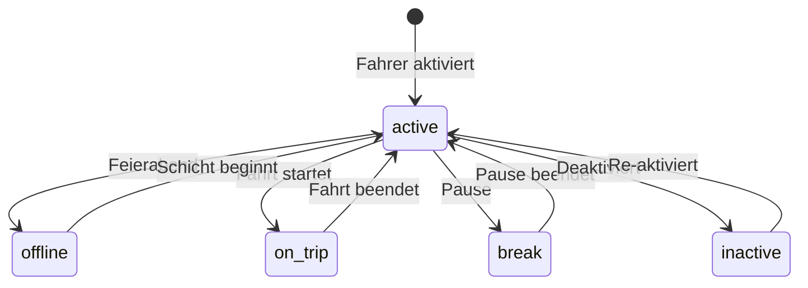

# Driver Specification V18.5.0

**Status:** Production-Ready  
**Letzte Aktualisierung:** 2025-10-22  
**Verantwortlich:** Pascal Courbois  
**Kategorie:** Page Specification

---

## 🎯 Übersicht

Die **Drivers-Seite** verwaltet alle Fahrer mit ihren Profilen, Verfügbarkeiten, Fahrzeugen und Performance-Metriken.

---

## 📊 Datenbankschema

### **Tabelle: `drivers`**

```sql
CREATE TABLE public.drivers (
  id UUID NOT NULL DEFAULT gen_random_uuid() PRIMARY KEY,
  user_id UUID REFERENCES auth.users(id) ON DELETE CASCADE,
  driver_number TEXT NOT NULL UNIQUE,

  -- Persönliche Daten
  first_name TEXT NOT NULL,
  last_name TEXT NOT NULL,
  email TEXT NOT NULL,
  phone TEXT NOT NULL,
  date_of_birth DATE,

  -- Adresse
  street TEXT,
  postal_code TEXT,
  city TEXT,
  country TEXT DEFAULT 'DE',

  -- Führerschein
  license_number TEXT NOT NULL,
  license_category TEXT[] NOT NULL, -- ['B', 'D', 'P']
  license_expiry DATE NOT NULL,
  license_verified BOOLEAN DEFAULT false,

  -- Dokumente
  avatar_url TEXT,
  license_image_url TEXT,
  vehicle_registration_url TEXT,
  insurance_url TEXT,

  -- Status & Verfügbarkeit
  status TEXT NOT NULL DEFAULT 'active' CHECK (status IN (
    'active',      -- Aktiv verfügbar
    'offline',     -- Offline/Nicht verfügbar
    'on_trip',     -- Gerade auf Fahrt
    'break',       -- Pause
    'inactive'     -- Deaktiviert
  )),

  -- Performance
  rating DECIMAL(3, 2) DEFAULT 5.00 CHECK (rating >= 0 AND rating <= 5),
  total_trips INTEGER DEFAULT 0,
  completed_trips INTEGER DEFAULT 0,
  cancelled_trips INTEGER DEFAULT 0,

  -- Fahrzeug-Präferenzen
  preferred_vehicle_id UUID REFERENCES public.vehicles(id),
  service_types TEXT[] DEFAULT ARRAY['taxi'], -- ['taxi', 'rental', 'limousine']

  -- Finanzen
  commission_rate DECIMAL(5, 2) DEFAULT 15.00, -- Prozentsatz
  payment_method TEXT CHECK (payment_method IN (
    'bank_transfer',
    'paypal',
    'cash'
  )),
  iban TEXT,

  -- Tracking
  last_location_lat DECIMAL(10, 8),
  last_location_lng DECIMAL(11, 8),
  last_location_update TIMESTAMP WITH TIME ZONE,

  -- System
  created_by UUID REFERENCES auth.users(id),
  created_at TIMESTAMP WITH TIME ZONE NOT NULL DEFAULT now(),
  updated_at TIMESTAMP WITH TIME ZONE NOT NULL DEFAULT now()
);

-- Indizes
CREATE INDEX idx_drivers_status ON public.drivers(status);
CREATE INDEX idx_drivers_rating ON public.drivers(rating DESC);
CREATE INDEX idx_drivers_user_id ON public.drivers(user_id);
CREATE INDEX idx_drivers_location ON public.drivers(last_location_lat, last_location_lng);

-- Auto-generate driver number
CREATE OR REPLACE FUNCTION generate_driver_number()
RETURNS TRIGGER AS $$
BEGIN
  NEW.driver_number := 'DRV-' || LPAD(NEXTVAL('driver_number_seq')::TEXT, 5, '0');
  RETURN NEW;
END;
$$ LANGUAGE plpgsql;

CREATE SEQUENCE IF NOT EXISTS driver_number_seq;

CREATE TRIGGER set_driver_number
BEFORE INSERT ON public.drivers
FOR EACH ROW
WHEN (NEW.driver_number IS NULL)
EXECUTE FUNCTION generate_driver_number();

-- Auto-update timestamp
CREATE TRIGGER update_drivers_updated_at
BEFORE UPDATE ON public.drivers
FOR EACH ROW
EXECUTE FUNCTION public.update_updated_at_column();

-- RLS Policies
ALTER TABLE public.drivers ENABLE ROW LEVEL SECURITY;

CREATE POLICY "Users can view drivers"
ON public.drivers FOR SELECT
USING (auth.uid() IS NOT NULL);

CREATE POLICY "Users can create drivers"
ON public.drivers FOR INSERT
WITH CHECK (auth.uid() = created_by);

CREATE POLICY "Users can update drivers"
ON public.drivers FOR UPDATE
USING (auth.uid() IS NOT NULL);

CREATE POLICY "Drivers can update own profile"
ON public.drivers FOR UPDATE
USING (auth.uid() = user_id);
```

### **Tabelle: `vehicles`**

```sql
CREATE TABLE public.vehicles (
  id UUID NOT NULL DEFAULT gen_random_uuid() PRIMARY KEY,
  driver_id UUID REFERENCES public.drivers(id) ON DELETE CASCADE,

  -- Fahrzeugdaten
  make TEXT NOT NULL, -- z.B. "Mercedes-Benz"
  model TEXT NOT NULL, -- z.B. "E-Klasse"
  year INTEGER NOT NULL CHECK (year >= 1990 AND year <= EXTRACT(YEAR FROM now()) + 1),
  color TEXT NOT NULL,
  license_plate TEXT NOT NULL UNIQUE,

  -- Technische Daten
  vehicle_type TEXT NOT NULL CHECK (vehicle_type IN (
    'sedan',
    'suv',
    'van',
    'luxury',
    'minibus'
  )),
  seats INTEGER NOT NULL CHECK (seats >= 1 AND seats <= 50),
  luggage_capacity INTEGER DEFAULT 2,

  -- Ausstattung
  features TEXT[], -- ['air_conditioning', 'gps', 'child_seat', 'wheelchair_accessible']
  fuel_type TEXT CHECK (fuel_type IN (
    'gasoline',
    'diesel',
    'electric',
    'hybrid'
  )),

  -- Dokumente
  registration_number TEXT NOT NULL,
  registration_expiry DATE NOT NULL,
  insurance_number TEXT NOT NULL,
  insurance_expiry DATE NOT NULL,
  tuv_expiry DATE, -- TÜV/AU

  -- Status
  status TEXT NOT NULL DEFAULT 'active' CHECK (status IN (
    'active',
    'maintenance',
    'inactive'
  )),

  -- System
  created_at TIMESTAMP WITH TIME ZONE NOT NULL DEFAULT now(),
  updated_at TIMESTAMP WITH TIME ZONE NOT NULL DEFAULT now()
);

-- Indizes
CREATE INDEX idx_vehicles_driver ON public.vehicles(driver_id);
CREATE INDEX idx_vehicles_status ON public.vehicles(status);
CREATE INDEX idx_vehicles_type ON public.vehicles(vehicle_type);

-- Auto-update timestamp
CREATE TRIGGER update_vehicles_updated_at
BEFORE UPDATE ON public.vehicles
FOR EACH ROW
EXECUTE FUNCTION public.update_updated_at_column();

-- RLS Policies
ALTER TABLE public.vehicles ENABLE ROW LEVEL SECURITY;

CREATE POLICY "Users can view vehicles"
ON public.vehicles FOR SELECT
USING (auth.uid() IS NOT NULL);

CREATE POLICY "Users can manage vehicles"
ON public.vehicles FOR ALL
USING (auth.uid() IS NOT NULL);
```

---

## 🎨 UI-Komponenten

### **1. Drivers List View**

```typescript
// src/pages/Drivers.tsx
import { DriversList } from "@/components/drivers/DriversList";
import { DriversFilters } from "@/components/drivers/DriversFilters";
import { AddDriverButton } from "@/components/drivers/AddDriverButton";

export function Drivers() {
  return (
    <div className="container-safe space-y-6">
      <div className="flex justify-between items-center">
        <h1 className="text-heading">Fahrer</h1>
        <AddDriverButton />
      </div>

      <DriversFilters />
      <DriversList />
    </div>
  );
}
```

### **2. Drivers Table**

**Spalten:**

- Avatar (mit Online-Status Indicator)
- Fahrernummer
- Name (First + Last)
- Telefon
- Status (Badge)
- Aktuelles Fahrzeug
- Bewertung (Stars)
- Anzahl Fahrten (gesamt/abgeschlossen)
- Aktionen (View/Edit/Deactivate)

**Features:**

- Live-Status Updates (Echtzeit)
- Drag & Drop für Fahrer-Zuweisung zu Aufträgen
- Quick-Actions: Anrufen, Nachricht senden
- Map-View: Alle aktiven Fahrer auf Karte

### **3. Add/Edit Driver Form**

**Sections:**

**A) Persönliche Daten**

- Vorname (Text Input)
- Nachname (Text Input)
- Email (Email Input)
- Telefon (Phone Input mit Format DE)
- Geburtsdatum (Date Picker)
- Avatar Upload (Image Upload)

**B) Adresse**

- Straße + Hausnummer
- PLZ
- Stadt
- Land (Select)

**C) Führerschein**

- Führerscheinnummer
- Führerscheinklassen (Multi-Select: B, C, D, P)
- Ablaufdatum (Date Picker mit Warning bei <30 Tagen)
- Führerschein-Scan Upload

**D) Fahrzeug zuweisen**

- Fahrzeug auswählen (Select aus vehicles)
- Oder neues Fahrzeug anlegen (Nested Form)

**E) Einstellungen**

- Service-Typen (Checkbox Group: Taxi, Mietwagen, Limousine)
- Provisions-Satz (Number Input in %)
- Zahlungsmethode (Select)
- IBAN (bei Bank Transfer)

**Validation:**

- Email format check
- Telefonnummer format DE: +49 oder 0
- Führerschein-Ablauf muss in Zukunft liegen
- Geburtsdatum: Fahrer muss mind. 21 Jahre alt sein
- IBAN Validation (bei Bank Transfer)

### **4. Driver Detail View**

**Tabs:**

**1. Übersicht**

- Profile Card (Avatar, Name, Contact, Status)
- Performance Metrics (Rating, Trips, Completion Rate)
- Current Vehicle Info
- Documents Status (TÜV, Versicherung, Führerschein mit Expiry Warnings)

**2. Fahrten-Historie**

- Table mit letzten 50 Fahrten
- Filter: Datum, Status
- Export als CSV

**3. Fahrzeuge**

- Liste aller Fahrzeuge des Fahrers
- Add/Edit/Delete Fahrzeuge

**4. Finanzen**

- Umsatzübersicht (nach Monat)
- Offene Provisionen
- Abrechnungen (Link zu Invoices)

**5. Dokumente**

- Upload/View/Download aller Dokumente
- Ablaufdatum-Tracking
- Verifikations-Status

---

## 🔄 Status-Workflow



---

## 🚀 Edge Functions

### **1. Driver Analytics**

```typescript
// supabase/functions/driver-analytics/index.ts
// Input: driver_id, date_range
// Output: performance_metrics, revenue, trips_by_status
```

### **2. Find Nearby Drivers**

```typescript
// supabase/functions/find-nearby-drivers/index.ts
// Input: location (lat, lng), radius_km, vehicle_type
// Output: available_drivers[]
```

**Logik:**

- Haversine-Distanz-Berechnung
- Filter nach Status = 'active'
- Filter nach vehicle_type match
- Sort by: Distanz, Rating

### **3. Document Expiry Alerts**

```typescript
// supabase/functions/check-document-expiry/index.ts
// Läuft täglich via Cron
// Output: notifications for drivers with expiring docs (<30 days)
```

---

## 📱 Realtime Features

```typescript
// Enable Realtime für Drivers
ALTER PUBLICATION supabase_realtime ADD TABLE public.drivers;

// Track Live Location Updates
const channel = supabase
  .channel('driver-locations')
  .on(
    'postgres_changes',
    {
      event: 'UPDATE',
      schema: 'public',
      table: 'drivers',
      filter: 'status=eq.active',
    },
    (payload) => {
      // Update Fahrer auf Map
      updateDriverMarker(payload.new.id, {
        lat: payload.new.last_location_lat,
        lng: payload.new.last_location_lng,
      });
    }
  )
  .subscribe();
```

---

## 🎨 Design System

### **Status Colors**

```css
/* src/index.css */
:root {
  --driver-active: 142 71% 45%;
  --driver-active-foreground: 0 0% 100%;

  --driver-offline: 220 13% 91%;
  --driver-offline-foreground: 220 9% 46%;

  --driver-on-trip: 47 96% 53%;
  --driver-on-trip-foreground: 26 83% 14%;

  --driver-break: 221 83% 53%;
  --driver-break-foreground: 0 0% 100%;

  --driver-inactive: 0 0% 64%;
  --driver-inactive-foreground: 0 0% 100%;
}
```

---

## 🧪 Testing

```typescript
// tests/drivers.spec.ts
test("Add new driver", async ({ page }) => {
  await page.goto("/drivers");
  await page.click("text=Neuer Fahrer");

  await page.fill('[name="first_name"]', "Max");
  await page.fill('[name="last_name"]', "Mustermann");
  await page.fill('[name="email"]', "max@example.com");
  await page.fill('[name="phone"]', "+49 170 1234567");

  await page.click('button[type="submit"]');

  await expect(page.locator("text=Fahrer erstellt")).toBeVisible();
});
```

---

## 🔗 Verknüpfte Dokumente

- [ORDERS_SPECIFICATION_V18.5.0.md](./ORDERS_SPECIFICATION_V18.5.0.md)
- [CUSTOMER_SPECIFICATION_V18.5.0.md](./CUSTOMER_SPECIFICATION_V18.5.0.md)
- [FORM_STANDARDS_V18.5.0.md](./FORM_STANDARDS_V18.5.0.md)

---

**Letzte Aktualisierung:** 2025-10-22 22:00 (DE)  
**Version:** 18.5.0  
**Status:** ✅ Production-Ready
