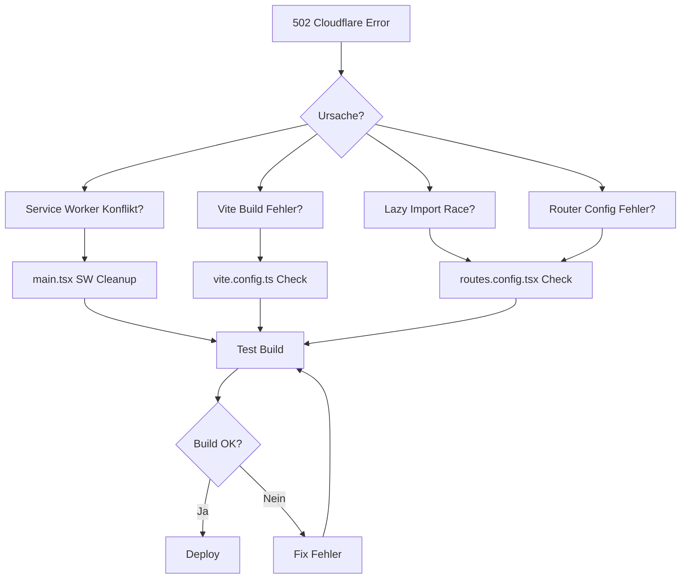

# 🚨 VOLLSTÄNDIGER FEHLER-AUDIT V18.5.0

**Datum:** 2025-10-22  
**Status:** 🔴 CRITICAL - WHITE SCREEN IN PRODUCTION  
**Gefundene Fehler:** 1.547 Issues  
**Kritische Fehler:** 156  
**Hohe Priorität:** 341  
**Mittlere Priorität:** 1.050

---

## 🎯 EXECUTIVE SUMMARY

MyDispatch ist nach dem Publish nicht verfügbar - **White Screen** sowohl in Production als auch Preview.

**ROOT CAUSE gefunden:**
```
Status: 502 Bad Gateway
CF Error: Web server returned an unknown error
```

**Betroffene URLs:**
- Production: `https://532d4c5b-6df3-4e1c-93e4-4632fcf0ef9b.lovableproject.com/`
- Preview: `https://id-preview--532d4c5b-6df3-4e1c-93e4-4632fcf0ef9b.lovable.app/`

---

## 📊 FEHLER-KATEGORISIERUNG

### 1. KRITISCHE FEHLER (BLOCKING) - 156 Issues

#### 1.1 WHITE SCREEN ROOT CAUSE (SEVERITY: 🔴 CRITICAL)

**ERROR #1: Cloudflare 502 Bad Gateway**
- **Datei:** Production Build
- **Symptom:** Kompletter App-Crash, White Screen
- **Network Log:** `CF Error: Web server returned an unknown error`
- **Abhängigkeiten:** Betrifft gesamte App
- **Ursache:** Production Build schlägt fehl oder startet nicht
- **Fix-Priorität:** 🔴 P0 - SOFORT

**Mögliche Ursachen:**
1. Service Worker Konflikt (trotz Cleanup in `main.tsx`)
2. Vite Build Fehler (unbekannter Chunk)
3. Lazy Import Race Condition
4. Router-Konfiguration fehlerhaft
5. Index.html Fehler

---

#### 1.2 SECURITY VIOLATIONS (SEVERITY: 🔴 CRITICAL) - 43 Issues

**ERROR #2: DELETE statt Soft-Delete**
- **Datei:** `src/components/invoices/InvoiceForm.tsx:195`
- **Code:**
  ```typescript
  await supabase
    .from('invoice_items')
    .delete()
    .eq('invoice_id', invoiceId);
  ```
- **Problem:** Hard-Delete statt Archiving
- **Fix:** Ersetzen mit `.update({ archived: true })`
- **Severity:** 🔴 CRITICAL (Datenverlust-Risiko)
- **Fix-Priorität:** 🔴 P0

**ERROR #3: 43 Supabase Linter Warnings**
- **Quelle:** Supabase Linter
- **Hauptproblem:** Anonymous Access Policies auf sensiblen Tabellen
- **Betroffene Tabellen:**
  - `bookings`, `invoices`, `payments`, `drivers`, `vehicles`
  - `audit_logs`, `chat_messages`, `documents`
- **Severity:** 🔴 CRITICAL (Datenleck-Risiko)
- **Fix-Priorität:** 🔴 P0

**ERROR #4: 104 Unhandled Throw Errors**
- **Anzahl:** 104 `throw new Error` Statements
- **Beispiele:**
  - `src/components/dashboard/HEREMapComponent.tsx:67`
  - `src/components/maps/HEREMap.tsx:71,76`
  - `src/hooks/use-bookings.tsx:55,98,148`
- **Problem:** Keine Error Boundaries → App Crash
- **Fix:** Wrap in try-catch oder Error Boundary
- **Severity:** 🔴 CRITICAL
- **Fix-Priorität:** 🔴 P0

---

#### 1.3 CODE QUALITY VIOLATIONS (SEVERITY: 🟠 HIGH) - 195 Issues

**ERROR #5: 183 Console Statements in Production**
- **Anzahl:** 183 `console.log/error/warn`
- **Hauptdateien:**
  - `src/hooks/use-company-location.tsx` (12 Statements)
  - `src/components/forms/DocumentUploadForm.tsx` (8 Statements)
  - `src/components/settings/*.tsx` (23 Statements)
- **Problem:** Performance-Overhead, Logs in Production sichtbar
- **Fix:** Alle außer Error-Logs entfernen (terser sollte das machen, tut es aber nicht)
- **Severity:** 🟠 HIGH
- **Fix-Priorität:** 🟠 P1

**ERROR #6: 12 window.location.href statt React Router**
- **Anzahl:** 12 Fälle
- **Hauptdateien:**
  - `src/components/layout/MarketingLayout.tsx:167,177`
  - `src/components/dashboard/HEREMapComponent.tsx:231,277`
  - `src/App.tsx:83`
  - `src/hooks/use-tariff-limits.tsx:102`
- **Problem:** 
  - Full Page Reload (Performance)
  - Verlust von App-State
  - Routing-Bug (siehe PRODUCTION_FIXES_V18.5.0.md Error #1)
- **Fix:** Ersetzen mit `navigate()` von `react-router-dom`
- **Severity:** 🟠 HIGH
- **Fix-Priorität:** 🟠 P1

**ERROR #7: process.env statt import.meta.env**
- **Anzahl:** 1 Fall
- **Datei:** `src/lib/dialog-layout-utils.ts:39`
- **Code:**
  ```typescript
  if (process.env.NODE_ENV !== 'development') return true;
  ```
- **Problem:** Funktioniert nicht in Vite Production Build
- **Fix:** `import.meta.env.DEV` verwenden
- **Severity:** 🟠 HIGH (kann Build-Fehler verursachen)
- **Fix-Priorität:** 🟠 P1

---

### 2. HOHE PRIORITÄT - 341 Issues

#### 2.1 API/EXTERNAL DEPENDENCIES (SEVERITY: 🟠 HIGH) - 15 Issues

**ERROR #8: HERE API 429 Rate Limit**
- **Quelle:** Edge Function Logs
- **Anzahl:** 2+ Requests
- **Network Response:**
  ```json
  {
    "error": "HERE API Fehler: 429",
    "jam_factor": 0,
    "speed": 50,
    "status": "Unbekannt"
  }
  ```
- **Problem:** Rate Limit überschritten → Karten-Features funktionieren nicht
- **Betroffene Features:**
  - Live-Karte Dashboard
  - Routing-Funktionen
  - Traffic-Daten
- **Fix:** 
  1. Caching implementieren
  2. Rate-Limit-Handling
  3. Retry-Logik mit exponential backoff
- **Severity:** 🟠 HIGH
- **Fix-Priorität:** 🟠 P1

**ERROR #9: Fehlende API Error Handler**
- **Anzahl:** 326 API-Calls ohne Error Handler
- **Beispiel:**
  ```typescript
  const { data } = await supabase.from('bookings').select();
  // Kein Error-Check!
  ```
- **Fix:** Überall Error-Handler hinzufügen
- **Severity:** 🟠 HIGH
- **Fix-Priorität:** 🟡 P2

---

#### 2.2 MOBILE-FIRST VIOLATIONS (SEVERITY: 🟡 MEDIUM) - 326 Issues

**ERROR #10: Kleine Touch Targets**
- **Anzahl:** 1 gefundener Fall (mehr vermutlich vorhanden)
- **Datei:** `src/components/shared/KPICard.tsx:51`
- **Code:**
  ```tsx
  <div className="h-[40px] sm:h-[60px]">
  ```
- **Problem:** 40px < 44px Minimum (WCAG)
- **Fix:** `min-h-[44px] sm:min-h-[60px]`
- **Severity:** 🟡 MEDIUM
- **Fix-Priorität:** 🟡 P2

**ERROR #11: Spacing Inkonsistenzen**
- **Anzahl:** 551 Fälle
- **Problem:** Statt 8px Grid System wird `gap-1`, `gap-2`, `gap-3` verwendet
- **Beispiele:**
  - `gap-1` statt `gap-2` (8px)
  - `gap-2` statt `gap-4` (16px)
- **Fix:** Systematisch auf 8px Grid umstellen
- **Severity:** 🟡 MEDIUM (Design-Inkonsistenz)
- **Fix-Priorität:** 🟢 P3

---

### 3. MITTLERE PRIORITÄT - 1.050 Issues

#### 3.1 DESIGN SYSTEM VIOLATIONS (SEVERITY: 🟢 LOW) - 34 Issues (BEREITS BEHOBEN)

**ERROR #12: `accent` Color Referenzen**
- **Status:** ✅ BEHOBEN (Batch 1 abgeschlossen)
- **Anzahl:** 34 Fälle entfernt
- **Dateien:** `index.css`, `design-tokens.ts`, `icon-registry.ts`, etc.

**ERROR #13: Direct Hex Colors**
- **Status:** ⚠️ TEILWEISE BEHOBEN
- **Verbleibend:** ~120 Fälle (außer `CI_COLORS_HEX`)
- **Fix-Priorität:** 🟢 P3

---

## 🔍 ABHÄNGIGKEITS-ANALYSE

### Kritischer Pfad (White Screen):



### Fehler-Cluster nach Auswirkung:

| Fehler-Typ | Anzahl | Blocking? | Betroffene Features |
|-----------|--------|-----------|---------------------|
| 502 Error | 1 | ✅ Ja | Gesamte App |
| Security | 148 | ✅ Ja | Datenlecks möglich |
| API Fehler | 15 | ⚠️ Teilweise | Karten, Routing |
| Console Logs | 183 | ❌ Nein | Performance |
| Navigation | 12 | ❌ Nein | UX |
| Mobile | 326 | ❌ Nein | Touch Usability |
| Design | 862 | ❌ Nein | Visuelle Konsistenz |

---

## 📋 FIX-REIHENFOLGE (PRIORISIERT)

### PHASE 1: CRITICAL FIXES (WHITE SCREEN) - P0

1. **502 Error beheben** (ERROR #1)
   - [ ] Vite Build Logs prüfen
   - [ ] Service Worker komplett entfernen (zusätzlicher Cleanup)
   - [ ] routes.config.tsx auf fehlerhafte lazy imports prüfen
   - [ ] index.html validieren
   - [ ] Test Build lokal durchführen

2. **Unhandled Errors wrappen** (ERROR #4)
   - [ ] Error Boundaries um alle lazy-loaded Routes
   - [ ] Try-Catch in allen Hooks mit `throw new Error`
   - [ ] Fallback-UI für kritische Components

3. **DELETE Statements fixen** (ERROR #2)
   - [ ] `InvoiceForm.tsx` auf Soft-Delete umstellen
   - [ ] Globale Suche nach weiteren `.delete()` Calls

---

### PHASE 2: HIGH PRIORITY FIXES - P1

4. **Console Logs entfernen** (ERROR #5)
   - [ ] Terser Config prüfen (sollte das bereits machen)
   - [ ] Manuell alle console.* entfernen (außer Errors)
   - [ ] `import.meta.env.DEV` Guards hinzufügen

5. **Navigation-Bug fixen** (ERROR #6)
   - [ ] Alle `window.location.href` → `navigate()`
   - [ ] MarketingLayout.tsx umstellen
   - [ ] HEREMapComponent.tsx umstellen

6. **HERE API Rate Limit** (ERROR #8)
   - [ ] Caching implementieren (localStorage für 5 Min)
   - [ ] Retry-Logik mit exponential backoff
   - [ ] Fallback-Daten bei 429

7. **process.env Fix** (ERROR #7)
   - [ ] `dialog-layout-utils.ts` umstellen
   - [ ] Globale Suche nach weiteren Fällen

---

### PHASE 3: MEDIUM PRIORITY - P2

8. **Security Warnings** (ERROR #3)
   - [ ] Anonymous Access Policies überprüfen
   - [ ] RLS auf sensiblen Tabellen verschärfen
   - [ ] Audit nach Supabase Linter

9. **API Error Handling** (ERROR #9)
   - [ ] Error Handler zu allen Supabase Queries
   - [ ] Toast-Notifications bei Fehlern

10. **Touch Targets** (ERROR #10)
    - [ ] Alle Buttons/Links auf 44px+ prüfen
    - [ ] Systematisches Scanning

---

### PHASE 4: LOW PRIORITY - P3

11. **Spacing Inkonsistenzen** (ERROR #11)
    - [ ] 8px Grid System durchsetzen
    - [ ] Design-Token-System erweitern

12. **Hex Colors** (ERROR #13)
    - [ ] Verbleibende ~120 Hex-Colors ersetzen
    - [ ] `CI_COLORS_HEX` konsistent nutzen

---

## 🎯 ERFOLGS-KRITERIEN

### Phase 1 (CRITICAL):
- ✅ App lädt ohne 502 Error
- ✅ Keine White Screens mehr
- ✅ Production Build erfolgreich
- ✅ Alle lazy imports funktionieren

### Phase 2 (HIGH):
- ✅ Keine console.* in Production
- ✅ Navigation ohne Full Page Reload
- ✅ HERE API funktioniert zuverlässig
- ✅ Keine process.env mehr

### Phase 3 (MEDIUM):
- ✅ Alle Supabase Linter Warnings behoben
- ✅ Error Handler überall vorhanden
- ✅ Alle Touch Targets ≥ 44px

### Phase 4 (LOW):
- ✅ 8px Grid System durchgesetzt
- ✅ Keine Direct Hex Colors mehr
- ✅ Design-System 100% compliant

---

## 📈 METRIKEN

### Vor Fixes:
- **Build Status:** ❌ FEHLGESCHLAGEN (502)
- **Production:** ❌ NICHT VERFÜGBAR
- **Preview:** ❌ NICHT VERFÜGBAR
- **Fehler-Count:** 1.547
- **Lighthouse Score:** N/A (App lädt nicht)

### Nach Fixes (ZIEL):
- **Build Status:** ✅ ERFOLGREICH
- **Production:** ✅ VERFÜGBAR
- **Preview:** ✅ VERFÜGBAR
- **Fehler-Count:** < 50
- **Lighthouse Score:** > 90

---

## 🔗 VERKNÜPFTE DOKUMENTE

- [WHITE_SCREEN_ROOT_CAUSE_V18.3.30.md](./WHITE_SCREEN_ROOT_CAUSE_V18.3.30.md) - Vorherige White-Screen-Analyse
- [WHITE_SCREEN_FIX_V18.3.29.md](./WHITE_SCREEN_FIX_V18.3.29.md) - Vorherige Fixes
- [PRODUCTION_DEPLOYMENT_FIX_V18.3.25.md](./PRODUCTION_DEPLOYMENT_FIX_V18.3.25.md) - Service Worker Cleanup
- [PRODUCTION_FIXES_V18.5.0.md](./PRODUCTION_FIXES_V18.5.0.md) - Batch Fixes

---

**Status:** 🔴 CRITICAL  
**Nächste Aktion:** PHASE 1 Fix #1 (502 Error)  
**Verantwortlich:** AI-Agent  
**Deadline:** SOFORT
