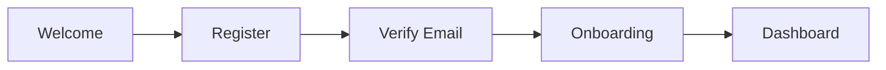
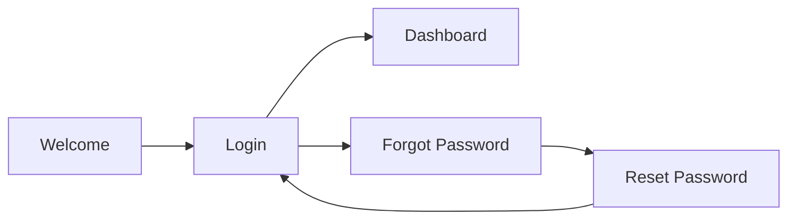

# MyDispatch Fahrer-App - Dokumentation V1.0

**Status:** ✅ MVP Implementiert  
**Datum:** 20.01.2025  
**Version:** 1.0.0

---

## 📱 Übersicht

Die MyDispatch Fahrer-App ist eine mobile-first Anwendung für Fahrer im MyDispatch-Netzwerk. Sie ermöglicht Fahrern die einfache Verwaltung ihrer Aufträge, Dokumente und Einnahmen.

### Features

- ✅ **Authentifizierung**: Registrierung, Login, Passwort-Reset
- ✅ **Dashboard**: Live-Übersicht über Aufträge und Einnahmen
- ✅ **Auftrags-Verwaltung**: Annahme, Ablehnung und Navigation
- ✅ **Dokument-Upload**: Führerschein, Fahrzeugpapiere, etc.
- ✅ **Echtzeit-Status**: Online/Offline-Verwaltung
- ✅ **Statistiken**: Tages-, Wochen- und Monatsübersicht

---

## 🎨 Design-System

### CI-Farben (MyDispatch)

```css
/* Primary - Beige/Gold */
--primary: hsl(40, 31%, 88%) /* #EADEBD */

/* Foreground - Dunkelblau */
--foreground: hsl(225, 31%, 28%) /* #323D5E */

/* Accent - Gold-Braun */
--accent: hsl(45, 31%, 54%) /* #A28A5B */

/* Background */
--background: #FEFFEE /* Helles Beige */
```

### Typografie

- **Primary Font**: Inter (400, 500, 600, 700)
- **Secondary Font**: Geist (Headlines)
- **Body Text**: 14px (text-sm)
- **Headlines**: 24px+ (text-2xl, text-3xl)

### Responsive Breakpoints

```typescript
Mobile:  < 768px
Tablet:  768px - 1024px
Desktop: > 1024px
```

---

## 📂 Projekt-Struktur

```
src/
├── pages/driver-app/
│   ├── DriverSplash.tsx          # Splash-Screen (Auto-Redirect)
│   ├── DriverWelcome.tsx         # Welcome-Screen mit Features
│   ├── DriverLogin.tsx           # Login-Formular
│   ├── DriverRegister.tsx        # Registrierungs-Formular
│   ├── DriverForgotPassword.tsx  # Passwort zurücksetzen
│   ├── DriverVerifyEmail.tsx     # E-Mail-Verifizierung
│   └── DriverDashboard.tsx       # Haupt-Dashboard
├── assets/driver-app/
│   ├── 01_splash_screen.svg
│   ├── 02_welcome_screen.svg
│   └── ... (31+ SVG-Dateien)
├── config/
│   └── driver-routes.tsx         # Route-Konfiguration
└── docs/
    └── FAHRER_APP_DOKUMENTATION.md
```

---

## 🚀 Routen-Übersicht

| Route | Beschreibung | Auth | Layout |
|-------|--------------|------|--------|
| `/driver` | Splash-Screen (Auto-Redirect) | ❌ | none |
| `/driver/welcome` | Welcome-Screen mit Feature-Liste | ❌ | none |
| `/driver/login` | Login-Formular | ❌ | none |
| `/driver/register` | Registrierung mit AGB-Zustimmung | ❌ | none |
| `/driver/forgot-password` | Passwort zurücksetzen | ❌ | none |
| `/driver/verify-email` | E-Mail-Verifizierung (6-stelliger Code) | ❌ | none |
| `/driver/dashboard` | Haupt-Dashboard (Aufträge, Stats) | ✅ | none |

---

## 🔐 Authentifizierung

### Registrierungs-Flow



### Login-Flow



### Formular-Validierung

#### Registrierung

```typescript
interface RegisterFormData {
  firstName: string;      // Pflichtfeld
  lastName: string;       // Pflichtfeld
  email: string;          // Pflichtfeld (E-Mail-Format)
  phone: string;          // Pflichtfeld (Tel-Format)
  password: string;       // Pflichtfeld (min. 8 Zeichen)
  acceptedTerms: boolean; // Pflichtfeld (muss true sein)
  acceptedPrivacy: boolean; // Pflichtfeld (muss true sein)
}
```

#### Login

```typescript
interface LoginFormData {
  email: string;    // Pflichtfeld (E-Mail-Format)
  password: string; // Pflichtfeld
}
```

---

## 📊 Dashboard-Komponenten

### KPI-Cards

```typescript
interface DriverStats {
  todayEarnings: number;    // Tageseinnahmen (€)
  todayRides: number;       // Anzahl Fahrten heute
  weeklyEarnings: number;   // Wocheneinnahmen (€)
  rating: number;           // Durchschnittsbewertung (0-5)
  completionRate: number;   // Abschlussrate (%)
}
```

### Auftrags-Card

```typescript
interface Booking {
  id: string;
  pickup: string;           // Abholadresse
  destination: string;      // Zieladresse
  time: string;             // Abholzeit (HH:MM)
  distance: string;         // Entfernung (z.B. "28 km")
  price: number;            // Preis in Euro
  status: 'confirmed' | 'pending'; // Status
}
```

---

## 🎯 Implementierungs-Roadmap

### Phase 1: MVP (✅ Abgeschlossen)

- ✅ Splash-Screen mit Logo und Animation
- ✅ Welcome-Screen mit Feature-Liste
- ✅ Login/Register-Formulare
- ✅ Passwort-Reset-Flow
- ✅ E-Mail-Verifizierung
- ✅ Basic Dashboard mit KPIs

### Phase 2: Onboarding (🔄 In Planung)

- ⏳ Dokument-Upload (Führerschein, Fahrzeugpapiere)
- ⏳ Fahrzeug-Details
- ⏳ Profilbild-Upload
- ⏳ Hintergrund-Prüfung
- ⏳ Versicherungsnachweis

### Phase 3: Live-Features (📅 Geplant)

- 📅 GPS-Tracking
- 📅 Echtzeit-Auftrags-Benachrichtigungen
- 📅 Navigation (HERE Maps Integration)
- 📅 Chat mit Kunden/Zentrale
- 📅 Push-Benachrichtigungen

### Phase 4: Erweiterte Features (📅 Geplant)

- 📅 Schichtplanung
- 📅 Urlaubsanträge
- 📅 Abrechnungs-Export (PDF)
- 📅 Ratings & Feedback
- 📅 Schulungsmaterialien

---

## 💡 Best Practices

### Mobile-First Design

```tsx
// ✅ KORREKT: Mobile-first mit Breakpoints
<div className="space-y-4 md:space-y-6 lg:space-y-8">
  <Button className="h-12 w-full md:w-auto">
    Jetzt registrieren
  </Button>
</div>

// ❌ FALSCH: Desktop-first ohne mobile Optimierung
<div className="space-y-8">
  <Button className="h-10 px-4">
    Jetzt registrieren
  </Button>
</div>
```

### Touch-Targets

```tsx
// ✅ KORREKT: Mindestens 44x44px für Touch
<Button className="h-12 min-h-[44px] px-6">
  Anmelden
</Button>

// ❌ FALSCH: Zu klein für Touch
<Button className="h-8 px-2">
  Anmelden
</Button>
```

### CI-Farben-Verwendung

```tsx
// ✅ KORREKT: Semantic Tokens verwenden
<Button className="bg-accent hover:bg-accent/90 text-white">
  Aktion
</Button>

// ❌ FALSCH: Direkte Farben
<Button className="bg-[#A28A5B] hover:bg-[#856d4b] text-white">
  Aktion
</Button>
```

---

## 🔧 Technische Integration

### Supabase Auth

```typescript
// TODO: Implementierung mit Supabase Auth
import { supabase } from '@/integrations/supabase/client';

// Registrierung
const { data, error } = await supabase.auth.signUp({
  email: formData.email,
  password: formData.password,
  options: {
    data: {
      first_name: formData.firstName,
      last_name: formData.lastName,
      phone: formData.phone,
      user_type: 'driver'
    }
  }
});

// Login
const { data, error } = await supabase.auth.signInWithPassword({
  email: formData.email,
  password: formData.password
});
```

### Database Schema (Geplant)

```sql
-- Drivers Table
CREATE TABLE drivers (
  id UUID PRIMARY KEY DEFAULT gen_random_uuid(),
  user_id UUID REFERENCES auth.users NOT NULL,
  first_name TEXT NOT NULL,
  last_name TEXT NOT NULL,
  phone TEXT NOT NULL,
  profile_image_url TEXT,
  vehicle_id UUID REFERENCES vehicles,
  status TEXT DEFAULT 'offline', -- 'online', 'offline', 'busy'
  rating DECIMAL(2,1) DEFAULT 5.0,
  total_rides INTEGER DEFAULT 0,
  total_earnings DECIMAL(10,2) DEFAULT 0,
  created_at TIMESTAMPTZ DEFAULT NOW(),
  updated_at TIMESTAMPTZ DEFAULT NOW()
);

-- RLS Policies
ALTER TABLE drivers ENABLE ROW LEVEL SECURITY;

CREATE POLICY "Drivers can view own data"
  ON drivers FOR SELECT
  USING (auth.uid() = user_id);

CREATE POLICY "Drivers can update own data"
  ON drivers FOR UPDATE
  USING (auth.uid() = user_id);
```

---

## 📝 Testing-Checklist

### Funktionale Tests

- [ ] Registrierung mit gültigen Daten
- [ ] Registrierung mit ungültigen Daten (Fehlerbehandlung)
- [ ] Login mit korrekten Credentials
- [ ] Login mit falschen Credentials
- [ ] Passwort-Reset-Flow
- [ ] E-Mail-Verifizierung
- [ ] Dashboard-Daten-Anzeige
- [ ] Auftrags-Details öffnen
- [ ] Online/Offline-Toggle

### UI/UX Tests

- [ ] Responsive Design (Mobile, Tablet, Desktop)
- [ ] Touch-Targets mindestens 44x44px
- [ ] Ladezeiten < 2 Sekunden
- [ ] Animationen flüssig (60fps)
- [ ] Barrierefreiheit (ARIA-Labels, Kontrast)

### Security Tests

- [ ] XSS-Schutz
- [ ] CSRF-Schutz
- [ ] Input-Validierung
- [ ] Auth-Token-Handling
- [ ] RLS-Policies aktiv

---

## 🚨 Bekannte Issues

### TODO

1. **Auth-Integration**: Supabase Auth implementieren
2. **Database**: Driver-Tabelle und RLS-Policies erstellen
3. **GPS-Tracking**: Real-Time-Locations speichern
4. **Push-Notifications**: Firebase Cloud Messaging
5. **Document-Upload**: Supabase Storage Integration

---

## 📞 Support & Kontakt

**Technische Fragen:**
- E-Mail: support@my-dispatch.de
- Tel: +49 170 8004423

**Dokumentation:**
- Hauptdokumentation: `/docs/INSTRUCTIONS_GUIDELINES_V18.3_FINAL.md`
- Mobile Standards: `/docs/MOBILE_LAYOUT_STANDARDS_V18.3.md`

---

**Version:** 1.0.0  
**Letzte Aktualisierung:** 20.01.2025  
**Autor:** MyDispatch Development Team
