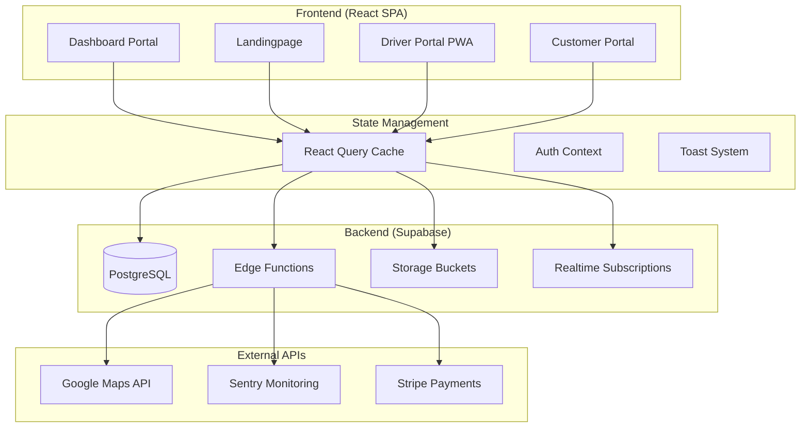

# 🎯 GESAMTKONZEPT MYDISPATCH V18.5.0

**Version:** 18.5.0  
**Status:** MASTER BLUEPRINT  
**Erstellt:** 2025-01-22  
**Gültigkeit:** Go-Live + 12 Monate

---

## 📋 EXECUTIVE SUMMARY

MyDispatch ist eine **Multi-Tenant SaaS-Plattform** für Taxi- und Mietwagenunternehmen, die **4 separate Portale** in einer einzigen Anwendung vereint:

1. **Dashboard-Portal** (Interne Verwaltung für Unternehmer)
2. **Unternehmer-Landingpage** (Öffentlich, gebrandetes Marketing)
3. **Fahrer-Portal** (PWA für mobile Nutzung)
4. **Kunden-Portal** (Self-Service-Buchungen)

**Technologie-Stack:**
- **Frontend:** React 18, TypeScript, Tailwind CSS, Vite
- **Backend:** Supabase (PostgreSQL, Edge Functions, Storage, Auth)
- **State Management:** React Query (TanStack Query)
- **Design System:** Custom Semantic Tokens (68 Tokens, Light/Dark Mode)
- **Deployment:** Lovable Cloud (Auto-Deploy, Zero-Downtime)

**Business Model:**
- **4 Tarife:** Free, Basic, Business, Business+, Enterprise
- **Feature-Gates:** Booking Widget (Business+), Driver Portal (Enterprise)
- **Revenue:** Subscription + Transaction Fees

---

## 🏗️ SYSTEMARCHITEKTUR

### High-Level Architecture



---

## 🎨 DESIGN-PHILOSOPHIE

### Prinzipien

1. **Mobile-First:** Alle UI-Elemente optimiert für Touch (≥44px Targets)
2. **Semantic Tokens:** Keine direkten Farben, nur Design-System Tokens
3. **Dark Mode Native:** Alle Komponenten unterstützen Light/Dark automatisch
4. **Accessibility:** WCAG 2.1 AA konform (4.5:1 Kontrast-Ratio)
5. **Performance:** First Contentful Paint <1.5s, Lighthouse Score ≥90

### Design-System Hierarchie

```
Design System V18.3.30
├── Semantic Tokens (index.css)
│   ├── Colors (68 Tokens: --primary, --background, etc.)
│   ├── Typography (Font-Sizes, Line-Heights)
│   ├── Spacing (Padding, Margin, Gap)
│   └── Shadows & Borders
├── Master Components (src/components/design-system/)
│   ├── HeroSection
│   ├── KPICard
│   ├── QuickActions
│   ├── DashboardGrid
│   ├── ResponsiveBadge
│   └── Icon (Dynamic Lucide)
└── Shadcn Components (src/components/ui/)
    ├── Button (6 Variants)
    ├── Dialog, Drawer
    ├── Form, Input
    ├── Table, DataTable
    └── 40+ weitere
```

**Verbotene Patterns:**
- ❌ `text-white`, `bg-black`, `text-blue-500`
- ❌ `#hex-colors`, `rgb()`
- ❌ Direktes `accent` Token (entfernt in V18.3.24)
- ❌ Icons mit Status-Farben (`text-status-success`)

**Erlaubt:**
- ✅ `bg-primary`, `text-foreground`
- ✅ `bg-card`, `text-muted-foreground`
- ✅ `border-border`
- ✅ HSL-basierte Custom Colors (`hsl(var(--primary))`)

---

## 🔐 SICHERHEITSKONZEPT

### Multi-Tenant Data Isolation

**Regel:** Jede Supabase-Query MUSS `company_id` Filter haben!

```typescript
// ✅ RICHTIG
import { CompanyQuery } from '@/lib/database-utils';

const bookings = await CompanyQuery(supabase)
  .from('bookings')
  .select('*')
  .eq('company_id', profile.company_id);

// ❌ FALSCH
const bookings = await supabase.from('bookings').select('*');
```

**Enforcement:**
1. **RLS Policies** auf allen Tabellen (Supabase)
2. **CompanyQuery Wrapper** (Type-Safe)
3. **Security Scanner** (Agent Debug System)
4. **GitHub Workflow** (security-audit.yml)

---

### Soft-Delete Policy

**Regel:** Keine Hard-Deletes! Nur Soft-Delete via `deleted_at`.

```typescript
// ✅ RICHTIG
import { softDelete } from '@/lib/database-utils';

await softDelete(supabase, 'drivers', driverId);

// ❌ FALSCH
await supabase.from('drivers').delete().eq('id', driverId);
```

**Vorteile:**
- DSGVO-konform (Wiederherstellen möglich)
- PBefG-konform (7 Jahre Archivierung)
- Audit-Trail erhalten

---

### Authentication & Authorization

**Auth-Flow:**
1. **Email/Password** (Standard)
2. **JWT-basierte Sessions** (24h Lifetime)
3. **Auto-Refresh** (Supabase SDK)
4. **Role-Based Access Control** (Admin, Unternehmer, Disponent, Fahrer)

**Implementierung:**
- `use-auth.tsx` Hook (Zentral)
- `ProtectedRoute` Component (Dashboard)
- `PortalRoute` Component (Fahrer/Kunden)

**RLS Policies:**
```sql
-- Beispiel: Bookings
CREATE POLICY "bookings_select" ON bookings
  FOR SELECT
  USING (
    company_id = (auth.jwt() ->> 'company_id')::uuid
  );
```

---

## 📊 DATENBANK-SCHEMA

### Core Tables (34 Tabellen)

#### Companies (Multi-Tenant Root)
```sql
CREATE TABLE companies (
  id UUID PRIMARY KEY DEFAULT gen_random_uuid(),
  name TEXT NOT NULL,
  slug TEXT UNIQUE NOT NULL,
  tariff TEXT NOT NULL DEFAULT 'free', -- free, basic, business, business_plus, enterprise
  logo_url TEXT,
  primary_color TEXT, -- HEX für Branding
  created_at TIMESTAMPTZ DEFAULT NOW(),
  updated_at TIMESTAMPTZ DEFAULT NOW(),
  deleted_at TIMESTAMPTZ -- Soft Delete
);
```

#### Profiles (User-Company-Mapping)
```sql
CREATE TABLE profiles (
  id UUID PRIMARY KEY DEFAULT gen_random_uuid(),
  user_id UUID REFERENCES auth.users NOT NULL,
  company_id UUID REFERENCES companies NOT NULL,
  full_name TEXT,
  avatar_url TEXT,
  phone TEXT,
  created_at TIMESTAMPTZ DEFAULT NOW(),
  updated_at TIMESTAMPTZ DEFAULT NOW()
);
```

#### Bookings (Core Entity)
```sql
CREATE TABLE bookings (
  id UUID PRIMARY KEY DEFAULT gen_random_uuid(),
  company_id UUID REFERENCES companies NOT NULL,
  customer_id UUID REFERENCES customers,
  driver_id UUID REFERENCES drivers,
  vehicle_id UUID REFERENCES vehicles,
  pickup_address TEXT NOT NULL,
  dropoff_address TEXT,
  pickup_time TIMESTAMPTZ NOT NULL,
  dropoff_time TIMESTAMPTZ,
  status TEXT NOT NULL DEFAULT 'open', -- open, assigned, in_progress, completed, cancelled
  fare DECIMAL(10,2),
  distance_km DECIMAL(10,2),
  created_at TIMESTAMPTZ DEFAULT NOW(),
  updated_at TIMESTAMPTZ DEFAULT NOW(),
  deleted_at TIMESTAMPTZ
);
```

#### Drivers (Fahrer)
```sql
CREATE TABLE drivers (
  id UUID PRIMARY KEY DEFAULT gen_random_uuid(),
  company_id UUID REFERENCES companies NOT NULL,
  user_id UUID REFERENCES auth.users, -- Für Portal-Login
  full_name TEXT NOT NULL,
  phone TEXT,
  email TEXT,
  license_number TEXT,
  license_expiry DATE,
  status TEXT DEFAULT 'active', -- active, inactive, suspended
  created_at TIMESTAMPTZ DEFAULT NOW(),
  updated_at TIMESTAMPTZ DEFAULT NOW(),
  deleted_at TIMESTAMPTZ
);
```

**Weitere Core Tables:**
- `vehicles` (Fahrzeuge)
- `customers` (Kunden)
- `partners` (Partner-Unternehmen)
- `invoices` (Rechnungen)
- `cost_centers` (Kostenstellen)
- `documents` (Dokumente)
- `shifts` (Schichten)
- `chat_messages` (Kommunikation)
- `audit_logs` (Audit-Trail)

### Indexes & Constraints

```sql
-- Performance Indexes
CREATE INDEX idx_bookings_company ON bookings(company_id);
CREATE INDEX idx_bookings_status ON bookings(status) WHERE deleted_at IS NULL;
CREATE INDEX idx_bookings_pickup ON bookings(pickup_time) WHERE deleted_at IS NULL;

-- Unique Constraints
ALTER TABLE companies ADD CONSTRAINT unique_slug UNIQUE(slug);
ALTER TABLE profiles ADD CONSTRAINT unique_user_company UNIQUE(user_id, company_id);

-- Foreign Key Indexes
CREATE INDEX idx_profiles_company ON profiles(company_id);
CREATE INDEX idx_drivers_company ON drivers(company_id);
```

---

## 🚀 EDGE FUNCTIONS

### AI-Powered Functions

1. **ai-chat** (Lovable AI Gateway)
   - Model: `google/gemini-2.5-flash`
   - Use Case: NeXify Support Chat
   - Streaming: SSE (Server-Sent Events)

2. **ai-code-review** (CI/CD)
   - Model: `google/gemini-2.5-pro`
   - Use Case: Automated Code Reviews
   - Trigger: GitHub Pull Requests

3. **ai-smart-routing**
   - Model: `google/gemini-2.5-flash`
   - Use Case: Optimale Fahrer-Zuweisung
   - Input: Standort, Verfügbarkeit, Bewertung

### Booking & Operations

4. **create-booking**
   - Validation: Zod Schema
   - Output: Booking ID, Invoice, Notification

5. **assign-driver**
   - Logic: Verfügbarkeit, Distanz, Rating
   - Output: Driver Assignment

6. **calculate-fare**
   - Input: Distance, Time, Vehicle Type, Tariff
   - Output: Fare Breakdown

### Communication

7. **send-email** (Resend API)
   - Templates: Booking Confirmation, Invoice, etc.
   - Rate Limit: 100/hour

8. **send-sms** (Twilio API)
   - Use Case: Driver Notifications
   - Rate Limit: 50/hour

### Payments

9. **create-stripe-checkout**
   - Integration: Stripe Checkout
   - Success URL: `/payment/success`

10. **webhook-stripe**
    - Events: payment_intent.succeeded
    - Action: Update Invoice Status

---

## 🎭 PORTAL-STRUKTUR

### 1. Dashboard-Portal (Unternehmer)

**Route:** `/dashboard`, `/auftraege`, `/fahrer`, `/kunden`, etc.

**Layout:**
- **Sidebar:** 64px collapsed, 240px expanded (hover)
- **Header:** 60px fixed, Company Logo, User Menu
- **Content:** Responsive Grid (DashboardGrid)
- **Footer:** Collapsible (Windows Taskbar Style)

**Pages (18):**
1. **Dashboard** (`/dashboard`)
   - KPI Cards (4): Umsatz, Aufträge, Fahrer, Kunden
   - Charts (3): Umsatz-Trend, Auslastung, Top-Fahrer
   - Quick Actions: Neuer Auftrag, Neuer Fahrer
   
2. **Aufträge** (`/auftraege`)
   - DataTable mit Filtering
   - Status-Filter, Datum-Filter
   - Quick Actions: Erstellen, Zuweisen

3. **Fahrer** (`/fahrer`)
   - Driver Cards Grid
   - Verfügbarkeits-Status
   - Dokument-Upload

4. **Fahrzeuge** (`/fahrzeuge`)
   - Vehicle Grid
   - Wartungs-Tracking
   - TÜV-Ablauf-Alerts

5. **Kunden** (`/kunden`)
   - Customer Table
   - Buchungshistorie
   - Favoriten-Adressen

6. **Finanzen** (`/finanzen`)
   - Umsatz-Dashboard
   - Rechnungen
   - Kostenübersicht

7. **Statistiken** (`/statistiken`)
   - Advanced Analytics
   - Custom Dashboards
   - Export-Funktionen

**Feature-Gates:**
- **Basic:** Aufträge, Fahrer, Fahrzeuge, Kunden
- **Business:** Finanzen, Rechnungen, Kostenstellen
- **Business+:** Statistiken, Partner, API-Zugang
- **Enterprise:** AI-Features, White-Label, Driver Portal

---

### 2. Unternehmer-Landingpage

**Route:** `/:slug` (z.B. `/nexify`)

**Komponenten:**
- **HeroSection** (Full-Screen)
  - Company Logo (300x100px)
  - Tagline (Custom)
  - CTA Buttons (2-3)
  
- **Services Section**
  - Icon + Text (Grid 3 Spalten)
  
- **Booking Widget** (Business+)
  - Address Autocomplete (Google Maps)
  - Date/Time Picker
  - Vehicle Selection
  - Instant Price Calculation
  
- **Footer**
  - Contact Info
  - Social Links
  - Legal Pages

**Branding:**
- **Primary Color:** `--primary-landingpage` (HEX aus DB)
- **Logo:** `/storage/logos/${company_id}.png`
- **Slug:** Unique URL (z.B. `/nexify`)

**SEO-Optimierung:**
```html
<title>{company.name} - Taxi & Mietwagen</title>
<meta name="description" content="{company.description}" />
<meta property="og:title" content="{company.name}" />
<meta property="og:image" content="{company.logo_url}" />
```

---

### 3. Fahrer-Portal (PWA)

**Route:** `/fahrer-portal`

**Features:**
- **Mobile-First Design** (≥44px Touch Targets)
- **Offline-Mode** (Service Worker + IndexedDB)
- **GPS-Tracking** (Real-Time via Supabase Realtime)
- **Biometric Auth** (Face ID, Fingerprint)

**Pages:**
1. **Onboarding** (`/fahrer/splash`, `/fahrer/welcome`)
2. **Login** (`/fahrer/login`)
3. **Dashboard** (`/fahrer/dashboard`)
   - Zugewiesene Aufträge (Cards)
   - Status-Update (Unterwegs, Abgeschlossen)
   - Navigation (Google Maps Intent)
4. **Einnahmen** (`/fahrer/earnings`)
   - Tagesübersicht
   - Wochenübersicht
   - Monatsstatistiken

**PWA-Konfiguration:**
```json
{
  "name": "MyDispatch Driver",
  "short_name": "Driver",
  "theme_color": "#1a1a2e",
  "background_color": "#0f0f1a",
  "display": "standalone",
  "orientation": "portrait",
  "icons": [
    { "src": "/icon-192.png", "sizes": "192x192" },
    { "src": "/icon-512.png", "sizes": "512x512" }
  ]
}
```

---

### 4. Kunden-Portal

**Route:** `/kunden-portal`

**Features:**
- **Self-Service Registrierung** (Email-Verifizierung)
- **Buchungsverlauf** (DataTable)
- **Neue Buchung** (Formular + Google Maps)
- **Rechnungen** (PDF-Download)

**Pages:**
1. **Portal Login** (`/kunden-portal/login`)
2. **Registrierung** (`/kunden-portal/register`)
3. **Dashboard** (`/kunden-portal/dashboard`)
   - Letzte Buchungen (5)
   - Quick Actions: Neue Buchung
4. **Buchungen** (`/kunden-portal/bookings`)
   - Alle Buchungen (Table)
   - Filter: Datum, Status
5. **Neue Buchung** (`/kunden-portal/new-booking`)
   - Address Input (Google Maps)
   - Vehicle Selection
   - Date/Time Picker
   - Payment Method

---

## ⚡ PERFORMANCE-OPTIMIERUNG

### Frontend Performance

**Code-Splitting:**
```typescript
// React.lazy für Routes
const Dashboard = lazy(() => import('@/pages/Dashboard'));
const Auftraege = lazy(() => import('@/pages/Auftraege'));
```

**Image Optimization:**
```typescript
// WebP Format, Lazy Loading

```

**React Query Caching:**
```typescript
export const queryClient = new QueryClient({
  defaultOptions: {
    queries: {
      staleTime: 5 * 60 * 1000, // 5 Min
      gcTime: 10 * 60 * 1000,   // 10 Min
      refetchOnWindowFocus: true,
    },
  },
});
```

### Backend Performance

**Database Indexes:**
- Foreign Keys: `company_id`, `user_id`, `driver_id`
- Composite Indexes: `(company_id, status, deleted_at)`
- Full-Text Search: `bookings.pickup_address`

**Edge Function Optimization:**
- **Cold Start:** <100ms (Deno Runtime)
- **Execution Time:** <200ms (avg)
- **Caching:** Redis (Supabase)

---

## 📱 RESPONSIVE DESIGN

### Breakpoints

```typescript
// Tailwind Config
screens: {
  'xs': '375px',  // iPhone SE
  'sm': '640px',  // Small Tablets
  'md': '768px',  // Tablets
  'lg': '1024px', // Laptops
  'xl': '1280px', // Desktops
  '2xl': '1536px' // Large Desktops
}
```

### Mobile-First Components

```typescript
// ✅ RICHTIG
<div className="p-4 sm:p-6 md:p-8 lg:p-10">
  <h1 className="text-2xl sm:text-3xl md:text-4xl lg:text-5xl">
    MyDispatch
  </h1>
</div>

// ❌ FALSCH (nicht responsive)
<div className="p-8">
  <h1 className="text-4xl">MyDispatch</h1>
</div>
```

---

## 🧪 TESTING-STRATEGIE

### Unit-Tests (Jest + Testing Library)

**Coverage-Ziel:** 60%

```typescript
// Example: format-utils.test.ts
describe('formatCurrency', () => {
  it('formats EUR correctly', () => {
    expect(formatCurrency(1234.56, 'EUR')).toBe('1.234,56 €');
  });
});
```

### E2E-Tests (Playwright)

**Critical Paths:**
1. **Login-Flow**
2. **Booking-Creation**
3. **Driver-Assignment**
4. **Invoice-Generation**

```typescript
// Example: booking.spec.ts
test('create booking', async ({ page }) => {
  await page.goto('/auftraege');
  await page.click('text=Neuer Auftrag');
  await page.fill('[name="pickup_address"]', 'Berlin Hauptbahnhof');
  await page.click('button[type="submit"]');
  await expect(page.locator('text=Auftrag erstellt')).toBeVisible();
});
```

---

## 📈 MONITORING & OBSERVABILITY

### Sentry Integration

```typescript
Sentry.init({
  dsn: import.meta.env.VITE_SENTRY_DSN,
  environment: import.meta.env.MODE,
  tracesSampleRate: 0.2,
  replaysSessionSampleRate: 0.1,
  replaysOnErrorSampleRate: 1.0,
});
```

### Custom Logging

```typescript
import { logger } from '@/lib/logger';

logger.info('[Booking] Created', { bookingId, companyId });
logger.error('[API] Failed', error as Error, { endpoint });
```

### Health Checks

**Endpoint:** `/health`

**Checks:**
- Database Connectivity
- Edge Functions Status
- Storage Availability
- Supabase Realtime

---

## 🚀 DEPLOYMENT-PROZESS

### CI/CD Pipeline (GitHub Actions)

```yaml
# .github/workflows/production-deployment.yml
jobs:
  ai-code-review:
    runs-on: ubuntu-latest
    steps:
      - name: AI Code Review (Claude)
        run: curl -X POST $SUPABASE_URL/functions/v1/ai-code-review

  security-scan:
    needs: ai-code-review
    steps:
      - name: Supabase Security Linter
        run: npx supabase db lint --linked

  deploy:
    needs: security-scan
    steps:
      - name: Deploy to Lovable
        run: git push origin main
```

### Zero-Downtime Deployment

1. **Staging-Slot** wird gebaut
2. **Health-Check** auf Staging
3. **Blue-Green Swap**
4. **Smoke-Tests** auf Production
5. **Rollback** bei Failure (<1 Min)

---

**Version:** V18.5.0  
**Status:** PRODUKTIONSBEREIT  
**Nächste Revision:** Q2 2025
