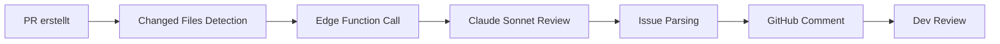

# 🤖 GITHUB CI/CD KI-INTEGRATION V18.3.30

## Übersicht

MyDispatch nutzt **intelligente KI-gestützte Code-Reviews** mit **Claude Sonnet 4.5** für automatische Qualitätsprüfungen bei jedem Pull Request.

---

## 🎯 Features

### 1. Automatische Code-Review (AI)

- ✅ **Design System Compliance** (keine `accent`, `text-white` etc.)
- ✅ **Security Best Practices** (company_id Filter, Soft-Delete, Input Validation)
- ✅ **TypeScript Patterns** (Type-Safety, keine console.logs)
- ✅ **Mobile-First** (Touch-Targets, Responsive Klassen)
- ✅ **Performance** (React Query, Defensive Coding)

### 2. Intelligente Severity-Klassifizierung

- 🚨 **Critical:** Blocking Issues (Design System Violations, Security Gaps)
- ⚠️ **Warning:** Wichtige Verbesserungen (Performance, Best Practices)
- ℹ️ **Info:** Vorschläge (Optimierungen, Nice-to-Haves)

### 3. GitHub PR Integration

- Automatische PR-Comments mit detailliertem Review
- Direkter Link zu betroffenen Dateien und Zeilen
- Konkrete Fix-Vorschläge für jeden Fund

---

## 🚀 Setup

### Secrets konfigurieren

#### 1. Anthropic API Key

```bash
# In Lovable Cloud hinzufügen:
ANTHROPIC_API_KEY=sk-ant-...
```

#### 2. GitHub Token (Classic)

```bash
# In Lovable Cloud hinzufügen:
GITHUB_Personal_access_tokens_classic=ghp_...
```

**Erforderliche Permissions:**

- `repo` (Full control of private repositories)
- `workflow` (Update GitHub Action workflows)

#### 3. GitHub Repository Variable

```bash
# In GitHub Actions Secrets hinzufügen:
GITHUB_REPOSITORY=owner/repo-name
```

### Edge Function deployen

Die Edge Function wird **automatisch** deployt bei jedem Push zu `main`.

Manuelle Deployments:

```bash
npx supabase functions deploy ai-code-review
```

---

## 📋 Workflow

### Trigger

Der AI Code Review läuft automatisch bei:

- `pull_request` (opened, synchronize, reopened)
- Branches: `main`, `develop`

### Ablauf



### Beispiel Output

```markdown
## 🤖 AI Code Review (Claude Sonnet 4.5)

### 🚨 Critical Issues (2)

**Design System** - `src/components/MyComponent.tsx:45`
Found prohibited `accent` color. Use semantic token instead.
💡 **Fix:** Replace `bg-accent` with `bg-primary`

**Security** - `src/hooks/useData.tsx:23`
Query missing company_id filter. All queries must be scoped to company.
💡 **Fix:** Add `.eq('company_id', profile.company_id)`

### ⚠️ Warnings (3)

**Performance** - `src/pages/Dashboard.tsx:12`
Missing React Query for data fetching. Use useQuery for better caching.
💡 **Suggestion:** Migrate to useQuery hook

...

---

_Automated Review powered by Claude Sonnet 4.5 | MyDispatch V18.3.30_
```

---

## 🎨 Review-Kategorien

### 1. Design System

- ❌ Verboten: `accent`, `text-white`, `bg-black`, `text-black`
- ✅ Pflicht: Semantic Tokens (`text-foreground`, `bg-primary`)
- ✅ Touch-Targets ≥ 44px (`min-h-[44px]`)
- ✅ Mobile-First (Responsive Klassen)

### 2. Security

- ✅ Company-ID Filter bei allen Queries
- ✅ Soft-Delete statt Hard-Delete (`archived=true`)
- ✅ Input Validation mit Zod
- ✅ DEV-Guards für console.log

### 3. Performance

- ✅ React Query für Data Fetching
- ✅ Defensive Coding (try-catch, fallbacks)
- ✅ Error Handler statt console.error

### 4. TypeScript

- ✅ Type-Safety (kein `any` ohne Grund)
- ✅ Keine doppelten Imports
- ✅ Interfaces für Props

### 5. Mobile

- ✅ Responsive Typography (`text-sm sm:text-base md:text-lg`)
- ✅ Responsive Icons (`h-4 w-4 sm:h-5 sm:w-5`)
- ✅ Responsive Spacing (`p-4 sm:p-6 md:p-8`)
- ✅ Keine horizontalen Scrollbars

---

## 🔧 Konfiguration

### Workflow anpassen

`.github/workflows/ai-code-review.yml`:

```yaml
# Dateitypen für Review
files: |
  **/*.tsx
  **/*.ts
  **/*.css

# Max Files pro Review (Performance)
files.slice(0, 10)

# Max Content per File (Token-Limit)
file.content.slice(0, 5000)
```

### Edge Function anpassen

`supabase/functions/ai-code-review/index.ts`:

```typescript
// Model wechseln
model: "claude-sonnet-4-20250514"; // Default
model: "claude-opus-4-20250514"; // Mehr Leistung

// Max Tokens anpassen
max_tokens: 4096; // Default
max_tokens: 8192; // Längere Reviews

// System Prompt erweitern
const systemPrompt = `...`;
```

---

## 📊 Monitoring

### Edge Function Logs

```bash
# In Lovable Backend:
# Functions → ai-code-review → Logs

# Filter nach Errors:
supabase functions logs ai-code-review --error
```

### GitHub Actions Logs

```bash
# In GitHub:
# Actions → AI Code Review → Latest Run → Logs
```

---

## 🚨 Troubleshooting

### Issue: "ANTHROPIC_API_KEY not configured"

**Lösung:**

```bash
# In Lovable Cloud → Settings → Secrets:
ANTHROPIC_API_KEY=sk-ant-...
```

### Issue: "GitHub comment failed"

**Lösung:**

```bash
# In Lovable Cloud → Settings → Secrets:
GITHUB_Personal_access_tokens_classic=ghp_...

# Check Permissions:
# Settings → Developer settings → Personal access tokens
# → repo, workflow
```

### Issue: "Anthropic API Error: 429"

**Grund:** Rate Limit erreicht

**Lösung:**

- Reduce Files per Review (max 10)
- Reduce Content per File (max 5KB)
- Upgrade Anthropic Plan

### Issue: "Failed to parse Claude response"

**Grund:** Claude gibt kein valides JSON zurück

**Lösung:**

- Prompt präzisieren ("Gebe NUR JSON zurück")
- JSON-Extraktion robuster machen (Regex)
- Fallback-Issue erstellen (wie aktuell)

---

## 🎓 Best Practices

### 1. PR-Erstellung

- Kleine PRs (max 10 Files)
- Clear Description
- Pre-Check vor PR (local linting)

### 2. Review-Verarbeitung

- Critical Issues **SOFORT** fixen
- Warnings **vor Merge** adressieren
- Infos für spätere Refactorings merken

### 3. False Positives

- Im PR diskutieren
- System Prompt verbessern
- Edge Function updaten

---

## 📈 Erfolgsmetriken

### Ziel: 100% Corporate Standard Compliance

```
✅ 0 Critical Issues bei Merge
✅ < 3 Warnings bei Merge
✅ 95%+ First-Pass Success Rate
```

### Tracking

- GitHub PR Comments
- Edge Function Logs
- Manual Review Notes

---

## 🔄 Updates

### Edge Function Update

```bash
# 1. Edit supabase/functions/ai-code-review/index.ts
# 2. Deploy:
npx supabase functions deploy ai-code-review

# 3. Test:
curl -X POST "$SUPABASE_URL/functions/v1/ai-code-review" \
  -H "Authorization: Bearer $SUPABASE_ANON_KEY" \
  -H "Content-Type: application/json" \
  -d '{"files":[...], "prNumber": 123}'
```

### Workflow Update

```bash
# 1. Edit .github/workflows/ai-code-review.yml
# 2. Commit & Push
# 3. Check Actions → Latest Run
```

---

## 📚 Weiterführende Links

- [Anthropic Claude API Docs](https://docs.anthropic.com/claude/reference)
- [GitHub Actions Docs](https://docs.github.com/en/actions)
- [Supabase Edge Functions](https://supabase.com/docs/guides/functions)

---

**Version:** 18.3.30  
**Last Updated:** 2025-01-22  
**Status:** ✅ Production Ready
