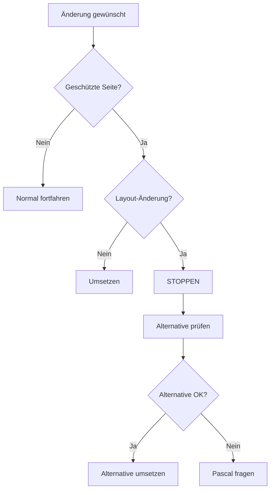

# LAYOUT FREEZE SYSTEM - ZUSAMMENFASSUNG V18.5.1

> **Zentrale Dokumentation des Schutzsystems für fertiggestellte Seiten**

## 📋 ÜBERSICHT

Das Layout Freeze System schützt fertiggestellte Dashboard-Seiten vor ungewollten Design- und Layout-Änderungen während alle funktionalen Erweiterungen weiterhin möglich bleiben.

## 🎯 ZWECK

1. **Stabilität:** Verhindert "Design-Drift" bei fertigen Seiten
2. **Konsistenz:** Einheitliches Erscheinungsbild über Zeit
3. **Effizienz:** Entwickler fokussieren auf neue Features statt Redesigns
4. **Qualität:** Keine ungetesteten visuellen Änderungen

## 🔒 GESCHÜTZTE SEITEN

| Seite     | Datei                     | Geschützt seit |
| --------- | ------------------------- | -------------- |
| Dashboard | `src/pages/Index.tsx`     | 2025-01-26     |
| Aufträge  | `src/pages/Auftraege.tsx` | 2025-01-26     |

## 📚 DOKUMENTATIONS-STRUKTUR

### 1. Kern-Dokumentation

- **`LAYOUT_FREEZE_PROTECTION_V18.5.1.md`** - Vollständige Regeln & Policies
- **`AI_AGENT_LAYOUT_FREEZE_PROMPT_V18.5.1.md`** - AI-Verhaltensregeln
- **`LAYOUT_FREEZE_QUICK_REFERENCE.md`** - Schnell-Check für Entwickler

### 2. Integration in bestehende Docs

- `SEITEN_PLANUNGSPROZESS_V18.5.1.md` - Layout Freeze Check als Step 0
- `MYDISPATCH_AI_AGENT_META_PROMPT_V18.5.1.md` - Höchste Priorität Check
- `MOBILE_FIRST_GRID_SYSTEM_V18.5.1.md` - Warnung für neue Seiten

### 3. Code-Marker

Alle geschützten Dateien haben Header-Kommentar:

```typescript
/* ==================================================================================
   ⚠️ LAYOUT FREEZE V18.5.1 - KEINE DESIGN/LAYOUT-ÄNDERUNGEN ERLAUBT!
   ==================================================================================
   GESCHÜTZT: Hero-Grafik, Header, KPIs, Grid-Layout, Card-Struktur, Spacing
   ERLAUBT: Funktionale Erweiterungen, Datenanbindung, Performance-Optimierung
   VERBOTEN: Position, Größe, Farben, Abstände, Design-Änderungen
   ================================================================================== */
```

## 🛡️ SCHUTZ-EBENEN

### Ebene 1: Dokumentation

- Klare Regeln in Markdown-Docs
- In alle relevanten Dokumente integriert

### Ebene 2: Code-Kommentare

- Header in geschützten Dateien
- Inline-Warnungen bei kritischen Bereichen

### Ebene 3: AI-Prompt-Vorgaben

- Automatische Checks im Meta-Prompt
- Template-Antworten für Ablehnung
- Alternative-Vorschläge-System

## ✅ ERLAUBTE ÄNDERUNGEN

Trotz Layout Freeze sind folglich ERLAUBT:

1. **Datenanbindung**
   - Live-Daten einbinden
   - API-Calls optimieren
   - Realtime-Updates

2. **Performance**
   - React Query Integration
   - Memoization
   - Code-Splitting

3. **Bug-Fixes**
   - Funktionale Fehler beheben
   - Keine visuellen Änderungen

4. **Neue Features**
   - In NEUEN Bereichen unterhalb
   - Als neue Komponenten
   - Auf neuen Seiten

5. **Code-Qualität**
   - Refactoring von Logik
   - TypeScript-Verbesserungen
   - Clean Code Praktiken

## ❌ VERBOTENE ÄNDERUNGEN

1. **Layout-Struktur**
   - Grid-System ändern
   - Komponenten verschieben
   - Card-Anordnung ändern

2. **Design-Elemente**
   - Farben ändern
   - Spacing anpassen
   - Größen modifizieren

3. **Hero & Header**
   - Position ändern
   - Größe anpassen
   - Inhalte verschieben

4. **KPI-Cards**
   - Design ändern
   - Anordnung modifizieren
   - Neue KPIs OBEN einfügen

## 🔄 WORKFLOW

### Für Entwickler:



### Für AI-Agent:

```typescript
async function beforeAnyChange(file: string, request: string) {
  const protectedFiles = ["Index.tsx", "Auftraege.tsx"];
  const isProtected = protectedFiles.some((f) => file.includes(f));

  if (!isProtected) return PROCEED;

  const layoutKeywords = ["hero", "header", "kpi", "grid", "layout", "design", "color", "spacing"];
  const isLayoutChange = layoutKeywords.some((k) => request.toLowerCase().includes(k));

  if (isLayoutChange) {
    await warnUser();
    await suggestAlternatives();
    return WAIT_FOR_APPROVAL;
  }

  return PROCEED;
}
```

## 📖 WEITERE RESSOURCEN

- **Vollständige Regeln:** `LAYOUT_FREEZE_PROTECTION_V18.5.1.md`
- **AI-Behavior:** `AI_AGENT_LAYOUT_FREEZE_PROMPT_V18.5.1.md`
- **Quick Check:** `LAYOUT_FREEZE_QUICK_REFERENCE.md`
- **Planung:** `SEITEN_PLANUNGSPROZESS_V18.5.1.md`
- **Meta-Prompt:** `MYDISPATCH_AI_AGENT_META_PROMPT_V18.5.1.md`

## 🚀 IMPLEMENTIERUNGS-STATUS

- ✅ Dokumentation erstellt (4 Dokumente)
- ✅ Code-Marker hinzugefügt (Index.tsx, Auftraege.tsx)
- ✅ Meta-Prompt aktualisiert
- ✅ Bestehende Docs aktualisiert (3 Dateien)
- ✅ AI-Verhaltensregeln definiert
- ✅ Quick Reference erstellt

## 📊 METRIKEN & ERFOLG

**Erfolg wird gemessen an:**

- Anzahl verhinderte ungewollte Layout-Änderungen
- Zeit gespart durch klare Regeln
- Konsistenz über Entwicklungs-Sprints
- User-Zufriedenheit mit stabilem Design

---

**Version:** 18.5.1  
**Erstellt:** 2025-01-26  
**Status:** 🟢 Aktiv & Vollständig implementiert  
**Nächste Review:** Nach Abschluss 3 weiterer Seiten
