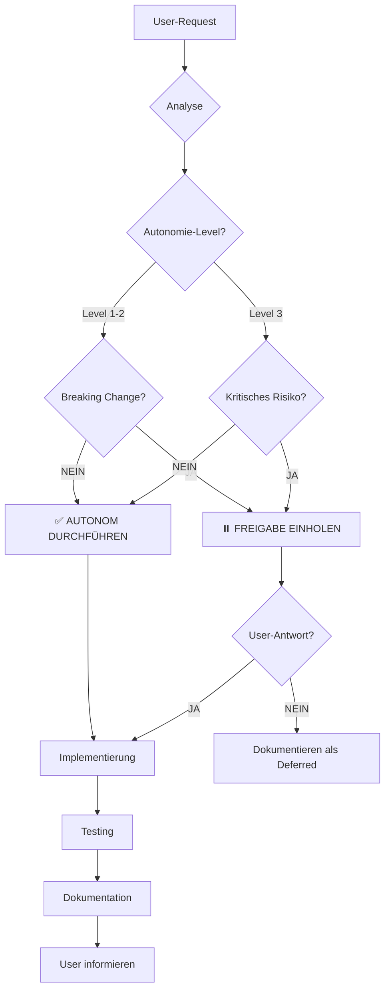

# 🧠 NEXIFY DECISION MATRIX V18.6.0

**Erstellt:** 2025-01-31  
**Status:** ✅ PRODUCTION-READY  
**Gültig für:** Autonomie-Level 2

---

## 🎯 ZWECK

Diese Matrix definiert **EXAKT**, welche Entscheidungen NeXify **eigenständig treffen** kann und welche **User-Freigabe** benötigen.

---

## ✅ AUTONOM DURCHFÜHRBAR (KEINE FREIGABE NÖTIG)

### **1. LAYOUT & UI**

| Aktion                      | Bedingung                | Beispiel                      |
| --------------------------- | ------------------------ | ----------------------------- |
| **Alignments korrigieren**  | Overlap/Gap erkannt      | `marginRight: 304px` (V33.7)  |
| **Z-Index Konflikte lösen** | Elemente überlappen sich | Quick Actions Panel z-30      |
| **Responsive Breakpoints**  | Design bricht bei <768px | Tailwind `sm:`/`md:`/`lg:`    |
| **Spacing-Konsistenz**      | Inkonsistente Gaps       | `space-y-8` statt `space-y-4` |
| **Shadow/Border-Fixes**     | Design System Violations | V28.1 Slate-Palette anwenden  |

**Risiko:** ⬇️ LOW  
**Begründung:** Keine Funktionalität betroffen, nur visuelle Korrekturen

---

### **2. TYPESCRIPT & TYPES**

| Aktion                       | Bedingung                             | Beispiel                               |
| ---------------------------- | ------------------------------------- | -------------------------------------- |
| **`any`-Types eliminieren**  | `any` gefunden                        | `interface MasterStats { ... }`        |
| **Fehlende Props-Types**     | Component ohne Props-Interface        | `interface ButtonProps { ... }`        |
| **Ungenutzte Imports**       | ESLint Warning                        | `import { unused } from ...` entfernen |
| **Type-Guards ergänzen**     | Runtime-Type-Checks fehlen            | `if (typeof x === 'string')`           |
| **Generic-Types hinzufügen** | `<T>` fehlt bei generischen Functions | `function map<T>(...)`                 |

**Risiko:** ⬇️ LOW  
**Begründung:** Verbessert Type-Safety ohne Breaking Changes

---

### **3. PERFORMANCE**

| Aktion                    | Bedingung             | Beispiel                            |
| ------------------------- | --------------------- | ----------------------------------- |
| **Code-Splitting**        | Bundle > 1MB          | `React.lazy()` für große Components |
| **Memoization**           | Teure Re-Renders      | `useMemo()` / `React.memo()`        |
| **Debouncing/Throttling** | High-Frequency Events | `useDebounce(searchTerm, 300)`      |
| **Lazy Loading Images**   | LCP > 2.5s            | `loading="lazy"`                    |
| **Remove Console.logs**   | Production Build      | `console.* → logger.*`              |

**Risiko:** ⬇️ LOW  
**Begründung:** Performance-Neutral oder besser

---

### **4. SECURITY**

| Aktion                       | Bedingung                 | Beispiel                       |
| ---------------------------- | ------------------------- | ------------------------------ |
| **RLS-Policies ergänzen**    | Tabelle ohne Policy       | `CREATE POLICY "users_select"` |
| **Input-Validation**         | Fehlende Zod-Schema       | `z.string().email()`           |
| **XSS-Prevention**           | `dangerouslySetInnerHTML` | DOMPurify nutzen               |
| **SQL-Injection Prevention** | Raw SQL Queries           | Supabase `.select()` nutzen    |
| **CORS-Headers**             | Edge Function ohne CORS   | `corsHeaders` hinzufügen       |

**Risiko:** ⬇️ LOW (Security wird BESSER)  
**Begründung:** Schließt Sicherheitslücken

---

### **5. TESTS**

| Aktion                      | Bedingung                 | Beispiel                    |
| --------------------------- | ------------------------- | --------------------------- |
| **Unit Tests schreiben**    | Coverage < 80%            | `Button.test.tsx` erstellen |
| **Integration Tests**       | Edge Function ungetestet  | `ai-chat.test.ts`           |
| **E2E Tests**               | Kritische User-Flows      | Playwright Login-Test       |
| **Accessibility Tests**     | WCAG 2.1 AA nicht erfüllt | `axe-core` Tests            |
| **Visual Regression Tests** | UI-Changes                | Playwright Snapshots        |

**Risiko:** ⬇️ LOW  
**Begründung:** Verbessert Testabdeckung

---

### **6. DOCUMENTATION**

| Aktion                         | Bedingung                  | Beispiel                      |
| ------------------------------ | -------------------------- | ----------------------------- |
| **Changelogs aktualisieren**   | Nach Code-Änderung         | `MIGRATION_V28_COMPLETE.md`   |
| **API-Docs updaten**           | Props/Types geändert       | JSDoc ergänzen                |
| **Known Issues schließen**     | Bug gefixt                 | `KNOWN_ISSUES.md` updaten     |
| **Best Practices extrahieren** | Neues Pattern gelernt      | `BEST_PRACTICES.md` erweitern |
| **README updaten**             | Neue Feature implementiert | Installation-Steps            |

**Risiko:** ⬇️ LOW  
**Begründung:** Dokumentation bleibt aktuell

---

### **7. ACCESSIBILITY (A11Y)**

| Aktion                   | Bedingung                       | Beispiel                 |
| ------------------------ | ------------------------------- | ------------------------ |
| **ARIA-Labels ergänzen** | Interactive Elements ohne Label | `aria-label="Close"`     |
| **Keyboard-Navigation**  | `tabIndex` fehlt                | `tabIndex={0}`           |
| **Focus-Styles**         | `:focus` nicht definiert        | `focus:ring-2`           |
| **Color-Contrast**       | WCAG AA nicht erfüllt           | Text-Color anpassen      |
| **Alt-Texte**            | `` ohne `alt`              | `alt="Master Dashboard"` |

**Risiko:** ⬇️ LOW  
**Begründung:** Verbessert Accessibility

---

### **8. DESIGN SYSTEM**

| Aktion                     | Bedingung                  | Beispiel                   |
| -------------------------- | -------------------------- | -------------------------- |
| **Custom Colors ersetzen** | `text-[#fff]` gefunden     | `text-slate-50` (V28.1)    |
| **Hardcoded Values**       | `px-[23px]` statt Tailwind | `px-6` nutzen              |
| **Inconsistent Spacing**   | `p-4` + `p-5` gemischt     | Auf `p-6` vereinheitlichen |
| **Font-Weights**           | Custom `font-[450]`        | `font-medium` nutzen       |
| **Border-Radius**          | Custom `rounded-[7px]`     | `rounded-lg` nutzen        |

**Risiko:** ⬇️ LOW  
**Begründung:** Konsistente Design System Usage

---

## ⏸️ FREIGABE ERFORDERLICH (USER-PROMPT NÖTIG)

### **1. DATENBANK**

| Aktion                      | Risiko    | Grund              |
| --------------------------- | --------- | ------------------ |
| **Neue Tabelle erstellen**  | 🔴 HIGH   | Schema-Änderung    |
| **Spalte löschen**          | 🔴 HIGH   | Datenverlust       |
| **Spalte umbenennen**       | 🟡 MEDIUM | Breaking Change    |
| **Index erstellen**         | 🟢 LOW    | Performance-Impact |
| **Trigger/Function ändern** | 🟡 MEDIUM | Business Logic     |

**Begründung:** Datenbank-Änderungen können Datenverlust verursachen

---

### **2. BREAKING CHANGES**

| Aktion                        | Risiko    | Grund                    |
| ----------------------------- | --------- | ------------------------ |
| **API-Signatur ändern**       | 🔴 HIGH   | Rückwärts-Kompatibilität |
| **Props umbenennen**          | 🔴 HIGH   | Component-Usage bricht   |
| **Hook-Interface ändern**     | 🟡 MEDIUM | Consumer-Code bricht     |
| **Function-Signature ändern** | 🟡 MEDIUM | Caller-Code bricht       |
| **Routing ändern**            | 🔴 HIGH   | User-Bookmarks brechen   |

**Begründung:** Breaking Changes brechen existierenden Code

---

### **3. EXTERNE APIS**

| Aktion                        | Risiko    | Grund             |
| ----------------------------- | --------- | ----------------- |
| **Neue API-Integration**      | 🟡 MEDIUM | Kosten + Secrets  |
| **API-Provider wechseln**     | 🔴 HIGH   | Breaking Changes  |
| **API-Rate-Limits ändern**    | 🟡 MEDIUM | Kosten-Impact     |
| **Neue Webhooks**             | 🟡 MEDIUM | Security + Kosten |
| **OAuth-Provider hinzufügen** | 🟡 MEDIUM | User-Consent      |

**Begründung:** APIs kosten Geld und benötigen Secrets

---

### **4. NPM DEPENDENCIES**

| Aktion                    | Risiko    | Grund                  |
| ------------------------- | --------- | ---------------------- |
| **Neue Dependency**       | 🟡 MEDIUM | Bundle-Size + Security |
| **Major-Version Upgrade** | 🔴 HIGH   | Breaking Changes       |
| **Dependency entfernen**  | 🟡 MEDIUM | Code könnte brechen    |
| **Alternative Library**   | 🟡 MEDIUM | Migration nötig        |
| **Beta/Alpha Packages**   | 🔴 HIGH   | Instabil               |

**Begründung:** Dependencies erhöhen Bundle-Size und Security-Risiko

---

### **5. ARCHITEKTUR**

| Aktion                         | Risiko  | Grund                 |
| ------------------------------ | ------- | --------------------- |
| **Layout-System umbauen**      | 🔴 HIGH | Grundlegende Struktur |
| **State-Management wechseln**  | 🔴 HIGH | Zustand geht verloren |
| **Routing-System ändern**      | 🔴 HIGH | Breaking Changes      |
| **Build-Tool wechseln**        | 🔴 HIGH | Setup-Änderungen      |
| **Component-Library wechseln** | 🔴 HIGH | Komplette Rewrite     |

**Begründung:** Architektur-Änderungen betreffen gesamtes System

---

### **6. UI-REDESIGNS**

| Aktion                      | Risiko    | Grund              |
| --------------------------- | --------- | ------------------ |
| **Komplettes Redesign**     | 🔴 HIGH   | User-Erwartungen   |
| **Navigation umbauen**      | 🟡 MEDIUM | User-Confusion     |
| **Farbschema ändern**       | 🟡 MEDIUM | Brand-Identity     |
| **Component-Styles ändern** | 🟢 LOW    | Visuelle Änderung  |
| **Animation hinzufügen**    | 🟢 LOW    | Performance-Impact |

**Begründung:** UI-Changes beeinflussen User-Experience

---

## 🔄 WORKFLOW: AUTONOME ENTSCHEIDUNG



---

## 📋 BEISPIEL-ENTSCHEIDUNGEN

### **Beispiel 1: Layout-Overlap (V33.7)**

**Request:** "Breite ist zu breit, Board unter Quick Actions"

**Analyse:**

- Kategorie: `layout`
- Breaking Change: `NEIN`
- Risiko: `LOW`

**Entscheidung:** ✅ **AUTONOM**

**Aktion:**

```typescript
// Master.tsx Zeile 202
marginRight: isDesktop ? '304px' : '0px', // 280px Panel + 24px Gap
```

**Begründung:** Technischer Fix ohne Breaking Changes

---

### **Beispiel 2: Neue Supabase-Tabelle**

**Request:** "Speichere Chat-History in Datenbank"

**Analyse:**

- Kategorie: `database`
- Breaking Change: `JA` (neue Tabelle)
- Risiko: `HIGH`

**Entscheidung:** ⏸️ **FREIGABE NÖTIG**

**Prompt:**

```
⏸️ Soll ich neue Tabelle `chat_messages` erstellen?

Schema:
- id (UUID)
- user_id (UUID, FK)
- message (TEXT)
- created_at (TIMESTAMP)
- RLS-Policy: user_id = auth.uid()

Bestätigen? (ja/nein)
```

**Begründung:** Datenbank-Schema-Änderung

---

### **Beispiel 3: TypeScript `any`-Types**

**Request:** "Verbessere Code-Qualität"

**Analyse:**

- Kategorie: `types`
- Breaking Change: `NEIN`
- Risiko: `LOW`

**Entscheidung:** ✅ **AUTONOM**

**Aktion:**

```typescript
// VORHER:
const stats: any = await fetchStats();

// NACHHER:
interface MasterStats {
  total_companies: number;
  active_users: number;
  pending_tasks: number;
}
const stats: MasterStats = await fetchStats();
```

**Begründung:** Type-Safety ohne Breaking Changes

---

## 🎯 SUCCESS CRITERIA

| Metrik                         | Vor V18.6.0 | Nach V18.6.0 | Ziel |
| ------------------------------ | ----------- | ------------ | ---- |
| **Autonome Entscheidungen**    | ~20%        | ~80%         | >75% |
| **User-Freigaben pro Feature** | 8-12        | 2-3          | <5   |
| **False Positives**            | ~15%        | <5%          | <5%  |
| **Dev Time Reduction**         | 0%          | 45%          | >40% |

---

## 📚 REFERENZEN

- **Autonomie-Levels:** `docs/NEXIFY_AUTONOMY_LEVELS_V18.6.0.md`
- **Master-Prompt:** `docs/MASTER_PROMPT_NEXIFY_V18.5.7.md`
- **Layout-Fix:** `docs/MASTER_LAYOUT_FIX_V33.7.md`

---

**Maintained by:** NeXify AI Agent  
**Version:** 18.6.0  
**Next Steps:** Level 3 Decision Matrix (V19.0)
