# Orders Specification V18.5.0

**Status:** Production-Ready  
**Letzte Aktualisierung:** 2025-10-22  
**Verantwortlich:** Pascal Courbois  
**Kategorie:** Page Specification

---

## 🎯 Übersicht

Die **Orders-Seite** ist das Herzstück von MyDispatch. Sie ermöglicht die Verwaltung aller Aufträge für Taxi, Mietwagen und Limousinenservices mit Echtzeit-Updates, intelligenter Routenplanung und vollständiger Disposition.

---

## 📊 Datenbankschema

### **Tabelle: `orders`**

```sql
CREATE TABLE public.orders (
  id UUID NOT NULL DEFAULT gen_random_uuid() PRIMARY KEY,
  order_number TEXT NOT NULL UNIQUE,
  customer_id UUID REFERENCES public.customers(id) ON DELETE SET NULL,
  driver_id UUID REFERENCES public.drivers(id) ON DELETE SET NULL,
  
  -- Auftragsstatus
  status TEXT NOT NULL DEFAULT 'pending' CHECK (status IN (
    'pending',      -- Neu eingetragen
    'confirmed',    -- Bestätigt
    'assigned',     -- Fahrer zugewiesen
    'in_progress',  -- Fahrer unterwegs/Kunde abgeholt
    'completed',    -- Abgeschlossen
    'cancelled'     -- Storniert
  )),
  
  -- Service-Typ
  service_type TEXT NOT NULL CHECK (service_type IN (
    'taxi',
    'rental',
    'limousine'
  )),
  
  -- Adressen
  pickup_address TEXT NOT NULL,
  pickup_lat DECIMAL(10, 8),
  pickup_lng DECIMAL(11, 8),
  dropoff_address TEXT NOT NULL,
  dropoff_lat DECIMAL(10, 8),
  dropoff_lng DECIMAL(11, 8),
  
  -- Zeitplanung
  pickup_time TIMESTAMP WITH TIME ZONE NOT NULL,
  estimated_dropoff_time TIMESTAMP WITH TIME ZONE,
  actual_pickup_time TIMESTAMP WITH TIME ZONE,
  actual_dropoff_time TIMESTAMP WITH TIME ZONE,
  
  -- Preisgestaltung
  estimated_price DECIMAL(10, 2),
  final_price DECIMAL(10, 2),
  currency TEXT NOT NULL DEFAULT 'EUR',
  
  -- Fahrzeugdetails
  vehicle_type TEXT CHECK (vehicle_type IN (
    'sedan',
    'suv',
    'van',
    'luxury',
    'minibus'
  )),
  passenger_count INTEGER DEFAULT 1 CHECK (passenger_count > 0),
  luggage_count INTEGER DEFAULT 0 CHECK (luggage_count >= 0),
  
  -- Zusatzinformationen
  notes TEXT,
  special_requirements TEXT,
  payment_method TEXT CHECK (payment_method IN (
    'cash',
    'card',
    'invoice',
    'prepaid'
  )),
  
  -- Tracking
  created_by UUID REFERENCES auth.users(id),
  assigned_by UUID REFERENCES auth.users(id),
  created_at TIMESTAMP WITH TIME ZONE NOT NULL DEFAULT now(),
  updated_at TIMESTAMP WITH TIME ZONE NOT NULL DEFAULT now()
);

-- Indizes für Performance
CREATE INDEX idx_orders_customer ON public.orders(customer_id);
CREATE INDEX idx_orders_driver ON public.orders(driver_id);
CREATE INDEX idx_orders_status ON public.orders(status);
CREATE INDEX idx_orders_pickup_time ON public.orders(pickup_time);
CREATE INDEX idx_orders_created_at ON public.orders(created_at DESC);

-- Auto-generate order number
CREATE OR REPLACE FUNCTION generate_order_number()
RETURNS TRIGGER AS $$
BEGIN
  NEW.order_number := 'ORD-' || TO_CHAR(now(), 'YYYYMMDD') || '-' || 
    LPAD(NEXTVAL('order_number_seq')::TEXT, 4, '0');
  RETURN NEW;
END;
$$ LANGUAGE plpgsql;

CREATE SEQUENCE IF NOT EXISTS order_number_seq;

CREATE TRIGGER set_order_number
BEFORE INSERT ON public.orders
FOR EACH ROW
WHEN (NEW.order_number IS NULL)
EXECUTE FUNCTION generate_order_number();

-- Auto-update timestamp
CREATE TRIGGER update_orders_updated_at
BEFORE UPDATE ON public.orders
FOR EACH ROW
EXECUTE FUNCTION public.update_updated_at_column();

-- RLS Policies
ALTER TABLE public.orders ENABLE ROW LEVEL SECURITY;

CREATE POLICY "Users can view orders" 
ON public.orders FOR SELECT 
USING (auth.uid() IS NOT NULL);

CREATE POLICY "Users can create orders" 
ON public.orders FOR INSERT 
WITH CHECK (auth.uid() = created_by);

CREATE POLICY "Users can update orders" 
ON public.orders FOR UPDATE 
USING (auth.uid() IS NOT NULL);

CREATE POLICY "Users can delete own orders" 
ON public.orders FOR DELETE 
USING (auth.uid() = created_by);
```

---

## 🎨 UI-Komponenten

### **1. Orders List View (Standard-Ansicht)**

```typescript
// src/pages/Orders.tsx
import { OrdersList } from "@/components/orders/OrdersList";
import { OrdersFilters } from "@/components/orders/OrdersFilters";
import { CreateOrderButton } from "@/components/orders/CreateOrderButton";

export function Orders() {
  return (
    <div className="container-safe space-y-6">
      <div className="flex justify-between items-center">
        <h1 className="text-heading">Aufträge</h1>
        <CreateOrderButton />
      </div>
      
      <OrdersFilters />
      <OrdersList />
    </div>
  );
}
```

### **2. Orders Table Component**

**Spalten:**
- Auftragsnummer (Badge mit Status-Color)
- Kunde (Name + Telefon)
- Abholung (Adresse + Zeit)
- Ziel (Adresse)
- Fahrer (Avatar + Name oder "Nicht zugewiesen")
- Status (Badge)
- Preis
- Aktionen (View/Edit/Delete)

**Features:**
- Sortierung nach allen Spalten
- Inline-Editing für Status
- Drag & Drop für Fahrer-Zuweisung
- Echtzeit-Updates via Supabase Realtime
- Export als CSV/PDF

### **3. Create/Edit Order Form**

**Form-Felder gemäß [FORM_STANDARDS_V18.5.0.md]:**
- Kunde auswählen (Autocomplete mit Search)
- Service-Typ (Radio Group: Taxi/Mietwagen/Limousine)
- Abhol-Adresse (Google Places Autocomplete)
- Ziel-Adresse (Google Places Autocomplete)
- Abholzeit (Date + Time Picker)
- Fahrzeugtyp (Select)
- Anzahl Passagiere (Number Input)
- Anzahl Gepäckstücke (Number Input)
- Zahlungsmethode (Select)
- Notizen (Textarea)
- Sonderanforderungen (Textarea)

**Validation:**
- Pflichtfelder: Kunde, Abhol-Adresse, Ziel, Abholzeit
- Abholzeit muss in Zukunft liegen (außer bei Sofort-Aufträgen)
- Passagieranzahl > 0
- Preiskalkulation automatisch bei Adresseingabe

### **4. Order Detail View**

**Sections:**
- **Header:** Order Number, Status Badge, Created Date
- **Customer Info:** Name, Phone, Email, Kundennummer
- **Trip Details:** 
  - Map mit Route (Leaflet/Mapbox)
  - Pickup & Dropoff mit Uhrzeiten
  - Geschätzte/Tatsächliche Fahrtdauer
- **Driver Info:** Avatar, Name, Fahrzeug, Telefon
- **Pricing:** Estimated vs. Final, Zahlungsmethode
- **Timeline:** Status-Änderungen mit Timestamps
- **Actions:** Edit, Assign Driver, Cancel, Invoice

---

## 🔄 Status-Workflow

```mermaid
stateDiagram-v2
    [*] --> pending: Auftrag erstellt
    pending --> confirmed: Kunde bestätigt
    pending --> cancelled: Storniert
    confirmed --> assigned: Fahrer zugewiesen
    assigned --> in_progress: Fahrer startet
    assigned --> cancelled: Storniert
    in_progress --> completed: Fahrt abgeschlossen
    in_progress --> cancelled: Abgebrochen
    completed --> [*]
    cancelled --> [*]
```



**Status-Transitions:**
- `pending → confirmed`: Manuelle Bestätigung oder automatisch nach 5 Min
- `confirmed → assigned`: Fahrer manuell oder automatisch zuweisen
- `assigned → in_progress`: Fahrer-App meldet "Start"
- `in_progress → completed`: Fahrer-App meldet "Abschluss"
- Jeder Status → `cancelled`: Kann storniert werden mit Grund

---

## 🚀 Edge Functions

### **1. Smart Route Planning**

```typescript
// supabase/functions/calculate-route/index.ts
// Input: pickup_address, dropoff_address
// Output: distance, duration, estimated_price, route_polyline
```

**Features:**
- Google Maps Directions API Integration
- Traffic-basierte Schätzungen
- Preisberechnung basierend auf Distanz + Zeit
- Alternative Routen

### **2. Auto-Assign Driver**

```typescript
// supabase/functions/auto-assign-driver/index.ts
// Input: order_id
// Output: assigned_driver_id
```

**Logik:**
- Verfügbare Fahrer in Reichweite finden
- Matching nach Fahrzeugtyp
- Ranking nach: Distanz, Bewertung, Verfügbarkeit
- Notification an Fahrer senden

### **3. Order Analytics**

```typescript
// supabase/functions/order-analytics/index.ts
// Input: date_range, filters
// Output: metrics (total_orders, revenue, avg_rating, top_drivers)
```

---

## 📱 Realtime Features

```typescript
// Enable Realtime für Orders
// In Migration:
ALTER PUBLICATION supabase_realtime ADD TABLE public.orders;

// In Component:
const channel = supabase
  .channel('orders-changes')
  .on(
    'postgres_changes',
    {
      event: '*',
      schema: 'public',
      table: 'orders',
    },
    (payload) => {
      // Update UI in Echtzeit
      queryClient.invalidateQueries(['orders']);
    }
  )
  .subscribe();
```

---

## 🎨 Design System

### **Status Colors (Semantic Tokens)**

```css
/* src/index.css */
:root {
  --status-pending: 220 13% 91%;
  --status-pending-foreground: 220 9% 46%;
  
  --status-confirmed: 221 83% 53%;
  --status-confirmed-foreground: 0 0% 100%;
  
  --status-assigned: 262 83% 58%;
  --status-assigned-foreground: 0 0% 100%;
  
  --status-in-progress: 47 96% 53%;
  --status-in-progress-foreground: 26 83% 14%;
  
  --status-completed: 142 71% 45%;
  --status-completed-foreground: 0 0% 100%;
  
  --status-cancelled: 0 84% 60%;
  --status-cancelled-foreground: 0 0% 100%;
}
```

### **Component Variants**

```typescript
// src/components/orders/OrderStatusBadge.tsx
const statusVariants = cva(
  "inline-flex items-center rounded-full px-2.5 py-0.5 text-xs font-semibold",
  {
    variants: {
      status: {
        pending: "bg-status-pending text-status-pending-foreground",
        confirmed: "bg-status-confirmed text-status-confirmed-foreground",
        assigned: "bg-status-assigned text-status-assigned-foreground",
        in_progress: "bg-status-in-progress text-status-in-progress-foreground",
        completed: "bg-status-completed text-status-completed-foreground",
        cancelled: "bg-status-cancelled text-status-cancelled-foreground",
      },
    },
  }
);
```

---

## 🧪 Testing

### **E2E Tests (Playwright)**

```typescript
// tests/orders.spec.ts
test('Create new order', async ({ page }) => {
  await page.goto('/orders');
  await page.click('text=Neuer Auftrag');
  
  // Fill form
  await page.fill('[name="customer"]', 'Max Mustermann');
  await page.fill('[name="pickup_address"]', 'Berlin Hauptbahnhof');
  await page.fill('[name="dropoff_address"]', 'Berlin Tegel');
  
  await page.click('button[type="submit"]');
  
  // Verify
  await expect(page.locator('text=Auftrag erstellt')).toBeVisible();
});

test('Filter orders by status', async ({ page }) => {
  await page.goto('/orders');
  await page.selectOption('[name="status"]', 'in_progress');
  
  // Verify filtered
  await expect(page.locator('.order-row')).toHaveCount(5);
});
```

---

## 📊 Analytics & KPIs

```typescript
// Dashboard Metrics für Orders
interface OrderMetrics {
  totalOrders: number;
  completedToday: number;
  pendingOrders: number;
  totalRevenue: number;
  avgOrderValue: number;
  completionRate: number;
  avgResponseTime: number; // Zeit bis Fahrer-Zuweisung
  customerSatisfaction: number;
}
```

---

## 🔗 Verknüpfte Dokumente

- [DRIVER_SPECIFICATION_V18.5.0.md](./DRIVER_SPECIFICATION_V18.5.0.md)
- [CUSTOMER_SPECIFICATION_V18.5.0.md](./CUSTOMER_SPECIFICATION_V18.5.0.md)
- [INVOICES_SPECIFICATION_V18.5.0.md](./INVOICES_SPECIFICATION_V18.5.0.md)
- [FORM_STANDARDS_V18.5.0.md](./FORM_STANDARDS_V18.5.0.md)
- [ASSET_MANAGEMENT_SYSTEM_V18.5.0.md](./ASSET_MANAGEMENT_SYSTEM_V18.5.0.md)

---

**Letzte Aktualisierung:** 2025-10-22 22:00 (DE)  
**Version:** 18.5.0  
**Status:** ✅ Production-Ready
