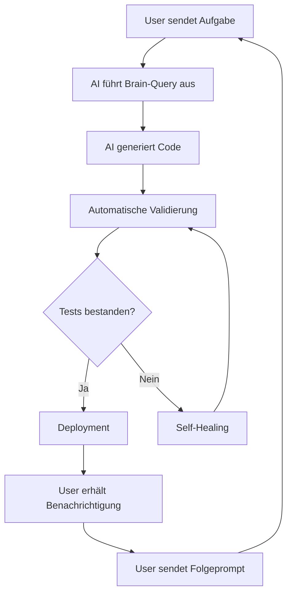

# Standard-Folgeprompt für MyDispatch V18.5.0

**Status:** Production-Ready  
**Letzte Aktualisierung:** 2025-10-22  
**Zweck:** Standardisierte Kommunikation zwischen User und AI-Agent

---

## 🎯 Zweck

Dieser Standard-Folgeprompt dient zur strukturierten, effizienten Kommunikation nach Abschluss eines Vorgangs. Er stellt sicher, dass:

- Automatische Qualitätsprüfungen durchgeführt wurden
- Die nächste Aufgabe klar definiert ist
- Feedback dokumentiert wird
- Der AI-Agent optimal arbeiten kann

---

## 📝 Standard-Template

### **Basis-Template (Copy & Paste)**

```
✅ Erledigt!

[Dein Feedback oder Bestätigungen hier]

➡️ Nächste Aufgabe: [Beschreibe die nächste Aufgabe]

---
Automatische Prüfungen:
- Brain-Query erfolgreich? [Ja/Nein]
- Design-System-Compliance? [Ja/Nein]
- Tests bestanden? [Ja/Nein]
- Dokumentation aktualisiert? [Ja/Nein]
```

---

## 🔄 Anwendungsfälle

### **1. Einfache Bestätigung + Neue Aufgabe**

```
✅ Erledigt!

Sieht gut aus.

➡️ Nächste Aufgabe: Implementiere die Driver-Seite gemäß DRIVER_SPECIFICATION_V18.5.0.md

---
Automatische Prüfungen:
- Brain-Query erfolgreich? Ja
- Design-System-Compliance? Ja
- Tests bestanden? Ja
- Dokumentation aktualisiert? Ja
```

### **2. Mit Feedback**

```
✅ Erledigt!

Die Farben sind jetzt perfekt, aber die Mobile-Ansicht sollte noch optimiert werden.

➡️ Nächste Aufgabe: Optimiere Mobile-Responsiveness der Orders-Seite

---
Automatische Prüfungen:
- Brain-Query erfolgreich? Ja
- Design-System-Compliance? Teilweise (Mobile noch anpassen)
- Tests bestanden? Ja
- Dokumentation aktualisiert? Ja
```

### **3. Fehler gefunden**

```
❌ Problem gefunden!

Fehler: Die API-Verbindung zur Routenplanung schlägt fehl.
Fehlermeldung: [Kopiere die Fehlermeldung aus der Console]

➡️ Nächste Aufgabe: Behebe den API-Fehler und teste erneut

---
Automatische Prüfungen:
- Brain-Query erfolgreich? Ja
- Design-System-Compliance? Ja
- Tests bestanden? Nein (API-Fehler)
- Dokumentation aktualisiert? Ja
```

### **4. Vollautomatischer Modus (KEIN Folgeprompt nötig)**

Wenn der AI-Agent im vollautomatischen Modus arbeitet, benötigst du KEINEN Folgeprompt. Der Agent:

- Führt automatisch Brain-Queries durch
- Validiert den Code
- Deployed bei Erfolg
- Aktiviert Self-Healing bei Fehlern

**In diesen Fällen einfach abwarten und nur eingreifen, wenn du benachrichtigt wirst.**

---

## 🚦 Wann welcher Modus?

| Situation               | Benötigst du einen Folgeprompt? | Grund                          |
| ----------------------- | ------------------------------- | ------------------------------ |
| Neue Feature-Anfrage    | ✅ Ja                           | Klare Aufgabe definieren       |
| Feedback zu Design      | ✅ Ja                           | Änderungen kommunizieren       |
| Fehler melden           | ✅ Ja                           | Problem beschreiben            |
| AI arbeitet automatisch | ❌ Nein                         | Pipeline läuft automatisch     |
| CI/CD deployed          | ❌ Nein                         | Automatische Überwachung aktiv |
| Self-Healing greift     | ❌ Nein                         | System korrigiert sich selbst  |

---

## 📊 Automatische Prüfungen (Checkliste)

### **1. Brain-Query erfolgreich?**

- Hat der AI-Agent das Knowledge-System abgefragt?
- Wurden relevante Docs gefunden?
- Logs in `brain_query_logs` vorhanden?

### **2. Design-System-Compliance?**

- Werden Semantic Tokens verwendet (`index.css`, `tailwind.config.ts`)?
- Keine Direct-Colors (`text-white`, `bg-black` etc.)?
- Shadcn-Varianten korrekt angepasst?

### **3. Tests bestanden?**

- E2E-Tests (Playwright) grün?
- TypeScript-Compiler-Fehler gelöst?
- Lighthouse-Score > 90?

### **4. Dokumentation aktualisiert?**

- Neue Features in entsprechender Spec dokumentiert?
- README.md aktualisiert?
- Changelog gepflegt?

---

## 🎯 Best Practices

### **DO's ✅**

- **Klar & präzise:** "Implementiere die Driver-Seite" statt "Mach was mit Fahrern"
- **Feedback geben:** "Farbe zu dunkel" statt nur "Nicht gut"
- **Logs beifügen:** Bei Fehlern immer Console-Logs mitschicken
- **Kontext nennen:** "In der Mobile-Ansicht" statt "Da ist was kaputt"

### **DON'Ts ❌**

- **Keine vagen Anfragen:** "Mach es schöner" ist nicht hilfreich
- **Keine Mehrfach-Aufgaben:** Eine Aufgabe pro Prompt
- **Keine Feature-Creep:** Nur das anfordern, was wirklich benötigt wird
- **Keine Duplikate:** Nicht dieselbe Aufgabe mehrfach senden

---

## 🔗 Verknüpfte Dokumente

- [LOVABLE_AI_AGENT_META_PROMPT_V18.5.0.md](./LOVABLE_AI_AGENT_META_PROMPT_V18.5.0.md) - AI-Agent Konfiguration
- [BRAIN_INTEGRATION_WORKFLOW_V18.5.0.md](./BRAIN_INTEGRATION_WORKFLOW_V18.5.0.md) - Brain-Query-System
- [VOLLAUTOMATISIERUNGS_KONZEPT_V18.5.0.md](./VOLLAUTOMATISIERUNGS_KONZEPT_V18.5.0.md) - Automatisierungsstrategie
- [AUTOMATISIERUNGS_PIPELINE_V18.5.0.md](./AUTOMATISIERUNGS_PIPELINE_V18.5.0.md) - CI/CD Pipeline

---

## 📈 Erfolgskriterien

| Metrik                          | Zielwert      | Aktuell |
| ------------------------------- | ------------- | ------- |
| Durchschnittliche Response-Zeit | < 30 Sekunden | -       |
| Erfolgsquote 1. Versuch         | > 90%         | -       |
| Manuelle Nachbesserungen        | < 10%         | -       |
| User-Zufriedenheit              | > 4.5/5       | -       |

---

## 💡 Beispiel-Workflow



---

**Letzte Aktualisierung:** 2025-10-22 21:54 (DE)  
**Version:** 18.5.0  
**Status:** ✅ Production-Ready
