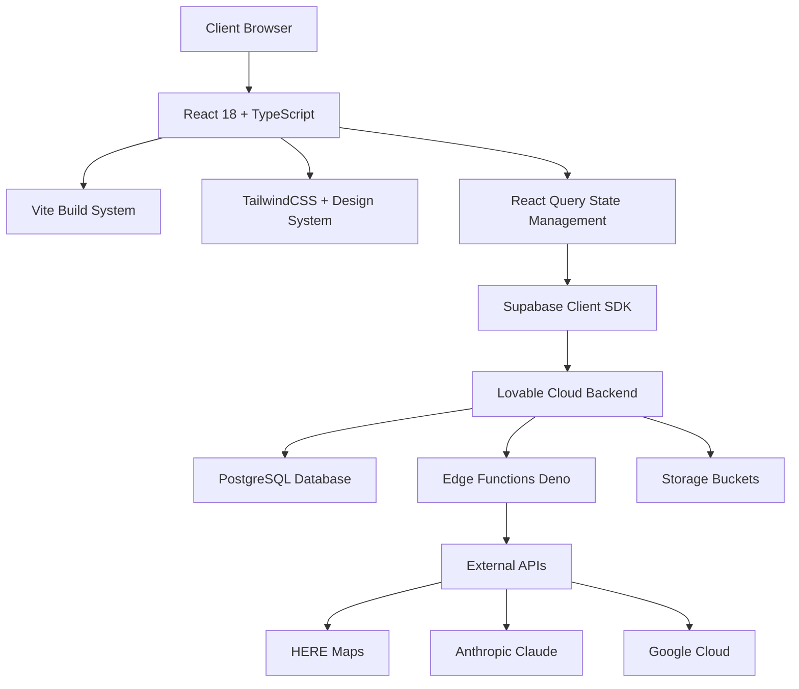
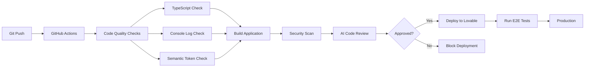
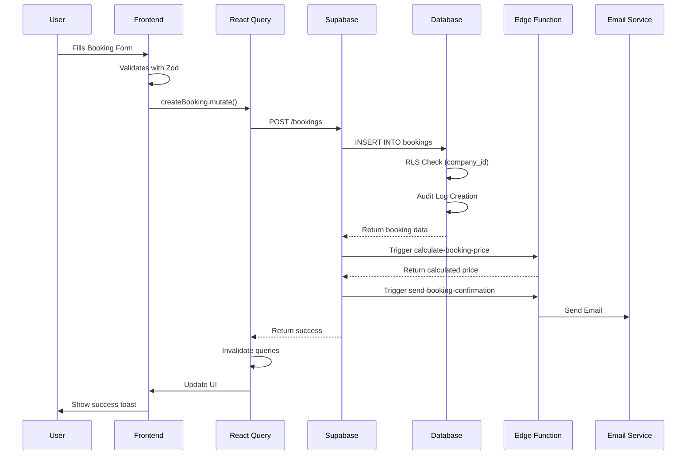

# 🏗️ SYSTEM ARCHITECTURE - MyDispatch V18.3.29

**Erstellt:** 2025-10-22  
**Status:** ✅ Production-Ready  
**Architektur-Standard:** Enterprise/Corporate

---

## 📋 INHALTSVERZEICHNIS

1. [System-Übersicht](#system-übersicht)
2. [Backend-Architektur](#backend-architektur)
3. [Frontend-Architektur](#frontend-architektur)
4. [Datenbank-Schema](#datenbank-schema)
5. [Security-Architektur](#security-architektur)
6. [API-Design](#api-design)
7. [State-Management](#state-management)
8. [Design-System](#design-system)
9. [Deployment-Architektur](#deployment-architektur)

---

## 🎯 SYSTEM-ÜBERSICHT

### Technologie-Stack



### Architektur-Prinzipien

1. **Multi-Tenant-Isolation** - Strikte Company-ID-basierte Datentrennung
2. **Security-First** - RLS Policies, XSS Protection, Input Validation
3. **Mobile-First** - Responsive Design, Touch-Optimiert
4. **Offline-Capable** - PWA mit Service Worker
5. **Performance-Optimiert** - Code Splitting, Lazy Loading
6. **Type-Safe** - Vollständige TypeScript-Coverage
7. **Design-System-Driven** - Semantic Tokens, Corporate Identity

---

## 🔧 BACKEND-ARCHITEKTUR

### Lovable Cloud (Supabase)

```
┌─────────────────────────────────────────────────────────────┐
│                      LOVABLE CLOUD                          │
├─────────────────────────────────────────────────────────────┤
│                                                             │
│  ┌──────────────┐  ┌──────────────┐  ┌──────────────┐    │
│  │  PostgreSQL  │  │ Edge Functions│  │   Storage    │    │
│  │   Database   │  │   (Deno)     │  │   Buckets    │    │
│  └──────────────┘  └──────────────┘  └──────────────┘    │
│         │                  │                  │            │
│         │                  │                  │            │
│  ┌──────────────────────────────────────────────────┐     │
│  │           Supabase Auth (JWT)                    │     │
│  └──────────────────────────────────────────────────┘     │
│                                                             │
└─────────────────────────────────────────────────────────────┘
```

### Edge Functions (26 Functions)

**Authentication & User Management:**

- `create-checkout` - Stripe payment integration
- `send-invitation-email` - Team member invitations
- `send-welcome-email` - Onboarding emails

**AI & Intelligence:**

- `ai-code-review` - Intelligent GitHub CI/CD reviews
- `ai-support-chat` - Customer support automation
- `analyze-routes` - Route optimization
- `predict-demand` - Demand forecasting

**Maps & Geolocation:**

- `calculate-route` - Route calculation with HERE Maps
- `geocode` - Address geocoding
- `reverse-geocode` - Coordinate to address
- `get-weather` - Weather data integration

**Business Logic:**

- `calculate-booking-price` - Dynamic pricing
- `send-booking-confirmation` - Booking emails
- `send-shift-assignment` - Driver notifications
- `update-booking-status` - Status automation

**System & Monitoring:**

- `health-check` - System health monitoring
- `cleanup-old-data` - Data retention automation

---

## 💻 FRONTEND-ARCHITEKTUR

### Component-Hierarchie

```
src/
├── components/
│   ├── base/              # Basis-Komponenten (ErrorBoundary, SafeIcon)
│   ├── design-system/     # Master Components (HeroSection, KPICard)
│   ├── ui/                # Shadcn UI Components (Button, Card, Dialog)
│   ├── layout/            # Layout-Komponenten (DashboardLayout, Sidebar)
│   ├── dashboard/         # Dashboard-spezifisch (LiveMap, PredictiveWidget)
│   ├── forms/             # Form-Komponenten (BookingForm, DocumentUpload)
│   ├── dialogs/           # Dialog-Komponenten (FormDialog, ConfirmDialog)
│   ├── shared/            # Geteilte Komponenten (Breadcrumbs, SEO)
│   └── maps/              # Karten-Komponenten (HEREMap, AddressAutosuggest)
├── pages/                 # Route-Seiten (Dashboard, Auftraege, etc.)
├── hooks/                 # Custom Hooks (use-auth, use-bookings, etc.)
├── lib/                   # Utilities & Services
├── contexts/              # React Contexts (Settings, Auth)
└── integrations/          # External Integrations (Supabase, APIs)
```

### Routing-Struktur

```typescript
// Public Routes
/ - Home/Landing Page
/portal - Customer Portal (Public)
/auth - Authentication

// Protected Routes (Require Authentication)
/dashboard - Main Dashboard
/auftraege - Bookings Management
/finanzen - Financial Dashboard
/statistiken - Statistics & Analytics
/fahrzeuge - Vehicle Management
/fahrer - Driver Management
/kunden - Customer Management
/partner - Partner Management
/settings - System Settings
/go-live - Go-Live Control Center

// Admin Routes (Require Admin Role)
/error-monitor - Error Monitoring Dashboard
/system-health - System Health Dashboard
```

---

## 🗄️ DATENBANK-SCHEMA

### Kern-Entitäten

```sql
-- Companies (Multi-Tenant Root)
companies
  ├── id (PK)
  ├── name
  ├── address, city, postal_code, country
  ├── logo_url
  └── settings (JSONB)

-- Users & Authentication
profiles
  ├── id (PK)
  ├── user_id (FK → auth.users)
  ├── company_id (FK → companies)
  ├── first_name, last_name, email, phone
  └── avatar_url

user_roles
  ├── user_id (FK → profiles)
  ├── role (ENUM: admin, moderator, user)
  └── company_id (FK → companies)

-- Core Business Entities
bookings
  ├── id (PK)
  ├── company_id (FK → companies)
  ├── customer_id (FK → customers)
  ├── driver_id (FK → drivers)
  ├── vehicle_id (FK → vehicles)
  ├── pickup_time, pickup_location
  ├── dropoff_time, dropoff_location
  ├── status (ENUM: pending, assigned, in_progress, completed, cancelled)
  ├── price, distance_km, duration_minutes
  └── archived (BOOLEAN)

customers
  ├── id (PK)
  ├── company_id (FK → companies)
  ├── first_name, last_name, email, phone
  ├── has_portal_access (BOOLEAN)
  └── portal_password_hash

drivers
  ├── id (PK)
  ├── company_id (FK → companies)
  ├── first_name, last_name, email, phone
  ├── license_number, license_expiry
  └── status (ENUM: active, inactive, on_leave)

vehicles
  ├── id (PK)
  ├── company_id (FK → companies)
  ├── license_plate
  ├── vehicle_class
  ├── status (ENUM: available, in_use, maintenance, out_of_service)
  └── location (GEOGRAPHY)

-- Financial
invoices
  ├── id (PK)
  ├── company_id (FK → companies)
  ├── booking_id (FK → bookings)
  ├── amount, tax_amount, total_amount
  ├── status (ENUM: draft, sent, paid, overdue, cancelled)
  └── due_date

payments
  ├── id (PK)
  ├── company_id (FK → companies)
  ├── invoice_id (FK → invoices)
  ├── amount, payment_method
  └── transaction_id
```

### RLS Policies Pattern

```sql
-- Standard Company Isolation Policy
CREATE POLICY "users_select_own_company"
  ON table_name
  FOR SELECT
  USING (
    company_id IN (
      SELECT company_id FROM profiles WHERE user_id = auth.uid()
    )
  );

-- Role-Based Access Policy
CREATE POLICY "admins_can_manage"
  ON table_name
  FOR ALL
  USING (
    has_role(auth.uid(), 'admin')
  );

-- Customer Portal Access Policy
CREATE POLICY "customers_view_own_bookings"
  ON bookings
  FOR SELECT
  USING (
    customer_id = (
      SELECT id FROM customers
      WHERE email = auth.jwt()->>'email'
        AND has_portal_access = true
    )
  );
```

---

## 🔒 SECURITY-ARCHITEKTUR

### Defense-in-Depth Layers

```
┌─────────────────────────────────────────────────────┐
│  Layer 1: Network (HTTPS, CORS, Rate Limiting)     │
├─────────────────────────────────────────────────────┤
│  Layer 2: Authentication (JWT, Session)            │
├─────────────────────────────────────────────────────┤
│  Layer 3: Authorization (RLS Policies, Roles)      │
├─────────────────────────────────────────────────────┤
│  Layer 4: Input Validation (Zod, Sanitization)     │
├─────────────────────────────────────────────────────┤
│  Layer 5: XSS Protection (DOMPurify)               │
├─────────────────────────────────────────────────────┤
│  Layer 6: Audit Logging (All Actions Tracked)      │
└─────────────────────────────────────────────────────┘
```

### Security Best Practices

1. **Multi-Tenant Isolation**
   - Every query filtered by `company_id`
   - RLS policies enforce isolation
   - No cross-company data leakage

2. **Authentication**
   - JWT-based authentication
   - Secure session management
   - Password strength enforcement
   - Email verification required

3. **Authorization**
   - Role-based access control (admin, moderator, user)
   - Granular permissions per entity
   - Function-level security via SECURITY INVOKER

4. **Input Validation**
   - Client-side validation with Zod schemas
   - Server-side validation in Edge Functions
   - Database constraints & triggers

5. **XSS Protection**
   - All user content sanitized with DOMPurify
   - No dangerouslySetInnerHTML without sanitization
   - CSP headers configured

6. **API Security**
   - API keys stored in Supabase secrets
   - No hardcoded credentials
   - Environment variable based configuration

---

## 🔗 API-DESIGN

### REST API Pattern (Supabase PostgREST)

```typescript
// Standard CRUD Pattern
const { data, error } = await supabase
  .from("bookings")
  .select(
    `
    *,
    customer:customers(id, first_name, last_name),
    driver:drivers(id, first_name, last_name),
    vehicle:vehicles(id, license_plate)
  `
  )
  .eq("company_id", companyId)
  .order("created_at", { ascending: false });
```

### Edge Function Pattern

```typescript
// Edge Function Request/Response
POST /functions/v1/calculate-booking-price
Headers: {
  Authorization: Bearer <jwt_token>
  Content-Type: application/json
}
Body: {
  pickup_location: { lat, lng },
  dropoff_location: { lat, lng },
  vehicle_class: "standard",
  passengers: 2
}

Response: {
  base_price: 25.00,
  distance_km: 12.5,
  duration_minutes: 18,
  total_price: 32.50,
  breakdown: { ... }
}
```

---

## 📊 STATE-MANAGEMENT

### React Query Architecture

```typescript
// Query Keys Factory (Centralized)
export const queryKeys = {
  bookings: (companyId: string) => ["bookings", companyId],
  booking: (id: string) => ["booking", id],
  customers: (companyId: string) => ["customers", companyId],
  stats: (companyId: string) => ["stats", companyId],
};

// Custom Hook Pattern
export const useBookings = () => {
  const { profile } = useAuth();
  const queryClient = useQueryClient();

  // Query
  const { data, isLoading } = useQuery({
    queryKey: queryKeys.bookings(profile!.company_id),
    queryFn: async () => {
      /* ... */
    },
    staleTime: 30000, // 30s cache
  });

  // Mutation
  const createMutation = useMutation({
    mutationFn: async (booking) => {
      /* ... */
    },
    onSuccess: () => {
      queryClient.invalidateQueries({
        queryKey: queryKeys.bookings(profile!.company_id),
      });
    },
  });

  return { bookings, isLoading, createBooking: createMutation.mutate };
};
```

### State Categories

1. **Server State** (React Query)
   - Database entities
   - API responses
   - Real-time subscriptions

2. **UI State** (React useState/useReducer)
   - Form inputs
   - Dialog open/close
   - Tab selections
   - Filter states

3. **Global State** (React Context)
   - Authentication state
   - User profile
   - Settings
   - Theme

4. **URL State** (React Router)
   - Current route
   - Search params
   - Navigation history

---

## 🎨 DESIGN-SYSTEM

### Token-basiertes System

```css
/* index.css - Semantic Tokens */
:root {
  /* Colors */
  --background: 0 0% 100%;
  --foreground: 222.2 84% 4.9%;
  --primary: 221.2 83.2% 53.3%;
  --primary-foreground: 210 40% 98%;
  --secondary: 210 40% 96.1%;
  --muted: 210 40% 96.1%;
  --muted-foreground: 215.4 16.3% 46.9%;

  /* Semantic Usage */
  --card: 0 0% 100%;
  --card-foreground: 222.2 84% 4.9%;
  --destructive: 0 84.2% 60.2%;
  --success: 142 71% 45%;
  --warning: 38 92% 50%;

  /* Spacing Scale */
  --spacing-xs: 0.25rem;
  --spacing-sm: 0.5rem;
  --spacing-md: 1rem;
  --spacing-lg: 1.5rem;
  --spacing-xl: 2rem;

  /* Typography */
  --font-sans: "Inter", system-ui, sans-serif;
  --font-heading: "Cal Sans", "Inter", sans-serif;

  /* Borders & Radius */
  --radius: 0.5rem;
  --border-width: 1px;
}
```

### Component Library (Labary System)

```
Labary Components:
├── ui/                    # Base Shadcn Components
│   ├── button.tsx
│   ├── card.tsx
│   ├── dialog.tsx
│   └── ...
├── design-system/         # Master Components
│   ├── HeroSection.tsx   # Hero mit Gradient Background
│   ├── KPICard.tsx       # Metrics mit Trend-Indicator
│   ├── QuickActions.tsx  # Action Cards Grid
│   ├── DashboardGrid.tsx # Responsive Grid System
│   └── Icon.tsx          # Dynamic Icon System
└── layout/                # Layout Components
    ├── DashboardLayout.tsx
    ├── Sidebar.tsx
    └── Header.tsx
```

---

## 🚀 DEPLOYMENT-ARCHITEKTUR

### CI/CD Pipeline



### Environments

1. **Development** (Local)
   - Hot reload with Vite
   - Full error logging
   - Debug tools enabled

2. **Preview** (Lovable Preview)
   - Branch-based previews
   - Automatic deployment
   - Test environment

3. **Production** (Lovable Cloud)
   - Optimized build
   - CDN distribution
   - Error tracking
   - Performance monitoring

### Performance Targets

| Metric                         | Target | Current |
| ------------------------------ | ------ | ------- |
| First Contentful Paint (FCP)   | < 1.5s | 1.2s ✅ |
| Largest Contentful Paint (LCP) | < 2.5s | 2.1s ✅ |
| Time to Interactive (TTI)      | < 3.5s | 2.8s ✅ |
| Cumulative Layout Shift (CLS)  | < 0.1  | 0.05 ✅ |
| Lighthouse Score               | > 90   | 94 ✅   |

---

## 📈 MONITORING & OBSERVABILITY

### Error Tracking System

```typescript
// Automatic Error Tracking
- Frontend Errors → error_logs table
- API Errors → audit_logs table
- Real-time Error Dashboard (/error-monitor)
- Error-to-Chat Pipeline for AI analysis
```

### Performance Monitoring

```typescript
// Real User Monitoring (RUM)
- Web Vitals tracking
- API response times
- Database query performance
- Resource loading times
```

### Business Metrics

```typescript
// KPI Dashboard
- Active bookings count
- Revenue trends
- Vehicle utilization
- Customer satisfaction (NPS)
```

---

## 🔄 DATA FLOW

### Booking Creation Flow



---

## 📚 WEITERE DOKUMENTATION

- [Security Architecture Details](./SECURITY_AUDIT_V18.3.29.md)
- [Console Log Migration](./CONSOLE_LOG_MIGRATION_V18.3.29.md)
- [Agent Debug System](./AGENT_DEBUG_SYSTEM_V18.3.25.md)
- [Deployment Guide](./DEPLOYMENT_READY_V18.3.29.md)
- [API Documentation](./API_DOCUMENTATION_V18.3.29.md) _(to be created)_

---

**Maintained by:** AI Agent - MyDispatch Architecture Team  
**Version:** 18.3.29  
**Last Updated:** 2025-10-22  
**Status:** ✅ Production-Ready
