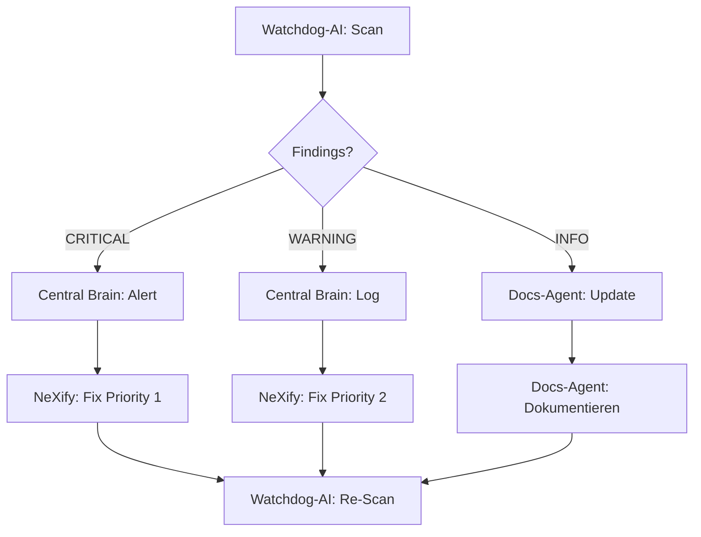

# WATCHDOG-AI ARCHITECTURE V18.5.1

**Status:** 🔄 IN DEVELOPMENT  
**Datum:** 2025-10-24  
**Zweck:** 24/7 System-Überwachung für MyDispatch  
**AI-Modell:** Claude Sonnet 4.5 (via Lovable AI Gateway)

---

## 🎯 MISSION

Die **Watchdog-AI** überwacht das gesamte MyDispatch-System 24/7 und stellt sicher, dass:
- ✅ Alle Vorgaben eingehalten werden (Design, Layout, Mobile-First, Legal)
- ✅ Keine Fehler unbemerkt bleiben
- ✅ Performance-Budget eingehalten wird (< 3s Ladezeit, < 1.5MB Bundle)
- ✅ Security-Standards gewährleistet sind (RLS, DSGVO, AI Act)
- ✅ Code-Qualität konstant hoch bleibt (TypeScript, Tests, Best Practices)

---

## 🏗️ SYSTEM-ARCHITEKTUR

### 1. Watchdog-AI Edge Function

**File:** `supabase/functions/watchdog-monitor/index.ts`

```typescript
POST /functions/v1/watchdog-monitor
{
  "action": "scan" | "report" | "alert",
  "scope": "full" | "frontend" | "backend" | "docs" | "tests",
  "lastScan": "2025-10-24T09:00:00Z"
}

Response:
{
  "status": "ok" | "warning" | "critical",
  "findings": [
    {
      "severity": "info" | "warning" | "critical",
      "category": "design" | "security" | "performance" | "legal",
      "message": "...",
      "location": "file:line",
      "recommendation": "..."
    }
  ],
  "metrics": {
    "bundleSize": "1.2MB",
    "loadTime": "2.4s",
    "testCoverage": "65%",
    "rlsPolicies": 15
  }
}
```

### 2. Zentrales Brain (Monitoring Hub)

**File:** `supabase/functions/central-brain/index.ts`

Das **Central Brain** orchestriert alle AI-Agenten:
- **NeXify** (Lead AI Development Agent)
- **Docs-Agent** (Dokumentations-Management)
- **Watchdog-AI** (System-Überwachung)

```typescript
POST /functions/v1/central-brain
{
  "command": "status" | "sync" | "deploy" | "rollback",
  "agents": ["nexify", "docs", "watchdog"]
}

Response:
{
  "nexifyStatus": { activeTask: "...", progress: 80 },
  "docsStatus": { lastSync: "2025-10-24T09:45:00Z", docsUpToDate: true },
  "watchdogStatus": { lastScan: "2025-10-24T09:30:00Z", findings: 2 },
  "systemHealth": "ok" | "degraded" | "critical"
}
```

### 3. Monitoring Script (Cron Job)

**File:** `supabase/functions/monitoring-cron/index.ts`

Läuft automatisch alle 30 Minuten:
1. Ruft Watchdog-AI auf (`action: "scan"`)
2. Speichert Ergebnisse in `monitoring_logs` Tabelle
3. Bei CRITICAL-Findings → Alarm an Central Brain
4. Central Brain → Benachrichtigt NeXify

---

## 🔍 ÜBERWACHUNGS-BEREICHE

### Frontend Monitoring

**Checks:**
- ✅ Direct Colors verwendet? (text-white, bg-black verboten)
- ✅ Mobile-First eingehalten? (Touch-Targets ≥ 44px)
- ✅ Semantic Tokens verwendet? (bg-primary, text-foreground)
- ✅ Layout Freeze respektiert? (Index.tsx, Auftraege.tsx)
- ✅ Hero-Bereiche korrekt? (Tailwind CSS, keine inline styles)

**Tools:**
- Playwright E2E Tests (automatisch)
- Regex-Scans auf Dateien
- Screenshot-Vergleiche (Visual Regression)

### Backend Monitoring

**Checks:**
- ✅ RLS-Policies auf allen Tabellen?
- ✅ API-Keys sicher gespeichert? (LOVABLE_API_KEY, etc.)
- ✅ Edge Functions deployed & funktional?
- ✅ Database Migrations ohne Fehler?
- ✅ Realtime-Subscriptions aktiv?

**Tools:**
- Supabase Linter
- Security Scanner
- Edge Function Health Checks

### Documentation Monitoring

**Checks:**
- ✅ Alle Docs auf V18.5.1 aktualisiert?
- ✅ Veraltete Versionen (V18.3) archiviert?
- ✅ Design-Referenzen konsistent?
- ✅ FEHLER_LOG aktuell?
- ✅ Keine widersprüchlichen Anweisungen?

**Tools:**
- Docs-Agent (manage-docs Edge Function)
- Version-Checker Script
- Cross-Reference Validator

### Testing Monitoring

**Checks:**
- ✅ E2E Tests laufen erfolgreich?
- ✅ Test Coverage ≥ 70%?
- ✅ Keine flakey Tests?
- ✅ CI/CD Pipeline grün?
- ✅ Performance Budget eingehalten?

**Tools:**
- Playwright Test Runner
- Coverage Reporter
- Bundle Analyzer

---

## 🚨 ALARM-SYSTEM

### Severity Levels

| Level | Beschreibung | Aktion |
|-------|--------------|--------|
| **INFO** | Hinweise, Best-Practice-Vorschläge | Logging, kein Alarm |
| **WARNING** | Potenzielle Probleme, nicht kritisch | Benachrichtigung an NeXify |
| **CRITICAL** | Fehler, System-Integrität gefährdet | Sofortiger Alarm, Auto-Rollback prüfen |

### Alarm-Trigger (CRITICAL)

- ❌ **RLS fehlt** auf Tabelle mit User-Daten
- ❌ **Direct Colors** in mehr als 5 Komponenten
- ❌ **Mobile Touch-Targets** < 44px in kritischen Bereichen
- ❌ **Bundle Size** > 2MB (Limit überschritten)
- ❌ **Load Time** > 5s (Performance kritisch)
- ❌ **DSGVO-Verstoß** (fehlende Datenschutz-Hinweise)
- ❌ **Layout Freeze Broken** (Index.tsx, Auftraege.tsx verändert)

---

## 🔄 INTER-AGENT-COMMUNICATION

### Workflow



### Sync-Protocol

**Alle 30 Minuten:**
1. **Watchdog-AI** → Scan durchführen
2. **Central Brain** → Ergebnisse aggregieren
3. **NeXify** → Status abrufen, Fixes planen
4. **Docs-Agent** → Erkenntnisse dokumentieren

**Bei CRITICAL Findings:**
1. **Watchdog-AI** → Sofort an Central Brain melden
2. **Central Brain** → NeXify benachrichtigen (Priority 1)
3. **NeXify** → Fix innerhalb 1 Stunde
4. **Watchdog-AI** → Re-Scan nach Fix

---

## 📊 MONITORING-DASHBOARD

### Database Schema

```sql
CREATE TABLE monitoring_logs (
  id UUID PRIMARY KEY DEFAULT gen_random_uuid(),
  scan_timestamp TIMESTAMPTZ NOT NULL DEFAULT now(),
  agent VARCHAR(50) NOT NULL, -- 'watchdog' | 'docs' | 'nexify'
  scope VARCHAR(50) NOT NULL, -- 'frontend' | 'backend' | 'docs' | 'tests'
  status VARCHAR(20) NOT NULL, -- 'ok' | 'warning' | 'critical'
  findings JSONB,
  metrics JSONB,
  created_at TIMESTAMPTZ NOT NULL DEFAULT now()
);

CREATE INDEX idx_monitoring_logs_timestamp ON monitoring_logs(scan_timestamp DESC);
CREATE INDEX idx_monitoring_logs_status ON monitoring_logs(status);
```

### Dashboard UI (Admin-Bereich)

**Route:** `/admin/monitoring`

**Features:**
- 📊 Real-Time System Health
- 🔍 Latest Findings (letzten 24h)
- 📈 Trend-Charts (Bundle Size, Load Time, Test Coverage)
- 🚨 Active Alerts
- 📋 Agent Status (NeXify, Docs-Agent, Watchdog-AI)

---

## 🚀 IMPLEMENTATION ROADMAP

### Phase 1: Foundation (BATCH 6)
- [ ] `watchdog-monitor` Edge Function entwickeln
- [ ] `central-brain` Edge Function entwickeln
- [ ] Database Schema erstellen (`monitoring_logs`)
- [ ] Basic Scans implementieren (Frontend, Backend)

### Phase 2: Integration (BATCH 7)
- [ ] Cron Job Setup (alle 30min)
- [ ] Alarm-System implementieren
- [ ] Inter-Agent-Communication testen
- [ ] Monitoring-Dashboard UI

### Phase 3: Optimization (BATCH 8)
- [ ] Visual Regression Tests
- [ ] Advanced Metrics (Code Coverage, Bundle Analysis)
- [ ] Auto-Rollback bei CRITICAL Errors
- [ ] Slack/Email Notifications

---

## 🎓 SUCCESS METRICS

| Metrik | Ziel | Status |
|--------|------|--------|
| **Uptime** | 99.9% | 🔄 Monitoring |
| **False Positives** | < 5% | 🔄 TBD |
| **Response Time** | < 1h (CRITICAL) | 🔄 TBD |
| **Scan Coverage** | 100% Codebase | 🔄 TBD |
| **Alert Accuracy** | > 95% | 🔄 TBD |

---

## 🔐 SECURITY

### API-Keys

- `LOVABLE_API_KEY` (Watchdog-AI, Docs-Agent)
- `SUPABASE_SERVICE_ROLE_KEY` (Central Brain, Admin-Access)

### Permissions

- Watchdog-AI: **READ-ONLY** auf Code, Docs, Database
- Central Brain: **ADMIN-ACCESS** (für Rollbacks)
- NeXify: **FULL-ACCESS** (Development)

---

**Version:** 18.5.1  
**Status:** 🔄 In Development  
**Nächste Review:** BATCH 6 Implementation
