```mermaid
graph TD
    A[Kunde öffnet Portal] --> B[Wählt Abhol-/Zieladresse]
    B --> C[Wählt Datum/Zeit]
    C --> D[Zeige Preisvorschau]
    D --> E{Bestätigung?}
    E -->|Nein| B
    E -->|Ja| F[Erstelle Booking]
    F --> G[Status: pending]
    G --> H[Benachrichtige Disponenten]
    H --> I[Auto-Assign via N8N]
```

```mermaid
graph TD
    A[User wählt Datei] --> B{Validierung}
    B -->|Fehler| C[Zeige Fehler]
    B -->|OK| D[Upload zu Supabase Storage]
    D --> E[Erstelle Document-Record]
    E --> F{Expiry-Date?}
    F -->|Ja| G[Erstelle Expiry-Reminder]
    F -->|Nein| H[Fertig]
    G --> I[Update Entity-Status]
```

# WORKFLOW AUTOMATION - MyDispatch V18.5.0

**Status**: ✅ PRODUCTION-READY  
**Version**: 18.5.0  
**Letzte Aktualisierung**: 2025-10-22

---

## 📋 INHALTSVERZEICHNIS

1. [Authentifizierungs-Workflows](#1-authentifizierungs-workflows)
2. [Buchungs-Workflows](#2-buchungs-workflows)
3. [Fahrer-Workflows](#3-fahrer-workflows)
4. [Kunden-Workflows](#4-kunden-workflows)
5. [Partner-Workflows](#5-partner-workflows)
6. [Dokumenten-Workflows](#6-dokumenten-workflows)
7. [Payment-Workflows](#7-payment-workflows)
8. [N8N-Integration-Workflows](#8-n8n-integration-workflows)
9. [E-Mail-Trigger-Matrix](#9-e-mail-trigger-matrix)
10. [Fehlerbehandlung & Retry-Logik](#10-fehlerbehandlung--retry-logik)

---

## 1. AUTHENTIFIZIERUNGS-WORKFLOWS

### 1.1 Registrierungs-Workflow

**Trigger**: Benutzer füllt Registrierungsformular aus (`/auth`)

**Ablauf**:



```mermaid
graph TD
    A[User füllt Formular] --> B{Validierung}
    B -->|Fehler| C[Zeige Fehler]
    B -->|OK| D[Supabase signUp]
    D --> E{Auto-Confirm?}
    E -->|Ja| F[Erstelle Company]
    E -->|Nein| G[Sende Bestätigungs-Mail]
    F --> H[Erstelle Profile]
    H --> I[Weise admin-Rolle zu]
    I --> J[Sende Willkommens-Mail]
    J --> K[Redirect zu Dashboard]
    G --> L[Zeige Hinweis: Check E-Mail]
```

**Edge Function**: `supabase/functions/send-welcome-email/`

**E-Mail-Template**: `registrationConfirmTemplate` (siehe `src/lib/email-templates.ts`)

**Datenbank-Trigger**: `handle_new_user()` (automatisch bei neuem Auth-User)

**Validierung**:

- E-Mail: Zod Email-Validator
- Passwort: Min. 8 Zeichen, `validateSecurePassword()` aus `src/lib/password-validation.ts`
- Company-Name: Min. 3 Zeichen, Max. 100 Zeichen
- Tax-ID: Optional, aber empfohlen

**Fehlerbehandlung**:

- **Duplikat-E-Mail**: Toast mit Hinweis "E-Mail bereits registriert"
- **Schwaches Passwort**: Zeige Passwort-Stärke-Anzeige mit Feedback
- **Netzwerkfehler**: Retry mit Exponential Backoff (3x)

**Security-Checks**:

- ✅ CSRF-Protection via Supabase
- ✅ Rate-Limiting: Max. 5 Registrierungen pro IP/Stunde
- ✅ Leaked-Password-Check (clientseitig via `password-validation.ts`)

---

### 1.2 Passwort-Vergessen-Workflow

**Trigger**: Benutzer klickt "Passwort vergessen" (`/auth`, `/driver/forgot-password`)

**Ablauf**:



```mermaid
graph TD
    A[User gibt E-Mail ein] --> B{E-Mail existiert?}
    B -->|Nein| C[Zeige generische Nachricht]
    B -->|Ja| D[Generiere Reset-Token]
    D --> E[Sende Reset-Mail]
    E --> F[User klickt Link]
    F --> G[Redirect zu /reset-password]
    G --> H[User gibt neues Passwort ein]
    H --> I{Validierung}
    I -->|Fehler| J[Zeige Fehler]
    I -->|OK| K[Update Passwort]
    K --> L[Sende Bestätigungs-Mail]
    L --> M[Redirect zu /auth]
```

**Edge Function**: `supabase/functions/send-password-reset/`

**E-Mail-Template**: `passwordResetTemplate` (siehe `src/lib/email-templates.ts`)

**Supabase-API**:

```typescript
const { error } = await supabase.auth.resetPasswordForEmail(email, {
  redirectTo: `${window.location.origin}/reset-password`,
});
```

**Security-Checks**:

- ✅ Token-Expiry: 24 Stunden (Supabase-Default)
- ✅ Rate-Limiting: Max. 3 Resets pro E-Mail/Stunde
- ✅ Generische Erfolgsmeldung (Information Disclosure Prevention)

**Komponenten**:

- Frontend: `src/pages/driver-app/DriverForgotPassword.tsx`
- Auth-Hook: `src/hooks/use-auth.tsx`

---

### 1.3 E-Mail-Verifizierungs-Workflow

**Trigger**: Neue Registrierung mit `auto_confirm_email = false`

**Ablauf**:


**Konfiguration**:

```typescript
// Supabase Auth Settings
{
  "DISABLE_SIGNUP": false,
  "ENABLE_SIGNUP": true,
  "SITE_URL": "https://your-app.lovable.app",
  "MAILER_AUTOCONFIRM": true // ✅ Für Development/Testing
}
```

**Deployment-Hinweis**:

- ⚠️ Production: `MAILER_AUTOCONFIRM = false` für regulierte Branchen
- ✅ Development: `MAILER_AUTOCONFIRM = true` für schnelles Testing

---

## 2. BUCHUNGS-WORKFLOWS

### 2.1 Buchungserstellungs-Workflow

**Trigger**: Benutzer erstellt neue Buchung (`/auftraege`, Landingpage-Widget, Kunden-Portal)

**Ablauf**:


**Edge Function**: `supabase/functions/create-booking/`

**N8N-Workflow**: "Automatische Fahrer-Zuweisung" (siehe Abschnitt 8.1)

**E-Mail-Template**: `bookingConfirmationTemplate`

**Validierung** (siehe `src/lib/validation-schemas.ts`):

```typescript
const bookingSchema = z.object({
  pickup_address: z.string().min(5).max(500),
  dropoff_address: z.string().min(5).max(500),
  pickup_time: z.date().min(new Date()), // Zukunft
  passengers: z.number().min(1).max(8),
  luggage: z.number().min(0).max(8),
  special_requests: z.string().max(1000).optional(),
});
```

**Database-Trigger**: `validate_booking_input()` (siehe Supabase Functions)

**Security-Checks**:

- ✅ `company_id` Filter (Multi-Tenant)
- ✅ Input-Längen-Limits (DoS-Prevention)
- ✅ Pickup-Time >= NOW() - 5 Minuten

---

### 2.2 Buchungsbestätigungs-Workflow

**Trigger**: Disponent weist Fahrer zu

**Ablauf**:



```mermaid
graph TD
    A[Disponent wählt Fahrer] --> B{Fahrer verfügbar?}
    B -->|Nein| C[Zeige Warnung]
    B -->|Ja| D[Update Booking]
    D --> E[Status: confirmed]
    E --> F[Sende Mail an Kunde]
    F --> G[Sende Push an Fahrer]
    G --> H[Update Fahrer-Shift]
```

**E-Mail-Template**: `bookingConfirmationTemplate` (mit Fahrer-Details)

**Push-Notification** (via Fahrer-Portal):

```typescript
// supabase/functions/send-driver-notification/
{
  title: "Neuer Auftrag zugewiesen",
  body: `${booking.pickup_address} → ${booking.dropoff_address}`,
  data: { booking_id: booking.id }
}
```

---

### 2.3 Buchungsstornierung-Workflow

**Trigger**: Kunde/Disponent storniert Buchung

**Ablauf**:


**E-Mail-Template**: Neu erstellen: `bookingCancellationTemplate`

**Stornogebühren-Logik**:

```typescript
const getCancellationFee = (pickup_time: Date, cancelled_at: Date) => {
  const hoursUntilPickup = (pickup_time - cancelled_at) / (1000 * 60 * 60);

  if (hoursUntilPickup < 2) return 1.0; // 100%
  if (hoursUntilPickup < 24) return 0.5; // 50%
  return 0.0; // Kostenlos
};
```

---

## 3. FAHRER-WORKFLOWS

### 3.1 Fahrer-Einladungs-Workflow

**Trigger**: Disponent lädt neuen Fahrer ein (`/fahrer`)

**Ablauf**:



```mermaid
graph TD
    A[Disponent gibt Fahrer-Daten ein] --> B[Generiere temporäres Passwort]
    B --> C[Erstelle Driver-Record]
    C --> D[Erstelle Auth-User]
    D --> E[Weise driver-Rolle zu]
    E --> F[Sende Einladungs-Mail]
    F --> G[Fahrer klickt Link]
    G --> H[First-Login: Passwort ändern erzwungen]
```

**Edge Function**: `supabase/functions/invite-driver/`

**E-Mail-Template**: `driverInvitationTemplate` (siehe `src/lib/email-templates.ts`)

**Temporäres Passwort**:

```typescript
const generateTempPassword = () => {
  const chars = "ABCDEFGHJKLMNPQRSTUVWXYZabcdefghijkmnpqrstuvwxyz23456789!@#$%";
  return Array.from(crypto.getRandomValues(new Uint8Array(12)))
    .map((x) => chars[x % chars.length])
    .join("");
};
```

**Security-Checks**:

- ✅ Temp-Passwort: 12 Zeichen, gemischt
- ✅ First-Login-Flag: `requires_password_change = true`
- ✅ Temp-Passwort-Expiry: 7 Tage

---

### 3.2 Fahrer-Onboarding-Workflow

**Trigger**: Fahrer meldet sich erstmals an

**Ablauf**:


**Komponenten**:

- `src/pages/driver-app/DriverOnboarding.tsx` (neu erstellen)
- Stepper-Component mit 4 Schritten

**Pflicht-Dokumente**:

1. Personalausweis
2. Führerschein
3. P-Schein (Personenbeförderungsschein)
4. Fahrzeugschein (falls eigenes Fahrzeug)

---

### 3.3 Schichtverwaltungs-Workflow

**Trigger**: Fahrer ändert Verfügbarkeit im Fahrer-Portal

**Ablauf**:



```mermaid
graph TD
    A[Fahrer öffnet Schichtplan] --> B[Wählt Datum/Zeit]
    B --> C{Überschneidung?}
    C -->|Ja| D[Zeige Warnung]
    C -->|Nein| E[Erstelle Shift-Record]
    E --> F[Benachrichtige Disponenten]
    F --> G{Auto-Assign Bookings?}
    G -->|Ja| H[N8N: Match verfügbare Aufträge]
```

**Database-Function**: `can_edit_shift()` (siehe Supabase Functions)

**Bearbeitungsrechte**:

- Fahrer: Nur heutiger Tag
- Disponent: Letzten 10 Tage

---

## 4. KUNDEN-WORKFLOWS

### 4.1 Kunden-Einladungs-Workflow

**Trigger**: Disponent lädt Firmenkunden ein

**Ablauf**:


**E-Mail-Template**: `customerInvitationTemplate` (siehe `src/lib/email-templates.ts`)

**Tarif-Check**:

- ✅ Kunden-Portal nur für Business+ / Enterprise

---

### 4.2 Kunden-Buchungs-Workflow (Self-Service)

**Trigger**: Kunde bucht über Kunden-Portal

**Ablauf**:



**Komponenten**:

- `src/pages/customer-portal/CreateBooking.tsx` (neu erstellen)
- Integration mit Landingpage-Widget-Code

---

## 5. PARTNER-WORKFLOWS

### 5.1 Partner-Anfrage-Workflow

**Trigger**: Company A sendet Partner-Anfrage an Company B

**Ablauf**:


**E-Mail-Template**: `partnerRequestTemplate` (siehe `src/lib/email-templates.ts`)

**Database-Functions**:

- `get_partner_drivers()` - Listet Partner-Fahrer
- `get_partner_vehicles()` - Listet Partner-Fahrzeuge

**Security-Checks**:

- ✅ Beide Companies müssen aktiv sein
- ✅ Duplikat-Check: Keine doppelten Partner-Connections
- ✅ `company_id` Filter bei Ressourcen-Queries

---

### 5.2 Partner-Ressourcen-Sharing-Workflow

**Trigger**: Disponent bucht Partner-Fahrzeug/-Fahrer

**Ablauf**:


**Revenue-Split-Logik**:

```typescript
const calculateRevenueSplit = (price: number, partnerConfig: PartnerConnection) => {
  return {
    own_company: price * (1 - partnerConfig.revenue_split_percentage),
    partner_company: price * partnerConfig.revenue_split_percentage,
  };
};
```

---

## 6. DOKUMENTEN-WORKFLOWS

### 6.1 Dokumenten-Ablauf-Erinnerungs-Workflow

**Trigger**: Cron-Job (täglich 06:00 Uhr)

**Ablauf**:


**Edge Function**: `supabase/functions/check-document-expiry/`

**E-Mail-Template**: `documentExpiryTemplate` (siehe `src/lib/email-templates.ts`)

**Database-Trigger**: `create_expiry_reminder()`, `create_p_schein_reminder()`

**Cron-Schedule** (Supabase pg_cron):

```sql
SELECT cron.schedule(
  'check-document-expiry',
  '0 6 * * *', -- Täglich 06:00 Uhr
  $$SELECT net.http_post(
    url := 'https://your-project.supabase.co/functions/v1/check-document-expiry',
    headers := '{"Authorization": "Bearer ' || current_setting('app.service_role_key') || '"}'::jsonb
  )$$
);
```

**Reminder-Schwellen**:

- 90 Tage vorher: Info-Mail
- 60 Tage vorher: Warning-Mail
- 30 Tage vorher: Urgent-Mail
- 7 Tage vorher: Critical-Mail + Push-Notification
- 0 Tage (abgelaufen): Admin-Alert + Fahrer/Fahrzeug deaktivieren

---

### 6.2 Dokumenten-Upload-Workflow

**Trigger**: Benutzer lädt neues Dokument hoch

**Ablauf**:



**Validierung**:

```typescript
const documentSchema = z.object({
  file: z.instanceof(File)
    .refine(f => f.size <= 10 * 1024 * 1024, "Max. 10MB")
    .refine(f => ['application/pdf', 'image/jpeg', 'image/png'].includes(f.type),
      "Nur PDF, JPG, PNG erlaubt"),
  document_type: z.enum(['fuehrerschein', 'personalausweis', 'p_schein', ...]),
  expiry_date: z.date().min(new Date()).optional()
});
```

**Storage-Bucket**: `documents` (public read, RLS-protected)

**Pfad-Struktur**:

```
documents/
  ├── {company_id}/
  │   ├── drivers/
  │   │   └── {driver_id}/
  │   │       └── {document_type}_{timestamp}.pdf
  │   ├── vehicles/
  │   └── company/
```

---

## 7. PAYMENT-WORKFLOWS

### 7.1 Rechnungserstellungs-Workflow

**Trigger**: Buchung abgeschlossen (Status: completed)

**Ablauf**:


**Edge Function**: `supabase/functions/generate-invoice-pdf/`

**E-Mail-Template**: Neu erstellen: `invoiceEmailTemplate`

**PDF-Generation**:

- Bibliothek: `jsPDF` oder `pdfmake`
- Template: Company-Logo, Rechnungsnummer, Positionen, MwSt., Zahlungsziel

---

### 7.2 Zahlungserinnerungs-Workflow

**Trigger**: Cron-Job (täglich 08:00 Uhr)

**Ablauf**:


**Edge Function**: `supabase/functions/send-payment-reminder/`

**E-Mail-Templates**:

- `paymentReminder1Template` (freundlich)
- `paymentReminder2Template` (eindringlich)
- `paymentReminder3Template` (Inkasso-Warnung)

---

### 7.3 Stripe-Checkout-Workflow

**Trigger**: Kunde wählt "Jetzt bezahlen" bei Rechnung

**Ablauf**:



```mermaid
graph TD
    A[Kunde klickt Bezahlen] --> B[Erstelle Stripe Checkout-Session]
    B --> C[Redirect zu Stripe]
    C --> D[Kunde gibt Kartendaten ein]
    D --> E{Zahlung erfolgreich?}
    E -->|Ja| F[Webhook: payment_intent.succeeded]
    E -->|Nein| G[Zeige Fehler]
    F --> H[Update Invoice: paid]
    H --> I[Sende Zahlungsbestätigung]
```

**Edge Function**: `supabase/functions/create-stripe-checkout/`

**Webhook-Handler**: `supabase/functions/stripe-webhook/`

**Stripe-Events**:

- `payment_intent.succeeded` → Update Invoice
- `payment_intent.failed` → Sende Fehler-Mail
- `charge.refunded` → Erstelle Credit-Note

---

## 8. N8N-INTEGRATION-WORKFLOWS

### 8.1 Smart-Dispatch-Workflow (Automatische Fahrer-Zuweisung)

**Trigger**: Neue Buchung erstellt (Webhook)

**N8N-Knoten**:

```json
{
  "nodes": [
    {
      "name": "Webhook: Neue Buchung",
      "type": "n8n-nodes-base.webhook",
      "parameters": { "path": "booking-created" }
    },
    {
      "name": "Verfügbare Fahrer abrufen",
      "type": "n8n-nodes-base.supabase",
      "parameters": {
        "operation": "getAll",
        "tableId": "drivers",
        "filters": {
          "shift_status": "available",
          "company_id": "={{$json.company_id}}"
        }
      }
    },
    {
      "name": "HERE Route-Optimizer",
      "type": "n8n-nodes-base.httpRequest",
      "parameters": {
        "url": "https://router.hereapi.com/v8/routes",
        "method": "GET",
        "queryParameters": {
          "origin": "={{$json.driver_location}}",
          "destination": "={{$json.pickup_address}}",
          "apiKey": "={{$credentials.hereApi.apiKey}}"
        }
      }
    },
    {
      "name": "KI-Score berechnen",
      "type": "n8n-nodes-base.function",
      "parameters": {
        "code": "const drivers = items.map(item => ({\n  id: item.json.id,\n  distance: item.json.route.distance,\n  score: calculateScore(item.json)\n}));\nreturn [drivers.sort((a, b) => b.score - a.score)[0]];"
      }
    },
    {
      "name": "Auftrag zuweisen",
      "type": "n8n-nodes-base.supabase",
      "parameters": {
        "operation": "update",
        "tableId": "bookings",
        "data": {
          "driver_id": "={{$json.optimal_driver_id}}",
          "assignment_type": "automatisch"
        }
      }
    },
    {
      "name": "Bestätigungs-Mail senden",
      "type": "n8n-nodes-base.supabase",
      "parameters": {
        "operation": "invoke",
        "functionId": "send-booking-confirmation"
      }
    }
  ]
}
```

**Score-Berechnung**:

```javascript
function calculateScore(driver) {
  const distanceScore = 100 - driver.distance / 1000; // Näher = besser
  const ratingScore = driver.rating * 20; // 5-Sterne-System
  const experienceScore = Math.min(driver.years_experience * 2, 20);

  return distanceScore * 0.5 + ratingScore * 0.3 + experienceScore * 0.2;
}
```

---

### 8.2 Predictive-Demand-Workflow (KI-Nachfrage-Prognose)

**Trigger**: Cron-Job (täglich 23:00 Uhr)

**Ablauf**:


**N8N-Knoten**:

- Supabase: Query letzte 90 Tage Buchungen
- HTTP Request: POST zu `supabase/functions/ai-forecast`
- Supabase: Update `analytics.dashboard_stats`
- Resend: Sende Prognose-Report an Admin

**Lovable AI Prompt**:

```
Analysiere die Buchungsdaten und erstelle eine 7-Tage-Prognose.
Berücksichtige: Wochentag-Muster, Saisonalität, Feiertage, Trends.
Antwort als JSON: [{ date, predictedBookings, confidence }]

Daten: {historical_bookings}
```

---

### 8.3 WhatsApp-Notification-Workflow

**Trigger**: Buchungsstatus-Änderung

**Ablauf**:


**N8N-Knoten**:

- Webhook: Status-Change
- Function: Formatiere Nachricht
- WhatsApp Business API: Sende Message

**Message-Template**:

```
Hallo {{customer_name}},

Ihr Auftrag für {{pickup_time}} wurde bestätigt! 🚗

📍 Abholung: {{pickup_address}}
📍 Ziel: {{dropoff_address}}
👤 Fahrer: {{driver_name}}
🚙 Fahrzeug: {{vehicle_plate}}

Track your ride: {{tracking_link}}
```

---

## 9. E-MAIL-TRIGGER-MATRIX

| Event                  | Template                                 | Empfänger          | Edge Function               | Priorität |
| ---------------------- | ---------------------------------------- | ------------------ | --------------------------- | --------- |
| **Neue Registrierung** | `registrationConfirmTemplate`            | Neuer User         | `send-welcome-email`        | P1        |
| **Passwort vergessen** | `passwordResetTemplate`                  | User               | `send-password-reset`       | P0        |
| **Buchung erstellt**   | `bookingConfirmationTemplate`            | Kunde              | `send-booking-confirmation` | P1        |
| **Buchung bestätigt**  | `bookingConfirmationTemplate` (+ Fahrer) | Kunde + Fahrer     | `send-booking-confirmation` | P1        |
| **Buchung storniert**  | `bookingCancellationTemplate`            | Kunde + Fahrer     | `send-cancellation-email`   | P2        |
| **Fahrer eingeladen**  | `driverInvitationTemplate`               | Fahrer             | `invite-driver`             | P1        |
| **Kunde eingeladen**   | `customerInvitationTemplate`             | Kunde              | `invite-customer`           | P2        |
| **Partner-Anfrage**    | `partnerRequestTemplate`                 | Ziel-Company       | `send-partner-request`      | P2        |
| **Dokument läuft ab**  | `documentExpiryTemplate`                 | Disponent + Fahrer | `send-expiry-reminder`      | P1        |
| **Rechnung erstellt**  | `invoiceEmailTemplate`                   | Kunde              | `send-invoice`              | P1        |
| **Zahlungserinnerung** | `paymentReminder1/2/3Template`           | Kunde              | `send-payment-reminder`     | P2        |
| **Zahlung bestätigt**  | `paymentConfirmationTemplate`            | Kunde              | `send-payment-confirmation` | P2        |

**Prioritäten**:

- P0: Kritisch (< 1 Min)
- P1: Hoch (< 5 Min)
- P2: Normal (< 15 Min)
- P3: Niedrig (< 1 Std)

---

## 10. FEHLERBEHANDLUNG & RETRY-LOGIK

### 10.1 E-Mail-Versand-Fehler

**Retry-Strategie**:

```typescript
async function sendEmailWithRetry(template: EmailTemplate, recipient: string, maxRetries = 3) {
  for (let attempt = 1; attempt <= maxRetries; attempt++) {
    try {
      const response = await resend.emails.send({
        from: "MyDispatch <noreply@mydispatch.de>",
        to: recipient,
        subject: template.subject,
        html: template.body,
      });

      if (response.error) throw response.error;
      return response;
    } catch (error) {
      if (attempt === maxRetries) {
        logger.error("[Email] Max retries reached", error, { recipient, template });
        // Fallback: Speichere in error_logs Tabelle
        await supabase.from("error_logs").insert({
          error_type: "email_send_failed",
          error_message: error.message,
          context: { recipient, template: template.subject },
        });
        throw error;
      }

      const delay = Math.min(1000 * 2 ** (attempt - 1), 10000); // Exponential Backoff
      await new Promise((resolve) => setTimeout(resolve, delay));
    }
  }
}
```

---

### 10.2 N8N-Workflow-Fehler

**Error-Handler**:

- N8N-Node: "Error Trigger" nach jedem kritischen Schritt
- Bei Fehler: Sende Alert an Admin via Resend
- Speichere Fehler in Supabase `error_logs` Tabelle

**Monitoring**:

```typescript
// Edge Function: check-n8n-health
const checkN8NHealth = async () => {
  const response = await fetch(`${N8N_WEBHOOK_URL}/health`);
  if (!response.ok) {
    await sendAlert("N8N Health Check Failed", "admin@mydispatch.de");
  }
};
```

---

### 10.3 Webhook-Fehler (Stripe, Supabase)

**Webhook-Verification**:

```typescript
// supabase/functions/stripe-webhook/
const signature = req.headers.get("stripe-signature");
const event = stripe.webhooks.constructEvent(payload, signature, STRIPE_WEBHOOK_SECRET);

// Prevent duplicate processing
const { data: existing } = await supabase
  .from("webhook_events")
  .select("id")
  .eq("event_id", event.id)
  .single();

if (existing) {
  return new Response("Duplicate event", { status: 200 });
}
```

**Idempotency**:

- Alle Webhooks speichern `event_id` in `webhook_events` Tabelle
- Bei Duplikat: 200 OK (ohne Processing)

---

## ✅ IMPLEMENTATION CHECKLIST

### Phase 1: Auth-Workflows (2h)

- [ ] `send-welcome-email` Edge Function
- [ ] `send-password-reset` Edge Function
- [ ] E-Mail-Templates optimieren (HTML + Plain Text)
- [ ] Password-Validation-Logik integrieren
- [ ] Rate-Limiting für Auth-Endpoints

### Phase 2: Buchungs-Workflows (3h)

- [ ] `create-booking` Edge Function mit HERE-Integration
- [ ] `send-booking-confirmation` Edge Function
- [ ] `send-cancellation-email` Edge Function
- [ ] Booking-Validation-Trigger testen
- [ ] N8N Smart-Dispatch-Workflow deployen

### Phase 3: Fahrer-/Kunden-Workflows (2h)

- [ ] `invite-driver` Edge Function
- [ ] `invite-customer` Edge Function
- [ ] Driver-Onboarding-Component
- [ ] Customer-Portal-Booking-Component

### Phase 4: Dokumenten-Workflows (1.5h)

- [ ] `check-document-expiry` Edge Function
- [ ] Cron-Job für tägliche Checks
- [ ] Document-Upload-Validierung
- [ ] Expiry-Reminder-E-Mails testen

### Phase 5: Payment-Workflows (2h)

- [ ] `generate-invoice-pdf` Edge Function
- [ ] `send-payment-reminder` Edge Function
- [ ] Stripe-Webhook-Handler
- [ ] Payment-Confirmation-E-Mails

### Phase 6: N8N-Workflows (2h)

- [ ] Smart-Dispatch-Workflow live schalten
- [ ] Predictive-Demand-Workflow deployen
- [ ] WhatsApp-Integration (optional)
- [ ] Health-Check-Monitoring

---

**Total Effort**: ~13 Stunden (vollständige Workflow-Automation)

**Dependencies**:

- Resend API Key ✅
- N8N Webhook URL ✅
- HERE API Key ✅
- Stripe API Key ✅
- Lovable AI aktiviert ✅

**Testing-Strategy**:

1. Unit-Tests für alle Edge Functions
2. E2E-Tests für kritische User-Journeys
3. Load-Tests für N8N-Workflows (100 Bookings/Min)
4. E-Mail-Zustellbarkeit-Tests (Spam-Check)

---

**Version**: 18.5.0 | **Status**: ✅ READY FOR IMPLEMENTATION
