# 📱 Capacitor Native App Migration Plan V18.3

## ⚠️ WICHTIG: UMSETZUNG NACH FERTIGSTELLUNG DER WEB-APP

**Status**: 🔴 **NICHT JETZT UMSETZEN** - Dokumentation für Phase nach Go-Live

Diese Dokumentation beschreibt die komplette Migration von MyDispatch zu einer Hybrid-Lösung (Web-App + Native iOS/Android Apps) mittels Capacitor.

---

## 🎯 Zielsetzung

Nach Fertigstellung der Web-App V18.2 wird MyDispatch um native mobile Apps erweitert:

### ✅ Was bleibt erhalten:

- 100% Web-App Funktionalität
- Browser-Zugriff für alle Nutzer
- PWA-Installation weiterhin möglich
- Ein gemeinsamer Codebase

### ✅ Was hinzukommt:

- Native iOS App (App Store)
- Native Android App (Play Store)
- Vollzugriff auf native Features (Kamera, GPS, Push-Notifications)
- Bessere Offline-Fähigkeiten
- Professionelle App Store Präsenz

---

## 📋 Implementierungsplan

### Phase 1: Setup & Konfiguration (30 Min)

#### 1.1 Abhängigkeiten installieren

```bash
# In lokalem Projekt nach GitHub Export
npm install @capacitor/core
npm install --save-dev @capacitor/cli
npm install @capacitor/ios
npm install @capacitor/android
```

#### 1.2 Capacitor initialisieren

```bash
npx cap init
```

**Konfigurationswerte:**

- **App ID**: `app.lovable.532d4c5b6df34e1c93e44632fcf0ef9b`
- **App Name**: `MyDispatch`
- **Web Directory**: `dist`

#### 1.3 Capacitor Config erstellen

```typescript
// capacitor.config.ts
import { CapacitorConfig } from "@capacitor/cli";

const config: CapacitorConfig = {
  appId: "app.lovable.532d4c5b6df34e1c93e44632fcf0ef9b",
  appName: "MyDispatch",
  webDir: "dist",
  server: {
    // Hot-Reload während Entwicklung (optional)
    url: "https://532d4c5b-6df3-4e1c-93e4-4632fcf0ef9b.lovableproject.com?forceHideBadge=true",
    cleartext: true,
  },
  plugins: {
    SplashScreen: {
      launchShowDuration: 2000,
      backgroundColor: "#1A1F2C",
      showSpinner: true,
      spinnerColor: "#9b87f5",
    },
    PushNotifications: {
      presentationOptions: ["badge", "sound", "alert"],
    },
  },
};

export default config;
```

---

### Phase 2: Plattformen hinzufügen

#### 2.1 iOS hinzufügen (nur auf Mac)

```bash
npm run build
npx cap add ios
npx cap sync ios
```

#### 2.2 Android hinzufügen

```bash
npm run build
npx cap add android
npx cap sync android
```

---

### Phase 3: Native Features integrieren

#### 3.1 GPS-Tracking verbessern

**Aktuelles System**: Browser Geolocation API (limitiert)
**Neues System**: Capacitor Geolocation Plugin

```bash
npm install @capacitor/geolocation
```

**Code-Änderung in `src/hooks/use-gps-tracking.tsx`:**

```typescript
import { Geolocation } from "@capacitor/geolocation";

// Statt navigator.geolocation:
const position = await Geolocation.getCurrentPosition({
  enableHighAccuracy: true,
  timeout: 10000,
  maximumAge: 0,
});

// Hintergrund-Tracking:
const watchId = await Geolocation.watchPosition({ enableHighAccuracy: true }, (position, err) => {
  if (position) {
    // GPS-Position speichern
  }
});
```

#### 3.2 Push-Notifications

```bash
npm install @capacitor/push-notifications
```

**Neue Datei: `src/hooks/use-push-notifications.tsx`:**

```typescript
import { PushNotifications } from "@capacitor/push-notifications";

export const usePushNotifications = () => {
  const registerPush = async () => {
    // Permission anfordern
    const permStatus = await PushNotifications.requestPermissions();

    if (permStatus.receive === "granted") {
      await PushNotifications.register();
    }

    // Token empfangen
    PushNotifications.addListener("registration", (token) => {
      console.log("Push Token:", token.value);
      // An Backend senden
    });

    // Notification empfangen
    PushNotifications.addListener("pushNotificationReceived", (notification) => {
      console.log("Push received:", notification);
    });
  };

  return { registerPush };
};
```

#### 3.3 Kamera-Zugriff (für Dokumente/Führerscheine)

```bash
npm install @capacitor/camera
```

**Integration in `src/components/forms/DocumentUploadForm.tsx`:**

```typescript
import { Camera, CameraResultType, CameraSource } from "@capacitor/camera";

const takePhoto = async () => {
  const image = await Camera.getPhoto({
    quality: 90,
    allowEditing: true,
    resultType: CameraResultType.DataUrl,
    source: CameraSource.Camera,
  });

  // Upload zu Supabase Storage
  const imageUrl = image.dataUrl;
  // ... existing upload logic
};
```

---

### Phase 4: App Store Vorbereitung

#### 4.1 iOS App Store

**Voraussetzungen:**

- Apple Developer Account (99€/Jahr)
- Mac mit Xcode
- App Icons (alle Größen)
- Screenshots (verschiedene Geräte)

**Schritte:**

1. Xcode öffnen: `npx cap open ios`
2. Bundle ID setzen: `app.lovable.mydispatch`
3. Signing & Capabilities konfigurieren
4. App Icons hinzufügen (Assets.xcassets)
5. Archive erstellen
6. App Store Connect Upload

#### 4.2 Android Play Store

**Voraussetzungen:**

- Google Play Developer Account (25€ einmalig)
- Android Studio
- App Icons & Feature Graphic
- Screenshots

**Schritte:**

1. Android Studio öffnen: `npx cap open android`
2. Package Name: `app.lovable.mydispatch`
3. App Bundle erstellen (AAB)
4. Signing Key generieren
5. Play Console Upload

---

### Phase 5: CI/CD Pipeline

#### 5.1 Automatisches Build-System

**GitHub Actions Workflow** (`.github/workflows/mobile-build.yml`):

```yaml
name: Build Mobile Apps

on:
  push:
    branches: [main]

jobs:
  build-android:
    runs-on: ubuntu-latest
    steps:
      - uses: actions/checkout@v3
      - name: Setup Node
        uses: actions/setup-node@v3
        with:
          node-version: "18"
      - name: Install dependencies
        run: npm install
      - name: Build web
        run: npm run build
      - name: Sync Capacitor
        run: npx cap sync android
      - name: Build Android
        run: cd android && ./gradlew assembleRelease

  build-ios:
    runs-on: macos-latest
    steps:
      - uses: actions/checkout@v3
      - name: Setup Node
        uses: actions/setup-node@v3
        with:
          node-version: "18"
      - name: Install dependencies
        run: npm install
      - name: Build web
        run: npm run build
      - name: Sync Capacitor
        run: npx cap sync ios
      - name: Build iOS
        run: cd ios && xcodebuild -workspace App.xcworkspace -scheme App -configuration Release
```

---

## 🔄 Workflow nach Migration

### Entwicklung

```bash
# 1. Code ändern (wie gewohnt)
# 2. Web-Build erstellen
npm run build

# 3. Zu nativen Plattformen synchronisieren
npx cap sync

# 4. Testen
npx cap run android    # Android Emulator/Device
npx cap run ios        # iOS Simulator/Device (nur Mac)
```

### Deployment

```mermaid
graph LR
    A[Code ändern] --> B[Git Push]
    B --> C[Web-Deploy]
    B --> D[Android Build]
    B --> E[iOS Build]
    C --> F[Lovable Cloud]
    D --> G[Play Store]
    E --> H[App Store]

    style A fill:#9b87f5,stroke:#7E69AB,stroke-width:2px,color:#fff
    style F fill:#22c55e,stroke:#16a34a,stroke-width:2px,color:#fff
    style G fill:#0EA5E9,stroke:#0284c7,stroke-width:2px,color:#fff
    style H fill:#D946EF,stroke:#a21caf,stroke-width:2px,color:#fff
```



---

## 📊 Vorteile für MyDispatch Use Cases

### 1. Fahrer-App Optimierung

| Feature                  | Vorher (PWA)        | Nachher (Native)   |
| ------------------------ | ------------------- | ------------------ |
| **GPS-Genauigkeit**      | ±50m                | ±5m                |
| **Hintergrund-Tracking** | ⚠️ Eingeschränkt    | ✅ Unbegrenzt      |
| **Offline-Modus**        | ⚠️ Service Worker   | ✅ Natives Caching |
| **Push-Notifications**   | ⚠️ Browser-abhängig | ✅ Zuverlässig     |
| **Batterie-Optimierung** | ❌ Nein             | ✅ Ja              |

### 2. Disponenten-Dashboard

- ✅ Weiterhin Browser-Zugriff (keine Installation nötig)
- ✅ Alle Features bleiben verfügbar
- ✅ Keine Änderungen für Desktop-Nutzer

### 3. Kunden-Portal

- ✅ Web-Zugriff bleibt primär
- ✅ Optional: Native App für Stammkunden
- ✅ Bessere Booking-Experience

---

## 💰 Kosten & Ressourcen

### Einmalige Kosten

- Apple Developer Account: **99€/Jahr**
- Google Play Developer Account: **25€ einmalig**
- App Icons & Design Assets: **~200€** (optional, kann intern erstellt werden)

### Laufende Kosten

- App Store Renewal: **99€/Jahr**
- Keine zusätzlichen Hosting-Kosten (nutzt bestehende Lovable Cloud)

### Zeitaufwand

- **Initiales Setup**: 2-4 Stunden
- **Native Features Integration**: 1-2 Tage
- **App Store Submission**: 1 Tag (pro Plattform)
- **Wartung**: Minimal (automatische Syncs)

---

## 🎯 Empfohlene Reihenfolge

### Sofort nach Web-App Fertigstellung:

1. ✅ **Woche 1**: Capacitor Setup + Android App
   - Einfacher Start (kein Mac erforderlich)
   - Schnelleres Approval im Play Store
2. ✅ **Woche 2**: iOS App + Push-Notifications
   - Benötigt Mac für Xcode
   - Längeres Review-Verfahren (7-14 Tage)

3. ✅ **Woche 3**: GPS-Tracking Optimierung
   - Hintergrund-Tracking für Fahrer
   - Batterie-Optimierung

4. ✅ **Woche 4**: Kamera-Integration
   - Dokument-Uploads direkt aus Kamera
   - QR-Code Scanner für Schichtzettel

---

## 📝 Offene Punkte vor Migration

### Checkliste vor Start:

- [ ] Web-App V18.2 vollständig getestet & deployed
- [ ] Alle kritischen Bugs behoben
- [ ] Apple Developer Account aktiviert
- [ ] Google Play Developer Account aktiviert
- [ ] App Icons in allen Größen vorbereitet
- [ ] Screenshots für beide Plattformen erstellt
- [ ] App Store Beschreibungen (DE/EN) fertig
- [ ] Datenschutzerklärung für App Stores aktualisiert
- [ ] GitHub Repository für CI/CD vorbereitet

---

## 🆘 Support & Ressourcen

### Dokumentation

- [Capacitor Docs](https://capacitorjs.com/docs)
- [iOS Human Interface Guidelines](https://developer.apple.com/design/human-interface-guidelines/)
- [Android Material Design](https://material.io/design)

### Lovable Integration

- Blog-Post: [Capacitor with Lovable](https://docs.lovable.dev/)
- Community: [Lovable Discord](https://discord.com/channels/1119885301872070706)

---

## ✅ Erinnerung bei Fertigstellung

**AUSLÖSER**: Wenn MyDispatch Web-App V18.2 vollständig fertig & deployed ist

**AKTION**: Diese Dokumentation erneut öffnen und Phase 1 starten

**KONTAKT**: Lovable AI Assistant fragen: _"Ich bin bereit für die Capacitor-Migration aus CAPACITOR_MIGRATION_PLAN_V18.3.md - können wir starten?"_

---

_Dokumentiert: 18.10.2025_  
_Version: V18.3 Draft_  
_Status: 🔴 Warten auf Web-App Fertigstellung_
