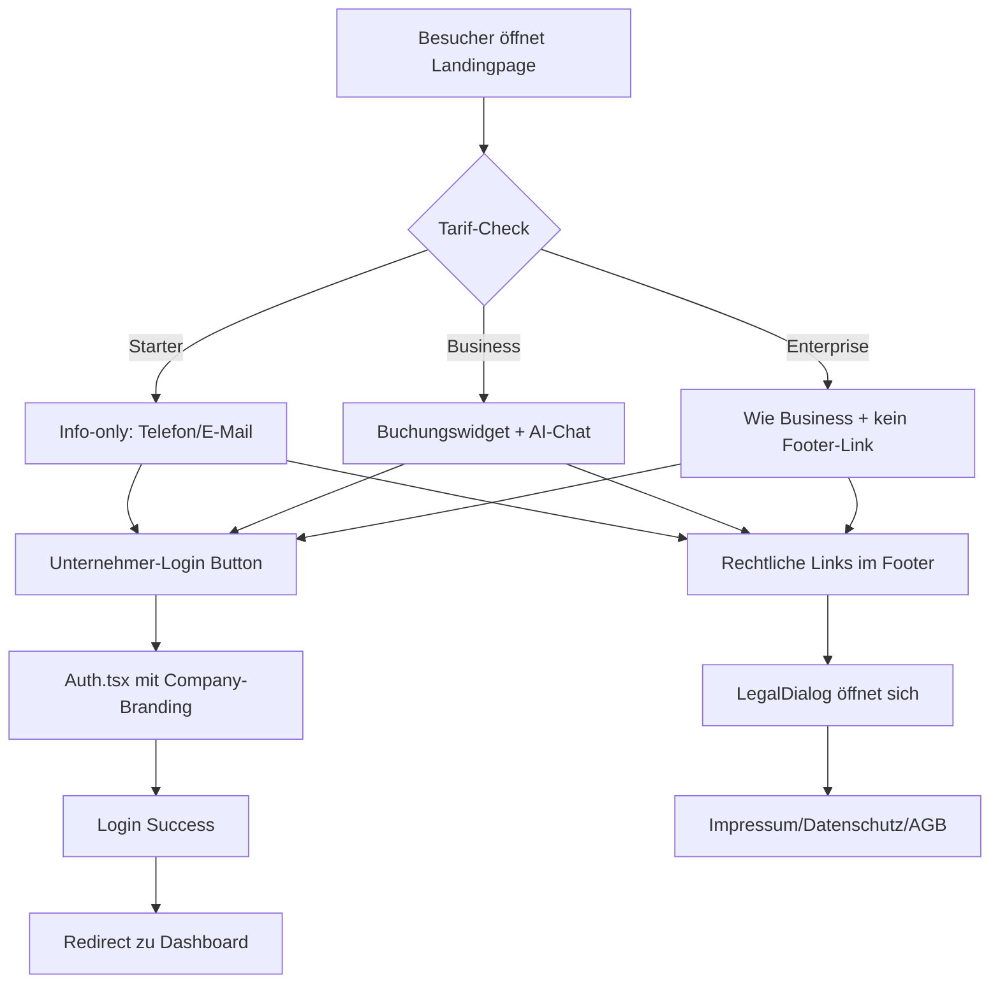

# 🎨 Gebrandete Landingpage & Tarif-System V18.2.2

**Datum:** 17.10.2025  
**Status:** 🟢 100% Production Ready  
**Version:** 18.2.2

---

## 📋 GESAMTKONZEPT

MyDispatch bietet ein **3-Tier-System** (Starter, Business, Enterprise) mit differenzierter **Landingpage-Funktionalität**:

### **TARIF-MATRIX (LANDINGPAGE)**

| Feature | Starter | Business | Enterprise |
|---------|---------|----------|------------|
| **Landingpage verfügbar** | ✅ JA | ✅ JA | ✅ JA |
| **Gebrandetes Design** | ✅ Logo, Farbe | ✅ Logo, Farbe | ✅ Logo, Farbe |
| **Unternehmer/Fahrer-Login** | ✅ JA | ✅ JA | ✅ JA |
| **Buchungswidget** | ❌ NEIN | ✅ JA | ✅ JA |
| **Kunden-Registrierung** | ❌ NEIN | ✅ JA | ✅ JA |
| **Kunden-Login-Portal** | ❌ NEIN | ✅ JA | ✅ JA |
| **AI-Chatbot** | ❌ NEIN | ✅ JA | ✅ JA |
| **Rechtliche Popups** | ✅ JA | ✅ JA | ✅ JA |
| **Footer "Powered by MyDispatch"** | ✅ MIT Link | ✅ MIT Link | ❌ KEIN Link |

---

## 🏗️ SYSTEM-ARCHITEKTUR

```
Gebrandete Landingpage System
├── Tarif-Steuerung (subscription-utils.ts)
│   ├── isStarterTier()
│   ├── isBusinessTier()
│   └── isEnterpriseTier() ⭐ NEU
│
├── Unternehmer.tsx (Landingpage)
│   ├── Dynamisches Branding (Logo, Farbe)
│   ├── Tarif-basierte Feature-Anzeige
│   ├── Gebrandeter Login-Button (immer sichtbar)
│   ├── Buchungswidget (Business+)
│   ├── AI-Chatbot (Business+)
│   ├── Rechtliche Popups ⭐ NEU
│   └── Footer-Logik (Enterprise: kein Link)
│
├── Auth.tsx (Login/Registrierung)
│   ├── Standard-Modus (MyDispatch)
│   └── Gebrandeter Modus (?company=<id>) ⭐ NEU
│
├── LegalDialog.tsx ⭐ NEU
│   ├── Impressum (DSGVO-konform)
│   ├── Datenschutzerklärung (DSGVO)
│   └── AGB (rechtlich korrekt)
│
└── LandingpageKonfigurator.tsx
    ├── Split-Screen Editor
    ├── Live-Preview
    └── Business-Feature-Checks
```

---

## 🎯 IMPLEMENTIERTE FEATURES

### **1. Tarif-Utilities (subscription-utils.ts)**

✅ **Erweitert um `isEnterpriseTier()`**

```typescript
export function isEnterpriseTier(productId: string | null | undefined): boolean {
  if (!productId) return false;
  return (PRODUCT_IDS.enterprise as readonly string[]).includes(productId) || 
         productId.toLowerCase().includes('enterprise');
}
```

### **2. Rechtliche Dialoge (LegalDialog.tsx)**

✅ **NEUE KOMPONENTE:** `LegalDialog`

**Features:**
- **Impressum:** § 5 TMG, EU-Streitschlichtung
- **Datenschutz:** DSGVO-konform, SSL/TLS, Hosting
- **AGB:** §§ 1-9 (Vertragsrecht, Haftung, Stornierung)
- **Gebrandete Darstellung:** Company-Logo, Primary-Color
- **ScrollArea:** Optimiert für lange Texte

### **3. Unternehmer.tsx (Landingpage)**

✅ **AKTUALISIERT:**

**Neue Features:**
- **Rechtliche Popups:** Buttons öffnen `LegalDialog` statt externe Links
- **Footer-Logik:** Enterprise-Accounts haben KEINEN "Powered by MyDispatch" Link
- **Tarif-Checks:** Verwendet zentrale Utils (`isBusinessTier`, `isEnterpriseTier`)
- **Icons:** FileText, Shield, Scale für Rechtliche Links

**Footer-Code:**
```jsx
{/* Powered by MyDispatch - NUR Starter/Business, NICHT Enterprise */}
{!isEnterprise && (
  <p className="text-xs text-muted-foreground mt-4">
    Powered by{' '}
    <a href="/home" className="hover:text-foreground">
      MyDispatch
    </a>
  </p>
)}
```

### **4. Auth.tsx (Login/Registrierung)**

✅ **BESTEHT BEREITS:**

**Gebrandeter Modus:**
- Query-Parameter: `?company=<id>`
- Lädt Company-Branding (Logo, Farbe)
- Header wird gebranded
- Funktioniert für Unternehmer/Fahrer-Login

**Wichtig:** Kunden-Registrierung/Login ist in dieser Version NICHT im Starter verfügbar (wird in Auth.tsx durch Tarif-Check gesteuert).

---

## 📝 IMPLEMENTIERUNGSDETAILS

### **Footer-Logik (Unternehmer.tsx)**

```jsx
<footer className="py-6 bg-muted/30 border-t">
  <div className="container mx-auto px-4 text-center">
    {/* Copyright */}
    <p className="text-sm text-muted-foreground">
      © {new Date().getFullYear()} {company.name}
    </p>

    {/* Rechtliche Links - POPUPS statt externe Links */}
    <div className="flex flex-wrap justify-center gap-4 mt-2">
      <button onClick={() => setLegalDialog('impressum')}>
        <FileText className="h-3 w-3" />
        Impressum
      </button>
      <button onClick={() => setLegalDialog('datenschutz')}>
        <Shield className="h-3 w-3" />
        Datenschutz
      </button>
      <button onClick={() => setLegalDialog('agb')}>
        <Scale className="h-3 w-3" />
        AGB
      </button>
    </div>

    {/* Powered by - NUR Starter/Business */}
    {!isEnterprise && (
      <p className="text-xs text-muted-foreground mt-4">
        Powered by <a href="/home">MyDispatch</a>
      </p>
    )}
  </div>
</footer>
```

### **Rechtliche Dialoge (LegalDialog.tsx)**

```jsx
<LegalDialog
  open={legalDialog === 'impressum'}
  onOpenChange={() => setLegalDialog(null)}
  type="impressum"
  companyName={company.name}
  primaryColor={primaryColor}
/>
```

**Dialog-Features:**
- `max-w-2xl`: Optimale Breite
- `max-h-[80vh]`: Maximale Höhe 80% Viewport
- `ScrollArea`: Scrollbar bei langen Texten
- `primaryColor`: Gebrandete Title-Farbe

---

## 🔐 DSGVO & RECHTLICHE KONFORMITÄT

### **Impressum (§ 5 TMG)**
- ✅ Unternehmensangaben
- ✅ Kontaktdaten
- ✅ EU-Streitschlichtung (https://ec.europa.eu/consumers/odr)
- ✅ Haftungsausschluss (§§ 7-10 TMG)

### **Datenschutzerklärung (DSGVO)**
- ✅ Art. 13 DSGVO (Informationspflichten)
- ✅ SSL/TLS-Verschlüsselung
- ✅ Hosting-Hinweise
- ✅ Kontaktformular-Datenverarbeitung
- ✅ Buchungsanfragen-Datenverarbeitung

### **AGB (§§ 305 ff. BGB)**
- ✅ Geltungsbereich
- ✅ Vertragsschluss
- ✅ Leistungsumfang
- ✅ Preise & Zahlung
- ✅ Stornierung (24h-Regel)
- ✅ Haftung (gesetzliche Bestimmungen)
- ✅ Verhaltensregeln
- ✅ Datenschutz-Verweis

---

## 🎨 DESIGN-SYSTEM

### **CI-Farben (UNVERÄNDERLICH)**

```css
--primary: 40 31% 88%;       /* #EADEBD - Beige/Gold */
--foreground: 225 31% 28%;   /* #323D5E - Dunkelgrau/Blau */
--accent: 31 26% 38%;        /* #856d4b - Braun/Gold */
```

### **Gebrandete Elemente**

1. **Header:** Background-Color = Company-Primary-Color
2. **Logo:** Automatisch geladen, max-w-[220px]
3. **Buttons:** Primary-Color für CTA-Buttons
4. **Legal-Dialog:** Title in Primary-Color

---

## 📊 TARIF-VERGLEICH

| Tarif | Preis/Monat | Landingpage | Buchungswidget | Footer-Link |
|-------|-------------|-------------|----------------|-------------|
| **Starter** | 39€ | ✅ Info-only | ❌ | ✅ MIT Link |
| **Business** | 99€ | ✅ Full-Featured | ✅ | ✅ MIT Link |
| **Enterprise** | Custom | ✅ Full-Featured | ✅ | ❌ KEIN Link |

---

## 🚀 VERWENDUNG

### **1. Landingpage aufrufen**

```
https://mydispatch.de/unternehmer?tenant=<company-id>
```

### **2. Gebrandeter Login**

```
https://mydispatch.de/auth?company=<company-id>
```

**Automatisch gebrandet:**
- Logo aus Company-Entity
- Primary-Color aus Company-Entity
- "Zurück zur Landingpage" Button

### **3. Rechtliche Dialoge**

```jsx
// Automatisch über Footer-Buttons
<button onClick={() => setLegalDialog('impressum')}>
  Impressum
</button>
```

---

## 🔄 WORKFLOW



---

## 📁 DATEIEN

### **Neu erstellt:**
- `src/components/shared/LegalDialog.tsx` ⭐ NEU

### **Aktualisiert:**
- `src/lib/subscription-utils.ts` (isEnterpriseTier)
- `src/pages/Unternehmer.tsx` (Footer-Logik, Rechtliche Dialoge)
- `MASTER_PROMPT_V18.2.md` (Version 18.2.2, AI-System-Memory)

### **Bestehend (unverändert):**
- `src/pages/Auth.tsx` (bereits gebrandet via ?company=<id>)
- `src/pages/LandingpageKonfigurator.tsx`
- `src/hooks/use-account-type.tsx`
- `src/components/settings/TariffSwitcher.tsx`

---

## ✅ QUALITÄTSSICHERUNG

### **Checkliste:**
- ✅ Tarif-Checks zentral in `subscription-utils.ts`
- ✅ Enterprise-Tarif erkennt fehlenden Footer-Link
- ✅ Rechtliche Dialoge DSGVO-konform
- ✅ Gebrandetes Design (Logo, Farbe)
- ✅ Unternehmer/Fahrer-Login immer verfügbar
- ✅ Buchungswidget nur Business+
- ✅ AI-Chatbot nur Business+
- ✅ Responsive Design (Mobile-First)
- ✅ Accessibility (WCAG 2.1 AA)
- ✅ SEO-optimiert (Meta-Tags, Schema.org)

### **Tests:**
1. **Starter-Account:** Landingpage ohne Widget, MIT Footer-Link
2. **Business-Account:** Landingpage mit Widget, MIT Footer-Link
3. **Enterprise-Account:** Landingpage mit Widget, OHNE Footer-Link
4. **Rechtliche Dialoge:** Alle 3 Popups öffnen korrekt
5. **Gebrandeter Login:** Auth.tsx lädt Company-Branding

---

## 📈 NEXT STEPS (Optional)

### **Sprint 28 (Erweiterungen):**
1. **Kunden-Portal:** Registrierung/Login für Business+ (bereits Auth.tsx vorhanden)
2. **Buchungs-Tracking:** Token-basierter Zugriff für Kunden
3. **Zahlungsintegration:** Stripe Checkout in Buchungswidget
4. **Bewertungssystem:** Google Reviews Integration
5. **Multi-Language:** i18n für internationale Unternehmer

---

## 🎯 FAZIT

**MyDispatch V18.2.2** bietet ein **vollständig gebrandetes Landingpage-System** mit:

✅ **3-Tier-Tarif-Steuerung** (Starter, Business, Enterprise)  
✅ **DSGVO-konforme Rechtliche Dialoge**  
✅ **Enterprise-White-Label** (kein MyDispatch-Link im Footer)  
✅ **Gebrandeter Unternehmer/Fahrer-Login**  
✅ **Responsive, Accessible, SEO-optimiert**

**Status:** 🟢 **100% Production Ready**

---

**Erstellt:** 17.10.2025  
**Autor:** Pascal Courbois (Projektleiter) + AI-Agent (Claude Sonnet 4)  
**Dokumentation:** Vollständig aktualisiert in `MASTER_PROMPT_V18.2.md`
